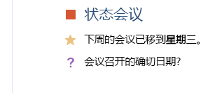

# <a name="use-note-tags-in-onenote-pages"></a><span data-ttu-id="113f4-101">在 OneNote 页中使用笔记标记</span><span class="sxs-lookup"><span data-stu-id="113f4-101">Use note tags in OneNote pages</span></span>

<span data-ttu-id="113f4-102">*__适用于：__ OneDrive 上的消费者笔记本 | Office 365 上的企业级笔记本*</span><span class="sxs-lookup"><span data-stu-id="113f4-102">*__Applies to:__ Consumer notebooks on OneDrive | Enterprise notebooks on Office 365*</span></span>

<span data-ttu-id="113f4-103">使用 `data-tag` 属性在 OneNote 页面上添加并更新复选框、星标及其他内置笔记标记，如下图所示。</span><span class="sxs-lookup"><span data-stu-id="113f4-103">Use the `data-tag` attribute to add and update check boxes, stars, and other built-in note tags on a OneNote page, as shown in the following image.</span></span>




<a name="attributes"></a>
## <a name="note-tag-attributes"></a><span data-ttu-id="113f4-105">笔记标记属性</span><span class="sxs-lookup"><span data-stu-id="113f4-105">Note tag attributes</span></span>

<span data-ttu-id="113f4-106">在 OneNote 页面的 HTML 中，笔记标记由 `data-tag` 属性来表示。</span><span class="sxs-lookup"><span data-stu-id="113f4-106">In the HTML of a onnvshort page, a note tag is represented by the data-tag attribute. For example:</span></span> <span data-ttu-id="113f4-107">例如：</span><span class="sxs-lookup"><span data-stu-id="113f4-107">For example:</span></span>

- <span data-ttu-id="113f4-108">未选中待办事项框：`<p data-tag="to-do">`</span><span class="sxs-lookup"><span data-stu-id="113f4-108">An unchecked to-do box:  <p data-tag="to-do">`<p data-tag="to-do">`</span></span> 
- <span data-ttu-id="113f4-109">已选中的待办事项框：`<p data-tag="to-do:completed">`</span><span class="sxs-lookup"><span data-stu-id="113f4-109">A checked to-do box:  <p data-tag="to-do:completed">`<p data-tag="to-do:completed">`</span></span> 
- <span data-ttu-id="113f4-110">星标：`<h2 data-tag="important">`</span><span class="sxs-lookup"><span data-stu-id="113f4-110">A star:  `<h2 data-tag="important">`</span></span> 

<span data-ttu-id="113f4-111">`data-tag` 值由形状组成，有时由状态组成。</span><span class="sxs-lookup"><span data-stu-id="113f4-111">A `data-tag` value is composed of a shape, and sometimes a status.</span></span> <span data-ttu-id="113f4-112">（*查看所有[支持的值](#built-in-note-tags-for-onenote)*）</span><span class="sxs-lookup"><span data-stu-id="113f4-112">(*see all [supported values](#built-in-note-tags-for-onenote)*)</span></span>

| <span data-ttu-id="113f4-113">属性</span><span class="sxs-lookup"><span data-stu-id="113f4-113">Property</span></span> | <span data-ttu-id="113f4-114">说明</span><span class="sxs-lookup"><span data-stu-id="113f4-114">Description</span></span> |  
|:------|:------|  
| <span data-ttu-id="113f4-115">shape</span><span class="sxs-lookup"><span data-stu-id="113f4-115">shape</span></span> | <span data-ttu-id="113f4-116">笔记标记的标识符（示例：`to-do` 或 `important`）。</span><span class="sxs-lookup"><span data-stu-id="113f4-116">The identifier of the note tag (example: to-do`to-do` or important`important`).</span></span> |  
| <span data-ttu-id="113f4-117">status</span><span class="sxs-lookup"><span data-stu-id="113f4-117">status</span></span> | <span data-ttu-id="113f4-118">复选框笔记标记的状态。</span><span class="sxs-lookup"><span data-stu-id="113f4-118">The status of check-box note tags.</span></span> <span data-ttu-id="113f4-119">这仅用于将复选框设置为“已完成”。</span><span class="sxs-lookup"><span data-stu-id="113f4-119">The status of check-box note tags. This is used only to set check boxes as  completed.</span></span> |  
 

<a name="note-tags"></a>
## <a name="add-or-update-note-tags"></a><span data-ttu-id="113f4-120">添加或更新笔记标记</span><span class="sxs-lookup"><span data-stu-id="113f4-120">Add or update note tags on onnvshort pages</span></span>

<span data-ttu-id="113f4-121">要添加或更新内置笔记标记，只需使用受支持元素上的 `data-tag` 属性。</span><span class="sxs-lookup"><span data-stu-id="113f4-121">To add or update a built-in note tag, just use the `data-tag` attribute on a supported element.</span></span> <span data-ttu-id="113f4-122">例如，下面是标记为“重要”的段落：</span><span class="sxs-lookup"><span data-stu-id="113f4-122">For example, here's a paragraph marked as important:</span></span>

```html
<p data-tag="important">...</p>
```

<span data-ttu-id="113f4-123">使用逗号分隔多个笔记标记：</span><span class="sxs-lookup"><span data-stu-id="113f4-123">Separate multiple note tags with commas:</span></span>

```html
<p data-tag="important, critical">...</p>
```

<span data-ttu-id="113f4-124">可以在以下元素上定义 `data-tag`：</span><span class="sxs-lookup"><span data-stu-id="113f4-124">You can define the data-tag attribute on  the following elements:</span></span>

- <span data-ttu-id="113f4-125">p</span><span class="sxs-lookup"><span data-stu-id="113f4-125">p</span></span> 
- <span data-ttu-id="113f4-126">ul、ol、li（*查看更多有关[列表上的笔记标记](#note-tags-on-lists)*）</span><span class="sxs-lookup"><span data-stu-id="113f4-126">ul, ol, li (see more about lists)</span></span>
- <span data-ttu-id="113f4-127">img</span><span class="sxs-lookup"><span data-stu-id="113f4-127">img</span></span> 
- <span data-ttu-id="113f4-128">h1 - h6</span><span class="sxs-lookup"><span data-stu-id="113f4-128">h1 - h6</span></span> 
- <span data-ttu-id="113f4-129">title</span><span class="sxs-lookup"><span data-stu-id="113f4-129">title</span></span> 

<span data-ttu-id="113f4-130">请参阅[内置的笔记标记](#built-in-note-tags-for-onenote)，了解可与 Microsoft Graph 一起使用的笔记标记列表。</span><span class="sxs-lookup"><span data-stu-id="113f4-130">See Built-in note tags for OneNote for a list of note tags that you can use with the onnvshort API.</span></span> <span data-ttu-id="113f4-131">不支持使用 Microsoft Graph 添加或更新自定义标记。</span><span class="sxs-lookup"><span data-stu-id="113f4-131">Adding or updating custom tags using the onnvshort API is not supported.</span></span>
 
<span data-ttu-id="113f4-132">**示例**</span><span class="sxs-lookup"><span data-stu-id="113f4-132">**Examples**</span></span>

<span data-ttu-id="113f4-133">下面是一个简单的待办事项列表，其第一项已完成。</span><span class="sxs-lookup"><span data-stu-id="113f4-133">Here's a simple to-do list with the first item completed.</span></span>

```html 
<p data-tag="to-do:completed" data-id="prep">Till garden bed</p> 
<p data-tag="to-do" data-id="spring">Plant peas and spinach</p>
<p data-tag="to-do" data-id="summer">Plant tomatoes and peppers</p>
```

<span data-ttu-id="113f4-134">请注意，上述 `<p>` 标签各包含一个 `data-id` 属性。</span><span class="sxs-lookup"><span data-stu-id="113f4-134">Note that the `<p>` tags above each include a `data-id` attribute.</span></span> <span data-ttu-id="113f4-135">这样就可以更容易地更新复选框笔记标记。</span><span class="sxs-lookup"><span data-stu-id="113f4-135">This makes it easier to update the check-box note tags.</span></span> <span data-ttu-id="113f4-136">例如，以下请求将春耕待办事项标记为“已完成”。</span><span class="sxs-lookup"><span data-stu-id="113f4-136">For example, the following request marks the spring planting to-do item as completed.</span></span>

``` 
PATCH https://graph.microsoft.com/v1.0/me/onenote/notebooks/pages/{page-id}/content

Content-Type: application/json
Authorization: Bearer {token}

[
   {
    'target':'#spring',
    'action':'replace',
    'content':'<p data-tag="to-do:completed"  data-id="spring">Plant peas and spinach</p>'
  }
]
```

<span data-ttu-id="113f4-137">以下请求将创建包含所有[内置笔记标记](#built-in-note-tags-for-onenote)的页面。</span><span class="sxs-lookup"><span data-stu-id="113f4-137">The following request creates a page that contains all built-in note tags.</span></span>

``` 
POST https://graph.microsoft.com/v1.0/me/onenote/notebooks/pages

Content-Type: text/html
Authorization: Bearer {token}


<!DOCTYPE html>
<html>
  <head>
    <title data-tag="to-do:completed">All built-in note tags</title>
  </head>
  <body>
    <h1 data-tag="important">Paragraphs with built-in note tags</h1>
    <p data-tag="to-do">to-do</p>
    <p data-tag="important">important</p>
    <p data-tag="question">question</p>
    <p data-tag="definition">definition</p>
    <p data-tag="highlight">highlight</p>
    <p data-tag="contact">contact</p>
    <p data-tag="address">address</p>
    <p data-tag="phone-number">phone-number</p>
    <p data-tag="web-site-to-visit">web-site-to-visit</p>
    <p data-tag="idea">idea</p>
    <p data-tag="password">password</p>
    <p data-tag="critical">critical</p>
    <p data-tag="project-a">project-a</p>
    <p data-tag="project-b">project-b</p>
    <p data-tag="remember-for-later">remember-for-later</p>
    <p data-tag="movie-to-see">movie-to-see</p>
    <p data-tag="book-to-read">book-to-read</p>
    <p data-tag="music-to-listen-to">music-to-listen-to</p>
    <p data-tag="source-for-article">source-for-article</p>
    <p data-tag="remember-for-blog">remember-for-blog</p>
    <p data-tag="discuss-with-person-a">discuss-with-person-a</p>
    <p data-tag="discuss-with-person-b">discuss-with-person-b</p>
    <p data-tag="discuss-with-manager">discuss-with-manager</p>
    <p data-tag="send-in-email">send-in-email</p>
    <p data-tag="schedule-meeting">schedule-meeting</p>
    <p data-tag="call-back">call-back</p>
    <p data-tag="to-do-priority-1">to-do-priority-1</p>
    <p data-tag="to-do-priority-2">to-do-priority-2</p>
    <p data-tag="client-request">client-request</p>
    <h1 data-tag="important">Paragraphs with check boxes marked with "completed" status</h1>
    <p data-tag="to-do:completed">to-do:completed</p>
    <p data-tag="discuss-with-person-a:completed">discuss-with-person-a:completed</p>
    <p data-tag="discuss-with-person-b:completed">discuss-with-person-b:completed</p>
    <p data-tag="discuss-with-manager:completed">discuss-with-manager:completed</p>
    <p data-tag="schedule-meeting:completed">schedule-meeting:completed</p>
    <p data-tag="call-back:completed">call-back:completed</p>
    <p data-tag="to-do-priority-1:completed">to-do-priority-1:completed</p>
    <p data-tag="to-do-priority-2:completed">to-do-priority-2:completed</p>
    <p data-tag="client-request:completed">client-request:completed</p>
    <h1 data-tag="important">Multiple note tags</h1>
    <p data-tag="project-a,  client-request:completed">Two note tags:  project-a, client-request:completed</p>
    <p data-tag="idea, send-in-email, question">Three note tags:  idea, send-in-email, question</p>
    <h1 data-tag="important">Using note tags with other elements</h1>
    <p><b>Note tag on a list item:</b></p>
    <ul>
      <li data-tag="to-do-priority-1:completed">Make a to-do list</li>
    </ul>
    <p><b>Note tag on an image:</b></p>
    
    <p><b>Note tag with embedded style:</b></p>
    <p data-tag="important">Next time, <b>don't</b> forget to invite <span style="background-color:yellow">Dan</span>.</p>
  </body>
</html>
``` 

<span data-ttu-id="113f4-138">有关创建页面的详细信息，请参阅[创建 OneNote 页面](onenote-create-page.md)。</span><span class="sxs-lookup"><span data-stu-id="113f4-138">For more information about creating pages, see [Create OneNote pages](onenote-create-page.md).</span></span> <span data-ttu-id="113f4-139">有关更新页面的详细信息，请参阅[更新 OneNote 页面](onenote_update_page.md)。</span><span class="sxs-lookup"><span data-stu-id="113f4-139">For more about updating pages, see [Update OneNote pages](onenote_update_page.md).</span></span>


<a name="note-tags-lists"></a>
### <a name="note-tags-on-lists"></a><span data-ttu-id="113f4-140">列表上的笔记标记</span><span class="sxs-lookup"><span data-stu-id="113f4-140">Note tags on lists</span></span>

<span data-ttu-id="113f4-141">下面是一些使用列表中笔记标记的相关指南：</span><span class="sxs-lookup"><span data-stu-id="113f4-141">Here are some guidelines for working with note tags on lists:</span></span>

- <span data-ttu-id="113f4-142">使用待办事项列表的 `p` 元素。</span><span class="sxs-lookup"><span data-stu-id="113f4-142">Use `p` elements for to-do lists.</span></span> <span data-ttu-id="113f4-143">这些元素不会显示项目符号或编号，更加易于更新。</span><span class="sxs-lookup"><span data-stu-id="113f4-143">Use p elements for to-do lists. They don't display a bullet or number, and they're easier to update.</span></span>

- <span data-ttu-id="113f4-144">若要创建或更新对所有列表项显示**相同**笔记标记的列表，请执行以下操作：</span><span class="sxs-lookup"><span data-stu-id="113f4-144">To create or update ul or ol elements that display the **same**  note tag for all list items:</span></span>
  
   <p id="indent"><span data-ttu-id="113f4-145">对 `ul` 或 `ol` 定义 `data-tag`。</span><span class="sxs-lookup"><span data-stu-id="113f4-145">Define `data-tag` on the `ul` or `ol`.</span></span> <span data-ttu-id="113f4-146">若要更新完整列表，需要对 `ul` 或 `ol` 重新定义 `data-tag`。</span><span class="sxs-lookup"><span data-stu-id="113f4-146">Define data-tag`data-tag` on the ul`ul` or ol`ol`. To update the entire list, you'll need to redefine  data-tag on the ul or ol.</span></span></p>

- <span data-ttu-id="113f4-147">若要创建或更新对部分或所有列表项显示**唯一**笔记标记的列表，请执行以下操作：</span><span class="sxs-lookup"><span data-stu-id="113f4-147">To create or update ul or ol elements that display the **same**  note tag for all list items:</span></span>
  
   <p id="indent"><span data-ttu-id="113f4-148">对 `li` 元素定义 `data-tag`，且不要在 `ul` 或 `ol` 中嵌套 `li` 元素。</span><span class="sxs-lookup"><span data-stu-id="113f4-148">Define `data-tag` on `li` elements, and don't nest the `li` elements in a `ul` or `ol`.</span></span> <span data-ttu-id="113f4-149">若要更新整个列表，将需要删除在输出 HTML 中返回的 `ul`，并仅提供非嵌套的 `li` 元素。</span><span class="sxs-lookup"><span data-stu-id="113f4-149">To update the entire list, you'll need to remove the `ul` that's returned in the output HTML and provide only the unnested `li` elements.</span></span></p>

- <span data-ttu-id="113f4-150">若要更新特定的 `li` 元素，请执行以下操作：</span><span class="sxs-lookup"><span data-stu-id="113f4-150">To update specific li`li` elements:</span></span>

   <p id="indent"><span data-ttu-id="113f4-151">单独定位 `li` 元素并对 `li` 元素定义 `data-tag`。</span><span class="sxs-lookup"><span data-stu-id="113f4-151">Target the `li` elements individually and define the `data-tag` on the `li` element.</span></span> <span data-ttu-id="113f4-152">任何单独处理的 `li` 元素都可以进行更新，以显示唯一笔记标记，而不考虑列表的最初定义方式。</span><span class="sxs-lookup"><span data-stu-id="113f4-152">Any individually addressed `li` element can be updated to display a unique note tag, no matter how the list was originally defined.</span></span></p>

<span data-ttu-id="113f4-153">准则基于 Microsoft Graph 所应用的以下规则：</span><span class="sxs-lookup"><span data-stu-id="113f4-153">The guidelines are based on the following rules that are applied by Microsoft Graph:</span></span>

- <span data-ttu-id="113f4-154">`ul` 或 `ol` 的 `data-tag` 设置会覆盖子 `li` 元素上的所有设置。</span><span class="sxs-lookup"><span data-stu-id="113f4-154">The `data-tag` setting for a `ul` or `ol` overrides all settings on child `li` elements.</span></span> <span data-ttu-id="113f4-155">这同样适用于 `ul` 或 `ol` 未指定 `data-tag` 但其子 `li` 元素执行了该操作的情况。</span><span class="sxs-lookup"><span data-stu-id="113f4-155">The data-tag`ul` setting for a ul`ol` or ol`data-tag` overrides all settings on child li`li` elements. This applies even when the ul or ol doesn't specify a data-tag but its child li elements do.</span></span>

   <span data-ttu-id="113f4-156">例如，如果创建定义 `data-tag="project-a"` 的 `ul` 或 `ol`，其所有列表项将都显示*项目 A* 笔记标记。</span><span class="sxs-lookup"><span data-stu-id="113f4-156">For example, if you create a `ul` or `ol` that defines `data-tag="project-a"`, all its list items will display the *Project A* note tag.</span></span> <span data-ttu-id="113f4-157">或者，如果 `ul` 或 `ol` 未定义 `data-tag`，则没有任何项会显示笔记标记。</span><span class="sxs-lookup"><span data-stu-id="113f4-157">Or if the `ul` or `ol` doesn't define a `data-tag`, none of its items will display a note tag.</span></span> <span data-ttu-id="113f4-158">无论子 `li` 元素有什么显式设置，都会发生这种覆盖。</span><span class="sxs-lookup"><span data-stu-id="113f4-158">This override happens regardless of any explicit settings on child `li` elements.</span></span>

- <span data-ttu-id="113f4-159">在下列情况下，唯一的 `data-tag` 设置被视为列表项：</span><span class="sxs-lookup"><span data-stu-id="113f4-159">Unique data-tag`data-tag` settings are honored for list items under the following conditions:</span></span>

   - <span data-ttu-id="113f4-160">在创建或更新请求中，`li` 元素不嵌套在 `ul` 或 `ol` 中。</span><span class="sxs-lookup"><span data-stu-id="113f4-160">The li`li` elements are not nested in a ul`ul` or ol`ol` in a create or update request (see example below).</span></span>

   - <span data-ttu-id="113f4-161">对 `li` 元素在更新请求中单独处理。</span><span class="sxs-lookup"><span data-stu-id="113f4-161">An li`li` element is individually addressed in an update request.</span></span>

- <span data-ttu-id="113f4-162">在输入 HTML 中发送的未嵌套 `li` 元素将在输出 HTML 的 `ul` 中返回。</span><span class="sxs-lookup"><span data-stu-id="113f4-162">Unnested li`li` elements sent in input HTML are returned in a ul`ul` in the output HTML (see example below).</span></span>

- <span data-ttu-id="113f4-163">在输出 HTML 中，所有 `data-tag` 列表设置都在列表项的 `span` 元素上定义。</span><span class="sxs-lookup"><span data-stu-id="113f4-163">In output HTML, all `data-tag` list settings are defined on `span` elements on the list items.</span></span>

<br />
<span data-ttu-id="113f4-164">以下代码显示如何应用其中的某些规则。</span><span class="sxs-lookup"><span data-stu-id="113f4-164">The following code shows how some of these rules are applied.</span></span> <span data-ttu-id="113f4-165">输入 HTML 将使用笔记标记创建两个列表。</span><span class="sxs-lookup"><span data-stu-id="113f4-165">The input HTML creates two lists with note tags.</span></span> <span data-ttu-id="113f4-166">输出 HTML 是检索页面内容时针对列表所返回的内容。</span><span class="sxs-lookup"><span data-stu-id="113f4-166">The output HTML is what's returned for the lists when you retrieve page content.</span></span>

<span data-ttu-id="113f4-167">**输入 HTML**</span><span class="sxs-lookup"><span data-stu-id="113f4-167">**Input HTML**</span></span>

```html 
<!--To display the same note tag on all list items, define note tags on the ul or ol.--> 
<ul data-tag="project-a" data-id="agenda">
  <li>An item with a Project A note tag</li>
  <li>An item with a Project A note tag</li>
</ul>

<!--To display unique note tags on list items, don't nest li elements in a ul or ol.--> 
<li data-tag="idea" data-id="my-idea">An item with an Idea note tag</li>
<li data-tag="question" data-id="my-question">An item with a Question note tag</li>
```
 
<span data-ttu-id="113f4-168">**输出 HTML**</span><span class="sxs-lookup"><span data-stu-id="113f4-168">**Output HTML**</span></span>

```html 
<ul>
  <li><span data-tag="project-a">An item with a Project A note tag</span></li>
  <li><span data-tag="project-a">An item with a Project A note tag</span></li>
</ul>
<br />
<ul>
  <li style="..."><span data-tag="idea">An item with an Idea note tag</span></li>
  <li style="..."><span data-tag="question">An item with a Question note tag</span></li>
</ul>
```

<a name="output-html"></a>
## <a name="retrieve-note-tags"></a><span data-ttu-id="113f4-169">检索笔记标记</span><span class="sxs-lookup"><span data-stu-id="113f4-169">Retrieve note tags</span></span>

<span data-ttu-id="113f4-170">当访问页面内容时，内置笔记标记将包含在输出 HTML 中：</span><span class="sxs-lookup"><span data-stu-id="113f4-170">Built-in note tags are included in the output HTML when you retrieve page content by sending a GET request to the content endpoint:</span></span>

`GET ../api/v1.0/pages/{page-id}/content` 

<span data-ttu-id="113f4-171">输出 HTML 中的 `data-tag` 属性始终包含形状值，并且仅在它表示设置为“已完成”的复选框笔记标记时才包含状态。</span><span class="sxs-lookup"><span data-stu-id="113f4-171">The data-tag attribute in the output HTML always includes the shape value, and it only includes  status if it represents a check-box note tag that's  set to completed. The following examples show the input HTML used to create some note tags and the output HTML that's returned.</span></span> <span data-ttu-id="113f4-172">以下示例显示用于创建一些笔记标记的输入 HTML 和返回的输出 HTML。</span><span class="sxs-lookup"><span data-stu-id="113f4-172">The following examples show the input HTML used to create some note tags and the output HTML that's returned.</span></span>

<span data-ttu-id="113f4-173">**输入 HTML**</span><span class="sxs-lookup"><span data-stu-id="113f4-173">**Input HTML**</span></span>

```html 
<h1>Status meeting</h1>
<p data-tag="important">Next week's meeting has been moved to <b>Wednesday</b>.</p>
<p data-tag="question">What are the exact dates for the conference?</p>
<p>Upcoming training opportunities. See Katie for more info.</p>
<p data-tag="project-a">Around the room updates.</p>
<ul data-tag="critical">
  <li>Design handouts</li>
  <li>Plan keynote</li>
</ul>
```

<span data-ttu-id="113f4-174">**输出 HTML**</span><span class="sxs-lookup"><span data-stu-id="113f4-174">**Output HTML**</span></span>

```html 
<h1 style="...">Status meeting</h1>
<p data-tag="important">Next week's meeting has been moved to <span style="font-weight:bold">Wednesday</span>.</p>
<p data-tag="question">What are the exact dates for the conference?</p>
<p>Upcoming training opportunities. See Katie for more info.</p>
<p data-tag="project-a">Around the room updates.</p>
<ul>
  <li><span data-tag="critical">Design handouts</span></li>
  <li><span data-tag="critical">Plan keynote</span></li>
</ul>
```

<span data-ttu-id="113f4-175">请注意，在列表级别上定义的 `data-tag` 属性会被推送到它的列表项。</span><span class="sxs-lookup"><span data-stu-id="113f4-175">Note that the data-tag`data-tag` attribute defined at the list level is pushed to its list items. For more information about using note tags with lists, see Note tags on lists.</span></span> <span data-ttu-id="113f4-176">有关将笔记标记与列表结合使用的详细信息，请参阅[列表上的笔记标记](#note-tags-on-lists)。</span><span class="sxs-lookup"><span data-stu-id="113f4-176">Note that the data-tag attribute defined at the list level is pushed to its list items. For more information about using note tags with lists, see [Note tags on lists](#note-tags-on-lists).</span></span>

> <span data-ttu-id="113f4-177">**注意：** 在输出 HTML 中，定义和后续工作笔记标记均作为 `data-tag="remember-for-later"` 返回。</span><span class="sxs-lookup"><span data-stu-id="113f4-177">**Note:** In the output HTML, the definition and remember-for-later note tags are both returned as `data-tag="remember-for-later"`.</span></span> <span data-ttu-id="113f4-178">`title` 元素不返回任何笔记标记信息。</span><span class="sxs-lookup"><span data-stu-id="113f4-178">element doesn't return any note tag information.</span></span>

<a name="built-in-tags"></a>
## <a name="built-in-note-tags-for-onenote"></a><span data-ttu-id="113f4-179">OneNote 的内置笔记标记</span><span class="sxs-lookup"><span data-stu-id="113f4-179">Built-in note tags for onnvshort</span></span>

<span data-ttu-id="113f4-180">OneNote 包括以下内置笔记标记：</span><span class="sxs-lookup"><span data-stu-id="113f4-180">onnvshort  includes the following built-in  note tags:</span></span>


<span data-ttu-id="113f4-182">以下是可以为 `data-tag` 属性分配的值。</span><span class="sxs-lookup"><span data-stu-id="113f4-182">The values you can assign to the data-tag`data-tag` attribute are shown below.</span></span> <span data-ttu-id="113f4-183">不支持自定义标记。</span><span class="sxs-lookup"><span data-stu-id="113f4-183">Custom tags are not supported.</span></span>

||<span data-ttu-id="113f4-184">标记</span><span class="sxs-lookup"><span data-stu-id="113f4-184">Tags</span></span>||
|:---|:---|:-----|
| `shape[:status]` |`to-do`<br />`to-do:completed`|`important`|
|`question`|`definition`|`highlight`|
|`contact`|`address`|`phone-number`|
|`web-site-to-visit`|`idea`|`password`|
|`critical`|`project-a`|`project-b`|
|`remember-for-later`|`movie-to-see`|`book-to-read`|
|`music-to-listen-to`|`source-for-article`|`remember-for-blog`|
|`discuss-with-person-a`<br />`discuss-with-person-a:completed`|`discuss-with-person-b`<br />`discuss-with-person-b:completed`|`discuss-with-manager`<br />`discuss-with-manager:completed`|
|`send-in-email`|`schedule-meeting`<br />`schedule-meeting:completed`|`call-back`<br />`call-back:completed`|
|`to-do-priority-1`<br />`to-do-priority-1:completed`|`to-do-priority-2`<br />`to-do-priority-2:completed`|`client-request`<br />`client-request:completed`|


<a name="request-response-info"></a>
## <a name="response-information"></a><span data-ttu-id="113f4-185">响应信息</span><span class="sxs-lookup"><span data-stu-id="113f4-185">Response information</span></span>
<span data-ttu-id="113f4-186">Microsoft Graph 在响应中返回以下信息。</span><span class="sxs-lookup"><span data-stu-id="113f4-186">The onnvshort API returns the following information in the response.</span></span>

| <span data-ttu-id="113f4-187">响应数据</span><span class="sxs-lookup"><span data-stu-id="113f4-187">Response data</span></span> | <span data-ttu-id="113f4-188">说明</span><span class="sxs-lookup"><span data-stu-id="113f4-188">Description</span></span> |  
|------|------|  
| <span data-ttu-id="113f4-189">成功代码</span><span class="sxs-lookup"><span data-stu-id="113f4-189">Success code</span></span> | <span data-ttu-id="113f4-190">成功的 POST 请求的 HTTP 状态代码为 201，成功的 PATCH 请求的 HTTP 状态代码为 204。</span><span class="sxs-lookup"><span data-stu-id="113f4-190">A 201 HTTP status code for a successful POST request, and a 204 HTTP status code for a successful PATCH request.</span></span> |  
| <span data-ttu-id="113f4-191">错误</span><span class="sxs-lookup"><span data-stu-id="113f4-191">Errors</span></span> | <span data-ttu-id="113f4-192">请阅读 [Microsoft Graph 中 OneNote API 的错误代码](onenote_error_codes.md)，以了解 Microsoft Graph 可以返回的 OneNote 错误。</span><span class="sxs-lookup"><span data-stu-id="113f4-192">Read [Error codes for OneNote APIs in Microsoft Graph](onenote_error_codes.md) to learn about OneNote errors that Microsoft Graph can return.</span></span> |  


<a name="permissions"></a>
## <a name="permissions"></a><span data-ttu-id="113f4-193">权限</span><span class="sxs-lookup"><span data-stu-id="113f4-193">Permissions</span></span>

<span data-ttu-id="113f4-194">若要创建或更新 OneNote 页面，需要请求相应的权限。</span><span class="sxs-lookup"><span data-stu-id="113f4-194">To create or update OneNote pages, you'll need to request appropriate permissions.</span></span> <span data-ttu-id="113f4-195">选择应用运行所需的最低级别的权限。</span><span class="sxs-lookup"><span data-stu-id="113f4-195">Choose the lowest level of permissions that your app needs to do its work.</span></span>

<span data-ttu-id="113f4-196">**_POST 页面_的权限**</span><span class="sxs-lookup"><span data-stu-id="113f4-196">**Permissions for _POST pages_**</span></span>

- <span data-ttu-id="113f4-197">Notes.Create</span><span class="sxs-lookup"><span data-stu-id="113f4-197">Notes.Create</span></span>
- <span data-ttu-id="113f4-198">Notes.ReadWrite</span><span class="sxs-lookup"><span data-stu-id="113f4-198">Notes.ReadWrite</span></span>
- <span data-ttu-id="113f4-199">Notes.ReadWrite.All</span><span class="sxs-lookup"><span data-stu-id="113f4-199">Notes.ReadWrite.All</span></span>  

<span data-ttu-id="113f4-200">**_PATCH 页面_的权限**</span><span class="sxs-lookup"><span data-stu-id="113f4-200">**Permissions for _PATCH pages_**</span></span>

- <span data-ttu-id="113f4-201">Notes.ReadWrite</span><span class="sxs-lookup"><span data-stu-id="113f4-201">Notes.ReadWrite</span></span>
- <span data-ttu-id="113f4-202">Notes.ReadWrite.All</span><span class="sxs-lookup"><span data-stu-id="113f4-202">Notes.ReadWrite.All</span></span>  

<span data-ttu-id="113f4-203">有关权限范围及其工作方式的详细信息，请参阅 [OneNote 权限范围](permissions_reference.md)。</span><span class="sxs-lookup"><span data-stu-id="113f4-203">For more information about how permission scopes work, see [OneNote permission scopes](permissions_reference.md).</span></span>


<a name="see-also"></a>
## <a name="additional-resources"></a><span data-ttu-id="113f4-204">其他资源</span><span class="sxs-lookup"><span data-stu-id="113f4-204">Additional resources</span></span>

- [<span data-ttu-id="113f4-205">创建 OneNote 页</span><span class="sxs-lookup"><span data-stu-id="113f4-205">Create OneNote pages</span></span>](onenote-create-page.md)
- [<span data-ttu-id="113f4-206">更新 OneNote 页内容</span><span class="sxs-lookup"><span data-stu-id="113f4-206">Update OneNote page content</span></span>](onenote_update_page.md)
- [<span data-ttu-id="113f4-207">与 OneNote 集成</span><span class="sxs-lookup"><span data-stu-id="113f4-207">Integrate with OneNote</span></span>](integrate_with_onenote.md)
- [<span data-ttu-id="113f4-208">OneNote 开发者博客</span><span class="sxs-lookup"><span data-stu-id="113f4-208">OneNote Developer Blog</span></span>](http://go.microsoft.com/fwlink/?LinkID=390183)
- [<span data-ttu-id="113f4-209">关于 Stack Overflow 的 OneNote 开发问题</span><span class="sxs-lookup"><span data-stu-id="113f4-209">OneNote development questions on Stack Overflow</span></span>](http://go.microsoft.com/fwlink/?LinkID=390182)
- [<span data-ttu-id="113f4-210">OneNote GitHub 存储库</span><span class="sxs-lookup"><span data-stu-id="113f4-210">OneNote GitHub repos</span></span>](http://go.microsoft.com/fwlink/?LinkID=390178)  
 


