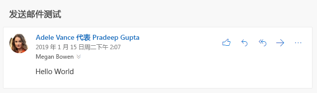

# <a name="send-outlook-messages-from-another-user"></a>从其他用户身份发送 Outlook 邮件

Exchange Online 提供的[邮箱权限](/Exchange/recipients/mailbox-permissions)允许用户从其他用户身份、通讯组列表、组、资源或共享邮箱发送邮件。 Microsoft Graph 也支持此功能，但是最终结果各不相同，具体取决于在 Exchange Online 中授予的准确权限以及用于发送邮件的 API。

## <a name="permissions"></a>权限

两类权限适用于从其他用户身份发送邮件：[Microsoft Graph 权限](permissions-reference.md)和邮箱权限。

### <a name="microsoft-graph-permissions"></a>Microsoft Graph 权限

若要从其他用户身份发送邮件，使用用户令牌的应用程序需使用 the **Mail.Send.Shared** 权限。

> [!NOTE]
> 使用应用程序令牌而不是用户令牌且已拥有管理员授予的 **Mail.Send** 权限的应用程序可以组织中的任何用户身份发送邮件，只需通过用户的邮箱正常发送邮件即可。

### <a name="mailbox-permissions"></a>邮箱权限

以下两种权限会影响从其他用户身份发送邮件的最终结果：**代表发送** 和 **代理发送**。 使用 **Mail.Send.Shared** 权限登录应用程序的用户必须至少拥有这两种权限之一，这些权限已授予从其中发送邮件的邮箱、组或通讯组列表。

#### <a name="send-on-behalf"></a>代表发送

使用此权限时，电子邮件的收件人将在其电子邮件客户端收到此邮件是使用你的应用程序代表其他用户发送的指示。



它在 Microsoft Graph 显示为 `sender`（实际发送邮件的用户）和 `from`（代表发送邮件的用户/组/等）属性。

```json
{
  "id": "AAMkAGE1...",
  "subject": "Send mail test",
  "sender": {
    "emailAddress": {
      "name": "Adele Vance",
      "address": "AdeleV@contoso.com"
    }
  },
  "from": {
    "emailAddress": {
      "name": "Pradeep Gupta",
      "address": "PradeepG@contoso.com"
    }
  }
}
```

用户可以[使用 Outlook](https://support.office.com/article/Allow-someone-else-to-manage-your-mail-and-calendar-41C40C04-3BD1-4D22-963A-28EAFEC25926) 将其自己邮箱的这种权限授予其他用户。 管理员可以在 [Microsoft 365 管理中心](/office365/admin/add-users/give-mailbox-permissions-to-another-user?view=o365-worldwide)为任何邮箱、组或通讯组列表授予此权限。

#### <a name="send-as"></a>代理发送

使用此权限时，不会显示邮件是以其他用户身份发送的指示。 `sender` 和 `from` 属性具有相同的值。

用户无法为其邮箱授予此权限。 管理员可以在 Microsoft 365 管理中心授予此权限。

## <a name="sending-with-microsoft-graph"></a>通过 Microsoft Graph 发送

可以通过[直接发送](/graph/api/user-sendmail?view=graph-rest-1.0)或[创建草稿](/graph/api/user-post-messages?view=graph-rest-1.0)然后再[发送](/graph/api/message-send?view=graph-rest-1.0)这两种方式，从其他用户身份发送邮件。

如要从其他用户身份发送，请设置要从其中向用户电子邮件地址发送的[邮件](/graph/api/resources/message?view=graph-rest-1.0)上的 `from` 属性。 无需设置 `sender` 属性 - Microsoft Graph 将会根据授予已登录用户的邮箱权限进行相应的设置。

例如，若要从 `sales@contoso.com` 组发送邮件，请按如下所示配置邮件。

```json
{
  "subject": "January sales report",
  "toRecipients": [
    {
      "emailAddress": {
        "address": "MeganB@contoso.com"
      }
    }
  ],
  "from": {
    "emailAddress": {
      "address": "sales@contoso.com"
    }
  }
}
```

## <a name="sent-items-behavior"></a>已发送邮件行为

邮件发送后，可将其保存到发送用户的“已发送邮件”文件夹、发件人用户的“已发送邮件”文件夹，或同时保存到这两个位置。也可以不进行保存。

> [!NOTE]
> 如果邮件是从没有邮箱的地址（例如通讯组列表）发送，则发件人用户没有“已发送邮件”。

- 如果应用程序通过使用 `/me` 终结点（或 `/users/{user-id}`，其中 `user-id` 对应于已登录的用户）发送，邮件则会默认保存至发送用户的“已发送邮件”文件夹。
- 如果应用程序通过使用 `/users/{user-id}`（其中 `user-id` 对应于已登录的用户）发送，邮件则会默认保存至发件人用户的“已发送邮件”文件夹。
    > [!IMPORTANT]
    > 若要以此方式发送，除了 **代表发送** 或 **代理发送** 权限之外，发送用户还必须具有 **完全访问** 邮箱权限。

以下其他外部因素可能会改变默认行为：

- 管理员将发件人用户的邮箱更新为[始终将从代理发送的邮件副本保存](/exchange/recipients-in-exchange-online/manage-user-mailboxes/automatically-save-sent-items-in-delegator-s-mailbox)至其“已发送邮件”。
- 通过在 [send mail](/graph/api/user-sendmail?view=graph-rest-1.0) 请求中将 `saveToSentItems` 属性设为 `false`，可以防止邮件被保存至“已发送邮件”文件夹。 但是，如果管理员已配置“始终保存副本”设置，则邮件将被保存至发件人用户的“已发送邮件”文件夹。

## <a name="examples"></a>示例

### <a name="example-1-successful-send-through-me-endpoint"></a>示例 1：通过 /me 终结点成功发送

在此示例中，Adele Vance 已为 Allan Deyoung 的邮箱授予 **代表发送** 权限。

#### <a name="request"></a>请求

```http
POST /me/sendmail
Content-Type: application/json

{
  "message": {
    "subject": "Expense reports",
    "body": {
      "contentType": "text",
      "content": "Have you submitted your expense reports yet?"
    },
    "toRecipients": [
      {
        "emailAddress": {
          "address": "MeganB@contoso.com"
        }
      }
    ],
    "from": {
      "emailAddress": {
        "address": "AllanD@contoso.com"
      }
    }
  }
}
```

#### <a name="response"></a>响应

```http
HTTP/1.1 202 Accepted
```

### <a name="example-2-unsuccessful-attempt-to-send-without-permissions"></a>示例 2：在无权限的情况下，尝试发送失败

在此示例中，Adele Vance 尝试从 Patti Fernandez 身份发送电子邮件，但他并没有被授予 **代表发送** 或 **代理发送** 权限。 响应中包含 `ErrorSendAsDenied` 错误。

<!-- markdownlint-disable MD024 -->

#### <a name="request"></a>请求

```http
POST /me/sendmail
Content-Type: application/json

{
  "message": {
    "subject": "Support ticket",
    "body": {
      "contentType": "text",
      "content": "I noticed you opened a support ticket yesterday..."
    },
    "toRecipients": [
      {
        "emailAddress": {
          "address": "MeganB@contoso.com"
        }
      }
    ],
    "from": {
      "emailAddress": {
        "address": "PattiF@contoso.com"
      }
    }
  }
}
```

#### <a name="response"></a>响应

```http
HTTP/1.1 403 Forbidden
Content-Type: application/json

{
  "error": {
    "code": "ErrorSendAsDenied",
    "message": "The user account which was used to submit this request does not have the right to send mail on behalf of the specified sending account. Cannot submit message.",
    "innerError": {
      "request-id": "24e7991e-01ae-4cc2-8e06-532a96fd8948",
      "date": "2019-01-16T18:53:25"
    }
  }
}
```

## <a name="next-steps"></a>后续步骤

详细了解以下信息：

- [为什么与 Outlook 邮件集成](outlook-mail-concept-overview.md)
- Microsoft Graph v1.0 中的[使用邮件 API](/graph/api/resources/mail-api-overview?view=graph-rest-1.0) 和邮件 API [用例](/graph/api/resources/mail-api-overview?view=graph-rest-1.0#common-use-cases)。

<!--
{
  "type": "#page.annotation",
  "suppressions": [
    "Error: /concepts/outlook-send-mail-from-other-user.md:\r\n      FileNotFound: '[/exchange/recipients-in-exchange-online/manage-user-mailboxes/automatically-save-sent-items-in-delegator-s-mailbox](always save a copy of messages sent from a delegate)'.",
    "Error: /concepts/outlook-send-mail-from-other-user.md:\r\n      InvalidUrlFormat '[/office365/admin/add-users/give-mailbox-permissions-to-another-user?view=o365-worldwide](Office 365 admin center)'.",
    "Error: /concepts/outlook-send-mail-from-other-user.md:\r\n      FileNotFound: '[/Exchange/recipients/mailbox-permissions](mailbox permissions)'. "
  ]
}
-->
