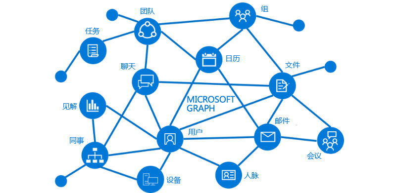

# Microsoft Graph 概述

Microsoft Graph 是 Microsoft 365 中数据和智能的网关。 Microsoft Graph 提供了统一的可编程性模型，通过该模型可利用 Office 365、企业移动性 + 安全性和 Windows 10 中的大量数据。 

Microsoft Graph API 可用于为组织和消费者生成应用，与数百万用户的数据进行交互。 使用 Microsoft Graph，可以与丰富的资源、关系和智能相连接，所有这些均通过单个终结点实现：`https://graph.microsoft.com`。

## Graph 有哪些功能？
Microsoft Graph 为以下服务公开了 API：

- Azure Active Directory
- Office 365 服务：SharePoint、OneDrive、Outlook/Exchange、Microsoft Teams、OneNote、Planner 和 Excel
- 企业移动性和安全性服务：Identity Manager、Intune、高级威胁分析和高级威胁防护。
- Windows 10 服务：活动和设备
- 教育

要了解更多内容，请参阅 [Microsoft Graph 中的主要服务和功能](../concepts/overview-major-services.md)。

Microsoft Graph 通过关系连接这些服务中的所有资源。 例如，用户可通过 [memberOf](../api-reference/v1.0/api/user_list_memberof.md) 关系连接到某个组，也可以通过 [manager](../api-reference/v1.0/api/user_list_manager.md) 关系连接到其他用户。 你的应用可以遍历这些关系来访问这些连接的资源，并通过 API 对其执行操作。

此外，你还可以从 Microsoft Graph 中获取与数据相关的有价值的见解和情报。 例如，你可以获得特定用户的[常用](../api-reference/beta/resources/insights_trending.md)文件，或者获取与用户相关度最高的[人员](../api-reference/beta/api/user_list_people.md)。

在 Microsoft Graph 中发现关系的可能性。

## 可以使用 Microsoft Graph 执行哪些操作？ 

可以使用 Microsoft Graph 为用户构建独特的周围环境体验，帮助他们提高工作效率。想象一下，一个应用可以...

- 查看你的下一次会议，并通过提供与会者的个人资料信息帮助你准备会议，包括他们的职务、工作伙伴以及关于最近处理的文档和项目的信息。
- 扫描你的日历，并为下一次团队会议提出最佳时间建议。
- 从 OneDrive 中的 Excel 文件获取最新销售预测图表，让你可以实时更新趋势预测，这一切通过手机就可以实现。
- 订阅日历更改、当你在会议上花费太长时间时发出警报，还可以根据与会者和你的相关度，为可能错过或委派的会议提供建议。
- 帮助你整理手机上的个人和工作信息；例如，对应当归到个人 OneDrive 的照片和应当归到 OneDrive for Business 的业务收据进行分类。

使用 Microsoft Graph API，你可以实现这些功能及其他更多功能。

>**注意：** 使用 Microsoft Graph API 时，表示你同意 [Microsoft Graph 使用条款](../misc/terms-of-use.md)和 [Microsoft 隐私声明](https://go.microsoft.com/fwlink/?LinkId=521839)。

### 常见请求

查看可与 Microsoft Graph API 结合使用的某些常见方案。 这些链接可带你前往 [Graph 浏览器](https://developer.microsoft.com/zh-CN/graph/graph-explorer)。

| **操作** | **URL** |
|:--------------------------|:----------------------------------------|
|   获取我的个人资料 |    [`https://graph.microsoft.com/v1.0/me`](https://developer.microsoft.com/graph/graph-explorer/?request=me&version=v1.0) |
|   获取我的文件 | [`https://graph.microsoft.com/v1.0/me/drive/root/children`](https://developer.microsoft.com/graph/graph-explorer/?request=me%2Fdrive%2Froot%2Fchildren&version=v1.0) |
|   获取我的照片	 | [`https://graph.microsoft.com/v1.0/me/photo/$value`](https://developer.microsoft.com/graph/graph-explorer/?request=me%2Fphoto%2F%24value&version=v1.0) |
|   获取我的邮件 |   [`https://graph.microsoft.com/v1.0/me/messages`](https://developer.microsoft.com/graph/graph-explorer/?request=me%2Fmessages&version=v1.0) |
|   获取我的高重要性的邮件 | [`https://graph.microsoft.com/v1.0/me/messages?$filter=importance%20eq%20'high'`](https://developer.microsoft.com/graph/graph-explorer/?request=me%2Fmessages%3F%24filter%3Dimportance%2520eq%2520'high'&version=v1.0) |
|   获取我的日历事件 |    [`https://graph.microsoft.com/v1.0/me/events`](https://developer.microsoft.com/graph/graph-explorer/?request=me%2Fevents&version=v1.0) |
|   获取我的经理  | [`https://graph.microsoft.com/v1.0/me/manager`](https://developer.microsoft.com/graph/graph-explorer/?request=me%2Fmanager&version=v1.0) |
|   获取上一个修改文件 foo.txt 的用户 |  [`https://graph.microsoft.com/v1.0/me/drive/root/children/foo.txt/lastModifiedByUser`](https://developer.microsoft.com/graph/graph-explorer/?request=me%2Fdrive%2Froot%2Fchildren%2Ffoo.txt%2FlastModifiedByUser&version=v1.0) |
|   获取我所属的 Office365 组| [`https://graph.microsoft.com/v1.0/me/memberOf/$/microsoft.graph.group?$filter=groupTypes/any(a:a%20eq%20'unified')`](https://developer.microsoft.com/graph/graph-explorer/?request=me%2FmemberOf%2F%24%2Fmicrosoft.graph.group%3F%24filter%3DgroupTypes%2Fany(a%3Aa%2520eq%2520'unified')&version=v1.0) |
|   获取我组织中的用户     | [`https://graph.microsoft.com/v1.0/users`](https://developer.microsoft.com/graph/graph-explorer/?request=users&version=v1.0) |
|   获取我组织中的组 | [`https://graph.microsoft.com/v1.0/groups`](https://developer.microsoft.com/graph/graph-explorer/?request=groups&version=v1.0) |
|   获取与我相关的人员    | [`https://graph.microsoft.com/v1.0/me/people`](https://developer.microsoft.com/graph/graph-explorer/?request=me%2Fpeople&version=beta)  |
|   获取我常用的项目 |  [`https://graph.microsoft.com/beta/me/insights/trending`](https://developer.microsoft.com/graph/graph-explorer/?request=me%2Finsights%2Ftrending&version=beta) |
|   获取我的注释 |  [`https://graph.microsoft.com/v1.0/me/onenote/notebooks`](https://developer.microsoft.com/graph/graph-explorer/?request=me%2Fonenote%2Fnotebooks&version=beta) |

## 后续步骤

- 查看某些[精选应用场景](../concepts/featured_scenarios.md)。
- 尝试 [Graph 浏览器](https://developer.microsoft.com/graph/graph-explorer)中的示例请求。
- 使用[快速入门](https://developer.microsoft.com/graph/quick-start)设置即可运行的示例应用。
- 在目录的**了解**下，阅读有关你可在应用场景中使用的服务和功能。 
- 了解如何在你的应用中[获取身份验证令牌](../concepts/auth_overview.md)。
- 开始[使用 API](../concepts/use_the_api.md)。

## 有反馈？

我们非常重视你的反馈意见。请在 [Stack Overflow](http://stackoverflow.com/questions/tagged/office365+or+microsoftgraph) 上与我们联系。使用 [MicrosoftGraph] 标记出你的问题。

