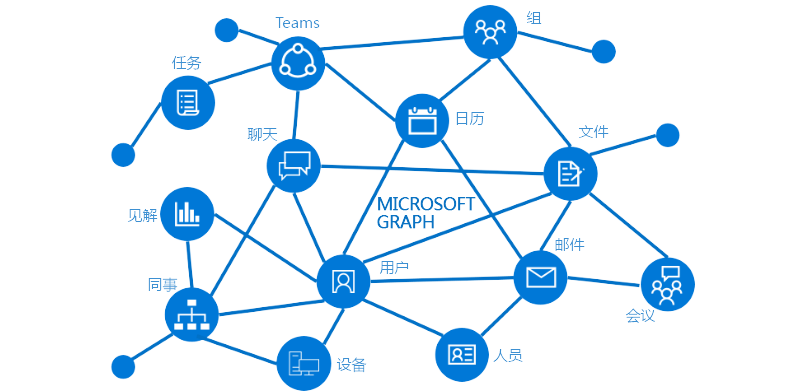

# Microsoft Graph 概述

Microsoft Graph 是 Microsoft 365 中通往数据和智能的网关。 它提供统一的可编程模型，可用于访问 Microsoft 365、Windows 10 和企业移动性 + 安全性中的海量数据。 利用 Microsoft Graph 中的大量数据针对与数百万名用户交互的组织和客户构建应用。

## 支持 Microsoft 365 平台的数据和服务
在 Microsoft 365 平台中，这三大组件让数据访问和传输变得轻松：

- Microsoft Graph API 提供单一终结点 `https://graph.microsoft.com`，以访问 **Microsoft 云**（包括 Microsoft 365、Windows 10 和企业移动性 + 安全性）中以人为中心的丰富的数据和见解。 你可使用 REST API 或 SDK 来访问终结点并构建支持横跨生产力、协作、教育、人员和工作场所智能等 Microsoft 365 场景的应用。 Microsoft Graph 还包含一组功能强大的服务，可管理用户和设备标识、访问、合规性和安全性，并帮助保护组织防止数据泄露或丢失。
- [Microsoft Graph 连接器（预览版）](/microsoftsearch/connectors-overview)在传入的方向上工作，**将 Microsoft 云外部的数据传递到 Microsoft Graph 服务和应用程序**，以增强 Microsoft 搜索等 Microsoft 365 体验。 许多常用数据源中均存在连接器，如 Box、Google Drive、Jira 和 Salesforce。
- [Microsoft Graph 数据连接](#access-microsoft-graph-data-at-scale-using-microsoft-graph-data-connect) 提供了一组工具，可以更加轻松地安全和可扩展地 **向热门 Azure 数据存储传递 Microsoft Graph 数据**。 缓存数据充当 Azure 开发工具的数据源，可用于构建智能应用程序。

Microsoft Graph API、连接器（预览版）和数据连接三者结合，为 Microsoft 365 平台提供支持。 借助可访问 Microsoft Graph 数据和其他数据集的能力，你可以获取见解和分析、扩展 Microsoft 365 体验和构建唯一而智能的应用程序。

> [!NOTE]
> Microsoft Graph 连接器现为预览版。 若要将连接器与 Microsoft 搜索结合使用或构建连接器，必须注册[连接器预览计划](/MicrosoftSearch/connectors-preview)。 若要加入预览计划，请提交 [Microsoft Graph 连接器预览版注册表单](https://forms.office.com/Pages/ResponsePage.aspx?id=v4j5cvGGr0GRqy180BHbRxWYgu82J_RFnMMATAS6_chUNVYwNU1CMDNZUDBSSDZKWVo2RDJDRjRLQi4u)。

## Microsoft Graph 提供了哪些内容？

Microsoft Graph 公开了 REST API 和客户端库，它们可访问以下 Microsoft 云服务上的数据：

- Microsoft 365 核心服务：Bookings、日历、Delve、Excel、Microsoft 365 合规中心电子数据展示、Microsoft 搜索、OneDrive、OneNote、Outlook/Exchange、人员（Outlook 联系人）、Planner、SharePoint、Teams、待办事项、工作区分析。
- 企业移动性 + 安全性服务：高级威胁分析、高级威胁防护、Azure Active Directory、Identity Manager 和 Intune。
- Windows 10 服务：活动、设备和通知、通用打印。
- Dynamics 365 业务中心。

要了解详细信息，请参阅 [Microsoft Graph 中的主要服务和功能](overview-major-services.md)。

## 可以使用 Microsoft Graph 执行哪些操作？

> [!VIDEO https://www.youtube-nocookie.com/embed/PI9NO5rayiY]

使用 Microsoft Graph 围绕用户的唯一上下文构建体验，帮助他们提高工作效率。 假设有个应用...

- 查看你的下一场会议，提供与会者职务和所属经理、其正在处理的最新文档相关信息，以及其正在与之协作的人员等与会者个人资料信息，帮助你为该会议做好准备。
- 扫描你的日历，并为下一次团队会议提出最佳时间建议。
- 从 OneDrive 中的 Excel 文件获取最新销售预测图表，让你可以实时更新趋势预测，这一切通过手机就可以实现。
- 订阅日历更改、当你在会议上花费太长时间时发出警报，还可以根据与会者和你的相关度，为可能错过或委派的会议提供建议。
- 帮助你整理手机上的个人和工作信息；例如，对应当归到个人 OneDrive 的照片和应当归到 OneDrive for Business 的业务收据进行分类。
- 分析大量 Microsoft 365 数据，让决策者们能将宝贵的见解转化成能提升业务生产力的时间分配和协作模式中。
- 将自定义业务数据引入到 Microsoft Graph，编制相关索引，使其可与来自 Microsoft 365 服务的数据一起供用户搜索。

以搜索与会者的第一个场景为例。 借助 Microsoft Graph API，你可执行以下操作：

1. 获取[会议活动](/graph/api/resources/event)与会者的电子邮件地址。
2. 在 Azure Active Directory 将其单独作为[用户](/graph/api/resources/user)进行查找，或者[获取他们的个人资料信息](/graph/api/user-get)。

然后，可顺着人际关系导航到其他联系人：

- 通过[上下级关系](/graph/api/user-list-manager)与其经理联系。
- 获取宝贵的见解和智能，包括在该用户身上发现的常用文件[趋势](/graph/api/resources/insights-trending)。
- 获取与该用户[关联性最大的人员](/graph/api/user-list-people?view=graph-rest-beta&preserve-view=true)。
- 将该场景进行扩展，通过[所属](/graph/api/user-list-memberof)关系了解该用户加入的组。
- [接触每个组中的其他成员](/graph/api/group-list-members)。
- 切入到通过[教育](education-concept-overview.md)和[团队合作](teams-concept-overview.md)等[组](office365-groups-concept-overview.md)实现的其他场景。

Microsoft Graph 不断向开发人员开放 Microsoft 365 平台，且始终仅使用适当的全向。

> [!NOTE]
> 使用 Microsoft Graph API 即表示你同意 [Microsoft API 使用条款](/legal/microsoft-apis/terms-of-use?context=/graph/context)和 [Microsoft 隐私声明](https://go.microsoft.com/fwlink/?LinkId=521839)。

### 热门 API 请求

查看可与 Microsoft Graph API 结合使用的某些常见方案。 这些链接可带你前往 [Graph 浏览器](https://developer.microsoft.com/graph/graph-explorer)。

| **操作** | **URL** |
|:--------------------------|:----------------------------------------|
|   获取我的个人资料 | [`https://graph.microsoft.com/v1.0/me`](https://developer.microsoft.com/graph/graph-explorer/?request=me&version=v1.0) |
|   获取我的文件 | [`https://graph.microsoft.com/v1.0/me/drive/root/children`](https://developer.microsoft.com/graph/graph-explorer/?request=me%2Fdrive%2Froot%2Fchildren&version=v1.0) |
|   获取我的照片	 | [`https://graph.microsoft.com/v1.0/me/photo/$value`](https://developer.microsoft.com/graph/graph-explorer/?request=me%2Fphoto%2F%24value&version=v1.0) |
|   获取我的邮件 | [`https://graph.microsoft.com/v1.0/me/messages`](https://developer.microsoft.com/graph/graph-explorer/?request=me%2Fmessages&version=v1.0) |
|   获取我的高重要性的邮件 | [`https://graph.microsoft.com/v1.0/me/messages?$filter=importance%20eq%20'high'`](https://developer.microsoft.com/graph/graph-explorer/?request=me%2Fmessages%3F%24filter%3Dimportance%2520eq%2520'high'&version=v1.0) |
|   获取我的日历事件 | [`https://graph.microsoft.com/v1.0/me/events`](https://developer.microsoft.com/graph/graph-explorer/?request=me%2Fevents&version=v1.0) |
|   获取我的经理 | [`https://graph.microsoft.com/v1.0/me/manager`](https://developer.microsoft.com/graph/graph-explorer/?request=me%2Fmanager&version=v1.0) |
|   获取上一个修改文件 foo.txt 的用户 | [`https://graph.microsoft.com/v1.0/me/drive/root/children/foo.txt/lastModifiedByUser`](https://developer.microsoft.com/graph/graph-explorer/?request=me%2Fdrive%2Froot%2Fchildren%2Ffoo.txt%2FlastModifiedByUser&version=v1.0) |
|   获取我隶属的 Microsoft 365 组| [`https://graph.microsoft.com/v1.0/me/memberOf/$/microsoft.graph.group?$filter=groupTypes/any(a:a%20eq%20'unified')`](https://developer.microsoft.com/graph/graph-explorer/?request=me%2FmemberOf%2F%24%2Fmicrosoft.graph.group%3F%24filter%3DgroupTypes%2Fany(a%3Aa%2520eq%2520'unified')&version=v1.0) |
|   获取我组织中的用户  | [`https://graph.microsoft.com/v1.0/users`](https://developer.microsoft.com/graph/graph-explorer/?request=users&version=v1.0) |
|   获取我组织中的组 | [`https://graph.microsoft.com/v1.0/groups`](https://developer.microsoft.com/graph/graph-explorer/?request=groups&version=v1.0) |
|   获取与我相关的人员 | [`https://graph.microsoft.com/v1.0/me/people`](https://developer.microsoft.com/graph/graph-explorer/?request=me%2Fpeople&version=beta)  |
|   获取我常用的项目 | [`https://graph.microsoft.com/beta/me/insights/trending`](https://developer.microsoft.com/graph/graph-explorer/?request=me%2Finsights%2Ftrending&version=v1.0) |
|   获取我的笔记 | [`https://graph.microsoft.com/v1.0/me/onenote/notebooks`](https://developer.microsoft.com/graph/graph-explorer/?request=me%2Fonenote%2Fnotebooks&version=beta) |

## 将数据从外部内容源引入 Microsoft Graph（预览版）

使用 Microsoft Graph _连接器_ 将 Microsoft 云外部的数据引入 Microsoft Graph。 此类数据的示例可以是组织的人力资源数据库或产品目录，它们在本地托管或在公有云或私有云中托管。 

Microsoft Graph 连接器创建与外部数据源的连接、对数据编制索引并将其作为外部自定义项和文件进行存储。 编制索引后，这些项将显示在 Microsoft 搜索中，并适用于使用 [Microsoft 搜索 API](search-concept-overview.md) 的应用。

## 使用 Microsoft Graph 数据连接大规模访问 Microsoft Graph 数据

使用 Microsoft Graph _数据连接_ 大规模访问 Microsoft Graph 上的数据，同时允许管理员能够精细地同意和全面掌控其 Microsoft Graph 数据。 通过数据连接，可更轻松地将此数据传递到 Microsoft Azure。

之后，可使用 Azure 工具构建能实现以下功能的智能应用：

- 为你在组织中查找与某主题最相关的专家
- 自动执行知识库创建
- 分析会议请求，以提供会议室利用率方面的见解
- 检测生产力和通信数据欺诈

## 应何时使用 Microsoft Graph API 或数据连接？

使用 Microsoft Graph 数据连接，可以一种新方式与通过 Microsoft Graph API 公开的数据进行交互。 数据连接提供了一套独特的工具，简化了智能应用程序的构建，且所有操作均在 Microsoft 云中完成。

|**功能**| **Microsoft Graph API** | **Microsoft Graph 数据连接** |
|:----------|:------------------------|:--------------------------------------|
| **访问范围** | 单个用户或整个租户 | 多个用户或组 |
| **访问模式** | 实时 | 定期重复 |
| **数据操作** | 对主数据执行操作 | 对数据缓存执行操作 |
| **数据保护** | 保护 Microsoft 365 中的数据 | 数据保护延伸至 Azure 订阅中的数据缓存 |
| **用户同意** | 自我 资源类型 | 无 |
| **管理员同意** | 整个组织 资源类型 | 选择用户组 资源类型和属性 排除用户 |
| **访问工具** | RESTful Web 查询 | Azure 数据工厂 |

 有关详细信息，请参与 [Microsoft Graph 数据连接](data-connect-concept-overview.md)。

## 后续步骤

- 查看一些[合作伙伴解决方案](https://developer.microsoft.com/graph/partners)。
- 尝试 [Graph 浏览器](https://developer.microsoft.com/graph/graph-explorer)中的示例请求。
- 使用[快速入门](https://developer.microsoft.com/graph/quick-start)设置即可运行的示例应用。
- 在目录的 **了解** 下，阅读有关你可在应用场景中使用的服务和功能。
- 了解如何在你的应用中[获取身份验证令牌](auth/auth-concepts.md)。
- 开始[使用 API](use-the-api.md)。
