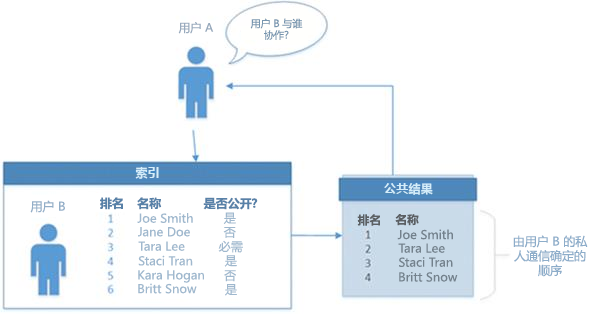

# <a name="use-the-people-api-in-microsoft-graph-to-get-information-about-the-people-most-relevant-to-you"></a>在 Microsoft Graph 中使用 People API 获取与你相关度最高的人员的信息

Microsoft Graph 应用程序可以使用人员 API 检索与用户相关度最高的人员。相关性由用户的通信和协作模式及业务关系决定。人员可以是当地联系人，或其所在组织目录中的联系人以及来自最近通信中的人员。在生成此见解的同时，人员 API 还会提供模糊匹配搜索支持及检索登录用户组织中其他用户的相关用户列表的功能。人员 API 尤其适用于人员选择应用场景，例如撰写电子邮件或创建会议。例如，可以在撰写电子邮件的应用场景中使用人员 API。

## <a name="authorization"></a>Authorization

若要在 Microsoft Graph 中调用 People API，应用必须拥有适当的权限：

* People.Read - 用于进行常规的 People API 调用，例如 `https://graph.microsoft.com/v1.0/me/people/`。People.Read 需要获得最终用户的同意。
* People.Read.All - 在进行检索与登录用户组织中指定用户相关度最高的人员 (`https://graph.microsoft.com/v1.0/users/{id}/people`) 调用时需要。 People.Read.All 需要获得管理员的同意。

## <a name="browse-people"></a>浏览人员

此部分中的请求可以获取与登录用户 (`/me`)，或者与登录用户所在组织中的特定用户相关度最高的人员。这些请求需要分别具有 People.Read 或 People.Read.All 权限。默认情况下，每个响应返回 10 个记录，但可以使用 *$top* 查询参数更改此设置。

### <a name="get-a-collection-of-relevant-people"></a>获取相关人员集合。

以下请求根据通信和协作模式及业务关系获取与登录用户 (`/me`) 相关度最高的人员。

```http
GET https://graph.microsoft.com/v1.0/me/people/
```

以下示例显示了相应的响应。默认情况下，每个响应返回 10 个记录。可以使用 *$top* 查询参数更改此设置。本示例使用 *$top* 将响应限制为三个记录。

```http
HTTP/1.1 200 OK
Content-type: application/json

{
  "value": [
    {
      "id": "8CE6E1DE-CB84-4BF5-971D-D3ECF452E2B5",
      "displayName": "Lorrie Frye",
      "givenName": "Lorrie",
      "surname": "Frye",
      "birthday": "",
      "personNotes": "",
      "isFavorite": false,
      "jobTitle": "Paralegal",
      "companyName": null,
      "yomiCompany": "",
      "department": "Legal",
      "officeLocation": "20/1109",
      "profession": "",
      "userPrincipalName": "LorrieF@contoso.onmicrosoft.com",
      "imAddress": "sip:LorrieF@contoso.onmicrosoft.com",
      "scoredEmailAddresses": [
        {
          "address": "LorrieF@contoso.onmicrosoft.com",
          "relevanceScore": 8
        }
      ],
      "phones": [
        {
          "type": "Business",
          "number": "+1 980 555 0101"
        }
      ],
      "postalAddresses": [],
      "websites": [],
      "personType": {
        "class": "Person",
        "subclass": "OrganizationUser"
      }
    },
    {
      "id": "5767393D-42BA-4E5C-BEE4-52BB25639CF4",
      "displayName": "Maynard Denman",
      "givenName": "Maynard",
      "surname": "Denman",
      "birthday": "",
      "personNotes": "",
      "isFavorite": false,
      "jobTitle": "Web Marketing Manager",
      "companyName": null,
      "yomiCompany": "",
      "department": "Sales & Marketing",
      "officeLocation": "20/1101",
      "profession": "",
      "userPrincipalName": "MaynardD@contoso.onmicrosoft.com",
      "imAddress": "sip:MaynardD@contoso.onmicrosoft.com",
      "scoredEmailAddresses": [
        {
          "address": "MaynardD@contoso.onmicrosoft.com",
          "relevanceScore": 8
        }
      ],
      "phones": [
        {
          "type": "Business",
          "number": "+1 918 555 0101"
        }
      ],
      "postalAddresses": [],
      "websites": [],
      "personType": {
        "class": "Person",
        "subclass": "OrganizationUser"
      }
    },
    {
      "id": "914B5191-11FA-4C0B-A354-0FA8C8EFD585",
      "displayName": "Darrel Halsey",
      "givenName": "Darrel",
      "surname": "Halsey",
      "birthday": "",
      "personNotes": "",
      "isFavorite": false,
      "jobTitle": "Attorney",
      "companyName": null,
      "yomiCompany": "",
      "department": "Legal",
      "officeLocation": "14/1102",
      "profession": "",
      "userPrincipalName": "DarrelH@contoso.onmicrosoft.com",
      "imAddress": "sip:DarrelH@contoso.onmicrosoft.com",
      "scoredEmailAddresses": [
        {
          "address": "DarrelH@contoso.onmicrosoft.com",
          "relevanceScore": 8
        }
      ],
      "phones": [
        {
          "type": "Business",
          "number": "+1 205 555 0103"
        }
      ],
      "postalAddresses": [],
      "websites": [],
      "personType": {
        "class": "Person",
        "subclass": "OrganizationUser"
      }
    }
  ]
}
```

### <a name="request-a-subsequent-page-of-people"></a>请求后续人员页面

如果第一个响应未包含相关人员的完整列表，可以使用 *$top* 和 *$skip* 发出第二个请求，以请求其他信息页面。如果上一个请求包含其他信息，则下一个请求从服务器获取下一个人员页面。

```http
GET https://graph.microsoft.com/v1.0/me/people/?$top=3&$skip=10
```

以下示例显示了相应的响应。默认情况下，每个响应返回 10 个记录。可以使用 *$top* 查询参数更改此设置。本示例使用 *$top* 将响应限制为三个记录。

```http
HTTP/1.1 200 OK
Content-type: application/json

{
  "value": [
    {
      "id": "1F28616D-BDFE-4080-8F06-03366A851688",
      "displayName": "Felix Coppola",
      "givenName": "Felix",
      "surname": "Coppola",
      "birthday": "",
      "personNotes": "",
      "isFavorite": false,
      "jobTitle": "CVP Legal",
      "companyName": null,
      "yomiCompany": "",
      "department": "Legal",
      "officeLocation": "19/2109",
      "profession": "",
      "userPrincipalName": "FelixC@contoso.onmicrosoft.com",
      "imAddress": "sip:FelixC@contoso.onmicrosoft.com",
      "scoredEmailAddresses": [
        {
          "address": "FelixC@contoso.onmicrosoft.com",
          "relevanceScore": 8
        }
      ],
      "phones": [
        {
          "type": "Business",
          "number": "+1 309 555 0104"
        }
      ],
      "postalAddresses": [],
      "websites": [],
      "personType": {
        "class": "Person",
        "subclass": "OrganizationUser"
      }
    },
    {
      "id": "8A3FC021-6DBB-44AC-8884-B7B500CC260A",
      "displayName": "Lenora Rowland",
      "givenName": "Lenora",
      "surname": "Rowland",
      "birthday": "",
      "personNotes": "",
      "isFavorite": false,
      "jobTitle": "Marketing Assistant",
      "companyName": null,
      "yomiCompany": "",
      "department": "Sales & Marketing",
      "officeLocation": "18/1106",
      "profession": "",
      "userPrincipalName": "LenoraR@contoso.onmicrosoft.com",
      "imAddress": "sip:LenoraR@contoso.onmicrosoft.com",
      "scoredEmailAddresses": [
        {
          "address": "LenoraR@contoso.onmicrosoft.com",
          "relevanceScore": 8
        }
      ],
      "phones": [
        {
          "type": "Business",
          "number": "+1 954 555 0118"
        }
      ],
      "postalAddresses": [],
      "websites": [],
      "personType": {
        "class": "Person",
        "subclass": "OrganizationUser"
      }
    },
    {
      "id": "032C9919-4DF9-4715-8C46-4D0FAE7B3EB2",
      "displayName": "Manuel Collette",
      "givenName": "Manuel",
      "surname": "Collette",
      "birthday": "",
      "personNotes": "",
      "isFavorite": false,
      "jobTitle": "Accountant II",
      "companyName": null,
      "yomiCompany": "",
      "department": "Finance",
      "officeLocation": "98/2202",
      "profession": "",
      "userPrincipalName": "ManuelC@contoso.onmicrosoft.com",
      "imAddress": "sip:ManuelC@contoso.onmicrosoft.com",
      "scoredEmailAddresses": [
        {
          "address": "ManuelC@contoso.onmicrosoft.com",
          "relevanceScore": 8
        }
      ],
      "phones": [
        {
          "type": "Business",
          "number": "+20 255501070"
        }
      ],
      "postalAddresses": [],
      "websites": [],
      "personType": {
        "class": "Person",
        "subclass": "OrganizationUser"
      }
    }
  ]
}
```

### <a name="sort-the-response"></a>对响应进行排序

默认情况下，按与查询的相关性对响应中的人员进行排序。可以使用 *$orderby* 参数更改响应中的人员的顺序。此查询会选择与你相关度最高的人员，按 **displayName** 对他们进行排序，然后返回排序列表上的前 10 个人员。

```http
GET https://graph.microsoft.com/v1.0/me/people/?$orderby=displayName
```

以下示例显示了相应的响应。默认情况下，每个响应返回 10 个记录。可以使用 *$top* 参数更改此设置。以下示例使用 *$top* 将响应限制为三个记录。

```http
HTTP/1.1 200 OK
Content-type: application/json

{
  "value": [
    {
      "id": "818E29A1-E6BB-4EDA-AB20-8230B4B1E290",
      "displayName": "Adriana Ramos",
      "givenName": "Adriana",
      "surname": "Ramos",
      "birthday": "",
      "personNotes": "",
      "isFavorite": false,
      "jobTitle": "Product Marketing Manager",
      "companyName": null,
      "yomiCompany": "",
      "department": "Sales & Marketing",
      "officeLocation": "18/2111",
      "profession": "",
      "userPrincipalName": "AdrianaR@contoso.onmicrosoft.com",
      "imAddress": "sip:AdrianaR@contoso.onmicrosoft.com",
      "scoredEmailAddresses": [
        {
          "address": "AdrianaR@contoso.onmicrosoft.com",
          "relevanceScore": 8
        }
      ],
      "phones": [
        {
          "type": "Business",
          "number": "+1 425 555 0109"
        }
      ],
      "postalAddresses": [],
      "websites": [],
      "personType": {
        "class": "Person",
        "subclass": "OrganizationUser"
      }
    },
    {
      "id": "62633BAA-1CB9-4FA2-9B8F-55AB1840B69D",
      "displayName": "Alyce Cooley",
      "givenName": "Alyce",
      "surname": "Cooley",
      "birthday": "",
      "personNotes": "",
      "isFavorite": false,
      "jobTitle": "Marketing Assistant",
      "companyName": null,
      "yomiCompany": "",
      "department": "Sales & Marketing",
      "officeLocation": "131/1104",
      "profession": "",
      "userPrincipalName": "AlyceC@contoso.onmicrosoft.com",
      "imAddress": "sip:AlyceC@contoso.onmicrosoft.com",
      "scoredEmailAddresses": [
        {
          "address": "AlyceC@contoso.onmicrosoft.com",
          "relevanceScore": 8
        }
      ],
      "phones": [
        {
          "type": "Business",
          "number": "+1 858 555 0110"
        }
      ],
      "postalAddresses": [],
      "websites": [],
      "personType": {
        "class": "Person",
        "subclass": "OrganizationUser"
      }
    },
    {
      "id": "6BB54D2C-EF20-48DA-ADD9-AE757DD30C4E",
      "displayName": "Alyssa Clarke",
      "givenName": "Alyssa",
      "surname": "Clarke",
      "birthday": "",
      "personNotes": "",
      "isFavorite": false,
      "jobTitle": "Corporate Security Officer",
      "companyName": null,
      "yomiCompany": "",
      "department": "Operations",
      "officeLocation": "24/1106",
      "profession": "",
      "userPrincipalName": "AlyssaC@contoso.onmicrosoft.com",
      "imAddress": "sip:AlyssaC@contoso.onmicrosoft.com",
      "scoredEmailAddresses": [
        {
          "address": "AlyssaC@contoso.onmicrosoft.com",
          "relevanceScore": 8
        }
      ],
      "phones": [
        {
          "type": "Business",
          "number": "+1 262 555 0106"
        }
      ],
      "postalAddresses": [],
      "websites": [],
      "personType": {
        "class": "Person",
        "subclass": "OrganizationUser"
      }
    }
  ]
}
```

### <a name="change-the-number-of-people-and-fields-returned"></a>更改返回的人员和字段数

可以通过设置 *$top* 参数更改响应中返回的人员数。

以下示例请求与 `/me` 相关度最高的 1,000 个人员。此请求还通过仅请求人员的 **displayName** 来限制从服务器返回的数据量。

```http
GET https://graph.microsoft.com/v1.0/me/people/?$top=1000&$Select=displayName
```

以下示例显示了相应的响应。

```http
HTTP/1.1 200 OK
Content-type: application/json

{
  "value": [
    {
      "id": "8CE6E1DE-CB84-4BF5-971D-D3ECF452E2B5",
      "displayName": "Lorrie Frye"
    },
    {
      "id": "5767393D-42BA-4E5C-BEE4-52BB25639CF4",
      "displayName": "Maynard Denman"
    },
    {
      "id": "914B5191-11FA-4C0B-A354-0FA8C8EFD585",
      "displayName": "Darrel Halsey"
    },
    {
      "id": "E3C5B235-DE15-4566-B7B1-7A8E32426540",
      "displayName": "Roscoe Seidel"
    },
    {
      "id": "6BB54D2C-EF20-48DA-ADD9-AE757DD30C4E",
      "displayName": "Alyssa Clarke"
    },
    {
      "id": "818E29A1-E6BB-4EDA-AB20-8230B4B1E290",
      "displayName": "Adriana Ramos"
    },
    {
      "id": "62633BAA-1CB9-4FA2-9B8F-55AB1840B69D",
      "displayName": "Alyce Cooley"
    },
    {
      "id": "6BB9CC1F-418D-4DDF-AB0C-6A1C4ABCDBF4",
      "displayName": "Wayne Leeper"
    },
    {
      "id": "E7D40AC5-0078-4575-B1F3-F738124C4BC9",
      "displayName": "Jan Travis"
    },
    {
      "id": "6F99D1CC-4FCC-49E4-9160-E8AB01BF3E83",
      "displayName": "Charlotte Delacruz"
    },
    {
      "id": "1F28616D-BDFE-4080-8F06-03366A851688",
      "displayName": "Felix Coppola"
    },
    {
      "id": "8A3FC021-6DBB-44AC-8884-B7B500CC260A",
      "displayName": "Lenora Rowland"
    },
    {
      "id": "032C9919-4DF9-4715-8C46-4D0FAE7B3EB2",
      "displayName": "Manuel Collette"
    }
  ]
}
```
### <a name="types-of-results-included"></a>包含的结果类型
默认情况下，Microsoft Graph 只为邮箱提供你所保存的联系人或最有可能与你互动的人的结果。 要检索整个组织范围的目录结果，请如下所示指定一个 HTTP 标头。

```http
"X-PeopleQuery-QuerySources: Mailbox,Directory”
```
### <a name="select-the-fields-to-return"></a>选择要返回的字段

可以使用 *$select* 参数选择一个或多个字段，限制从服务器返回的数据量。始终会返回 `@odata.id` 字段。

以下示例将响应限制为 10 个相关度最高人员的 **displayName** 和 **scoredEmailAddresses**。

```http
GET https://graph.microsoft.com/v1.0/me/people/?$select=displayName,scoredEmailAddresses
```

以下示例显示了相应的响应。默认情况下，每个响应返回 10 个记录。可以使用 *$top* 参数更改此设置。本示例使用 *$top* 将响应限制为三个记录。

```http
HTTP/1.1 200 OK
Content-type: application/json

{
  "value": [
    {
      "id": "8CE6E1DE-CB84-4BF5-971D-D3ECF452E2B5",
      "displayName": "Lorrie Frye",
      "scoredEmailAddresses": [
        {
          "address": "LorrieF@contoso.onmicrosoft.com",
          "relevanceScore": 8
        }
      ]
    },
    {
      "id": "5767393D-42BA-4E5C-BEE4-52BB25639CF4",
      "displayName": "Maynard Denman",
      "scoredEmailAddresses": [
        {
          "address": "MaynardD@contoso.onmicrosoft.com",
          "relevanceScore": 8
        }
      ]
    },
    {
      "id": "914B5191-11FA-4C0B-A354-0FA8C8EFD585",
      "displayName": "Darrel Halsey",
      "scoredEmailAddresses": [
        {
          "address": "DarrelH@contoso.onmicrosoft.com",
          "relevanceScore": 8
        }
      ]
    }
  ]
}
```

### <a name="use-a-filter-to-limit-the-response"></a>使用筛选器限制响应

可以使用 *$filter* 参数将响应限制为记录中包含指定条件的那些人员。

以下查询将响应限制为包含 **personType** 属性的 **person** 实例，该属性将 **person** 分配为 **类**，将 **organizationUser** 分配为 **子类**。

```http
GET https://graph.microsoft.com/v1.0/me/people/?$filter=personType/class eq 'Person' and personType/subclass eq 'OrganizationUser'
```

以下示例显示了相应的响应。默认情况下，每个响应返回 10 个记录。可以使用 *$top* 参数更改此设置。本示例使用 *$top* 将响应限制为三个记录。

```http
HTTP/1.1 200 OK
Content-type: application/json

{
  "value": [
    {
      "id": "8CE6E1DE-CB84-4BF5-971D-D3ECF452E2B5",
      "displayName": "Lorrie Frye",
      "givenName": "Lorrie",
      "surname": "Frye",
      "birthday": "",
      "personNotes": "",
      "isFavorite": false,
      "jobTitle": "Paralegal",
      "companyName": null,
      "yomiCompany": "",
      "department": "Legal",
      "officeLocation": "20/1109",
      "profession": "",
      "userPrincipalName": "LorrieF@contoso.onmicrosoft.com",
      "imAddress": "sip:LorrieF@contoso.onmicrosoft.com",
      "scoredEmailAddresses": [
        {
          "address": "LorrieF@contoso.onmicrosoft.com",
          "relevanceScore": 8
        }
      ],
      "phones": [
        {
          "type": "Business",
          "number": "+1 980 555 0101"
        }
      ],
      "postalAddresses": [],
      "websites": [],
      "personType": {
        "class": "Person",
        "subclass": "OrganizationUser"
      }
    },
    {
      "id": "5767393D-42BA-4E5C-BEE4-52BB25639CF4",
      "displayName": "Maynard Denman",
      "givenName": "Maynard",
      "surname": "Denman",
      "birthday": "",
      "personNotes": "",
      "isFavorite": false,
      "jobTitle": "Web Marketing Manager",
      "companyName": null,
      "yomiCompany": "",
      "department": "Sales & Marketing",
      "officeLocation": "20/1101",
      "profession": "",
      "userPrincipalName": "MaynardD@contoso.onmicrosoft.com",
      "imAddress": "sip:MaynardD@contoso.onmicrosoft.com",
      "scoredEmailAddresses": [
        {
          "address": "MaynardD@contoso.onmicrosoft.com",
          "relevanceScore": 8
        }
      ],
      "phones": [
        {
          "type": "Business",
          "number": "+1 918 555 0101"
        }
      ],
      "postalAddresses": [],
      "websites": [],
      "personType": {
        "class": "Person",
        "subclass": "OrganizationUser"
      }
    },
    {
      "id": "914B5191-11FA-4C0B-A354-0FA8C8EFD585",
      "displayName": "Darrel Halsey",
      "givenName": "Darrel",
      "surname": "Halsey",
      "birthday": "",
      "personNotes": "",
      "isFavorite": false,
      "jobTitle": "Attorney",
      "companyName": null,
      "yomiCompany": "",
      "department": "Legal",
      "officeLocation": "14/1102",
      "profession": "",
      "userPrincipalName": "DarrelH@contoso.onmicrosoft.com",
      "imAddress": "sip:DarrelH@contoso.onmicrosoft.com",
      "scoredEmailAddresses": [
        {
          "address": "DarrelH@contoso.onmicrosoft.com",
          "relevanceScore": 8
        }
      ],
      "phones": [
        {
          "type": "Business",
          "number": "+1 205 555 0103"
        }
      ],
      "postalAddresses": [],
      "websites": [],
      "personType": {
        "class": "Person",
        "subclass": "OrganizationUser"
      }
    }
  ]
}
```

### <a name="select-the-fields-to-return-in-a-filtered-response"></a>选择要在经过筛选的响应中返回的字段

可以结合 *$select* 和 *$filter* 参数创建自定义用户相关人员列表，并且只获取应用程序需要的字段。

以下示例获取显示名称等于指定名称的人员的 **displayName** 和 **scoredEmailAddresses**。在本示例中，只返回显示名称等于“Lorrie Frye”的人员。

```http
GET https://graph.microsoft.com/v1.0/me/people/?$select=displayName,scoredEmailAddresses&$filter=displayName eq 'Lorrie Frye'
```

以下示例显示了相应的响应。

```http
HTTP/1.1 200 OK
Content-type: application/json

{
  "value": [
    {
      "id": "8CE6E1DE-CB84-4BF5-971D-D3ECF452E2B5",
      "displayName": "Lorrie Frye",
      "scoredEmailAddresses": [
        {
          "address": "LorrieF@contoso.onmicrosoft.com",
          "relevanceScore": 8
        }
      ]
    }
  ]
}
```

### <a name="browse-another-users-relevant-people"></a>浏览其他用户的相关人员

以下请求获取与登录用户组织中的其他人员相关度最高的人员，例如在[实现参与工作功能](#implementation-of-the-working-with-feature) 中所述。 此请求需要具有 People.Read.All 权限。 上节所述的所有查询参数也都适用。

在本示例中显示了 Roscoe Seidel 的相关人员。

```http
GET https://graph.microsoft.com/v1.0/users('roscoes@contoso.com')/people/
```

以下示例显示了相应的响应。默认情况下，每个响应返回 10 个记录。可以使用 *$top* 参数更改此设置。下面的示例使用 *$top* 将响应限制为三个记录。

```http
HTTP/1.1 200 OK
Content-type: application/json

{
  "value": [
    {
      "id": "56155636-703F-47F2-B657-C83F01F49BBC",
      "displayName": "Clifton Clemente",
      "givenName": "Clifton",
      "surname": "Clemente",
      "birthday": "",
      "personNotes": "",
      "isFavorite": false,
      "jobTitle": "Director",
      "companyName": null,
      "yomiCompany": "",
      "department": "Legal",
      "officeLocation": "19/2106",
      "profession": "",
      "userPrincipalName": "CliftonC@contoso.onmicrosoft.com",
      "imAddress": "sip:CliftonC@contoso.onmicrosoft.com",
      "scoredEmailAddresses": [
        {
          "address": "CliftonC@contoso.onmicrosoft.com",
          "relevanceScore": 20
        }
      ],
      "phones": [
        {
          "type": "Business",
          "number": "+1 309 555 0101"
        }
      ],
      "postalAddresses": [],
      "websites": [],
      "personType": {
        "class": "Person",
        "subclass": "OrganizationUser"
      }
    },
    {
      "id": "6BF27D5A-AB4F-4C43-BED0-7DAD9EB0C1C4",
      "displayName": "Sheree Mitchell",
      "givenName": "Sheree",
      "surname": "Mitchell",
      "birthday": "",
      "personNotes": "",
      "isFavorite": false,
      "jobTitle": "Product Manager",
      "companyName": null,
      "yomiCompany": "",
      "department": "Sales & Marketing",
      "officeLocation": "20/2107",
      "profession": "",
      "userPrincipalName": "ShereeM@contoso.onmicrosoft.com",
      "imAddress": "sip:ShereeM@contoso.onmicrosoft.com",
      "scoredEmailAddresses": [
        {
          "address": "ShereeM@contoso.onmicrosoft.com",
          "relevanceScore": 10
        }
      ],
      "phones": [
        {
          "type": "Business",
          "number": "+1 918 555 0107"
        }
      ],
      "postalAddresses": [],
      "websites": [],
      "personType": {
        "class": "Person",
        "subclass": "OrganizationUser"
      }
    },
    {
      "id": "B3E5302D-EAF0-4E8B-8C6C-A2AE64B4B163",
      "displayName": "Vincent Matney",
      "givenName": "Vincent",
      "surname": "Matney",
      "birthday": "",
      "personNotes": "",
      "isFavorite": false,
      "jobTitle": "CVP Engineering",
      "companyName": null,
      "yomiCompany": "",
      "department": "Engineering",
      "officeLocation": "23/2102",
      "profession": "",
      "userPrincipalName": "VincentM@contoso.onmicrosoft.com",
      "imAddress": "sip:VincentM@contoso.onmicrosoft.com",
      "scoredEmailAddresses": [
        {
          "address": "VincentM@contoso.onmicrosoft.com",
          "relevanceScore": 10
        }
      ],
      "phones": [
        {
          "type": "Business",
          "number": "+1 502 555 0102"
        }
      ],
      "postalAddresses": [],
      "websites": [],
      "personType": {
        "class": "Person",
        "subclass": "OrganizationUser"
      }
    }
  ]
}
```

## <a name="search-people"></a>搜索人员

此部分中的请求使你可以搜索登录用户 (`/me`) 及登录用户组织中其他用户的相关人员。这些请求需要具有 People.Read 权限，但搜索其他用户的相关人员时除外，这种情况下需要具有 People.Read.All 权限。默认情况下，每个响应返回 10 个记录，但可以使用 *$top* 参数更改此设置。

### <a name="use-search-to-select-people"></a>使用搜索选择人员

使用 *$search* 参数选择符合某组特定条件的人员。

以下搜索查询返回与 `/me` 相关且 **displayName** 或 **emailAddress** 包含以字母“j”开头的单词的人员。

```http
GET https://graph.microsoft.com/v1.0/me/people/?$search=j
```

以下示例显示了相应的响应。默认情况下，每个响应返回 10 个记录。可以使用 *$top* 参数更改此设置。本示例使用 *$top* 将响应限制为三个记录。

```http
HTTP/1.1 200 OK
Content-type: application/json

{
  "value": [
    {
      "id": "E3C5B235-DE15-4566-B7B1-7A8E32426540",
      "displayName": "Jan Travis",
      "givenName": "Jan",
      "surname": "Travis",
      "birthday": "",
      "personNotes": "",
      "isFavorite": false,
      "jobTitle": "VP Sales",
      "companyName": null,
      "yomiCompany": "",
      "department": "Sales & Marketing",
      "officeLocation": "19/3123",
      "profession": "",
      "userPrincipalName": "JanT@contoso.onmicrosoft.com",
      "imAddress": "sip:JanT@contoso.onmicrosoft.com",
      "scoredEmailAddresses": [
        {
          "address": "JanT@contoso.onmicrosoft.com",
          "relevanceScore": -12.297347783416837
        }
      ],
      "phones": [
        {
          "type": "Business",
          "number": "+1 732 555 0102"
        }
      ],
      "postalAddresses": [],
      "websites": [],
      "personType": {
        "class": "Person",
        "subclass": "OrganizationUser"
      }
    },
    {
      "id": "C43BF05E-5B6B-4DCF-B2FC-0837B09E0FA9",
      "displayName": "Jacob Cazares (TAILSPIN)",
      "givenName": null,
      "surname": null,
      "birthday": "",
      "personNotes": "",
      "isFavorite": false,
      "jobTitle": null,
      "companyName": null,
      "yomiCompany": "",
      "department": null,
      "officeLocation": null,
      "profession": "",
      "userPrincipalName": "",
      "imAddress": null,
      "scoredEmailAddresses": [
        {
          "address": "JacobC@tailspintoys.com",
          "relevanceScore": -12.298154282019846
        }
      ],
      "phones": [],
      "postalAddresses": [],
      "websites": [],
      "personType": {
        "class": "Person",
        "subclass": "PersonalContact"
      }
    },
    {
      "id": "6BB9CC1F-418D-4DDF-AB0C-6A1C4ABCDBF4",
      "displayName": "Jewell Montgomery",
      "givenName": "Jewell",
      "surname": "Montgomery",
      "birthday": "",
      "personNotes": "",
      "isFavorite": false,
      "jobTitle": null,
      "companyName": null,
      "yomiCompany": "",
      "department": null,
      "officeLocation": null,
      "profession": "",
      "userPrincipalName": "JewellM@contoso.onmicrosoft.com",
      "imAddress": null,
      "scoredEmailAddresses": [
        {
          "address": "JewellM@contoso.onmicrosoft.com",
          "relevanceScore": -12.531408487977451
        }
      ],
      "phones": [],
      "postalAddresses": [],
      "websites": [],
      "personType": {
        "class": "Person",
        "subclass": "OrganizationUser"
      }
    }
  ]
}
```

### <a name="perform-a-fuzzy-search"></a>执行模糊搜索

搜索实现模糊匹配算法。 它们根据完全匹配以及搜索意图推断返回结果。 例如，假设用户显示名称为“Tyler Lee”，电子邮件地址为 tylerle@example.com，用户位于登录用户的 **people** 集合中。 所有以下搜索都将返回此用户 Tyler 作为结果之一。

```http
GET https://graph.microsoft.com/v1.0/me/people?$search="tyler"                //matches both Tyler's name and email
GET https://graph.microsoft.com/v1.0/me/people?$search="tylerle"              //matches Tyler's email
GET https://graph.microsoft.com/v1.0/me/people?$search="tylerle@example.com"  //matches Tyler's email. Note the quotes to enclose '@'.
GET https://graph.microsoft.com/v1.0/me/people?$search="tiler"                //fuzzy match with Tyler's name
GET https://graph.microsoft.com/v1.0/me/people?$search="tyler lee"            //matches Tyler's name. Note the quotes to enclose the space.
```

### <a name="implementation-of-the-working-with-feature"></a>实现参与工作功能
 
配置文件所有者和其他人员之间必须有公共关系，这些人员才会显示在配置文件所有者的列表中。 下图显示了用户 A、与其他用户（用户 B）的关系的索引，以及显示用户关系子集的公共配置文件。


 
下面是公共关系的示例：

- 在组织结构图中相连的个人：经理、直接下属、同事（其经理相同） 
- 人数少于 30 的公共组或通讯组列表的成员。 公共组具有可在目录中找到的成员身份列表。
 
如果配置文件所有者与某人通信，并且他们之间没有公共关系（例如组织结构图联系或共同的组），则其他人将看不到他们已在进行通信的事实。

人员的排名（即他们出现在配置文件所有者页面上的顺序）由配置文件所有者与列表上人员之间的私人和公共沟通确定。
 
私人沟通的示例包括：
- 相互发送电子邮件，另一个人的名字在“收件人”行中
- 通过将用户名称包括在日历邀请中来邀请用户参加会议 
 
公共交互的示例包括：
- 作为公共组的一部分相互发送或接收电子邮件 
- 作为组的一部分，或在已邀请了超过 X 名用户的情况下邀请用户参加会议
 
排名不会根据用户 A（查看其他人的页面的用户）的身份发生变化。 排名由用户 B（配置文件所有者）和用户 C（显示在配置文件所有者的列表中）之间的交互级别确定。
 
为了使用户 C 出现，配置文件所有者必须位于包含该用户的相对较小的公共组/DL（意味着可在目录中找到成员身份列表）中。
 
组织外部的人员不会显示在配置文件所有者的列表上。 与他们通过邮件或见面联系的，但不属于同一个组织的人，同样也不会作为老板的工作对象显示出来。
