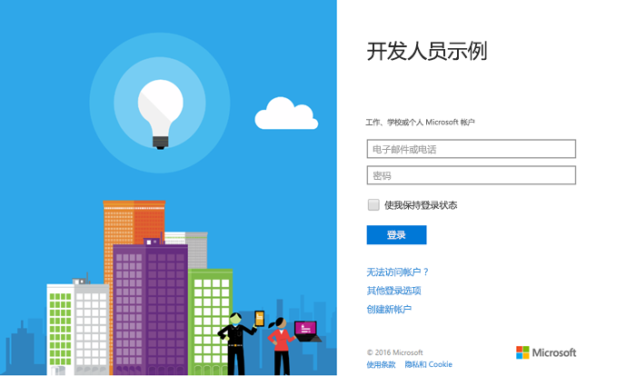

# <a name="get-started-with-microsoft-graph-in-a-php-app"></a>在 PHP 应用中开始使用 Microsoft Graph

本文介绍了从 Azure AD v2.0 终结点获取访问令牌和调用 Microsoft Graph 所需的任务。介绍了生成[适用于 PHP 的 Connect 示例 (REST)](https://github.com/microsoftgraph/php-connect-rest-sample) 的步骤，并说明实现使用 Microsoft Graph 的主要概念。本文还介绍如何使用 REST 调用来访问 Microsoft Graph。

若要在 PHP 应用中使用 Microsoft Graph，则需要向用户显示 Microsoft 登录页。以下屏幕截图显示了 Microsoft 帐户的登录页。



**不想生成一个应用吗？**通过下载本文所基于的[适用于 PHP 的 Connect 示例 (REST)](https://github.com/microsoftgraph/php-connect-rest-sample) 快速准备就绪并开始运行。或尝试使用[适用于 PHP 的 Connect 示例 (SDK) ](https://github.com/microsoftgraph/php-connect-sample)版本，该版本使用[适用于 PHP 的 Microsoft Graph 库](https://github.com/microsoftgraph/msgraph-sdk-php)（预览）。


## <a name="prerequisites"></a>先决条件

若要开始，将需要以下各项： 

- 一个 [Microsoft 帐户](https://www.outlook.com/) 或者一个[工作或学校帐户](http://dev.office.com/devprogram)
- PHP 版本 5.5.9 或更高版本
- [编辑器](https://getcomposer.org/)


## <a name="register-the-application"></a>注册应用程序
在 Microsoft 应用注册门户上注册一个应用。这会生成用于配置此应用的应用程序 ID 和密码。

1. 使用个人或工作或学校帐户登录到 [Microsoft 应用注册门户](https://apps.dev.microsoft.com/)。

2. 选择“**添加应用**”。

3. 输入应用的名称，并选择“**创建应用程序**”。 
    
    将显示注册页，其中列出应用的属性。

4. 选择“**生成新密码**”。

5. 复制应用程序 ID 和密码。

6. 选择“**添加平台**”和“**网页**”。

7. 在“**重定向 URI**”字段中，键入 `http://localhost:8000/oauth`。

8. 选择“**保存**”。


## <a name="configure-the-project"></a>配置项目

使用编辑器启动一个新项目。若要使用 Laravel 框架创建新的 PHP 项目，请使用以下命令：

```bash
composer create-project --prefer-dist laravel/laravel getstarted
```
 
这样可以创建可用于此项目的 **getstarted** 文件夹。

> 注意：还可以使用 [初学者项目](https://github.com/microsoftgraph/php-connect-rest-sample/tree/master/starter-project) 进行项目配置，这样就可以专注于此次演练的编码部分。

## <a name="authenticate-the-user-and-get-an-access-token"></a>对用户进行身份验证并获取一个访问令牌
使用 OAuth 库来简化身份验证流程。[PHP 联盟](http://thephpleague.com/) 提供了可用于此项目的 [OAuth 客户端库](https://github.com/thephpleague/oauth2-client)。

### <a name="add-the-dependency-to-composer"></a>将依赖项添加到编辑器

打开 `composer.json` 文件，并在**请求**部分中包括以下依赖项：

```json
"league/oauth2-client": "^1.4"
```

通过运行以下命令更新这些依赖项：

```bash
composer update
```

### <a name="start-the-authentication-flow"></a>开始身份验证流

1. 打开**资源** > **视图** >  **welcome.blade.php** 文件。用以下代码替换 **title** div 元素。
    ```html
    <div class="title" onClick="window.location='/oauth'">Sign in to Microsoft</div>
    ```
    
2. 在 **app** > **Http** > **routes.php** 文件上键入提示 `Illuminate\Http\Request` 类。在任何路由声明前面添加以下代码行。
    ```php
    use Illuminate\Http\Request;
    ```
    
3. 将 */oauth* 路由添加到 **app** > **Http** > **routes.php** 文件。若要添加路由，请在默认路由声明后复制以下代码。将应用的**应用程序 ID** 和**密码**插入到分别标记为 **\<YOUR_APPLICATION_ID\>** 和 **\<YOUR_PASSWORD\>** 的占位符中。
    ```php
    Route::get('/oauth', function () {
        $provider = new \League\OAuth2\Client\Provider\GenericProvider([
            'clientId'                => '<YOUR_APPLICATION_ID>',
            'clientSecret'            => '<YOUR_PASSWORD>',
            'redirectUri'             => 'http://localhost:8000/oauth',
            'urlAuthorize'            => 'https://login.microsoftonline.com/common/oauth2/v2.0/authorize',
            'urlAccessToken'          => 'https://login.microsoftonline.com/common/oauth2/v2.0/token',
            'urlResourceOwnerDetails' => '',
            'scopes'                  => 'openid mail.send'
        ]);

        if (!$request->has('code')) {
            return redirect($provider->getAuthorizationUrl());
        }
    });
    ```
    
此时，应该会有一个显示*登录到 Microsoft* 的 PHP 应用。如果单击文本，该应用会显示 Microsoft 登录页。下一步是处理授权服务器发送到重定向 URI 的代码，并用它来交换访问令牌。

### <a name="exchange-the-authorization-code-for-an-access-token"></a>用授权代码交换访问令牌

需要处理授权服务器的响应，其中包含可交换访问令牌的代码。

更新 */oauth* 路由，以便它可以使用授权代码获取访问令牌。若要执行此操作，请打开 **app** > **Http** > **routes.php** 文件并将以下 *else* 条件子句添加到现有的 *if* 语句。

```php
if (!$request->has('code')) {
    ...
    // add the following lines
} else {
    $accessToken = $provider->getAccessToken('authorization_code', [
        'code'     => $request->input('code')
    ]);
    exit($accessToken->getToken());
}
```
    
请注意，这一行包含访问令牌 `exit($accessToken->getToken());`。现在可以添加代码调用 Microsoft Graph。 

## <a name="call-microsoft-graph-using-rest"></a>使用 REST 调用 Microsoft Graph
可以使用 REST 调用 Microsoft Graph。用以下代码替换行 `exit($accessToken->getToken());`。将电子邮件地址插入标记为 **\<YOUR_EMAIL_ADDRESS\>** 的占位符中。

```php
$client = new \GuzzleHttp\Client();

$email = "{
    Message: {
    Subject: 'Sent using the Microsoft Graph REST API',
    Body: {
        ContentType: 'text',
        Content: 'This is the email body'
    },
    ToRecipients: [
        {
            EmailAddress: {
            Address: '<YOUR_EMAIL_ADDRESS>'
            }
        }
    ]
    }}";

$response = $client->request('POST', 'https://graph.microsoft.com/v1.0/me/sendmail', [
    'headers' => [
        'Authorization' => 'Bearer ' . $accessToken->getToken(),
        'Content-Type' => 'application/json;odata.metadata=minimal;odata.streaming=true'
    ],
    'body' => $email
]);
if($response.getStatusCode() === 201) {
    exit('Email sent, check your inbox');
} else {
    exit('There was an error sending the email. Status code: ' . $response.getStatusCode());
}
```

## <a name="run-the-app"></a>运行应用
现在可以尝试运行 PHP 应用。

1. 在 shell 中，键入以下命令：
    ```bash
    php artisan serve
    ```
    
2. 转到 Web 浏览器中的 `http://localhost:8000`。
3. 选择“**登录到 Microsoft**”。
4. 使用你的个人、工作或学校帐户登录，并授予所请求的权限。

检查在 [使用 REST 调用 Microsoft Graph](#call-microsoft-graph-using-rest) 部分中配置的电子邮件地址的收件箱。你应该会收到一封用于登录该应用的帐户所发送的电子邮件。

## <a name="next-steps"></a>后续步骤
- 试用 [Microsoft Graph 资源管理器](https://graph.microsoft.io/graph-explorer)。


## <a name="see-also"></a>另请参阅
- 请在我们的 [API Explorer](https://graph.microsoft.io/graph-explorer) 中尝试执行示例 REST 调用
- [获取访问令牌以调用 Microsoft Graph](https://developer.microsoft.com/en-us/graph/docs/concepts/auth_overview)
- [代表用户获取访问权限](https://developer.microsoft.com/en-us/graph/docs/concepts/auth_v2_user)
- [不代表用户获取访问权限](https://developer.microsoft.com/en-us/graph/docs/concepts/auth_v2_service)
