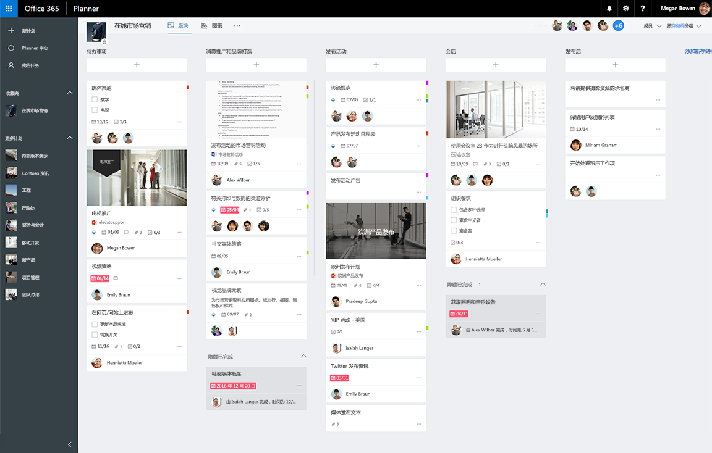

# Planner 任务和计划 API 概述
Planner 提供了一种简单而又直观的方法，可用于团队组织他们的工作。 客户可以使用 Planner 来创建计划、组织和分配任务、共享进度以及协作处理内容。  Planner 提供了多个交互式体验，包括任务板、图表页和日程安排视图，以及在整个 Microsoft 365 中的集成。

**Microsoft 365 Planner 任务板**

## 为什么与 Planner 任务集成？
Planner 为 Microsoft 365 中的协作体验提供了任务跟踪功能。 如果你的应用场景需要为一个团队或一组最终用户跟踪任务并组织工作，那么，Planner 就是正确的服务。 Planner 集成可有助于你覆盖数百万在 Microsoft 365 上进行协作的用户。 

### 组织团队的工作
Planner 提供了一个共享的空间，可以在其中构建团队、[创建任务](/graph/api/planner-post-tasks?view=graph-rest-1.0)，并将这些任务分配给团队中的其他人。 Planner 可让每个人轻松了解谁在做什么工作以及各项工作是否正常。你可以使用其他信息（如截止日期、进度和说明）来更新任务，然后使用可自定义的存储桶和类别标签对任务做进一步的组织。   

### 在整个 Microsoft 365 内协作
Planner 整合到整个 Microsoft 365 的协作体验中。除了 Planner Web 客户端和移动客户端，用户还可从 SharePoint 和 Microsoft Teams 中查看和更新 Planner 计划和任务。  

Microsoft Graph 和 Microsoft 365 组服务还支持 Planner 本身。 上传并附加到 Planner 任务的文件将存储在 SharePoint 中。 Planner 注释基于 Outlook 组对话。

<!-- Add image
Note: Put an image here showing the relationship between Planner and other things
-->

### 自动创建计划和任务
是否正在处理重复的流程或项目类型？ Planner API 可用于自动创建计划和任务列表。  
 
## 首要 Planner API 任务

|操作|URL|
|:--------|:--|
|查看组的所有[计划](/graph/api/resources/plannerplan?view=graph-rest-beta)|GET [https://graph.microsoft.com/v1.0/groups/{id}/planner/plans](https://developer.microsoft.com/graph/graph-explorer?request=groups/{id}/planner/plans&version=v1.0)|
|查看计划中的[任务](/graph/api/resources/plannertask?view=graph-rest-beta)|GET [https://graph.microsoft.com/v1.0/planner/plans/{id}/tasks](https://developer.microsoft.com/graph/graph-explorer?request=planner/plans/{id}/tasks&version=v1.0)|
|查看不同计划中分配给我的所有[我的任务](/graph/api/planneruser-list-tasks?view=graph-rest-beta)|GET [https://graph.microsoft.com/v1.0/me/planner/tasks/](https://developer.microsoft.com/graph/graph-explorer?request=me/planner/tasks/&version=v1.0)|
|[新建任务](/graph/api/planner-post-tasks?view=graph-rest-1.0)|POST [https://graph.microsoft.com/v1.0/planner/tasks](https://developer.microsoft.com/graph/graph-explorer?request=groups/{id}/planner/plans&version=v1.0)|
|[更新任务](/graph/api/plannertask-update?view=graph-rest-1.0)|PATCH [https://graph.microsoft.com/v1.0/planner/tasks/{task-id}](https://developer.microsoft.com/graph/graph-explorer?request=groups/{id}/planner/plans&version=v1.0)|
|[删除任务](/graph/api/plannertask-delete?view=graph-rest-1.0)|删除 [https://graph.microsoft.com/v1.0/planner/tasks/{id}](https://developer.microsoft.com/graph/graph-explorer?request=groups/{id}/planner/plans&version=v1.0)|

## API 参考
在查找此服务的 API 参考？

- [Microsoft Graph v1.0 中的 Planner API](/graph/api/resources/planner-overview?view=graph-rest-1.0)
- [Microsoft Graph beta 中的 Planner API](/graph/api/resources/planner-overview?view=graph-rest-beta)

## 后续步骤

- [使用 Planner API](/graph/api/resources/planner-overview?view=graph-rest-1.0)
- [使用计划](/graph/api/resources/planner-overview?view=graph-rest-1.0#plans)
- [使用任务](/graph/api/resources/planner-overview?view=graph-rest-1.0#tasks)
