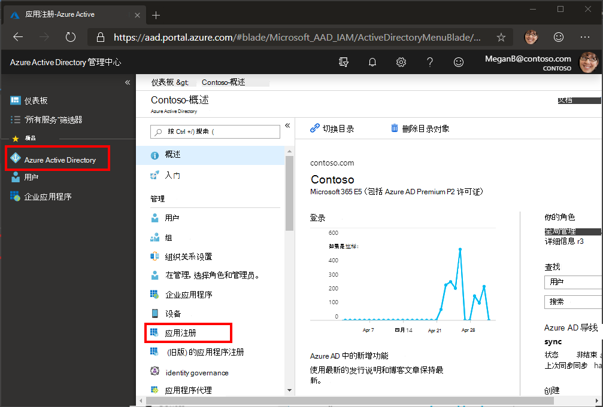
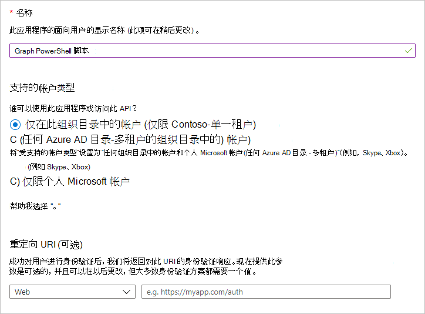
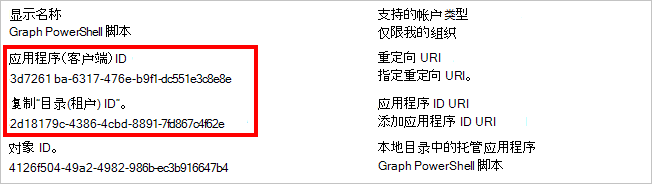
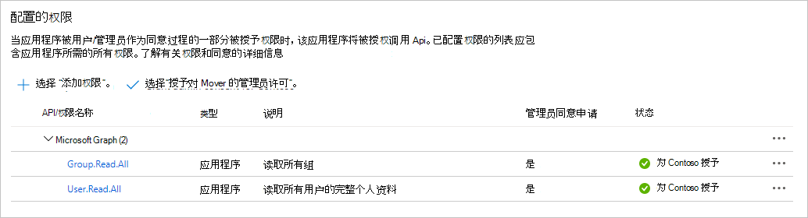

# <a name="use-app-only-authentication-with-the-microsoft-graph-powershell-sdk"></a>通过 Microsoft Graph PowerShell SDK 使用仅应用程序身份验证

PowerShell SDK 支持两种类型的身份验证： [委派访问](..\auth-v2-user.md)和 [仅应用访问](..\auth-v2-service.md)。 本指南将重点介绍启用仅应用访问所需的配置。

> [!IMPORTANT]
> 仅应用程序访问权限直接向应用程序授予权限，并需要管理员同意所需的权限范围。 有关仅应用访问的信息，请参阅 Microsoft 标识平台[和 OAuth 2.0 客户端凭据流](/azure/active-directory/develop/v2-oauth2-client-creds-grant-flow)。

让我们演练如何为简单脚本配置仅应用访问权限，以列出你的 Microsoft 365 租户中的用户和组。

## <a name="configuration"></a>配置

在将仅应用访问与 SDK 一同使用之前，需要执行以下操作。

- 用作应用程序凭据的证书。 这可以是自签名证书或颁发机构颁发的证书。 有关如何创建 [自签名](#see-also) 证书的指导，请参阅另请参阅部分。
- [在](/azure/active-directory/develop/app-objects-and-service-principals) Azure AD 中注册应用程序，使用方案所需的权限范围对其进行配置，并共享证书的公钥。

### <a name="certificate"></a>证书

你需要在将运行脚本的计算机的用户信任存储中安装 X.509 证书。 你还需要以 .cer、.pem 或 .crt 格式导出证书的公钥。 您需要证书主题的值或其指纹。

### <a name="register-the-application"></a>注册应用程序

可以在应用程序门户中注册Azure Active Directory[或](https://aad.portal.azure.com)PowerShell。

<!-- markdownlint-disable MD025 -->
# <a name="portal"></a>[门户](#tab/azure-portal)

1. 打开浏览器并导航到 Azure Active Directory[管理](https://aad.portal.azure.com)中心，然后使用租户Microsoft 365登录。

1. 选择左侧导航栏中的“**Azure Active Directory**”，再选择“**管理**”下的“**应用注册**”。

    

1. 选择“新注册”。 在“注册应用”页上，按如下方式设置值。

    - 将“名称”设置为“`Graph PowerShell Script`”。
    - 将 **"支持的帐户类型"****设置为"仅在此组织目录中的帐户"。**
    - 将 **重定向 URI 留** 空。

    

1. 选择“**注册**”。 在 **"Graph PowerShell** 脚本"页上，复制 **Application (client) ID** 和 **Directory (id**) 值，然后保存这些值。

    

1. 选择 **"管理"下的"API** **权限"。** 选择 **"添加权限"。**

1. 选择 **"Microsoft Graph"，** 然后选择"**应用程序权限"。** 添加 **User.Read.All** 和 **Group.Read.All，** 然后选择"**添加权限"。**

1. 在 **"已配置** 的权限"中，删除 **Microsoft** Graph 下的委派 **User.Read** 权限，选择权限右侧"..."并选择"**删除权限"。** 选择 **"是，删除** "以确认。

1. 选择"**授予管理员同意..."** 按钮，然后选择"是"以授予管理员对已配置的应用程序权限的许可。 "**配置** 的权限 **"表中的**"状态"列将更改 **为"已授予..."。**

    

1. 选择“管理”下的“证书和密码”。 选择 **"Upload证书"** 按钮。 浏览到证书的公钥文件， **然后选择添加**。

# <a name="powershell"></a>[PowerShell](#tab/powershell)
<!-- markdownlint-enable MD025 -->

> [!NOTE]
> 您必须先安装 Microsoft Graph PowerShell [SDK，](installation.md)然后才能执行以下步骤。

你可能想知道："我可以使用 PowerShell SDK 注册应用，以便可以使用 PowerShell SDK 吗？" 可以！ 在这种情况下，你将 PowerShell SDK 与委派访问权限一同使用，以管理员角色登录并创建应用注册。 然后，使用该应用注册，你可以将 PowerShell SDK 与仅应用访问权限一同使用，从而允许无人参与脚本。

1. 使用文本编辑器创建名为RegisterAppOnly.ps1 **的新文件**。 将以下代码粘贴到文件中。

    :::code language="powershell" source="RegisterAppOnly.ps1":::

1. 保存文件。 在包含以下命令的目录中打开 **RegisterAppOnly.ps1** 并运行以下命令。

    ```powershell
    .\RegisterAppOnly.ps1 -AppName "Graph PowerShell Script" -CertPath "PATH_TO_PUBLIC_KEY_FILE"
    ```

1. 根据提示打开浏览器。 使用管理员帐户登录并接受权限。

1. 查看提示的输出 `Please go to the following URL in your browser to provide admin consent` 。 复制提供的 URL 并将其粘贴到浏览器中。 使用管理员帐户登录，以向新注册的应用程序授予管理员同意。

    > [!NOTE]
    > 授予管理员同意后，浏览器将重定向回 `http://localhost` 并显示" **未找到"** 错误。 只要 URL 包含 ，就可以忽略此错误 `admin_consent=True` 。

1. 查看 PowerShell 输出的其余部分， `Connect-MgGraph` 以使用应用注册的值预填充命令。

    > [!TIP]
    > 如果脚本返回错误说明 `New-MgServicePrincipal : Unable to find target address` ，请用附加参数重新运行 `-TenantId` 脚本。 有关详细信息，请参阅[如何查找租户Azure Active Directory ID。](/azure/active-directory/fundamentals/active-directory-how-to-find-tenant)

---

## <a name="authenticate"></a>身份验证

完成上述配置步骤后，应包含三条信息。

- 上传到 Azure AD 应用注册的证书的证书主题或指纹。
- 应用注册的应用程序 ID。
- 租户 ID。

让我们使用这些测试身份验证。 打开 PowerShell 并运行以下命令，将占位符替换为你的信息。

```powershell
Connect-MgGraph -ClientID YOUR_APP_ID -TenantId YOUR_TENANT_ID -CertificateName YOUR_CERT_SUBJECT ## Or -CertificateThumbprint instead of -CertificateName
```

如果此操作成功，你将看到 `Welcome To Microsoft Graph!` 。 运行 `Get-MgContext` 以验证是否经过仅应用身份验证。 输出应如下所示。

```powershell
ClientId              : YOUR_APP_ID
TenantId              : YOUR_TENANT_ID
CertificateThumbprint :
Scopes                : {Group.Read.All, User.Read.All}
AuthType              : AppOnly
CertificateName       : YOUR_CERT_SUBJECT
Account               :
AppName               : Graph PowerShell Script
ContextScope          : Process
```

## <a name="create-the-script"></a>创建脚本

创建名为GraphAppOnly.ps1 **文件并** 添加以下代码。

```powershell
# Authenticate
Connect-MgGraph -ClientID YOUR_APP_ID -TenantId YOUR_TENANT_ID -CertificateName YOUR_CERT_SUBJECT

Write-Host "USERS:"
Write-Host "======================================================"
# List first 50 users
Get-MgUser -Property "id,displayName" -PageSize 50 | Format-Table DisplayName, Id

Write-Host "GROUPS:"
Write-Host "======================================================"
# List first 50 groups
Get-MgGroup -Property "id,displayName" -PageSize 50 | Format-Table DisplayName, Id

# Disconnect
Disconnect-MgGraph
```

将 命令中的 `Connect-MgGraph` 占位符替换为你的信息。 保存文件，然后在创建文件的目录中打开 PowerShell。 运行以下命令的脚本。

```powershell
.\GraphAppOnly.ps1
```

该脚本输出与下面输出类似的用户和组列表 (为简洁起见) 。

```powershell
Welcome To Microsoft Graph!
USERS:
======================================================

DisplayName              Id
-----------              --
Conf Room Adams          88d1ba68-8ff5-4de2-90ed-768c00abcfae
Adele Vance              3103c7b9-cfe6-4cd3-a696-f88909b9a609
MOD Administrator        da3a885e-2d97-41de-9347-5271ef321b58
...

GROUPS:
======================================================

DisplayName                         Id
-----------                         --
App Development                     06dce3e5-d310-4add-ab2c-be728fb9076e
All Employees                       1a1cd42d-9801-4e9d-9b77-5215886174ef
Mark 8 Project Team                 2bf1b0d0-81f6-4e80-b971-d1db69f8d651
...
```


## <a name="see-also"></a>另请参阅

+ [如何：创建自签名公共证书以对应用程序进行身份验证](/azure/active-directory/develop/howto-create-self-signed-certificate)
