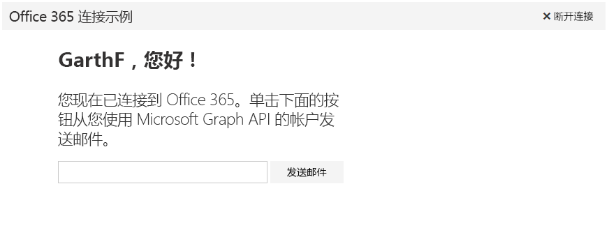

# <a name="get-started-with-microsoft-graph-in-a-python-app"></a>在 Python 应用中开始使用 Microsoft Graph 

本文介绍了从 Azure AD 获取访问令牌和调用 Microsoft Graph 所需的任务。本文演示了 [适用于 Python 的 Microsoft Graph Connect 示例](https://github.com/microsoftgraph/python3-connect-rest-sample)，并说明使用 Microsoft Graph API 要实现的主要概念。本文介绍了如何使用 REST 直接调用来访问 Microsoft Graph。



##  <a name="prerequisites"></a>先决条件

* [Python 3.5.2](https://www.python.org/downloads/)
* [Flask-OAuthlib](https://github.com/lepture/flask-oauthlib)
* [Flask-Script 0.4](http://flask-script.readthedocs.io/en/latest/)
* [Microsoft 帐户](https://www.outlook.com/)或 [Office 365 商业版帐户](https://msdn.microsoft.com/en-us/office/office365/howto/setup-development-environment#bk_Office365Account)
* [适用于 Python 的 Microsoft Graph Connect 示例](https://github.com/microsoftgraph/python3-connect-rest-sample)

## <a name="register-the-application-in-azure-active-directory"></a>在 Azure Active Directory 中注册应用程序

首先，需要注册应用程序并设置 Microsoft Graph 的使用权限。此操作允许用户使用工作或学校帐户登录应用程序。

## <a name="register-the-application"></a>注册应用程序

在 Microsoft 应用注册门户上注册一个应用。这会生成用于配置此应用的应用程序 ID 和密码，并进行身份验证。

1. 使用个人或工作或学校帐户登录到 [Microsoft 应用注册门户](https://apps.dev.microsoft.com/)。

2. 选择“**添加应用**”。

3. 输入应用的名称，并选择“**创建应用程序**”。

    将显示注册页，其中列出应用的属性。

4. 复制应用程序 ID。这是应用的唯一标识符。

5. 在“**应用程序机密**”下，选择“**生成新密码**”。从“**生成的新密码**”对话中复制应用机密。

    将使用此应用程序 ID 和应用机密配置应用。

6. 在“**平台**”下，依次选择“**添加平台**” > “**Web**”。

7. 请务必选中“**允许隐式流**”复选框，然后输入 *http://localhost:5000/login/authorized* 作为重定向 URI。

    “**允许隐式流**”选项可启用 OpenID Connect 混合流。在身份验证过程中，这可使应用同时接收登录信息 (**id_token**) 以及应用用来获取访问令牌的项目（在这种情况下，项目为授权代码）。

    重定向 URI *http://localhost:5000/login/authorized* 是 OmniAuth 中间件配置为在处理身份验证请求后使用的值。

8. 选择“保存”****。

## <a name="configure-and-run-the-app"></a>配置并运行应用程序

1. 使用常用文本编辑器打开 **_PRIVATE.txt** 文件。
2. 将 *ENTER_YOUR_CLIENT_ID* 替换成已注册的应用程序的客户端 ID。
3. 将 *ENTER_YOUR_SECRET* 替换成为应用程序生成的密钥。
4. 通过运行 ```python manage.py runserver``` 启动开发服务器。
5. 在 Web 浏览器中，转到 ```http://localhost:5000/```。

<!--<a name="authCode"></a>-->
## <a name="receive-an-authorization-code-in-your-reply-url-page"></a>在回复 URL 页面中接收授权代码

在用户登录后，浏览器会重定向到答复 URL（即 [*connectsample.py*](https://github.com/microsoftgraph/python3-connect-rest-sample/blob/master/connectsample.py) 中的 ```login/authorized``` 路由），并在响应中提供访问令牌。此示例将访问令牌存储为会话变量。

```python
@app.route('/login/authorized')
def authorized():
    """Handler for login/authorized route."""
    response = msgraphapi.authorized_response()

    if response is None:
        return "Access Denied: Reason={0}\nError={1}".format( \
            request.args['error'], request.args['error_description'])

    # Check response for state
    if str(session['state']) != str(request.args['state']):
        raise Exception('State has been messed with, end authentication')
    session['state'] = '' # reset session state to prevent re-use

    # Okay to store this in a local variable, encrypt if it's going to client
    # machine or database. Treat as a password.
    session['microsoft_token'] = (response['access_token'], '')
    # Store the token in another session variable for easy access
    session['access_token'] = response['access_token']
    me_response = msgraphapi.get('me')
    me_data = json.loads(json.dumps(me_response.data))
    username = me_data['displayName']
    email_address = me_data['userPrincipalName']
    session['alias'] = username
    session['userEmailAddress'] = email_address
    return redirect('main')
```

<!--<a name="request"></a>-->
## <a name="use-the-access-token-in-a-request-to-the-microsoft-graph-api"></a>在 Microsoft Graph API 请求中使用访问令牌

使用访问令牌，您的应用可以对 Microsoft Graph API 提出身份验证请求。您的应用必须将访问令牌附加到各个请求的**授权**头中。

Connect 示例使用 Microsoft Graph API 中的 ```me/microsoft.graph.sendMail``` 终结点发送电子邮件。代码位于 [*connectsample.py*](https://github.com/microsoftgraph/python3-connect-rest-sample/blob/master/connectsample.py) 文件的 ```call_sendmail_endpoint``` 函数中。此代码展示了如何将访问代码追加到授权标头中。

```python
    # Set request headers.
    headers = { 
      'User-Agent' : 'python_tutorial/1.0',
      'Authorization' : 'Bearer {0}'.format(access_token),
      'Accept' : 'application/json',
      'Content-Type' : 'application/json'
    }
```

> **注意**：请求还必须发送 **Content-Type** 头，其中包含 Graph API 接受的值（例如，`application/json`）。

Microsoft Graph API 的功能非常强大，统一了可用于与各种 Microsoft 数据进行交互的 API。请查看 API 参考，了解还可以使用 Microsoft Graph 完成什么任务。

## <a name="see-also"></a>另请参阅
- 请在我们的 [API Explorer](https://graph.microsoft.io/graph-explorer) 中尝试执行示例 REST 调用
- [获取访问令牌以调用 Microsoft Graph](https://developer.microsoft.com/en-us/graph/docs/concepts/auth_overview)
- [代表用户获取访问权限](https://developer.microsoft.com/en-us/graph/docs/concepts/auth_v2_user)
- [不代表用户获取访问权限](https://developer.microsoft.com/en-us/graph/docs/concepts/auth_v2_service)