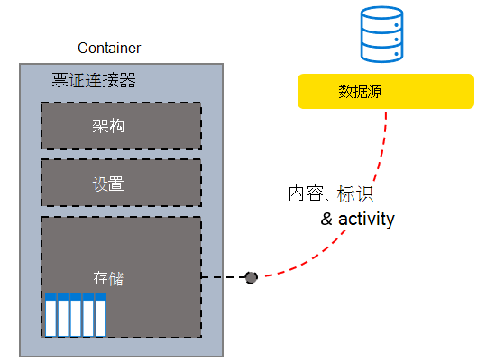

# 创建、更新和删除 Microsoft Graph 中的连接Create, update, and delete connections in the Microsoft Graph

外部服务与 Microsoft 搜索服务的连接由 Microsoft Graph 中的 [externalConnection](/graph/api/resources/externalconnection?view=graph-rest-beta&preserve-view=true) 资源表示。Connections from external services to the Microsoft Search service are represented by the [externalConnection](/graph/api/resources/externalconnection?view=graph-rest-beta&preserve-view=true) resource in Microsoft Graph.

Microsoft Graph 连接器平台提供了一种简单的方法，可将外部数据添加到 Microsoft Graph 中。The Microsoft Graph connectors platform offers a simple way to add your external data into the Microsoft Graph. 连接是外部数据的逻辑容器，管理员可将其作为一个单元进行管理。A connection is a logical container for your external data that an administrator can manage as a single unit.

创建连接后，你可以添加来自任何外部数据源（如本地内容源或外部 SaaS 服务）的内容。Once a connection has been created, you can add your content from any external data source such as an on-premises content source or an external SaaS service. 你只能查看和管理你创建的连接，或者显式[已授权](/graph/api/external-post-connections?view=graph-rest-beta&preserve-view=true)进行管理的连接。You can only view and manage the connections you created or were explicitly [authorized](/graph/api/external-post-connections?view=graph-rest-beta&preserve-view=true) to manage. 搜索管理员可以从现代管理中心查看和管理租户中的所有连接。A search admin can view and manage all the connections in the tenant from the Modern Admin Center.

<!-- markdownlint-disable MD036 -->

*自定义支持人员系统票证连接器结构示例**Sample custom helpdesk system Tickets Connector Structure*

*连接的管理员视图，包括自定义票证连接器**Admin View of Connections including the custom Tickets Connector*

<!-- markdownlint-enable MD036 -->

可建立任意的连接模型，但为每个连接器实例创建一个连接是最常见的模型。You can model a connection anyway you want, but creating one connection for every instance of your connector is the most common model. 例如，每次[设置 Microsoft Windows 文件共享连接器](/microsoftsearch/configure-connector)时，都会创建一个新的连接。For example, each time you [set up the Microsoft Windows file share connector](/microsoftsearch/configure-connector), a new connection is created. 你还可以创建一个连接来添加数据源中的所有项目。You can also create a single connection to add all items from your data source. 例如，创建单一连接，从支持人员系统中的多个团队中添加所有票证和事件。For example, creating a single connection to add all the tickets and incidents across multiple teams from your helpdesk system.

## 状态与操作States and operations

你的连接可以以下列一种状态存在。Your connection can exist in one of the following states.

| 状态State             | 说明Description                                                                                                                                               |
|-------------------|-----------------------------------------------------------------------------------------------------------------------------------------------------------|
| **Draft****Draft**         | 已设置空连接。An empty connection is provisioned. 尚未配置数据源、架构或任何设置。The data source, schema, or any settings have not been configured yet.                                                |
| **Ready****Ready**         | 该连接配有已注册的架构并已准备好接收。The connection is provisioned with registered schema and is ready for ingestion.                                                                          |
| **Obsolete****Obsolete**      | 如果已弃用依赖功能（如 API），则会出现这种情况。This occurs when a dependent feature, such as an API, has been deprecated. 删除连接是唯一有效的操作。Deleting the connection is the only valid operation.                           |
| **LimitExceeded****LimitExceeded** | 如果点击了单个连接的最大限制或所有连接的租户级别配额，则无法添加更多项目，直至退出该状态。If you hit the maximum limit of a single connection or the tenant level quota across all connections, you cannot add more items until you exit the state. |

下表指定每种状态中的可用操作。The following table specifies which operations are available in each state.

| OperationOperation         | DraftDraft              | ReadyReady              | ObsoleteObsolete           | LimitExceededLimitExceeded      |
|-------------------|--------------------|--------------------|--------------------|--------------------|
| Create ConnectionCreate connection | :x:                | :heavy_check_mark: | :x:                | :heavy_check_mark: |
| Read connectionRead connection   | :heavy_check_mark: | :heavy_check_mark: | :heavy_check_mark: | :heavy_check_mark: |
| 更新连接Update connection | :heavy_check_mark: | :heavy_check_mark: | :x:                | :heavy_check_mark: |
| 删除连接Delete connection | :heavy_check_mark: | :heavy_check_mark: | :heavy_check_mark: | :heavy_check_mark: |
| 创建架构Create schema     | :heavy_check_mark: | :x:                | :x:                | :x:                |
| 读取架构Read schema       | :x:                | :heavy_check_mark: | :heavy_check_mark: | :heavy_check_mark: |
| 更新架构Update schema     | :x:                | :x:                | :x:                | :x:                |
| 删除架构Delete schema     | :x:                | :x:                | :x:                | :x:                |
| 创建项目Create item       | :x:                | :heavy_check_mark: | :x:                | :x:                |
| 读取项目Read item         | :x:                | :heavy_check_mark: | :heavy_check_mark: | :heavy_check_mark: |
| 更新项目Update item       | :x:                | :heavy_check_mark: | :x:                | :heavy_check_mark: |
| 删除项目Delete item       | :x:                | :heavy_check_mark: | :x:                | :heavy_check_mark: |

通过连接，你的应用程序可以为要编入索引的项目[定义架构](/graph/api/externalconnection-post-schema?view=graph-rest-beta&preserve-view=true)，并为服务提供终结点，以便在索引中添加、更新或删除项目。A connection allows your application to [define a schema](/graph/api/externalconnection-post-schema?view=graph-rest-beta&preserve-view=true) for items that will be indexed, and provides an endpoint for your service to add, update, or delete items from the index. [创建连接](#create-a-connection)是应用程序将项目添加到搜索索引的第一步。[Creating a connection](#create-a-connection) is the first step for an application to add items to the search index.

## 创建连接Create a connection

应用程序必须先按照以下步骤创建并配置连接，才能将项目添加到搜索索引。Before an application can add items to the search index, it must create and configure a connection using the following steps.

- 使用唯一 ID、显示名称和说明[创建连接](/graph/api/external-post-connections?view=graph-rest-beta&preserve-view=true)。[Create a connection](/graph/api/external-post-connections?view=graph-rest-beta&preserve-view=true) with a unique ID, display name, and description.
- [注册架构](/graph/api/externalconnection-post-schema?view=graph-rest-beta&preserve-view=true)，以定义索引中将包含的字段。[Register a schema](/graph/api/externalconnection-post-schema?view=graph-rest-beta&preserve-view=true) to define the fields that will be included in the index.

> [!IMPORTANT]
> 架构注册后，不能为现有连接更改架构。After a schema has been registered, it cannot be changed for an existing connection.

## 更新连接Update a connection

可通过[更新连接](/graph/api/externalconnection-update?view=graph-rest-beta&preserve-view=true)来更改现有连接的显示名称或说明。You can change the display name or description of an existing connection by [updating the connection](/graph/api/externalconnection-update?view=graph-rest-beta&preserve-view=true).

## 删除连接Delete a connection

可[删除连接](/graph/api/externalconnection-delete?view=graph-rest-beta&preserve-view=true)，并删除通过该连接进行索引的所有项目。You can [delete a connection](/graph/api/externalconnection-delete?view=graph-rest-beta&preserve-view=true), and remove all items that were indexed via that connection.

## 后续步骤Next steps

- [注册连接架构Register the connection schema](./search-index-manage-schema.md)
- [查看图形连接器 API 参考Review the Graph Connectors API reference](/graph/api/resources/indexing-api-overview?view=graph-rest-beta&preserve-view=true)
- [Microsoft Graph 连接器概述Overview for Microsoft Graph Connectors](/microsoftsearch/connectors-overview)
- 从 GitHub 下载[示例搜索连接器](https://github.com/microsoftgraph/msgraph-search-connector-sample)Download the [sample search connector](https://github.com/microsoftgraph/msgraph-search-connector-sample) from GitHub