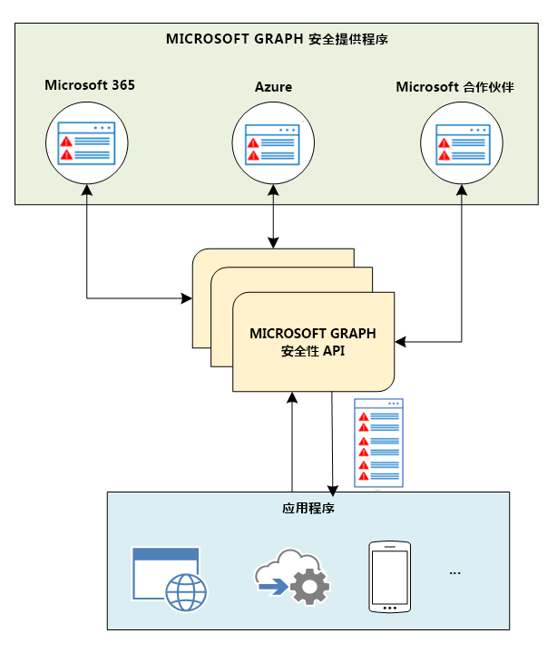

# Microsoft Graph 安全性 API 概述

Microsoft Graph 安全性 API 可用于连接 Microsoft 安全产品、服务和合作伙伴，以简化安全操作并改进威胁防护、检测和响应功能。

作为中介服务（或代理），Microsoft Graph 安全性 API 提供了一个编程接口，用于连接多个 [Microsoft Graph 安全提供程序](/graph/api/resources/securityvendorinformation)（亦称为“安全提供程序”或“提供程序”）。 向 Microsoft Graph 安全性 API 发出的请求被联合到所有适用的安全提供程序。 结果以通用架构的形式聚合并返回到发出请求的应用，如下图所示。 有关详细信息，请参阅 [Microsoft Graph 安全性 API 数据流](security-dataflow.md)。

若要了解授权，请参阅[授权和 Microsoft Graph 安全性 API](security-authorization.md)。 若要了解委托的权限和应用权限等权限，请参阅[权限](permissions-reference.md#security-permissions)。

> [!VIDEO https://www.youtube-nocookie.com/embed/oYXPGwH9Ho0]

## 为什么要使用 Microsoft Graph 安全性 API？

[Microsoft Graph 安全性 API](/graph/api/resources/security-api-overview) 可让你轻松连接来自 Microsoft 和合作伙伴的安全解决方案。 借助它，可以更容易地实现并丰富这些解决方案的价值。 你可以使用以下方法之一轻松连接 Microsoft Graph 安全性 API，具体取决于你的要求：

- [编写代码](https://aka.ms/graphsecuritysdk) – 查找以 C#、Java、NodeJS 等语言编写的[代码示例](https://aka.ms/graphsecurityapicode)。
- [使用脚本进行连接](https://aka.ms/graphsecuritypowershellsampleblog) – 查找 [PowerShell 示例](https://aka.ms/graphsecuritypowershellsample)。
- [拖放到工作流和行动手册中](https://aka.ms/graphsecurityconnectorsblogpost) - 将 [Microsoft Graph 安全连接器](/azure/connectors/connectors-integrate-security-operations-create-api-microsoft-graph-security) 用于 [Azure 逻辑应用](/azure/logic-apps/logic-apps-overview)、[Microsoft Flow](https://flow.microsoft.com/) 和 [Power Apps](https://powerapps.microsoft.com/)。
- [将数据导入报告和仪表板](https://aka.ms/graphsecuritypowerbiconnectorblogpost) – 将 [Microsoft Graph 安全连接器用于 Power BI](/power-bi/connect-data/desktop-connect-graph-security)。
- [使用 Jupyter 笔记本进行连接](https://jupyter.org/) – 查找 [Jupyter 笔记本示例](https://aka.ms/graphsecurityjupyternotebooks)。  

### 统一和标准化警报跟踪

连接一次，即可集成来自任何已集成 Microsoft Graph 的安全解决方案的警报，并跨所有解决方案同步警报状态和分配。 还可以使用 Microsoft Graph 安全性 API 连接器将警报流式处理到安全信息和事件管理 (SIEM) 解决方案（如 Splunk）。 有关与安全 API 实体的解决方案集成的详细信息，请参阅[使用 Microsoft Graph 安全性 API 实现安全解决方案集成](security-integration.md)。

### 关联安全警报以改进威胁防护和响应

使用统一警报架构，可以更轻松地跨安全解决方案关联警报。这不仅允许你接收可操作警报信息，还便于安全分析员使用资产和用户信息来透视和丰富警报，从而更快地响应威胁和资产保护。  

### 更新警报标记、状态和分配

标记使用其他上下文或威胁情报发出警报，通知响应和修复。 确保捕获有关警报的评论和反馈，实现所有工作流程的可见性。 保持警报状态和分配同步，使所有集成解决方案都能反映当前状态。 使用 Webhook 订阅获取变更通知。  

### 解锁安全性上下文以推动调查

深入到相关的安全相关库存（如用户、主机和应用），然后添加来自其他 Microsoft Graph 提供程序（Azure AD、Microsoft Intune、Microsoft 365）的组织上下文，以将业务和安全性上下文结合在一起并改进威胁响应。

### 自动执行安全工作流和报告

自动执行安全管理、监视和调查，以提高运营效率和缩短响应时间。 通过将 Microsoft Graph 安全功能集成到报表和仪表板中，获得更深入的见解和上下文。

### 深入了解如何针对安全解决方案进行培训

直观显示在组织内运行的不同安全产品中的数据，以获得更深入的安全见解。 发现从数据中学习并针对安全解决方案进行培训的机会。 该架构提供了多个属性，可以使用你的安全数据来构建丰富的探索性数据集。

### 在 Microsoft 安全解决方案中利用你的威胁智能（预览版）

自动将威胁指标发送到 Microsoft 安全解决方案，以启用 `alert`、`block` 或 `allow` 操作。 直接使用 Microsoft Graph 安全性 API 或利用与领先威胁智能平台的集成。

### 迅速采取行动应对新威胁（预览版）

采取快速行动来抵御新威胁，例如采取相关措施来阻止安全工具和工作流中的文件、URL、域或 IP 地址。

### 主动管理安全风险（预览版）

使用 Microsoft 安全功能分数（预览版）了解组织的安全需求，获取改进方法建议，并预测在采纳这些建议后的改进分数。 可以轻松度量一段时间内的进度，并获取有助于提高分数的具体变更的相关见解。

### 管理电子数据展示工作流

组织依靠 [Microsoft Purview 电子数据展示](/microsoft-365/compliance/ediscovery?view=o365-worldwide&preserve-view=true) 功能来满足要求，根据内部或外部要求（如诉讼、调查或法规合规性）查找组织中所发生情况的真实信息。

在许多组织中，电子数据展示工作流频繁、关键且数量大。 在存在常见重复任务或大量活动的情况下，API 将帮助提供一种可缩放的方式来一致且有效地重复进程。 许多组织处理大量案例和电子数据展示请求，并且希望自动执行某些任务。 高级电子数据展示的 Microsoft Graph API 提供对 Microsoft Purview 电子数据展示（高级）解决方案中可用的大多数功能的 API 访问权限。

根据当前的系统和流程，组织可能具有自动化和集成的各种优先级，从上游流程（如案例创建）到下游流程（如收集、审阅集查询或导出）。 在整个高级电子数据展示工作流中通过 API 支持工作流提供了灵活性和选项。

#### 使用 Microsoft Graph 构建自定义电子数据展示工作流

> [!VIDEO https://www.youtube-nocookie.com/embed/gXqBEHy5K6E]

- 使用案例管理工具自动执行案例管理和同步。

- 将标准化标记托盘添加到案例。

- 创建自定义报告以跟踪案例负载和各个案例的进度。

## 使用 Microsoft Graph 安全性 API 的优势

下表列出了各种安全解决方案与 Microsoft Graph 安全性 API 集成后获得的优势。  

|**区域**        | **优势**|
|:---------------|:------------|
|**托管安全服务提供程序 (MSSP)**|<ul><li>简化了与安全操作工具、工作流和报告功能集成的过程。</li> <li>缩减了部署和维护时间及工作量。</li> <li>通过对威胁采取措施来自动响应警报。</li> <li>能够为 MSSP 客户增值。</li></ul>|
|**SIEM 和 IT 风险管理解决方案**|<ul><li>与 Microsoft 安全解决方案和生态系统合作伙伴顺畅集成。</li> <li>丰富的警报元数据。</li> <li>提升了警报关联性。</li></ul>|
|**应用**  （威胁智能、移动、云、IOT、欺诈检测、标识和访问、风险和合规性、防火墙等）|<ul><li>跨各种安全解决方案统一了威胁管理、防护和风险管理。</li> <li>Microsoft Graph 中提供了警报、操作和客户威胁智能。</li> <li>与已启用 Microsoft Graph 的解决方案即时集成。</li> <li>获得深入的安全见解，以针对其他安全解决方案进行培训。</li> </ul>|

## API 参考

在查找此服务的 API 参考？

- [Microsoft Graph v1.0 中的安全性 API](/graph/api/resources/security-api-overview)
- [Microsoft Graph beta 中的安全性 API](/graph/api/resources/security-api-overview?view=graph-rest-beta&preserve-view=true)

## 后续步骤

- 浏览 [Microsoft Graph 安全 API 示例](https://aka.ms/graphsecurityapicode)
- 想要成为安全提供程序？ 请联系 [graphsecfeedback](mailto:graphsecfeedback@microsoft.com)。
