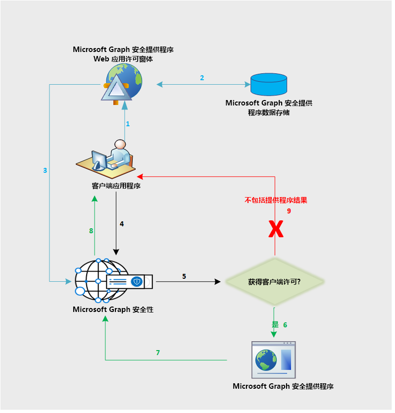

# Microsoft Graph 安全性 API 数据流

Microsoft Graph 安全性 API 在 Microsoft Graph 安全性生态系统中联合了对所有提供商的请求。 这基于应用程序提供的安全性提供商许可，如下图所示。 此许可工作流仅适用于非 Microsoft 提供商。

以下是对此流的说明：

1. 应用程序用户登录到提供商应用程序，以查看提供商提供的许可表单。 此许可表单体验或 UI 的所有权属于提供商，且仅适用于非 Microsoft 提供商用于获取其客户对向 Microsoft Graph 安全性 API 发送请求的明确许可。
2. 客户端许可存储在提供商端。
3. 提供商许可服务调用 Microsoft Graph 安全性 API，来告知相应客户的许可批准。
4. 应用程序向 Microsoft Graph 安全性 API 发送请求。
5. Microsoft Graph 安全性 API 查看此客户映射到各个提供商的许可信息。
6. Microsoft Graph 安全性 API 调用此客户已通过提供商许可体验明确许可的所有提供商。
7. 从该客户端的所有已许可的提供商返回响应。
8. 结果集响应返回至应用程序。
9. 若客户尚未许可任何提供商，则响应不包括任何提供商提供的结果。
