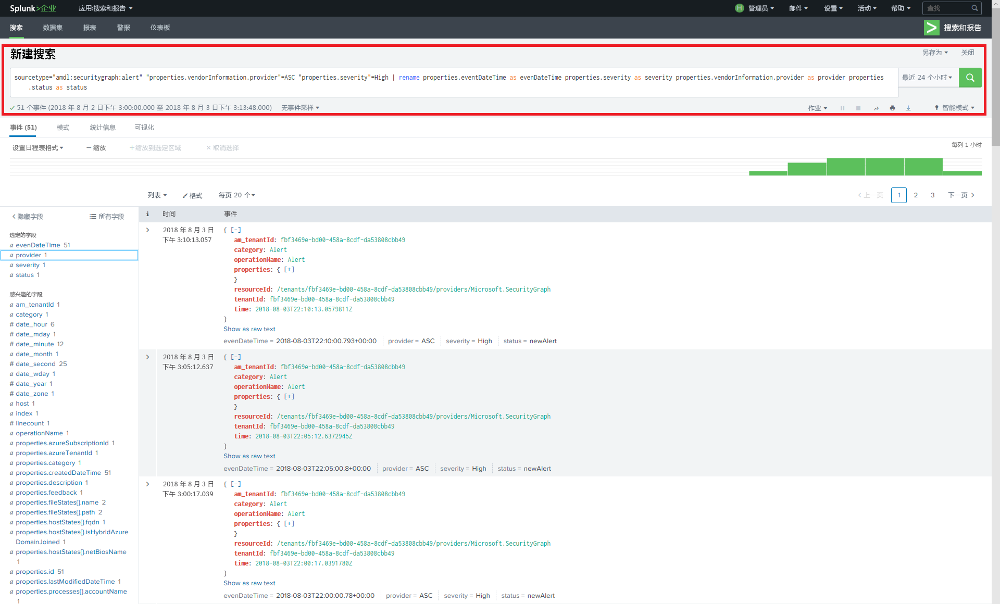
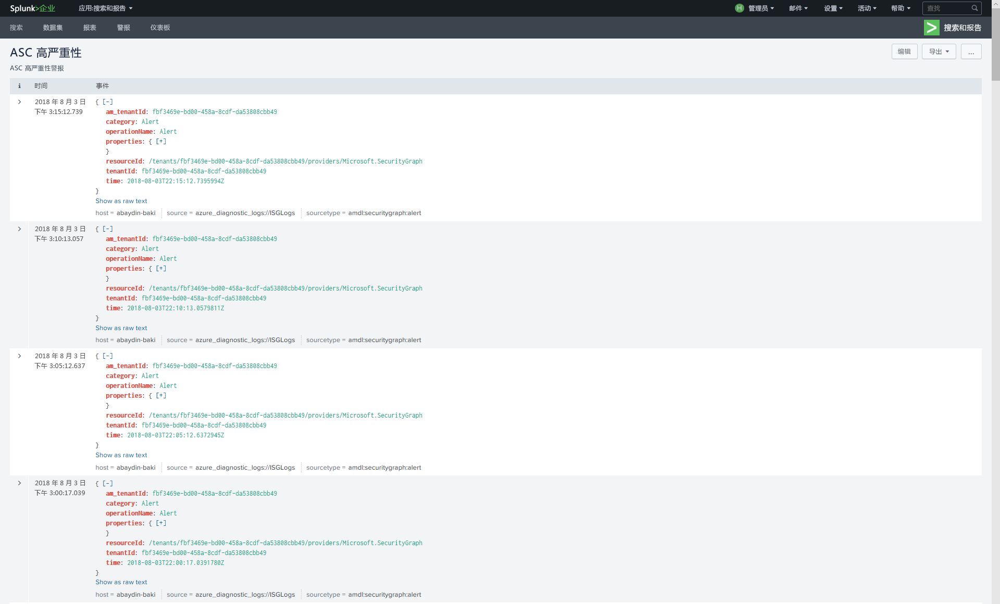
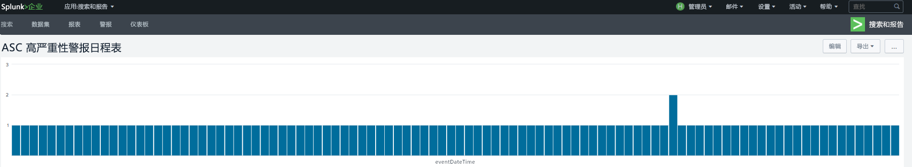

# <a name="integrate-microsoft-graph-security-api-alerts-with-your-siem-using-azure-monitor"></a>使用 Azure Monitor 将 Microsoft Graph 安全性 API 警报与 SIEM 集成

可通过一个 REST 终结点管理 Microsoft Graph 安全提供程序。 可以将此终结点配置为，支持连接到多个 SIEM 产品的 [Azure Monitor](https://docs.microsoft.com/zh-CN/azure/monitoring-and-diagnostics/)。 本文第 1 步和第 2 步中的说明是指，支持通过事件中心使用的所有 Azure Monitor 连接器。 本文介绍了 [Splunk](https://splunkbase.splunk.com/) SIEM 连接器的端到端集成。

此集成过程由以下步骤组成：

1. [创建用于接收租户的安全警报的 Azure 事件中心](#step-1-set-up-an-event-hubs-namespace-in-azure-to-receive-security-alerts-for-your-tenant)
2. [将 Azure Monitor 配置为将安全警报从租户发送到事件中心](#step-2-configure-azure-monitor-to-send-security-alerts-from-your-tenant-to-the-event-hub)
3. [下载和安装 Splunk 的 Azure Monitor 加载项，以允许 Splunk 使用安全警报](#step-3-download-and-install-the-azure-monitor-add-on-for-splunk-which-will-allow-splunk-to-consume-security-alerts)
4. [使用租户 Azure Active Directory 注册一个供 Splunk 从事件中心进行读取的应用程序](#step-4-register-an-application-with-your-tenant-azure-active-directory-which-splunk-will-use-to-read-from-the-event-hub )
5. [创建 Azure Key Vault 以存储事件中心的访问密钥](#step-5-create-an-azure-key-vault-to-store-the-access-key-for-the-event-hub)
6. [配置 Splunk 数据输入以使用存储在事件中心的安全警报](#step-6-configure-the-splunk-data-inputs-to-consume-security-alerts-stored-in-the-event-hub)

完成这些步骤后，Splunk Enterprise 将使用获许可租户的所有 Microsoft Graph 集成安全产品的安全警报。 许可的任何新安全产品也将通过此连接发送警报（在同一架构且无需进一步集成）。

## <a name="step-1-set-up-an-event-hubs-namespace-in-azure-to-receive-security-alerts-for-your-tenant"></a>第 1 步：在 Azure 中创建用于接收租户的安全警报的事件中心命名空间

首先，需要创建 [Microsoft Azure 事件中心](https://docs.microsoft.com/zh-CN/azure/event-hubs/)命名空间和事件中心。 此命名空间和事件中心是组织的所有安全警报的目标。 事件中心命名空间是共享同一访问策略的事件中心的逻辑分组。 请注意有关你创建的事件中心命名空间和事件中心的一些详细信息：

- 我们建议使用标准事件中心命名空间（尤其是当你通过这些相同的事件中心发送其他 Azure 监控数据时）。
- 通常情况下，一个吞吐量单位就已足够。 如果随着使用情况的增加而需要扩展吞吐量，则可在以后随时手动增加命名空间的吞吐量单位数或启用自动膨胀。
- 吞吐量单位数可让你增加事件中心的吞吐量比例。 分区数可让你跨多个使用者并行使用。 单个分区可执行最多 20MBps，或大约每秒 20,000 封邮件。 分区是否支持从多个分区使用要取决于使用数据的工具。 如果不确定要设置的分区数，我们建议从设置四个分区开始。
- 我们建议将事件中心的消息保留设置为 7 天。 在你使用的工具停用多天时，该设置可确保工具能够从上次停用的位置继续工作（针对最多 7 天的事件）。
- 我们建议为事件中心使用默认的使用者组。 无需创建其他使用者组或使用单独的使用者组，除非你计划用两个不同的工具使用来自同一事件中心的同一数据。
- 通常情况下，对于使用事件中心数据的计算机，必须打开端口 5671 和 5672。

另请参阅 [Azure 事件中心常见问题解答](https://docs.microsoft.com/zh-CN/azure/event-hubs/event-hubs-faq)。

1. 登录到 [Azure 门户](https://portal.azure.com/)，并选择屏幕左上角的“创建资源”****。

    

2. 选择“物联网”****，并选择“事件中心”****。

    

3. 在“创建命名空间”**** 中，输入命名空间名称。 确保命名空间名称可用后，选择定价层（基本或标准）。 此外，选择 Azure 订阅、资源组以及创建资源的位置。 选择“创建”**** 以创建命名空间。 你可能需要等待几分钟的时间，以使系统完全预配资源。

    

## <a name="step-2-configure-azure-monitor-to-send-security-alerts-from-your-tenant-to-the-event-hub"></a>步骤 2：配置 Azure Monitor 以将租户的安全警报发送至事件中心

通过 Azure Monitor 为整个 Azure Active Directory (Azure AD) 租户启用组织安全警报的流式处理操作已执行一次。 已授权和启用 Microsoft Graph 安全性 API 的所有产品都会开始向 Azure Monitor 发送安全警报，同时将数据流式处理到使用应用。 组织授权和部署的其他任何已启用 Microsoft Graph 安全性 API 的产品，也会自动通过这一相同的 Azure Monitor 配置流式处理安全警报。 组织无需进一步集成。

安全警报是具有很多特权的数据，通常只能由组织内的安全响应人员和全局管理员查看。 为此，在 SIEM 系统中配置租户安全警报集成所需的步骤将需要使用 Azure AD 全局管理员帐户。 在设置过程中只需使用此帐户一次，以请求获取要发送到 Azure Monitor 的组织安全警报。

> **注意：** 目前，Azure Monitor 的“诊断设置”边栏选项卡不支持配置租户级资源。 由于 Microsoft Graph 安全性 API 警报是租户级资源，因此必须使用 Azure 资源管理器 API 将 Azure Monitor 配置为支持使用组织的安全警报。

1. 在 Azure 订阅中，将“microsoft.insights”(Azure Monitor) 注册为资源提供程序。  
 > **注意：** 不要将“Microsoft.SecurityGraph”（Microsoft Graph 安全性 API）注册为 Azure 订阅中的资源提供程序，因为“Microsoft.SecurityGraph”是租户级资源（如前所述）。 下面的 #6 中介绍了租户级配置。

2. 若要使用 Azure 资源管理器 API 配置 Azure Monitor，请获取 [ARMClient](https://github.com/projectkudu/ARMClient) 工具。 此工具将用于将 REST API 调用从命令行发送到 Azure 门户。

3. 准备诊断设置请求 JSON 文件，如下所示：

<!-- {
  "blockType": "ignored"
} -->

    ``` json
    {
      "location": "",
      "properties": {
        "name": "securityApiAlerts",
        "serviceBusRuleId": "/subscriptions/SUBSCRIPTION_ID/resourceGroups/RESOURCE_GROUP/providers/Microsoft.EventHub/namespaces/EVENT_HUB_NAMESPACE/authorizationrules/RootManageSharedAccessKey",
        "logs": [
          {
            "category": "Alert",
            "enabled": true,
            "retentionPolicy": {
              "enabled": true,
              "days": 7
            }
          }
        ]
      }
    }
    ```

  将 JSON 文件中的值替换为以下值：

  * **SUBSCRIPTION_ID** 是托管资源组和事件中心命名空间的 Azure 订阅的订阅 ID，你将在此处发送组织的安全警报。
  * **RESOURCE_GROUP** 是包含事件中心命名空间的资源组，你将在此处发送组织的安全警报。
  * **EVENT_HUB_NAMESPACE** 是用于发送组织安全警报的事件中心命名空间。
  * **“days”** 是要将消息保留在事件中心内的天数。
  
&nbsp;
4. 以 JSON 格式将文件保存到从中调用 ARMClient.exe 的目录。 例如，将文件命名为 **AzMonConfig.json**。

5. 运行以下命令以登录到 ARMClient 工具。 你需要使用全局管理员帐户凭据。

    ``` shell
    ARMClient.exe login
    ```

6. 运行以下命令以将 Azure Monitor 配置为向事件中心命名空间发送安全警报。 这将自动预配命名空间内的事件中心，并启动流入事件中心的安全警报的流。 确保设置名称（在此示例中是 **securityApiAlerts**）匹配在 JSON 文件中为“名称”**** 字段指定的设置名称。

    ``` shell
    ARMClient.exe put https://management.azure.com/providers/Microsoft.SecurityGraph/diagnosticSettings/securityApiAlerts?api-version=2017-04-01-preview  @".\AzMonConfig.json"
    ```

7. 若要验证是否正确应用了设置，运行此命令并验证输出匹配 JSON 文件设置。

    ``` shell
    ARMClient.exe get https://management.azure.com/providers/Microsoft.SecurityGraph/diagnosticSettings/securityApiAlerts?api-version=2017-04-01-preview
    ```

8. 退出 ARMClient 工具。 现在，你已完成将租户安全警报发送到事件中心的 Azure Monitor 的配置。

## <a name="step-3-download-and-install-the-azure-monitor-add-on-for-splunk-which-will-allow-splunk-to-consume-security-alerts"></a>第 3 步：下载并安装用于 Splunk 的 Azure Monitor 加载项（可便于 Splunk 使用安全警报）

1. 此集成仅支持 [Splunk 企业版](https://splunkbase.splunk.com/)部署。
2. 下载并安装[用于 Splunk 的 Azure Monitor 加载项](https://github.com/Microsoft/AzureMonitorAddonForSplunk)。 有关详细安装说明，请参阅[安装](https://github.com/Microsoft/AzureMonitorAddonForSplunk/wiki/Installation)。 **仅支持用于 Splunk 的 Azure Monitor 加载项版本 1.2.9 或更高版本。**
3. 成功安装加载项后，请按照 [Azure Monitor 加载项配置 wiki](https://github.com/Microsoft/AzureMonitorAddonForSplunk/wiki/Configuration-of-Splunk ) 中的配置步骤操作，以配置 Splunk。
4. 如加载项安装说明中所述，需要在 Splunk Web 中的“管理应用”页面上通过执行禁用/启用循环，才可使加载项正常工作。 或者，可以重启 Splunk。

## <a name="step-4-register-an-application-with-your-tenant-azure-active-directory-which-splunk-will-use-to-read-from-the-event-hub"></a>第 4 步：向租户 Azure Active Directory 注册供 Splunk 从事件中心读取内容的应用

Splunk 需要向在组织的 Azure Active Directory 中注册的应用授予必需权限，以及对 Azure Monitor 事件中心进行身份验证所必需的应用凭据。

1. 在 Azure 门户中，转到“应用注册”****，再选择“新应用注册”****。

    

2. 为应用程序选择一个名称，为类型选择 **Web 应用/API**，为登录 URL 选择 **`https://localhost`**。 然后选择“创建”****。

    

3. 应用程序创建后，复制“应用程序 ID”**** 并将其保存，以供在以后配置 Splunk 数据输入时使用。 然后，转到应用程序设置并选择“密钥”****。

    

    这将允许你生成新密钥，称为“应用程序密码”。 新密钥生成后，复制“应用程序密码”**** 并将其保存，以供在以后配置 Splunk 数据输入时使用。

4. 在包含组织安全警报的事件中心的 Azure 订阅中授予应用程序****“读取器”角色。

    

    选择你的订阅，然后选择“访问控制 (IAM)”****。 选择“添加”**** 以添加权限。 选择应用程序并为其选择“读取器”**** 的“角色”****。

    

    选择“保存”****，以将授予应用程序的权限添加到订阅。

## <a name="step-5-create-an-azure-key-vault-to-store-the-access-key-for-the-event-hub"></a>步骤 5：创建 Azure Key Vault 以存储事件中心的访问密钥

Azure Key Vault 用于存储应用程序在运行时所使用的标识、密码和证书等机密。 在此步骤中，你将创建一个 Azure Key Vault，以存储 Splunk 从包含组织安全警报的 Azure 事件中心连接和读取所需的密码。

1. 在 Azure 门户中，转到“密钥保管库”**** 并选择“添加”****。

    

2. 创建新密钥保管库后，选择“访问策略”****，为刚在步骤 4 中注册的应用程序添加新访问策略。 向应用程序授予“获取”**** 密码权限。 这将允许 Splunk（充当注册的应用程序）访问存储在此 Azure Key Vault 中的密钥（密码）。

    

    选择“创建”****，以完成新 Azure Key Vault 的创建过程。

3. 在密钥保管库中生成新密码，以将访问密钥存储到事件中心命名空间。 首先，将访问密钥捕捉到事件中心命名空间，方法是打开事件中心命名空间并选择“共享的访问策略”****。 从列表中选择 **RootManageSharedAccessKey** 策略并从中复制“主键”****。

    

4. 打开密钥保管库并选择“密码”****。 选择“生成/导入”****，以将新密码添加到密钥保管库。 粘贴事件中心命名空间 **RootManageSharedAccessKey** 中的“主键”****。

    

5. 创建后，选择该密码并复制密码的“机密版本”****。 稍后将在步骤 6 中使用它来配置 Splunk 数据输入。

    

## <a name="step-6-configure-the-splunk-data-inputs-to-consume-security-alerts-stored-in-the-event-hub"></a>步骤 6：配置 Splunk 数据输入以使用存储在事件中心的安全警报

完成设置过程的最后一步是配置 Splunk 数据输入，以利用事件中心、应用程序和在上一步骤中创建的密码。

1. 按照[配置 Splunk](https://github.com/Microsoft/AzureMonitorAddonForSplunk/wiki/Configuration-of-Splunk) 主题中的说明进行操作，打开和配置 Azure Monitor 加载项的 Splunk 数据输入。 转到“设置”**** 和“数据输入”****。 选择“Azure Monitor 诊断日志”****。
2. 选择“新建”****，并使用在上一步骤中获取的值来输入所有必填的字段。 下图显示使用本文前面示例中值的所有必填的字段。

    

3. 选择“下一步”****，并开始搜索从 Azure Monitor 引入的组织安全警报。

## <a name="optional-use-splunk-search-to-explore-data"></a>（可选）使用 Splunk Search 浏览数据

在你设置 Azure Monitor Splunk 插件后，Splunk 实例便会开始从已配置事件中心检索事件。 默认情况下，Splunk 会为 Microsoft Graph 安全性 API 警报架构的每个属性编制索引，以便执行搜索。

若要搜索 Microsoft Graph 安全性 API 警报、创建仪表板或使用搜索查询创建 Splunk 警报，请在 Splunk 中依次转到“应用”->“搜索和报告应用”。

**示例**：<br/>
尝试搜索 Graph 安全警报：

- 在搜索栏中键入“`sourcetype="amdl:securitygraph:alert"`”，以获取通过 Microsoft Graph 安全性 API 公开的所有警报。 在右侧，可以看到 Azure Monitor 日志的顶级属性，其中 Graph 安全警报就位于属性字段下。<br/>
- 左侧窗格中显示选定字段和感兴趣字段。 可以使用选定字段创建仪表板或 Splunk 警报，也可以通过右键单击字段来添加或删除选定字段。  
> **注意：** 如下面的搜索查询所示，可以根据需要限制搜索。 此示例按 Azure 安全中心内的高严重性警报筛选 Graph 安全警报。 此外，还将 `eventDatetime`、`severity`、`status` 和 `provider` 用作要显示的选定字段。 有关更多高级搜索词，请参阅 [Splunk 搜索教程](https://docs.splunk.com/Documentation/Splunk/7.1.2/SearchTutorial/WelcometotheSearchTutorial)。

 
> 搜索查询：`sourcetype="amdl:securitygraph:alert" "properties.vendorInformation.provider"=ASC "properties.severity"=High | rename properties.eventDataTime as eventDateTime properties.severity as severity properties.vendorInformation.provider as provider properties.status as status`

借助 Splunk，还可以使用屏幕右上角的“另存为”菜单选项，对搜索结果执行多项操作。 可以根据搜索筛选器创建报告、仪表板面板或警报。
在下面的仪表板示例中，事件流基于上一次查询：可以向每个事件添加向下钻取链接，以在 Microsoft Graph 网站上进一步访问详细信息。 请参阅 [Splunk 向下钻取文档](https://docs.splunk.com/Documentation/Splunk/7.1.2/Viz/DrilldownIntro)。

 

也可以将仪表板创建为时间线图表：

 

有关详细信息，可以学习 [Splunk 搜索和报告教程](https://docs.splunk.com/Documentation/Splunk/7.1.2/SearchTutorial/WelcometotheSearchTutorial)。

