# <a name="integrate-microsoft-graph-security-api-alerts-with-your-siem-using-azure-monitor"></a><span data-ttu-id="5456d-101">使用 Azure Monitor 将 Microsoft Graph 安全 API 警报与 SIEM 集成</span><span class="sxs-lookup"><span data-stu-id="5456d-101">Integrate security API alerts with your SIEM using Azure Monitor</span></span>

<span data-ttu-id="5456d-102">Microsoft Graph 安全 API 通过单个 REST 端点，从所有 Microsoft 安全产品（统称提供程序）启用管理安全警告。</span><span class="sxs-lookup"><span data-stu-id="5456d-102">The Microsoft Graph Security API enables managing security alerts from all Microsoft security products, known as providers, through a single REST endpoint.</span></span> <span data-ttu-id="5456d-103">某些组织可能已将 Azure 特定日志数据通过 Azure Monitor 引入 SIEM 解决方案。</span><span class="sxs-lookup"><span data-stu-id="5456d-103">Some organizations might already ingest Azure specific log data through Azure Monitor into SIEM solutions.</span></span> <span data-ttu-id="5456d-104">为了简化集成，通过 Microsoft Graph 安全 API 实现的安全警告也可以通过 Azure Monitor 由客户对其订阅进行设置。</span><span class="sxs-lookup"><span data-stu-id="5456d-104">To simplify integration, the security alerts available through the Microsoft Graph Security API may also be provisioned by the customer to their subscription via Azure Monitor.</span></span> <span data-ttu-id="5456d-105">如果组织已使用 SIEM 解决方案配置了 Azure Monitor 集成，就可以将组织的安全警报轻松地添加到通过 Azure Monitor 获取的数据中。</span><span class="sxs-lookup"><span data-stu-id="5456d-105">If your organization has already configured Azure Monitor integration with your SIEM solution, you can now easily add your organization’s security alerts to the data available through Azure Monitor.</span></span> <span data-ttu-id="5456d-106">本文将指导你完成启用此集成的步骤。</span><span class="sxs-lookup"><span data-stu-id="5456d-106">This article will guide you through the steps to enable this integration.</span></span>

<span data-ttu-id="5456d-107">Azure Monitor 支持连接到多个 SIEM 产品的连接器。</span><span class="sxs-lookup"><span data-stu-id="5456d-107">Azure Monitor supports connectors to several SIEM products.</span></span> <span data-ttu-id="5456d-108">可以在[发送监控数据到一个事件中心](https://docs.microsoft.com/en-us/azure/monitoring-and-diagnostics/monitor-stream-monitoring-data-event-hubs#what-can-i-do-with-the-monitoring-data-being-sent-to-my-event-hub)中找到支持的 SIEM 产品列表。</span><span class="sxs-lookup"><span data-stu-id="5456d-108">A list of supported SIEM products can be found in [Send monitoring data to an event hub](https://docs.microsoft.com/en-us/azure/monitoring-and-diagnostics/monitor-stream-monitoring-data-event-hubs#what-can-i-do-with-the-monitoring-data-being-sent-to-my-event-hub).</span></span> <span data-ttu-id="5456d-109">本文步骤 1 和 2 的说明涉及所有支持通过事件中心使用的 Azure Monitor 连接器。</span><span class="sxs-lookup"><span data-stu-id="5456d-109">The instructions in Steps 1 and 2 of this article refer to all Azure Monitor connectors that support consumption via event hubs.</span></span> <span data-ttu-id="5456d-110">本文介绍了 Splunk SIEM 连接器的端到端集成。</span><span class="sxs-lookup"><span data-stu-id="5456d-110">This article describes the end-to-end configuration for the Splunk SIEM connector.</span></span>

<span data-ttu-id="5456d-111">此集成过程包含下列步骤：</span><span class="sxs-lookup"><span data-stu-id="5456d-111">The integration process involves the following steps:</span></span>

1. [<span data-ttu-id="5456d-112">设置 Azure 事件中心以接收租户的安全警报</span><span class="sxs-lookup"><span data-stu-id="5456d-112">Set up Azure your event hub to receive security alerts for your tenant</span></span>](#step-1-set-up-an-event-hubs-namespace-in-azure-to-receive-security-alerts-for-your-tenant)
2. [<span data-ttu-id="5456d-113">配置 Azure Monitor 以将租户的安全警报发送至事件中心</span><span class="sxs-lookup"><span data-stu-id="5456d-113">Configure Azure Monitor to send security alerts from your tenant to the event hub</span></span>](#step-2-configure-azure-monitor-to-send-security-alerts-from-your-tenant-to-the-event-hub)
3. [<span data-ttu-id="5456d-114">下载和安装 Splunk 的 Azure Monitor 加载项，以允许 Splunk 使用安全警报</span><span class="sxs-lookup"><span data-stu-id="5456d-114">Download and install the Azure Monitor Add-on for Splunk which will allow Splunk to consume security alerts</span></span>](#step-3-download-and-install-the-azure-monitor-add-on-for-splunk-which-will-allow-splunk-to-consume-security-alerts)
4. [<span data-ttu-id="5456d-115">使用租户 Azure Active Directory 注册一个供 Splunk 从事件中心进行读取的应用程序</span><span class="sxs-lookup"><span data-stu-id="5456d-115">Register an application with your tenant Azure Active Directory which Splunk will use to read from the event hub</span></span>](#step-4-register-an-application-with-your-tenant-azure-active-directory-which-splunk-will-use-to-read-from-the-event-hub )
5. [<span data-ttu-id="5456d-116">创建 Azure Key Vault 以存储事件中心的访问密钥</span><span class="sxs-lookup"><span data-stu-id="5456d-116">Create an Azure Key vault to store the access key for the event hub</span></span>](#step-5-create-an-azure-key-vault-to-store-the-access-key-for-the-event-hub)
6. [<span data-ttu-id="5456d-117">配置 Splunk 数据输入以使用存储在事件中心的安全警报</span><span class="sxs-lookup"><span data-stu-id="5456d-117">Configure the Splunk data inputs to consume security alerts stored in the event hub</span></span>](#step-6-configure-the-splunk-data-inputs-to-consume-security-alerts-stored-in-the-event-hub)

<span data-ttu-id="5456d-118">完成这些步骤后，Splunk Enterprise 将使用获许可租户的所有 Microsoft Graph 集成安全产品的安全警报。</span><span class="sxs-lookup"><span data-stu-id="5456d-118">After you complete these steps, your Splunk Enterprise will consume security alerts from all the Microsoft Graph integrated security products for which your tenant is licensed.</span></span> <span data-ttu-id="5456d-119">许可的任何新安全产品也将通过此连接发送警报（在同一架构且无需进一步集成）。</span><span class="sxs-lookup"><span data-stu-id="5456d-119">Any new security products that you license will also send alerts through this connection, in the same schema with no further integration work needed.</span></span>

## <a name="step-1-set-up-an-event-hubs-namespace-in-azure-to-receive-security-alerts-for-your-tenant"></a><span data-ttu-id="5456d-120">步骤 1：在 Azure 中设置事件中心命名空间，以接收租户的安全警报。</span><span class="sxs-lookup"><span data-stu-id="5456d-120">Step 1: Set up an Event Hubs namespace in Azure to receive security alerts for your tenant</span></span>

<span data-ttu-id="5456d-121">首先，需要创建 Microsoft Azure 事件中心命名空间和事件中心。</span><span class="sxs-lookup"><span data-stu-id="5456d-121">To begin, you need to create a Microsoft Azure Event Hubs namespace and event hub.</span></span> <span data-ttu-id="5456d-122">此命名空间和事件中心是所有组织的安全警报的目标。</span><span class="sxs-lookup"><span data-stu-id="5456d-122">This namespace and event hub is the destination for all your organization’s security alerts.</span></span> <span data-ttu-id="5456d-123">事件中心命名空间是共享同一访问策略的事件中心的逻辑分组。</span><span class="sxs-lookup"><span data-stu-id="5456d-123">An Event Hubs namespace is a logical grouping of event hubs that share the same access policy.</span></span> <span data-ttu-id="5456d-124">请注意有关你创建的事件中心命名空间和事件中心的一些详细信息：</span><span class="sxs-lookup"><span data-stu-id="5456d-124">Note a few details about the Event Hubs namespace and event hubs that you create:</span></span>

- <span data-ttu-id="5456d-125">我们建议使用标准事件中心命名空间（尤其是当你通过这些相同的事件中心发送其他 Azure 监控数据时）。</span><span class="sxs-lookup"><span data-stu-id="5456d-125">We recommend using a Standard Event Hubs namespace, particularly if you are sending other Azure monitoring data through these same event hubs.</span></span>
- <span data-ttu-id="5456d-126">通常情况下，一个吞吐量单位就已足够。</span><span class="sxs-lookup"><span data-stu-id="5456d-126">Typically, only one throughput unit is necessary.</span></span> <span data-ttu-id="5456d-127">如果随着使用情况的增加而需要扩展吞吐量，则可在以后随时手动增加命名空间的吞吐量单位数或启用自动膨胀。</span><span class="sxs-lookup"><span data-stu-id="5456d-127">If you need to scale up as your usage increases, you can always manually increase the number of throughput units for the namespace later or enable auto inflation.</span></span>
- <span data-ttu-id="5456d-128">吞吐量单位数可让你增加事件中心的吞吐量比例。</span><span class="sxs-lookup"><span data-stu-id="5456d-128">The number of throughput units allows you to increase throughput scale for your event hubs.</span></span> <span data-ttu-id="5456d-129">分区数可让你跨多个使用者并行使用。</span><span class="sxs-lookup"><span data-stu-id="5456d-129">The number of partitions allows you to parallelize consumption across many consumers.</span></span> <span data-ttu-id="5456d-130">单个分区可执行最多 20MBps，或大约每秒 20,000 封邮件。</span><span class="sxs-lookup"><span data-stu-id="5456d-130">A single partition can do up to 20MBps, or approximately 20,000 messages per second.</span></span> <span data-ttu-id="5456d-131">分区是否支持从多个分区使用要取决于使用数据的工具。</span><span class="sxs-lookup"><span data-stu-id="5456d-131">Depending on the tool consuming the data, it may or may not support consuming from multiple partitions.</span></span> <span data-ttu-id="5456d-132">如果不确定要设置的分区数，我们建议从设置四个分区开始。</span><span class="sxs-lookup"><span data-stu-id="5456d-132">If you're not sure about the number of partitions to set, we recommend starting with four partitions.</span></span>
- <span data-ttu-id="5456d-133">我们建议将事件中心的消息保留设置为 7 天。</span><span class="sxs-lookup"><span data-stu-id="5456d-133">We recommend that you set message retention on your event hub to 7 days.</span></span> <span data-ttu-id="5456d-134">在你使用的工具停用多天时，该设置可确保工具能够从上次停用的位置继续工作（针对最多 7 天的事件）。</span><span class="sxs-lookup"><span data-stu-id="5456d-134">If your consuming tool goes down for more than a day, this ensures that the tool can pick up where it left off (for events up to 7 days old).</span></span>
- <span data-ttu-id="5456d-135">我们建议为事件中心使用默认的使用者组。</span><span class="sxs-lookup"><span data-stu-id="5456d-135">We recommend using the default consumer group for your event hub.</span></span> <span data-ttu-id="5456d-136">无需创建其他使用者组或使用单独的使用者组，除非你计划用两个不同的工具使用来自同一事件中心的同一数据。</span><span class="sxs-lookup"><span data-stu-id="5456d-136">You don't need to create other consumer groups or use a separate consumer group unless you plan to have two different tools consume the same data from the same event hub.</span></span>
- <span data-ttu-id="5456d-137">通常情况下，对于使用事件中心数据的计算机，必须打开端口 5671 和 5672。</span><span class="sxs-lookup"><span data-stu-id="5456d-137">Typically, port 5671 and 5672 must be opened on the machine consuming data from the event hub.</span></span>

<span data-ttu-id="5456d-138">另请参阅 [Azure 事件中心常见问题解答](https://docs.microsoft.com/en-us/azure/event-hubs/event-hubs-faq)。</span><span class="sxs-lookup"><span data-stu-id="5456d-138">Also see the [Azure Event Hubs FAQ](https://docs.microsoft.com/en-us/azure/event-hubs/event-hubs-faq).</span></span>

1. <span data-ttu-id="5456d-139">登录到 [Azure 门户](https://portal.azure.com/)，并选择屏幕左上角的“创建资源”\*\*\*\*。</span><span class="sxs-lookup"><span data-stu-id="5456d-139">Log on to the [Azure portal](https://portal.azure.com/) and choose **Create a resource** at the top left of the screen.</span></span>

    

2. <span data-ttu-id="5456d-141">选择“物联网”\*\*\*\*，并选择“事件中心”\*\*\*\*。</span><span class="sxs-lookup"><span data-stu-id="5456d-141">Select **Internet of Things** and choose **Event Hubs**.</span></span>

    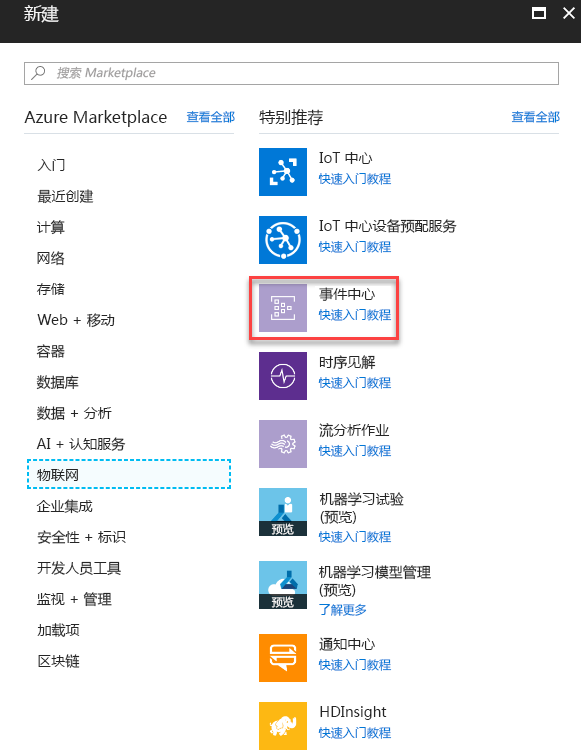

3. <span data-ttu-id="5456d-143">在“创建命名空间”\*\*\*\* 中，输入命名空间名称。</span><span class="sxs-lookup"><span data-stu-id="5456d-143">In **Create namespace**, enter a namespace name.</span></span> <span data-ttu-id="5456d-144">确保命名空间名称可用后，选择定价层（基本或标准）。</span><span class="sxs-lookup"><span data-stu-id="5456d-144">After making sure the namespace name is available, choose the pricing tier (Basic or Standard).</span></span> <span data-ttu-id="5456d-145">此外，选择 Azure 订阅、资源组以及创建资源的位置。</span><span class="sxs-lookup"><span data-stu-id="5456d-145">Also, choose an Azure subscription, resource group, and location in which to create the resource.</span></span> <span data-ttu-id="5456d-146">选择“创建”\*\*\*\* 以创建命名空间。</span><span class="sxs-lookup"><span data-stu-id="5456d-146">Choose **Create** to create the namespace.</span></span> <span data-ttu-id="5456d-147">你可能需要等待几分钟的时间，以使系统完全预配资源。</span><span class="sxs-lookup"><span data-stu-id="5456d-147">You might have to wait a few minutes for the system to fully provision the resources.</span></span>

    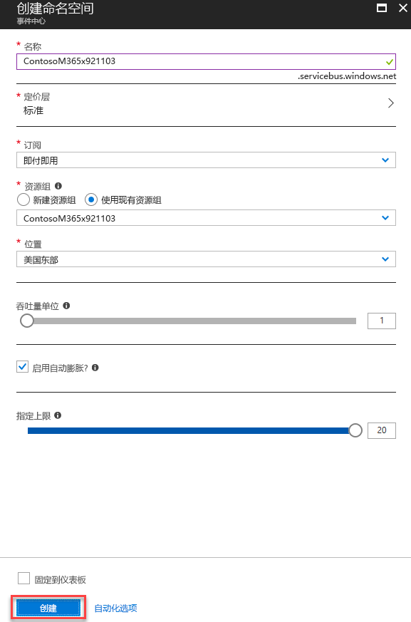

## <a name="step-2-configure-azure-monitor-to-send-security-alerts-from-your-tenant-to-the-event-hub"></a><span data-ttu-id="5456d-149">步骤 2：配置 Azure Monitor 以将租户的安全警报发送至事件中心</span><span class="sxs-lookup"><span data-stu-id="5456d-149">Step 2: Configure Azure Monitor to send security alerts from your tenant to the event hub</span></span>

<span data-ttu-id="5456d-150">通过 Azure Monitor 为整个 Azure Active Directory (Azure AD) 租户启用组织安全警报的流式处理操作已执行一次。</span><span class="sxs-lookup"><span data-stu-id="5456d-150">Enabling the streaming of your organization’s security alerts through Azure Monitor is done one time for your entire Azure Active Directory (Azure AD) tenant.</span></span> <span data-ttu-id="5456d-151">所有安全 API 许可和启用的产品都将开始向 Azure Monitor 发送安全警报，流式处理数据以使用应用程序。</span><span class="sxs-lookup"><span data-stu-id="5456d-151">All security API licensed and enabled products will begin sending security alerts to Azure Monitor, streaming data to consuming applications.</span></span> <span data-ttu-id="5456d-152">由组织许可和部署的任何其他启用了安全 API 的产品都将通过此相同的 Azure Monitor 配置自动流式处理安全警报。</span><span class="sxs-lookup"><span data-stu-id="5456d-152">Any additional security API-enabled products licensed and deployed by your organization will automatically stream security alerts through this same Azure Monitor configuration.</span></span> <span data-ttu-id="5456d-153">无需在组织中进行进一步集成。</span><span class="sxs-lookup"><span data-stu-id="5456d-153">No further integration work is needed from the organization.</span></span>

<span data-ttu-id="5456d-154">安全警报是具有很多特权的数据，通常只能由组织内的安全响应人员和全局管理员查看。</span><span class="sxs-lookup"><span data-stu-id="5456d-154">Security alerts are highly privileged data typically viewable only by security response personnel and global administrators within an organization.</span></span> <span data-ttu-id="5456d-155">为此，在 SIEM 系统中配置租户安全警报集成所需的步骤将需要使用 Azure AD 全局管理员帐户。</span><span class="sxs-lookup"><span data-stu-id="5456d-155">For this reason, the steps required to configure the integration of a tenant’s security alerts with SIEM systems require an Azure AD Global Administrator account.</span></span> <span data-ttu-id="5456d-156">此帐户在设置过程中只需使用一次，用以请求将组织的安全警报发送到 Azure Monitor。</span><span class="sxs-lookup"><span data-stu-id="5456d-156">This account is only needed one time, during setup, to request your organization’s security alerts be sent to Azure Monitor.</span></span>

> <span data-ttu-id="5456d-157">**注意：** 目前，Azure Monitor 诊断设置边栏选项卡不支持配置租户级资源。</span><span class="sxs-lookup"><span data-stu-id="5456d-157">**Note:** At this time, the Azure Monitor Diagnostic settings blade does not allow configuration of tenant-level resources.</span></span> <span data-ttu-id="5456d-158">Microsoft Graph 安全 API 警报是租户级资源，要求使用 Azure 资源管理器 API 配置 Azure Monitor，以支持您组织对安全警告的使用。</span><span class="sxs-lookup"><span data-stu-id="5456d-158">Microsoft Graph Security API alerts are a tenant-level resource, which requires using the Azure Resource Manager API to configure Azure Monitor to support consumption of your organization’s security alerts.</span></span>

1. <span data-ttu-id="5456d-159">在 Azure 订阅中，将“microsoft.insights”(Azure Monitor) 注册为资源提供程序。</span><span class="sxs-lookup"><span data-stu-id="5456d-159">In your Azure subscription, register "microsoft.insights" (Azure Monitor) as a resource provider.</span></span>  
> <span data-ttu-id="5456d-160">**注意：** 不要将 "Microsoft.SecurityGraph”（Microsoft Graph 安全 API）注册为您的 Azure 订阅中的资源提供程序，因为如上文所述，"Microsoft.SecurityGraph” 是租户级资源。</span><span class="sxs-lookup"><span data-stu-id="5456d-160">**Note:** Do not register "Microsoft.SecurityGraph" (Microsoft Graph Security API) as a resource provider in your Azure subscription, as “Microsoft.SecurityGraph” is a tenant-level resource as explained above.</span></span> <span data-ttu-id="5456d-161">租户级配置将是下面 #6 的一部分。</span><span class="sxs-lookup"><span data-stu-id="5456d-161">Tenant level configuration will be part of #6 below.</span></span>

2. <span data-ttu-id="5456d-162">若要使用 Azure 资源管理器 API 配置 Azure Monitor，请获取 [ARMClient](https://github.com/projectkudu/ARMClient) 工具。</span><span class="sxs-lookup"><span data-stu-id="5456d-162">To configure Azure Monitor using the Azure Resource Manager API, obtain the [ARMClient](https://github.com/projectkudu/ARMClient) tool.</span></span> <span data-ttu-id="5456d-163">此工具将用于将 REST API 调用从命令行发送到 Azure 门户。</span><span class="sxs-lookup"><span data-stu-id="5456d-163">This tool will be used to send REST API calls to the Azure portal from a command line.</span></span>

3. <span data-ttu-id="5456d-164">准备诊断设置请求 JSON 文件，如下所示：</span><span class="sxs-lookup"><span data-stu-id="5456d-164">Prepare a diagnostic setting request JSON file like the following:</span></span>

    ``` json
    {
      "location": "",
      "properties": {
        "name": "securityApiAlerts",
        "serviceBusRuleId": "/subscriptions/SUBSCRIPTION_ID/resourceGroups/RESOURCE_GROUP/providers/Microsoft.EventHub/namespaces/EVENT_HUB_NAMESPACE/authorizationrules/RootManageSharedAccessKey",
        "logs": [
          {
            "category": "Alert",
            "enabled": true,
            "retentionPolicy": {
              "enabled": true,
              "days": 7
            }
          }
        ]
      }
    }
    ```

    <span data-ttu-id="5456d-165">将 JSON 文件中的值替换为以下值：</span><span class="sxs-lookup"><span data-stu-id="5456d-165">Replace the values in the JSON file as follows:</span></span>

     <span data-ttu-id="5456d-166">**SUBSCRIPTION_ID** 是托管资源组和事件中心命名空间的 Azure 订阅的订阅 ID，你将在此处发送组织的安全警报。</span><span class="sxs-lookup"><span data-stu-id="5456d-166">**SUBSCRIPTION_ID** is the Subscription ID of the Azure subscription hosting the resource group and event hub namespace where you will be sending security alerts from your organization.</span></span>

     <span data-ttu-id="5456d-167">**RESOURCE_GROUP** 是包含事件中心命名空间的资源组，你将在此处发送组织的安全警报。</span><span class="sxs-lookup"><span data-stu-id="5456d-167">**RESOURCE_GROUP** is the resource group containing the event hub namespace where you will be sending security alerts from your organization.</span></span>

     <span data-ttu-id="5456d-168">**EVENT_HUB_NAMESPACE** 是事件中心命名空间，你将在此处发送组织的安全警报。</span><span class="sxs-lookup"><span data-stu-id="5456d-168">**EVENT_HUB_NAMESPACE** is the event hub namespace where you will be sending security alerts from your organization.</span></span>

     <span data-ttu-id="5456d-169">**“天”：** 是你想要在事件中心保留消息的天数。</span><span class="sxs-lookup"><span data-stu-id="5456d-169">**“days”:** 7 is the number of days you want to retain messages in your event hub.</span></span>

4. <span data-ttu-id="5456d-170">以 JSON 格式将文件另存到你将从中调用 ARMClient.exe 的目录。</span><span class="sxs-lookup"><span data-stu-id="5456d-170">Save the file as JSON to the directory where you will invoke ARMClient.exe.</span></span> <span data-ttu-id="5456d-171">例如，将文件命名为 **AzMonConfig.json**。</span><span class="sxs-lookup"><span data-stu-id="5456d-171">For example, name the file **AzMonConfig.json.**</span></span>

5. <span data-ttu-id="5456d-172">运行以下命令以登录到 ARMClient 工具。</span><span class="sxs-lookup"><span data-stu-id="5456d-172">Run the following command to sigh in to the ARMClient tool.</span></span> <span data-ttu-id="5456d-173">你需要使用全局管理员帐户凭据。</span><span class="sxs-lookup"><span data-stu-id="5456d-173">You will need to be using Global Administrator account credentials.</span></span>

    ``` shell
    ARMClient.exe login
    ```

6. <span data-ttu-id="5456d-174">运行以下命令以将 Azure Monitor 配置为向事件中心命名空间发送安全警报。</span><span class="sxs-lookup"><span data-stu-id="5456d-174">Run the following command to configure Azure Monitor to send security alerts to your event hub namespace.</span></span> <span data-ttu-id="5456d-175">这将自动预配命名空间内的事件中心，并启动流入事件中心的安全警报的流。</span><span class="sxs-lookup"><span data-stu-id="5456d-175">This will automatically provision an event hub within the namespace and start the flow of security alerts into the event hub.</span></span> <span data-ttu-id="5456d-176">确保设置名称（在此示例中是 **securityApiAlerts**）匹配在 JSON 文件中为“名称”\*\*\*\* 字段指定的设置名称。</span><span class="sxs-lookup"><span data-stu-id="5456d-176">Ensure that the setting name (in this example, **securityApiAlerts**) matches the setting name you specified in the JSON file for the **name** field.</span></span>

    ``` shell
    ARMClient.exe put https://management.azure.com/providers/Microsoft.SecurityGraph/diagnosticSettings/securityApiAlerts?api-version=2017-04-01-preview  @".\AzMonConfig.json"
    ```

7. <span data-ttu-id="5456d-177">若要验证是否正确应用了设置，运行此命令并验证输出匹配 JSON 文件设置。</span><span class="sxs-lookup"><span data-stu-id="5456d-177">To verify the settings were applied correctly, run this command and verify that the output matches your JSON file settings.</span></span>

    ``` shell
    ARMClient.exe get https://management.azure.com/providers/Microsoft.SecurityGraph/diagnosticSettings/securityApiAlerts?api-version=2017-04-01-preview
    ```
8. <span data-ttu-id="5456d-178">退出 ARMClient 工具。</span><span class="sxs-lookup"><span data-stu-id="5456d-178">Exit the ARMClient tool.</span></span> <span data-ttu-id="5456d-179">现在，你已完成将租户安全警报发送到事件中心的 Azure Monitor 的配置。</span><span class="sxs-lookup"><span data-stu-id="5456d-179">You have now completed the configuration of Azure Monitor to send security alerts from your tenant to event hub.</span></span>

## <a name="step-3-download-and-install-the-azure-monitor-add-on-for-splunk-which-will-allow-splunk-to-consume-security-alerts"></a><span data-ttu-id="5456d-180">步骤 3：下载和安装 Splunk 的 Azure Monitor 加载项，以允许 Splunk 使用安全警报</span><span class="sxs-lookup"><span data-stu-id="5456d-180">Step 3: Download and install the Azure Monitor Add-on for Splunk which will allow Splunk to consume security alerts</span></span>

1. <span data-ttu-id="5456d-181">这种集成仅支持 Splunk 企业部署。</span><span class="sxs-lookup"><span data-stu-id="5456d-181">This integration only supports Splunk Enterprise deployments.</span></span>
2. <span data-ttu-id="5456d-182">下载并安装 [Splunk 的 Azure Monitor 加载项](https://github.com/Microsoft/AzureMonitorAddonForSplunk)。</span><span class="sxs-lookup"><span data-stu-id="5456d-182">Download and install the [Azure Monitor Add-on for Splunk](https://github.com/Microsoft/AzureMonitorAddonForSplunk).</span></span> <span data-ttu-id="5456d-183">有关详细的安装说明，请参阅[安装](https://github.com/Microsoft/AzureMonitorAddonForSplunk/wiki/Installation)。</span><span class="sxs-lookup"><span data-stu-id="5456d-183">For detailed installation instructions, see [Installation](https://github.com/Microsoft/AzureMonitorAddonForSplunk/wiki/Installation).</span></span> <span data-ttu-id="5456d-184">**仅支持 Splunk 版本 1.2.9 或更高版本的 Azure Monitor 加载项。**</span><span class="sxs-lookup"><span data-stu-id="5456d-184">**Only Azure Monitor Add-on for Splunk version 1.2.9 or higher is supported.**</span></span>
3. <span data-ttu-id="5456d-185">成功安装加载项之后，按照 [Azure Monitor 加载项配置 wiki](https://github.com/Microsoft/AzureMonitorAddonForSplunk/wiki/Configuration-of-Splunk ) 中所述的配置步骤对 Splunk 进行配置。</span><span class="sxs-lookup"><span data-stu-id="5456d-185">After successfully installing the Add-on, follow the configuration steps described in the [Azure Monitor add-on configuration wiki](https://github.com/Microsoft/AzureMonitorAddonForSplunk/wiki/Configuration-of-Splunk ) to configure Splunk.</span></span>
4. <span data-ttu-id="5456d-186">如加载项安装说明中所述，需要在 Splunk Web 中的“管理应用”页面上通过执行禁用/启用循环，才可使加载项正常工作。</span><span class="sxs-lookup"><span data-stu-id="5456d-186">As indicated in the Add-on installation instructions, the add-on will work by doing a disable/enable cycle on the Manage Apps page in Splunk Web.</span></span> <span data-ttu-id="5456d-187">或者，可以重启 Splunk。</span><span class="sxs-lookup"><span data-stu-id="5456d-187">Or, you can restart Splunk.</span></span>

## <a name="step-4-register-an-application-with-your-tenant-azure-active-directory-which-splunk-will-use-to-read-from-the-event-hub"></a><span data-ttu-id="5456d-188">步骤 4：使用租户 Azure Active Directory 注册一个供 Splunk 从事件中心进行读取的应用程序</span><span class="sxs-lookup"><span data-stu-id="5456d-188">Step 4: Register an application with your tenant Azure Active Directory which Splunk will use to read from the event hub</span></span>

<span data-ttu-id="5456d-189">Splunk 需要在您的组织的 Azure Active Directory 中进行应用程序注册，才能获得对 Azure Monitor 事件中心进行身份验证所需的权限和应用程序凭据。</span><span class="sxs-lookup"><span data-stu-id="5456d-189">Splunk needs an application registration in your organization’s Azure Active Directory to be granted the required permissions and app credentials required to authenticate to the Azure Monitor event hub.</span></span>

1. <span data-ttu-id="5456d-190">在 Azure 门户中，转到**应用程序注册**，然后选择**新应用程序注册**。</span><span class="sxs-lookup"><span data-stu-id="5456d-190">In the Azure portal, go to **App Registrations** and select **New application registration**.</span></span>

    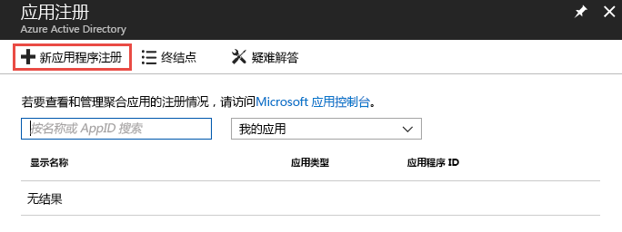

2. <span data-ttu-id="5456d-192">为应用程序选择一个名称，为类型选择 **Web 应用/API**，为登录 URL 选择 **`http://localhost`**。</span><span class="sxs-lookup"><span data-stu-id="5456d-192">Select a name for your application, choose **Web app / API** for the type, and **`http://localhost`** for the sign-on URL.</span></span> <span data-ttu-id="5456d-193">然后选择“创建”\*\*\*\*。</span><span class="sxs-lookup"><span data-stu-id="5456d-193">Then select **Create**.</span></span>

    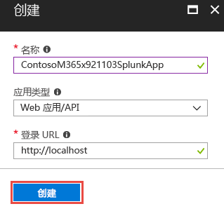

3. <span data-ttu-id="5456d-195">应用程序创建后，复制“应用程序 ID”\*\*\*\* 并将其保存，以供在以后配置 Splunk 数据输入时使用。</span><span class="sxs-lookup"><span data-stu-id="5456d-195">After the application is created, copy the **Application ID** and save for later use configuring the Splunk data inputs.</span></span> <span data-ttu-id="5456d-196">然后，转到应用程序设置并选择“密钥”\*\*\*\*。</span><span class="sxs-lookup"><span data-stu-id="5456d-196">Then go to the application settings and choose **Keys**.</span></span>

    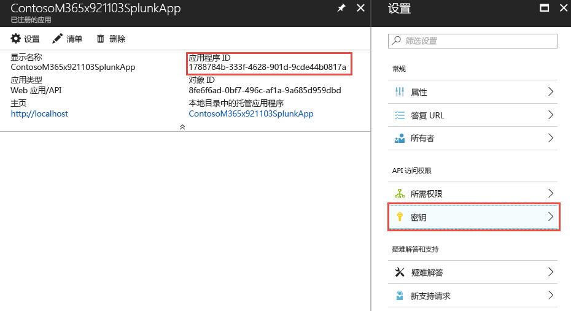

    <span data-ttu-id="5456d-198">这将允许你生成新密钥，称为“应用程序密码”。</span><span class="sxs-lookup"><span data-stu-id="5456d-198">This will allow you to generate a new key, known as an Application Secret.</span></span> <span data-ttu-id="5456d-199">新密钥生成后，复制“应用程序密码”\*\*\*\* 并将其保存，以供在以后配置 Splunk 数据输入时使用。</span><span class="sxs-lookup"><span data-stu-id="5456d-199">After it's generated, copy the **Application Secret** and save for later use configuring the Splunk data inputs.</span></span>

4. <span data-ttu-id="5456d-200">在包含组织安全警报的事件中心的 Azure 订阅中授予应用程序\*\*\*\*“读取器”角色。</span><span class="sxs-lookup"><span data-stu-id="5456d-200">Grant the application the role of **Reader** in the Azure subscription containing the event hub with your organization’s security alerts.</span></span>

    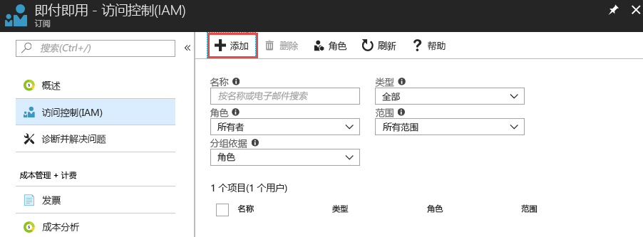

    <span data-ttu-id="5456d-202">选择你的订阅，然后选择“访问控制 (IAM)”\*\*\*\*。</span><span class="sxs-lookup"><span data-stu-id="5456d-202">Select your subscription, choose **Access control (IAM)**.</span></span> <span data-ttu-id="5456d-203">选择“添加”\*\*\*\* 以添加权限。</span><span class="sxs-lookup"><span data-stu-id="5456d-203">Select **Add** to add permissions.</span></span> <span data-ttu-id="5456d-204">选择应用程序并为其选择“读取器”\*\*\*\* 的“角色”\*\*\*\*。</span><span class="sxs-lookup"><span data-stu-id="5456d-204">Select your application and choose the **Role** of **Reader** for your application.</span></span>

    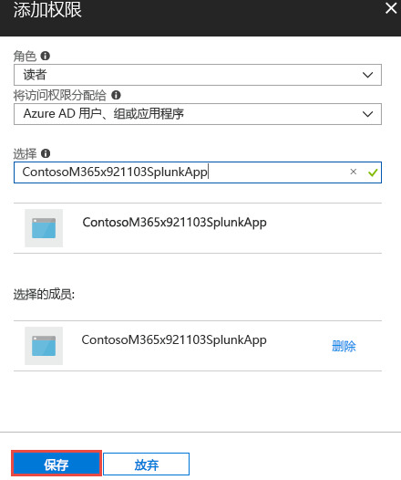

    <span data-ttu-id="5456d-206">选择“保存”\*\*\*\*，以将授予应用程序的权限添加到订阅。</span><span class="sxs-lookup"><span data-stu-id="5456d-206">Select **Save** to add the permissions granted to your application to the subscription.</span></span>

## <a name="step-5-create-an-azure-key-vault-to-store-the-access-key-for-the-event-hub"></a><span data-ttu-id="5456d-207">步骤 5：创建 Azure Key Vault 以存储事件中心的访问密钥</span><span class="sxs-lookup"><span data-stu-id="5456d-207">Step 5: Create an Azure Key vault to store the access key for the event hub</span></span>

<span data-ttu-id="5456d-208">Azure Key Vault 用于存储应用程序在运行时所使用的标识、密码和证书等机密。</span><span class="sxs-lookup"><span data-stu-id="5456d-208">Azure key vaults are used to store secrets such as identities, passwords, and certificates for use at runtime by applications.</span></span> <span data-ttu-id="5456d-209">在此步骤中，你将创建一个 Azure Key Vault，以存储 Splunk 从包含组织安全警报的 Azure 事件中心连接和读取所需的密码。</span><span class="sxs-lookup"><span data-stu-id="5456d-209">In this step you will create an Azure key vault to store the secrets needed for Splunk to connect and read from the Azure event hubs containing your organization’s security alerts.</span></span>

1. <span data-ttu-id="5456d-210">在 Azure 门户中，转到“密钥保管库”\*\*\*\* 并选择“添加”\*\*\*\*。</span><span class="sxs-lookup"><span data-stu-id="5456d-210">In the Azure portal, go to **Key vaults** and select **Add**.</span></span>

    

2. <span data-ttu-id="5456d-212">创建新密钥保管库后，选择“访问策略”\*\*\*\*，为刚在步骤 4 中注册的应用程序添加新访问策略。</span><span class="sxs-lookup"><span data-stu-id="5456d-212">When creating the new key vault, select **Access policies** to add a new access policy for the application you just registered in Step 4.</span></span> <span data-ttu-id="5456d-213">向应用程序授予“获取”\*\*\*\* 密码权限。</span><span class="sxs-lookup"><span data-stu-id="5456d-213">Grant the **Get** secret permissions to your application.</span></span> <span data-ttu-id="5456d-214">这将允许 Splunk（充当注册的应用程序）访问存储在此 Azure Key Vault 中的密钥（密码）。</span><span class="sxs-lookup"><span data-stu-id="5456d-214">This will allow Splunk, acting as the registered application, to access the keys (secrets) stored in this Azure key vault.</span></span>

    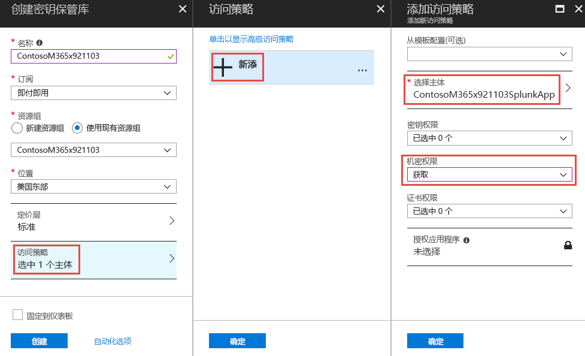

    <span data-ttu-id="5456d-216">选择“创建”\*\*\*\*，以完成新 Azure Key Vault 的创建过程。</span><span class="sxs-lookup"><span data-stu-id="5456d-216">Select **Create** to complete the creation of your new Azure key vault.</span></span>

3. <span data-ttu-id="5456d-217">在密钥保管库中生成新密码，以将访问密钥存储到事件中心命名空间。</span><span class="sxs-lookup"><span data-stu-id="5456d-217">Generate a new secret in your key vault to store the access key to your event hub namespace.</span></span> <span data-ttu-id="5456d-218">首先，将访问密钥捕捉到事件中心命名空间，方法是打开事件中心命名空间并选择“共享的访问策略”\*\*\*\*。</span><span class="sxs-lookup"><span data-stu-id="5456d-218">First, grab the access key to your event hub namespace by opening your event hub namespace and selecting **Shared access policies**.</span></span> <span data-ttu-id="5456d-219">从列表中选择 **RootManageSharedAccessKey** 策略并从中复制“主键”\*\*\*\*。</span><span class="sxs-lookup"><span data-stu-id="5456d-219">Select the **RootManageSharedAccessKey** policy from the list and copy the **Primary Key** from the list.</span></span>

    

4. <span data-ttu-id="5456d-221">打开密钥保管库并选择“密码”\*\*\*\*。</span><span class="sxs-lookup"><span data-stu-id="5456d-221">Open your key vault and select **Secrets**.</span></span> <span data-ttu-id="5456d-222">选择“生成/导入”\*\*\*\*，以将新密码添加到密钥保管库。</span><span class="sxs-lookup"><span data-stu-id="5456d-222">Choose **Generate/Import** to add a new secret to the key vault.</span></span> <span data-ttu-id="5456d-223">粘贴事件中心命名空间 **RootManageSharedAccessKey** 中的“主键”\*\*\*\*。</span><span class="sxs-lookup"><span data-stu-id="5456d-223">Paste in the **Primary key** from the event hub namespace **RootManageSharedAccessKey**.</span></span>

    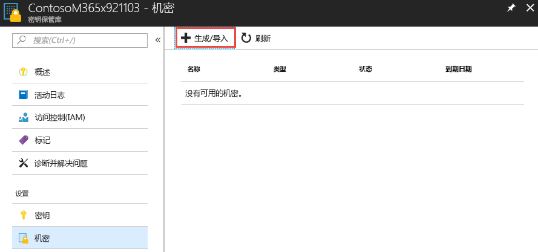

5. <span data-ttu-id="5456d-225">创建后，选择该密码并复制密码的“机密版本”\*\*\*\*。</span><span class="sxs-lookup"><span data-stu-id="5456d-225">After it's created, select the secret and copy the **Secret Version** of the secret.</span></span> <span data-ttu-id="5456d-226">稍后将在步骤 6 中使用它来配置 Splunk 数据输入。</span><span class="sxs-lookup"><span data-stu-id="5456d-226">This will be used later in Step 6 to configure Splunk data inputs.</span></span>

    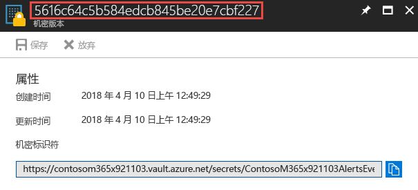

## <a name="step-6-configure-the-splunk-data-inputs-to-consume-security-alerts-stored-in-the-event-hub"></a><span data-ttu-id="5456d-228">步骤 6：配置 Splunk 数据输入以使用存储在事件中心的安全警报</span><span class="sxs-lookup"><span data-stu-id="5456d-228">Step 6: Configure the Splunk data inputs to consume security alerts stored in the event hub</span></span>

<span data-ttu-id="5456d-229">完成设置过程的最后一步是配置 Splunk 数据输入，以利用事件中心、应用程序和在上一步骤中创建的密码。</span><span class="sxs-lookup"><span data-stu-id="5456d-229">The last step to complete the setup process is to configure Splunk data inputs to utilize the event hub, application, and secrets you created in previous steps.</span></span>

1. <span data-ttu-id="5456d-230">按照[配置 Splunk](https://github.com/Microsoft/AzureMonitorAddonForSplunk/wiki/Configuration-of-Splunk) 主题中的说明进行操作，打开和配置 Azure Monitor 加载项的 Splunk 数据输入。</span><span class="sxs-lookup"><span data-stu-id="5456d-230">Follow the instructions in the [Configuration of Splunk](https://github.com/Microsoft/AzureMonitorAddonForSplunk/wiki/Configuration-of-Splunk) topic to open and configure Splunk data inputs for the Azure Monitor Add-on.</span></span> <span data-ttu-id="5456d-231">转到“设置”\*\*\*\* 和“数据输入”\*\*\*\*。</span><span class="sxs-lookup"><span data-stu-id="5456d-231">Go to **Settings** and **Data Inputs**.</span></span> <span data-ttu-id="5456d-232">选择“Azure Monitor 诊断日志”\*\*\*\*。</span><span class="sxs-lookup"><span data-stu-id="5456d-232">Choose **Azure Monitor Diagnostic Logs**.</span></span>
2. <span data-ttu-id="5456d-233">选择“新建”\*\*\*\*，并使用在上一步骤中获取的值来输入所有必填的字段。</span><span class="sxs-lookup"><span data-stu-id="5456d-233">Select **New** and input all the required fields using the values obtained in the previous steps.</span></span> <span data-ttu-id="5456d-234">下图显示使用本文前面示例中值的所有必填的字段。</span><span class="sxs-lookup"><span data-stu-id="5456d-234">The following image shows all the required fields using the values from the previous examples in this article.</span></span>

    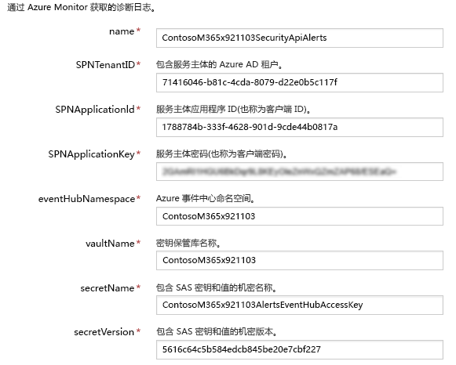

3. <span data-ttu-id="5456d-236">选择**下一步**，开始搜索从 Azure Monitor 中引入的组织安全警报。</span><span class="sxs-lookup"><span data-stu-id="5456d-236">Select **Next** and begin searching your organization’s security alerts ingested from Azure Monitor.</span></span>

## <a name="optional-use-splunk-search-to-explore-data"></a><span data-ttu-id="5456d-237">（可选）使用 Splunk 搜索来浏览数据</span><span class="sxs-lookup"><span data-stu-id="5456d-237">(Optional) Use Splunk Search to explore data</span></span>

<span data-ttu-id="5456d-238">一旦您完成 Azure Monitor Splunk 插件设置，您的 Splunk 实例将启动所配置事件中心的事件检索。</span><span class="sxs-lookup"><span data-stu-id="5456d-238">After you have set up the Azure Monitor Splunk plugin, your Splunk instance will start retrieving events from the configured event hub.</span></span> <span data-ttu-id="5456d-239">默认情况下，splunk 将索引 Microsoft Graph 安全警报架构的各个属性以允许搜索。</span><span class="sxs-lookup"><span data-stu-id="5456d-239">By default, splunk will index each property of the Microsoft Graph security alert schema to allow searching.</span></span>

<span data-ttu-id="5456d-240">若要搜索 Graph 安全警报、创建仪表板或使用搜索查询设置 Splunk 警报，请导航到 Splunk 中的应用程序 -> 搜索和报告应用程序。</span><span class="sxs-lookup"><span data-stu-id="5456d-240">To search for Microsoft Graph security alerts, to create dashboards, or to set Splunk alerts with your search query, navigate to apps -> Search & Reporting app in Splunk.</span></span>

<span data-ttu-id="5456d-241">**示例**：</span><span class="sxs-lookup"><span data-stu-id="5456d-241">Examples</span></span><br/>
<span data-ttu-id="5456d-242">尝试搜索 Graph 安全警报：</span><span class="sxs-lookup"><span data-stu-id="5456d-242">Try searching Graph Security alerts:</span></span>

- <span data-ttu-id="5456d-243">在搜索栏中键入 `sourcetype="amdl:securitygraph:alert"` 来获取所有通过 graph 安全 API 显示的警报。</span><span class="sxs-lookup"><span data-stu-id="5456d-243">Type `sourcetype="amdl:securitygraph:alert"` in the search bar to get all alerts surfaced through the graph security API.</span></span> <span data-ttu-id="5456d-244">在右侧，您将看到 Azure Monitor 日志的顶级属性，其中 Graph 安全警报位于属性栏下方。</span><span class="sxs-lookup"><span data-stu-id="5456d-244">On the right-hand side, you will see the top-level properties of Azure Monitor log where Graph Security alert is under properties field.</span></span><br/>
- <span data-ttu-id="5456d-245">在左窗格中，您将看到所选的字段和感兴趣的字段。</span><span class="sxs-lookup"><span data-stu-id="5456d-245">On the left pane, you will see selected fields and interesting fields.</span></span> <span data-ttu-id="5456d-246">您可以使用所选的字段来创建仪表板或 Splunk 警报，您还可以通过右键单击字段添加或删除所选的字段。</span><span class="sxs-lookup"><span data-stu-id="5456d-246">You can use selected fields to create dashboards or Splunk alerts, you can also add or remove selected fields by right-clicking on the fields.</span></span>  
> <span data-ttu-id="5456d-247">**注意：** 如下面的搜索查询所示，您可以根据需要限制您的搜索。</span><span class="sxs-lookup"><span data-stu-id="5456d-247">**Note:** As shown in the following search query, you can restrict your search as needed.</span></span> <span data-ttu-id="5456d-248">在示例中，我们按照 Azure 安全中心的高严重性警报对 Graph 安全警报进行筛选。</span><span class="sxs-lookup"><span data-stu-id="5456d-248">In the example, we filter the Graph Security Alerts by high severity alerts from Azure Security Center.</span></span> <span data-ttu-id="5456d-249">我们也使用了 `eventDatetime`、`severity`、`status` 和 `provider` 作为要显示的选定字段。</span><span class="sxs-lookup"><span data-stu-id="5456d-249">We also used `eventDatetime`, `severity`, `status`, and `provider` as selected fields to be displayed.</span></span> <span data-ttu-id="5456d-250">有关更多高级搜索词，请参阅 [splunk 搜索教程](http://docs.splunk.com/Documentation/Splunk/7.1.2/SearchTutorial/WelcometotheSearchTutorial)。</span><span class="sxs-lookup"><span data-stu-id="5456d-250">For more advance search terms, see [splunk search tutorials](http://docs.splunk.com/Documentation/Splunk/7.1.2/SearchTutorial/WelcometotheSearchTutorial).</span></span>

 
> <span data-ttu-id="5456d-252">搜索查询： `sourcetype="amdl:securitygraph:alert" "properties.vendorInformation.provider"=ASC "properties.severity"=High | rename properties.eventDataTime as eventDateTime properties.severity as severity properties.vendorInformation.provider as provider properties.status as status`</span><span class="sxs-lookup"><span data-stu-id="5456d-252">search query`sourcetype="amdl:securitygraph:alert" "properties.vendorInformation.provider"=ASC "properties.severity"=High | rename properties.eventDataTime as eventDateTime properties.severity as severity properties.vendorInformation.provider as provider properties.status as status`</span></span>

<span data-ttu-id="5456d-253">Splunk 还允许通过屏幕右上角的“另存为”菜单选项对搜索结果进行多种操作。</span><span class="sxs-lookup"><span data-stu-id="5456d-253">Splunk also allows multiple actions on search results using the "Save As" menu option in top right of the screen.</span></span> <span data-ttu-id="5456d-254">您可以根据您的搜索筛选器创建报表、仪表板面板或警报。</span><span class="sxs-lookup"><span data-stu-id="5456d-254">You can create Reports, Dashboard Panels, or Alerts based on your search filter.</span></span>
<span data-ttu-id="5456d-255">下面是基于以前查询的事件流仪表板示例：您可以对每个事件添加向下钻取链接，进一步访问 Microsoft Graph 网站上的详细信息。</span><span class="sxs-lookup"><span data-stu-id="5456d-255">Below is an example of a dashboard with an event stream based on the previous query: You can add a drilldown link to each event to further access the details on Microsoft Graph site.</span></span> <span data-ttu-id="5456d-256">请参阅 [Splunk 向下钻取文档](http://docs.splunk.com/Documentation/Splunk/7.1.2/Viz/DrilldownIntro)。</span><span class="sxs-lookup"><span data-stu-id="5456d-256">See [Splunk drilldown documentation](http://docs.splunk.com/Documentation/Splunk/7.1.2/Viz/DrilldownIntro).</span></span>

 

<span data-ttu-id="5456d-258">或者您也可以创建仪表板作为时间线图表：</span><span class="sxs-lookup"><span data-stu-id="5456d-258">Or you can create a dashboard as a timeline chart:</span></span>

 

<span data-ttu-id="5456d-260">您可以参考 [Splunk 搜索与报表教程](http://docs.splunk.com/Documentation/Splunk/7.1.2/SearchTutorial/WelcometotheSearchTutorial)获得更多信息。</span><span class="sxs-lookup"><span data-stu-id="5456d-260">You can follow [Splunk Search & Report tutorial](http://docs.splunk.com/Documentation/Splunk/7.1.2/SearchTutorial/WelcometotheSearchTutorial) for more details.</span></span>