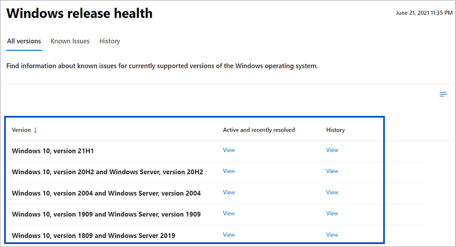
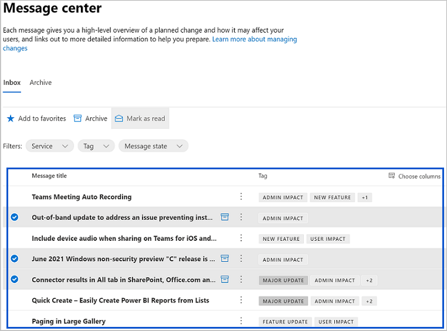

# 在 Microsoft Graph 中访问服务运行状况和通信的概述
可以使用 Microsoft Graph 中的服务通信 API 访问有关 Microsoft 云服务的运行状况和消息中心帖子。 实际运行状况和帖子对应于 API 所支持且由租户订阅的 Microsoft 365 和 Dynamics 365 服务。

## 为何与服务运行状况和通信数据集成？

### 获取租户的服务运行状况和消息中心帖子
客户可以获得支持的 Microsoft 服务当前或历史健康数据。当遇到 Microsoft 服务问题时，客户可以检查其运行状况，以验证是否已通过正在进行的解决方法识别问题，然后再请求支持或花费时间进行故障排除。 

客户可以定期查看消息中心帖子，以跟踪即将发布的新功能和更新以及其他重要公告。 然后，他们可以预测这些更改对用户有何影响，并制定相应的计划。

### 将服务通信数据集成到自定义工作流中
应用开发人员可以将活动服务运行状况问题直接集成到自定义应用程序中，从而允许管理员进行会审并与受影响的访问群体共享状态信息。

应用可以启用自定义工作流，以便管理员从消息中心查看、分配和会审更改通信。

### 构建面向客户的仪表板

使用面向客户的仪表板创建应用程序，以显示Microsoft 服务的运行状况，并允许客户跟踪即将发生的更改以及有关服务的其他重要公告。

## Microsoft 365 管理中心中的仪表板示例
本部分演示 [Microsoft 365 管理中心](https://admin.microsoft.com/Adminportal/Home?source=applauncher#/homepage) 中使用服务通信 API 生成各自运行状况仪表板的示例。 使用管理员帐户登录管理中心，然后单击“**运行状况**”以查看以下仪表板：
- [服务运行状况](#service-health-dashboard)
- [Windows 版本运行状况](#windows-release-health-dashboard)
- [消息中心](#message-center-dashboard)

### 服务运行状况仪表板

在 **服务运行状况** 仪表板中，可以查看订阅的Microsoft 服务的运行状况，其中可以包括 Office 网页版、Yammer、Microsoft Dynamics CRM 和移动设备管理云服务。 请参阅图 1 中所述的示例。

**图 1. Microsoft 365 管理中心中的服务运行状况仪表板**

### Windows 版本运行状况仪表板

从 **Windows 版本运行状况** 仪表板，可以查看有关每月质量和功能更新的重要信息，以及 Windows 的最新功能和增强功能。 请参阅图 2 中所述的示例。

**图 2. Microsoft 365 管理中心中的 Windows 版本运行状况仪表板**

### 消息中心仪表板
从 **消息中心** 仪表板，可以查看即将发生的更改，包括新增和已更改的功能、计划内维护和其他重要公告。 请参阅图 3 中所述的示例。

**图 3. Microsoft 365 管理中心中的消息中心仪表板**

## 后续步骤

- 在 [Graph 浏览器](https://developer.microsoft.com/graph/graph-explorer/?request=admin%2FserviceAnnouncement%2FhealthOverviews&version=v1.0) 中试用服务通信示例查询。

- 了解更多关于 [V1.0 版的服务通信 API](/graph/api/resources/service-communications-api-overview?view=graph-rest-1.0&preserve-view=true) 的信息。

- 了解更多关于 [Beta 版的服务通信 API](/graph/api/resources/service-communications-api-overview?view=graph-rest-beta&preserve-view=true) 的信息。

