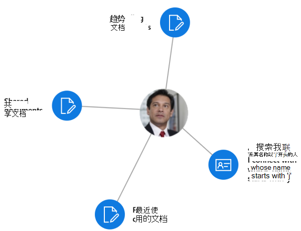
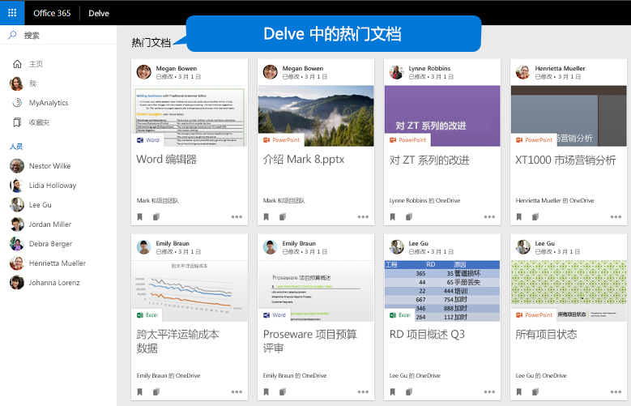
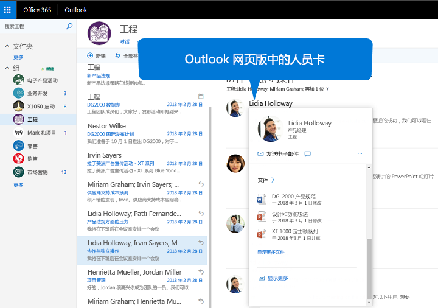

# <a name="overview-of-people-and-workplace-intelligence-in-microsoft-graph"></a>Microsoft Graph 中的人员和工作场所智能概述

Microsoft 365 云服务的亿万用户组成了 Microsoft Graph 的核心部分。 用户的数据通过 Microsoft Graph 提供的服务得到精心的管理、保护和适当的授权，以提升企业生产力和创造力。 

通过 _个人资料 API_，你可以作为应用开发人员为 Microsoft 365 服务中的人员建模并代表他们，借助个人资料卡片 API，管理员可以控制组织中用户个人资料卡上显示的信息。

因为在 Microsoft Graph 中有大量的用户数据，所以派生自用户社交交互的数据将尤为受到关注。 它可以对回答类似以下问题提供智能见解：

- “搜索名称以‘J’开头的人”
- “此人最感兴趣的文档有哪些？”

你可以在 Microsoft Graph 中使用 _人员 API_ 和 _见解 API_ 来构建更为智能的应用，分别访问与用户相关度高的人员和文档。

人员 API 基于用户的联系人、社交网络、组织目录以及电子邮件上的最近通信，返回按与该用户相关性排序的人员。这对于选取人员的应用场景尤为有用。

见解 API 使用高级分析和机器学习为用户提供他们在工作中所需的相关度最高的文件。 API 提升了我们所熟悉的 Microsoft 365 体验，其中包括 Office Delve、SharePoint Home、OneDrive for Business 中的发现视图以及 Outlook 网页版。



## <a name="why-integrate-with-people-data"></a>为什么与人员数据集成？

人员 API 可返回单个实体的数据[人员](/graph/api/resources/person)，其中包括当今商界中的个人典型数据。 “人员”数据的优势在于它相对于 Microsoft Graph 用户的“相关性”。 相关性是基于用户的通信和协作模式以及业务关系来计算的，并且以每个人的相关性分数进行记录。 有 3 种主要类型的“相关性”数据的应用程序。

### <a name="browse-people-by-relevance"></a>按相关性浏览人员

你可以浏览与登录用户相关的人员或与登录用户组织中某一些用户相关的人员，前提是你已获取相应的[授权](people-example.md#authorization)。 获取按相关性排序的“人员”对象的集合。 而且，通过指定查询参数 `top`、`skip`、`orderby`、`select` 和 `filter`，你还可以进一步[自定义](people-example.md#browse-people)响应中返回的“人员”对象的集合。

### <a name="fuzzy-searches-based-on-people-criteria"></a>基于人员条件的模糊搜索

人员 API 允许你搜索与登录用户相关的人员，前提是你的应用已获取该用户授予的权限。 （详细了解[人员权限](permissions-reference.md#people-permissions)。）

模糊搜索根据完全匹配以及搜索意图推断返回结果。 为了说明这一点，请见以下示例：这将返回与登录用户相关的、其名字或电子邮件地址中包含以“j”开头的单词的人员对象。

<!-- { "blockType": "ignored" } -->
```http
GET /me/people/?$search=j
```

## <a name="why-integrate-with-the-profile-api-preview"></a>为什么要与配置文件 API（预览版）集成？

[配置文件](/graph/api/resources/profile) API 表示下一代建模并代表 Microsoft 365 服务中的人脉。 配置文件数据可与人脉数据一起使用，以基于 Microsoft Graph 生成自定义体验。

## <a name="why-configure-profile-cards-in-your-organization-preview"></a>为什么要在组织中配置个人资料卡片（预览版）？

个人资料卡让组织中的用户可以查看其他人的信息，如姓名和联系信息。 管理员可以使用[个人资料卡](/graph/api/resources/profilecardproperty) API来定制有关 Microsoft 365 人员体验内的组织外观。

## <a name="why-integrate-with-document-based-insights"></a>为什么与基于文档的见解集成？

### <a name="use-intelligence-to-improve-collaboration"></a>使用智能来提升协作

在平时的工作日中，用户通常会与存储在多个文档中的大量信息进行交互，并以多种不同的方式与其他用户协作。 当他们需要任何信息时，始终可以随时找到所需的信息，这一点非常重要。

你可以使用见解 API（其中包含[热门](/graph/api/resources/insights-trending)、[共享](/graph/api/resources/insights-shared)和[使用](/graph/api/resources/insights-used) API），根据用户的当前上下文和需求跨 Microsoft 365 处理文件，使用户工作更为高效并提升组织中的协作。 组织可以为这些基于文档的见解[自定义隐私设置](insights-customize-item-insights-privacy.md)，并控制特定 Microsoft 365体验中这些见解的可用性。

在应用中呈现见解 API 中的结果很简单。 每个结果都附带了一组常用可视化属性，例如，预览图像 URL 或预览文本。

### <a name="make-relevant-content-visible"></a>使相关内容可见

在 Microsoft 365 中，Delve 使用 _热门_ 见解来帮助用户发现目前最令他们感兴趣的文档。 请参见图 1。

通过编程的方式，可以使用见解 API 中的[热门](/graph/api/resources/insights-trending)实体为应用客户提供类似体验。 使用“热门”实体可连接到最近热门或与用户相关的文档。 [列出热门文档](/graph/api/insights-list-trending)将返回存储在 OneDrive 或 SharePoint 团队网站上的文件，并参照这些文件的重要程度来对其排序。 

**图 1. Microsoft 365 中的 Delve 为用户显示热门文档**



### <a name="allow-users-to-collaborate-and-get-back-to-work"></a>允许用户进行协作和恢复工作

新的 Microsoft 365 人员卡片融入了“_使用_”和“_共享_”见解，以连接人员和知识单元之间的点。 人员卡片将标识和显示有关人员的相关文档。 用户可以在整个套件内查看人员卡片（例如，在 Outlook 网页版中）。 请参见图 2。

见解 API 提供与[使用](/graph/api/resources/insights-used)和[共享](/graph/api/resources/insights-shared)实体类似的功能。 它们返回用户最近最常查看或使用的内容，或同事最近在 Microsoft 365 中与用户共享的内容。

**图 2. Outlook 网页版显示用户的人员卡片**



## <a name="why-integrate-with-myanalytics-preview"></a>为什么要与 MyAnalytics（预览版）集成？

[MyAnalytics](/workplace-analytics/myanalytics/index) 提供了有关用户如何花费自己时间，以及用户与谁一起花费时间的见解。 此类数据可以帮助用户计划一天的日程安排，深入了解自己的不同工作模式，并帮助用户平衡工作和生活。

借助分析 API，可以同步或集成用户分析数据与自定义第三方应用，以支持各种有助于提升用户工作效率和协作的方案。 例如，可以将 MyAnalytics 数据与移动设备活动集成，以帮助用户在一个应用中跟踪自己的所有工作和社交活动，并计划一天的日程安排。
 
## <a name="api-reference"></a>API 参考

在查找这些服务的 API 参考？

- [使用 Microsoft Graph API 在应用中集成人员和工作区智能](/graph/api/resources/social-overview)
- 人脉 API [人员](/graph/api/resources/person) 资源
- [个人资料（预览版）](/graph/api/resources/profile) 资源
- [个人资料卡片（预览版）](/graph/api/resources/profilecardproperty) 资源
- [见解 API](/graph/api/resources/officegraphinsights)
- [分析 API（预览版）](/graph/api/resources/useranalytics)

## <a name="next-steps"></a>后续步骤

* 在 [Graph 浏览器](https://developer.microsoft.com/graph/graph-explorer)中使用你自己的文件试用人员、见解和分析 API。 登录，在左侧列中展开 **人员** 或 **见解**，然后尝试其示例查询。
* 查找有关[人脉 API](people-example.md) 的详细信息。
* 请参阅如何 [自定义个人资料卡片](add-properties-profilecard.md)。
* 详细了解[项目见解](item-insights-overview.md)、[自定义用户的项目见解隐私（预览版）](insights-customize-item-insights-privacy.md)，以及支持自定义的[项目见解设置 API（预览版）](/graph/api/resources/iteminsightssettings?view=graph-rest-beta&preserve-view=true)。
* 查找有关[分析 API](/graph/api/resources/social-overview?view=graph-rest-beta&preserve-view=true#help-users-balance-work-and-life) 的详细信息。
* 查找有关[配置文件 API](/graph/api/resources/profile?view=graph-rest-beta&preserve-view=true) 的详细信息。
