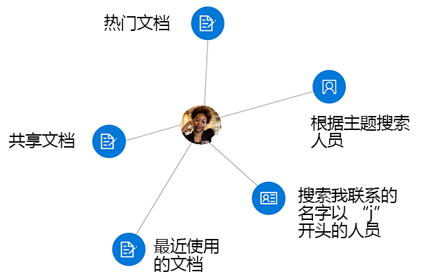

# <a name="overview-of-social-intelligence-and-analytics-in-microsoft-graph"></a><span data-ttu-id="d073a-105">Microsoft Graph 中的社交智能和分析概述</span><span class="sxs-lookup"><span data-stu-id="d073a-105">Overview of social intelligence and analytics in Microsoft Graph</span></span>

<span data-ttu-id="d073a-106">Microsoft 365 云服务的亿万用户组成了 Microsoft Graph 的核心部分。</span><span class="sxs-lookup"><span data-stu-id="d073a-106">The hundreds of millions of users of Microsoft 365 cloud services form part of the core of Microsoft Graph.</span></span> <span data-ttu-id="d073a-107">用户的数据通过 Microsoft Graph 提供的服务得到精心的管理、保护和适当的授权，以提升企业生产力和创造力。</span><span class="sxs-lookup"><span data-stu-id="d073a-107">The users' data is carefully managed, protected, and with proper authorization, made available by Microsoft Graph services to drive productivity and creativity in businesses.</span></span> <span data-ttu-id="d073a-108">因为在 Microsoft Graph 中有大量的用户数据，所以派生自用户社交交互的数据将尤为受到关注。</span><span class="sxs-lookup"><span data-stu-id="d073a-108">As ubiquitous the user's data is in Microsoft Graph, data derived from the user's social interactions is particularly interesting.</span></span> <span data-ttu-id="d073a-109">它可以对回答类似以下问题提供智能见解：</span><span class="sxs-lookup"><span data-stu-id="d073a-109">It provides intelligent insights that can answer questions such as the following:</span></span>

- <span data-ttu-id="d073a-110">“此用户就此主题的信息应与谁联系？”</span><span class="sxs-lookup"><span data-stu-id="d073a-110">"Who should this user contact for information on this topic?"</span></span>
- <span data-ttu-id="d073a-111">“此人最感兴趣的文档有哪些？”</span><span class="sxs-lookup"><span data-stu-id="d073a-111">"Which documents are most interesting to this person?"</span></span>

<span data-ttu-id="d073a-112">你可以在 Microsoft Graph 中使用人员 API 和见解 API 来构建更为智能的应用，分别访问与用户相关度高的人员和文档。</span><span class="sxs-lookup"><span data-stu-id="d073a-112">You can use the people API and insights API in Microsoft Graph to build smarter apps that can, respectively, access the relevant people and documents for a user.</span></span>

<span data-ttu-id="d073a-113">人员 API 基于用户的联系人、社交网络、组织目录以及电子邮件和 Skype 上的最近通信，返回按与该用户相关性排序的人员。</span><span class="sxs-lookup"><span data-stu-id="d073a-113">The people API returns people ordered by relevance to a user, based on that user's contacts, social networks, organization directory, and recent communications on email and Skype.</span></span> <span data-ttu-id="d073a-114">这对于选取人员的应用场景尤为有用。</span><span class="sxs-lookup"><span data-stu-id="d073a-114">This is particularly useful for people-picking scenarios.</span></span>

<span data-ttu-id="d073a-115">见解 API 使用高级分析和机器学习为用户提供他们在工作中所需的相关度最高的文件。</span><span class="sxs-lookup"><span data-stu-id="d073a-115">The insights API uses advanced analytics and machine learning to provide the most relevant files users need throughout their work day.</span></span> <span data-ttu-id="d073a-116">API 提升了我们所熟悉的 Office 365 体验，其中包括 Office Delve、SharePoint Home、OneDrive for Business 中的发现视图以及 Outlook 网页版。</span><span class="sxs-lookup"><span data-stu-id="d073a-116">The API powers familiar Office 365 experiences, including Office Delve, SharePoint Home, the Discover view in OneDrive for Business, and Outlook on the web.</span></span>



## <a name="why-integrate-with-people-data"></a><span data-ttu-id="d073a-118">为什么与人员数据集成？</span><span class="sxs-lookup"><span data-stu-id="d073a-118">Why integrate with people data?</span></span>

<span data-ttu-id="d073a-119">人员 API 可返回单个实体的数据[人员](/graph/api/resources/person?view=graph-rest-1.0)，其中包括当今商界中的个人典型数据。</span><span class="sxs-lookup"><span data-stu-id="d073a-119">The people API returns data of a single entity, [person](/graph/api/resources/person?view=graph-rest-1.0), which includes typical data of an individual in today's business world.</span></span> <span data-ttu-id="d073a-120">\*\*\*\*“人员”数据的优势在于它相对于 Microsoft Graph 用户的__“相关性”。</span><span class="sxs-lookup"><span data-stu-id="d073a-120">What makes this **person** data especially useful is its _relevance_ with respect to a Microsoft Graph user.</span></span> <span data-ttu-id="d073a-121">相关性是基于用户的通信和协作模式以及业务关系来计算的，并且以每个人的相关性分数进行记录。</span><span class="sxs-lookup"><span data-stu-id="d073a-121">Relevance is noted in a relevance score of each person, calculated based on the user's communication and collaboration patterns and business relationships.</span></span> <span data-ttu-id="d073a-122">有 3 种主要类型的“相关性”__ 数据的应用程序。</span><span class="sxs-lookup"><span data-stu-id="d073a-122">There are 3 main types of application of this _relevance_ data.</span></span>

### <a name="browse-people-by-relevance"></a><span data-ttu-id="d073a-123">按相关性浏览人员</span><span class="sxs-lookup"><span data-stu-id="d073a-123">Browse people by relevance</span></span>

<span data-ttu-id="d073a-124">你可以浏览与登录用户相关的人员或与登录用户组织中某一些用户相关的人员，前提是你已获取相应的[授权](people-example.md#authorization)。</span><span class="sxs-lookup"><span data-stu-id="d073a-124">You can browse people who are related to the signed-in user or to some other user in the signed-in user's organization, provided you have got the appropriate [authorization](people-example.md#authorization).</span></span> <span data-ttu-id="d073a-125">获取按相关性排序的“人员”\*\*\*\* 对象的集合。</span><span class="sxs-lookup"><span data-stu-id="d073a-125">You get a collection of **person** objects that are ordered by relevance.</span></span> <span data-ttu-id="d073a-126">而且，通过指定查询参数 `top`、`skip`、`orderby`、`select` 和 `filter`，你还可以进一步[自定义](people-example.md#browse-people)响应中返回的\*\*\*\*“人员”对象的集合。</span><span class="sxs-lookup"><span data-stu-id="d073a-126">You can further [customize](people-example.md#browse-people) the collection of **person** objects that is returned in the response by specifying the query parameters `top`, `skip`, `orderby`, `select`, and `filter`.</span></span>

### <a name="fuzzy-searches-based-on-people-criteria"></a><span data-ttu-id="d073a-127">基于人员条件的模糊搜索</span><span class="sxs-lookup"><span data-stu-id="d073a-127">Fuzzy searches based on people criteria</span></span>

<span data-ttu-id="d073a-128">人员 API 允许你搜索与登录用户相关的人员，前提是你的应用已获取该用户授予的权限。</span><span class="sxs-lookup"><span data-stu-id="d073a-128">The people API lets you search for people relevant to the signed-in user, provided that your app has got permissions by that user.</span></span> <span data-ttu-id="d073a-129">（详细了解[人员权限](permissions-reference.md#people-permissions)。）</span><span class="sxs-lookup"><span data-stu-id="d073a-129">(Read more on [people permissions](permissions-reference.md#people-permissions).)</span></span>

<span data-ttu-id="d073a-130">模糊搜索根据完全匹配以及搜索意图推断返回结果。</span><span class="sxs-lookup"><span data-stu-id="d073a-130">Fuzzy searches return results based on an exact match and also on inferences about the intent of the search.</span></span> <span data-ttu-id="d073a-131">为了说明这一点，请见以下示例：这将返回与登录用户相关的\*\*\*\*、其名字或电子邮件地址__ 中包含以“j”开头的单词的人员对象。</span><span class="sxs-lookup"><span data-stu-id="d073a-131">To illustrate this, the following example returns **person** objects relevant to the signed-in user whose name, _or email address_, contains a word that starts with 'j'.</span></span>

<!-- { "blockType": "ignored" } -->
```http
GET /me/people/?$search=j
```

### <a name="fuzzy-searches-based-on-topic-criteria"></a><span data-ttu-id="d073a-132">基于主题条件的模糊搜索</span><span class="sxs-lookup"><span data-stu-id="d073a-132">Fuzzy searches based on topic criteria</span></span>

<span data-ttu-id="d073a-133">你也可以借助人员 API 搜索与登录用户相关并表示出有兴趣与该用户就某些“话题”进行交流的人员。</span><span class="sxs-lookup"><span data-stu-id="d073a-133">The people API also lets you perform searches for people who are relevant to the signed-in user, and have expressed an interest in communicating with that user over certain "topics".</span></span> <span data-ttu-id="d073a-134">主题只是用户在电子邮件对话中使用最多的词。</span><span class="sxs-lookup"><span data-stu-id="d073a-134">Topics are just words that have been used most by users in email conversations.</span></span> <span data-ttu-id="d073a-135">Microsoft 从其上下文中随机提取这些词并为该数据创建索引，便于进行模糊搜索。</span><span class="sxs-lookup"><span data-stu-id="d073a-135">Microsoft extracts such words, free of their contexts, and creates an index for this data to facilitate fuzzy searches.</span></span>

<span data-ttu-id="d073a-136">以下示例说明有关就主题“甲壳虫”为目的进行搜索所得出的推理。</span><span class="sxs-lookup"><span data-stu-id="d073a-136">The following example illustrates inferences about the intent of a search on the topic "beetle":</span></span>

<!-- { "blockType": "ignored" } -->
```http
GET /me/people/?$search="topic:beetle" 
```

<span data-ttu-id="d073a-137">在主题数据索引中进行的模糊搜索返回了表示甲壳虫昆虫、标志性大众甲壳虫汽车、披头士乐队和其他定义的实例。</span><span class="sxs-lookup"><span data-stu-id="d073a-137">A fuzzy search in the topic data index return instances that mean the beetle insect, the iconic Volkswagen Beetle car, the Beatles band, and other definitions.</span></span>


## <a name="why-integrate-with-document-based-insights-preview"></a><span data-ttu-id="d073a-138">为什么与基于文档的见解（预览版）集成？</span><span class="sxs-lookup"><span data-stu-id="d073a-138">Why integrate with document-based insights (preview)?</span></span>

### <a name="use-intelligence-to-improve-collaboration"></a><span data-ttu-id="d073a-139">使用智能来提升协作</span><span class="sxs-lookup"><span data-stu-id="d073a-139">Use intelligence to improve collaboration</span></span>

<span data-ttu-id="d073a-140">在平时的工作日中，用户通常会与存储在多个文档中的大量信息进行交互，并以多种不同的方式与其他用户协作。</span><span class="sxs-lookup"><span data-stu-id="d073a-140">During a typical work day, users often interact with large amounts of information stored across many documents and collaborate with other users in many different ways.</span></span> <span data-ttu-id="d073a-141">当他们需要任何信息时，即可随时找到所需的信息，这一点很重要。</span><span class="sxs-lookup"><span data-stu-id="d073a-141">It's important that they can always can find what they need, when they need it.</span></span>

<span data-ttu-id="d073a-142">你可以使用见解 API（其中包含[热门](/graph/api/resources/insights-trending?view=graph-rest-beta)、[共享](/graph/api/resources/insights-shared?view=graph-rest-beta)和[使用](/graph/api/resources/insights-used?view=graph-rest-beta) API），根据用户的当前上下文和需求跨 Office 365 处理文件，使用户工作更为高效并提升组织中的协作。</span><span class="sxs-lookup"><span data-stu-id="d073a-142">You can use the insights API, which includes the [trending](/graph/api/resources/insights-trending?view=graph-rest-beta), [shared](/graph/api/resources/insights-shared?view=graph-rest-beta), and [used](/graph/api/resources/insights-used?view=graph-rest-beta) APIs, to surface files from across Office 365 based on your users' current context and needs, making users more productive and improving collaboration in your organization.</span></span>

<span data-ttu-id="d073a-143">在应用中呈现见解 API 中的结果很简单。</span><span class="sxs-lookup"><span data-stu-id="d073a-143">It is easy to render the results from the insights API in your app.</span></span> <span data-ttu-id="d073a-144">每个结果都附带了一组常用可视化属性，例如，预览图像 URL 或预览文本。</span><span class="sxs-lookup"><span data-stu-id="d073a-144">Every result comes with a set of common visualization properties, like a preview image URL or preview text.</span></span>

### <a name="make-relevant-content-visible"></a><span data-ttu-id="d073a-145">使相关内容可见</span><span class="sxs-lookup"><span data-stu-id="d073a-145">Make relevant content visible</span></span>

<span data-ttu-id="d073a-146">在 Office 365 中，Delve 使用_热门_见解来帮助用户发现目前最令他们感兴趣的文档。</span><span class="sxs-lookup"><span data-stu-id="d073a-146">In Office 365, Delve uses the _trending_ insight to help users discover the documents that are most interesting to them right now.</span></span> <span data-ttu-id="d073a-147">请参见图 1。</span><span class="sxs-lookup"><span data-stu-id="d073a-147">See figure 1.</span></span>

<span data-ttu-id="d073a-148">通过编程的方式，可以使用见解 API 中的[热门](/graph/api/resources/insights-trending?view=graph-rest-beta)实体为应用客户提供类似体验。</span><span class="sxs-lookup"><span data-stu-id="d073a-148">Programmatically, you can use the [trending](/graph/api/resources/insights-trending?view=graph-rest-beta) entity in the insights API to provide your app customers a similar experience.</span></span> <span data-ttu-id="d073a-149">使用\*\*\*\*“热门”实体可连接到最近热门或与用户相关的文档。</span><span class="sxs-lookup"><span data-stu-id="d073a-149">Use the **trending** entity to connect to documents that are trending around and relevant to the user.</span></span> <span data-ttu-id="d073a-150">[列出热门文档](/graph/api/insights-list-trending?view=graph-rest-beta)将返回存储在 OneDrive 或 SharePoint 团队网站上的文件，并参照这些文件的重要程度来对其排序。</span><span class="sxs-lookup"><span data-stu-id="d073a-150">[Listing trending documents](/graph/api/insights-list-trending?view=graph-rest-beta) returns those files stored on OneDrive or SharePoint team sites, sorted by relevance with the most important ones first.</span></span> 

<span data-ttu-id="d073a-151">**图 1. Office 365 中的 Delve 为用户显示热门文档**</span><span class="sxs-lookup"><span data-stu-id="d073a-151">**Figure 1. Delve in Office 365 showing popular documents for a user**</span></span>


### <a name="allow-users-to-collaborate-and-get-back-to-work"></a><span data-ttu-id="d073a-153">允许用户进行协作和恢复工作</span><span class="sxs-lookup"><span data-stu-id="d073a-153">Allow users to collaborate and get back to work</span></span>

<span data-ttu-id="d073a-154">新的 Office 365 人员卡片融入了“使用”__ 和__“共享”见解，以连接人员和知识单元之间的点。</span><span class="sxs-lookup"><span data-stu-id="d073a-154">The new Office 365 people cards tap into the _used_ and _shared_ insights to connect the dots between people and units of knowledge.</span></span> <span data-ttu-id="d073a-155">人员卡片将标识和显示有关人员的相关文档。</span><span class="sxs-lookup"><span data-stu-id="d073a-155">The people card identifies and displays relevant documents about a person.</span></span> <span data-ttu-id="d073a-156">用户可以在整个套件内查看人员卡片（例如，在 Outlook 网页版中）。</span><span class="sxs-lookup"><span data-stu-id="d073a-156">Users can see people cards across the suite, for example, in Outlook on the web.</span></span> <span data-ttu-id="d073a-157">请参见图 2。</span><span class="sxs-lookup"><span data-stu-id="d073a-157">See figure 2.</span></span>

<span data-ttu-id="d073a-158">见解 API 提供与[使用](/graph/api/resources/insights-used?view=graph-rest-beta)和[共享](/graph/api/resources/insights-shared?view=graph-rest-beta)实体类似的功能。</span><span class="sxs-lookup"><span data-stu-id="d073a-158">The insights API provides a similar functionality with the [used](/graph/api/resources/insights-used?view=graph-rest-beta) and [shared](/graph/api/resources/insights-shared?view=graph-rest-beta) entities.</span></span> <span data-ttu-id="d073a-159">它们返回用户最近最常查看或使用的内容，或同事最近在 Office 365 中与用户共享的内容。</span><span class="sxs-lookup"><span data-stu-id="d073a-159">They return what a user has been viewing or working on most recently, or what colleagues have shared with the user most recently in Office 365.</span></span>

<span data-ttu-id="d073a-160">**图 2. Outlook 网页版显示用户的人员卡片**</span><span class="sxs-lookup"><span data-stu-id="d073a-160">**Figure 2. Outlook on the web showing a people card for a user**</span></span>


## <a name="api-reference"></a><span data-ttu-id="d073a-162">API 参考</span><span class="sxs-lookup"><span data-stu-id="d073a-162">API reference</span></span>
<span data-ttu-id="d073a-163">在查找这些服务的 API 参考？</span><span class="sxs-lookup"><span data-stu-id="d073a-163">Looking for the API reference for these services?</span></span>

- [<span data-ttu-id="d073a-164">Microsoft Graph v1.0 中的人员 API</span><span class="sxs-lookup"><span data-stu-id="d073a-164">People API in Microsoft Graph v1.0</span></span>](/graph/api/resources/social-overview?view=graph-rest-1.0)
- [<span data-ttu-id="d073a-165">Microsoft Graph beta 中的社交智能和分析 API</span><span class="sxs-lookup"><span data-stu-id="d073a-165">API for social intelligence and analytics in Microsoft Graph beta</span></span>](/graph/api/resources/social-overview?view=graph-rest-beta)

## <a name="next-steps"></a><span data-ttu-id="d073a-166">后续步骤</span><span class="sxs-lookup"><span data-stu-id="d073a-166">Next steps</span></span>

* <span data-ttu-id="d073a-167">在 [Graph 浏览器](https://developer.microsoft.com/graph/graph-explorer)中使用你自己的文件尝试人员和见解 API。</span><span class="sxs-lookup"><span data-stu-id="d073a-167">Use the [Graph Explorer](https://developer.microsoft.com/graph/graph-explorer) to try out the people and insight APIs with your own files.</span></span> <span data-ttu-id="d073a-168">登录，然后选择左侧列中的“显示更多示例”\*\*\*\*。</span><span class="sxs-lookup"><span data-stu-id="d073a-168">Sign in, and choose **Show more samples** in the column on the left.</span></span> <span data-ttu-id="d073a-169">使用菜单打开“人员”\*\*\*\* 和“见解(beta)”\*\*\*\*。</span><span class="sxs-lookup"><span data-stu-id="d073a-169">Use the menu to turn on **People** and **Insights (beta)**.</span></span>
* <span data-ttu-id="d073a-170">了解有关[人员 API](people-example.md) 和[人员](/graph/api/resources/person?view=graph-rest-1.0)实体的详细信息。</span><span class="sxs-lookup"><span data-stu-id="d073a-170">Find more about the [people API](people-example.md) and the [person](/graph/api/resources/person?view=graph-rest-1.0) entity.</span></span>
* <span data-ttu-id="d073a-171">若要开始使用见解 API，请参阅[使用见解 API](/graph/api/resources/insights?view=graph-rest-beta)。</span><span class="sxs-lookup"><span data-stu-id="d073a-171">To get started with insights API, see [Use the insights API](/graph/api/resources/insights?view=graph-rest-beta).</span></span>
