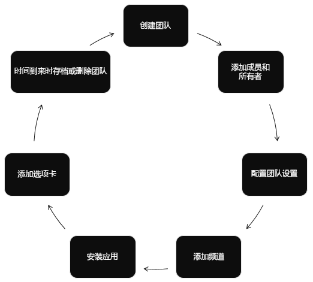

# Microsoft Teams API 概述

[Microsoft Teams](https://products.office.com/microsoft-teams) 是团队合作和智能通信的终极中心。[Microsoft Teams](https://products.office.com/) 基于超过 1.2 亿用户的 Microsoft 365 强度和规模，提供基于聊天的协作、会议、通话、企业语音功能。

> [!VIDEO https://www.youtube-nocookie.com/embed/KCvAhQEJmyY]

## 为什么与 Microsoft Teams 集成？

### 自动化团队生命周期

当出现新的业务问题时，使用 Microsoft Graph [创建一个新的虚拟团队](/graph/api/team-put-teams)，向团队[添加合适的人员](/graph/api/group-post-members)，并使用[渠道](/graph/api/channel-post)、[选项卡](/graph/api/teamstab-add)和[应用](/graph/api/teamsappinstallation-add)配置团队。
如果想要让新团队一起讨论业务问题，请在团队日历中[添加一个新事件](/graph/api/group-post-events)。

当业务问题得到解决且不再需要团队时，可使用 Microsoft Teams API 来[存档](/graph/api/team-archive)或[删除](/graph/api/group-delete)团队。 如果在创建团队时已了解团队的最长持续时间，则可为团队设置 [Microsoft 365 组过期策略](https://support.office.com/article/office-365-group-expiration-policy-8d253fe5-0e09-4b3c-8b5e-f48def064733?ui=en-US&rs=en-US&ad=US)，以便根据该策略自动删除团队。

### 即使在无人参与的情况下也可以完成工作

使用[应用程序权限](permissions-reference.md)在无人参与的情况下使用[团队](/graph/api/resources/team)、[渠道](/graph/api/resources/channel)和[选项卡](/graph/api/resources/teamstab)。 在客户下订单时创建一个新渠道。
在学年开始时为班级自动创建团队并在学年结束时对其存档。

### 创建链接到应用的团队

允许客户创建新[团队](/graph/api/resources/team)和[渠道](/graph/api/resources/channel)。 
在新团队中[安装](/graph/api/teamsappinstallation-add) [Teams 应用](/microsoftteams/platform/#pivot=home&panel=home-all)。 
在新渠道中[将应用绑定到选项卡](/graph/api/teamstab-add)。 
[将消息发送](/graph/api/channel-post-message)到链接回网站的渠道。

### 创建和管理多个团队和渠道

使用 Microsoft Graph，可以轻松地创建大型团队并使用用户和渠道对其进行填充，方法是自动化创建和管理[团队](/graph/api/resources/team)、[渠道](/graph/api/resources/channel)、[选项卡](/graph/api/resources/teamstab)和[应用](/graph/api/resources/teamsapp)。
Microsoft Graph 还允许用户[查找](teams-list-all-teams.md)和[存档](/graph/api/team-archive)不再使用的团队。 此 API 与构建 [Microsoft Teams 管理中心](/microsoftteams/enable-features-office-365)和 [Teams PowerShell commandlets](/microsoftteams/teams-powershell-overview) 的 API 相同。

### 向团队部署应用

[在租户中列出团队](teams-list-all-teams.md)，并向其[安装应用](/graph/api/teamsappinstallation-add)。 
在渠道中[创建选项卡](/graph/api/teamstab-add)，以使用户轻松访问应用。

### 在任何类型的应用中使用 Microsoft Graph

Microsoft Teams 应用为工作小组提供了一种新的工具，使协作成为一种更高效、更具吸引力的体验。 使用这些应用，工作组用户可共享资产、通过聊天进行交互，并在团队日历上安排事件。 这些应用还可以自动化团队、渠道和对话的创建，提高 Microsoft Teams 的价值。

可以创建在 Microsoft Teams 用户体验以外运行的网站、服务和本机平台应用程序，并调用 Teams API 以自动执行 Teams 方案。

**为 Microsoft Teams 启用的应用类型**

这些协作工具包括启用了 Microsoft Graph 的选项卡或在 Microsoft Teams 应用内运行的机器人。 此外，还可以在 Microsoft Teams 应用以外调用 Microsoft Graph，如从网站或者 Web 服务进行调用。 如果已为 Microsoft Graph 启用网站，则可以通过使用 [Microsoft Teams 开发人员平台](/microsoftteams/platform/#pivot=home&panel=home-all)创建[使用现有网站代码的选项卡](/microsoftteams/platform/concepts/tabs/tabs-overview)，将此项工作用于 Microsoft Teams。

Microsoft Teams API 可以增强 Teams 内部和外部的应用：

|应用类型|方案描述|
|:-------|:-------------------|
| [选项卡](/microsoftteams/platform/concepts/tabs/tabs-overview) |在 Microsoft Teams 中呈现内容。|
| [机器人](/microsoftteams/platform/concepts/bots/bots-overview) |帮助用户通过对话完成任务。|
| [连接器](/microsoftteams/platform/concepts/connectors/connectors) |将外部服务中的更新发布到渠道。|
| [可操作消息](/microsoftteams/platform/concepts/cards/cards) |将增强交互添加到连接器卡。|
| [消息扩展](/microsoftteams/platform/concepts/messaging-extensions) |允许用户查询和共享对话中的信息。|
|网站| 在网页中呈现增强的内容。|
|服务|通过 Web 服务使用 Microsoft Graph 数据增强客户端应用程序。|
| [活动源](/microsoftteams/platform/concepts/activity-feed)|通过源通知吸引用户。|
| [通话和联机会议（预览）](/graph/api/resources/communications-api-overview) |创建包含机器人的 Microsoft Teams 应用可以启动和参与音频/视频通话、基于互动语音响应 (IVR) 流路由/传输通话和参与联机会议。|

### 获取有关更改的通知

Microsoft Teams 支持订阅对[频道](/graph/api/resources/channel)和[聊天](/graph/api/resources/chat)中消息的更改（创建、更新和删除），以允许应用获得近乎即时的更新。 有关如何订阅更改的详细信息，请参阅[获取频道和聊天中消息的更改通知](teams-changenotifications-chatmessage.md)。

## API 参考

在查找此服务的 API 参考？

请参阅 [Microsoft Graph 中的 Teams API](/graph/api/resources/teams-api-overview)。

## 后续步骤

- 观看[概述视频](https://aka.ms/teamsgraph/v1/video)。
- 了解如何[使用 Microsoft Teams API](/graph/api/resources/teams-api-overview)。
- 深入了解[团队](/graph/api/resources/team)、[渠道](/graph/api/resources/channel)和[组](/graph/api/resources/group)资源的方法、属性和关系。
- 尝试 [Graph 浏览器](https://developer.microsoft.com/graph/graph-explorer)中的 API。
- 阅读更多有关 [Microsoft Teams 编程模型](/microsoftteams/platform/concepts/concepts-overview)的信息。
- 了解[云通信 API](/graph/api/resources/communications-api-overview)。
- 立即开始使用示例代码：[Contoso Airlines](https://github.com/microsoftgraph/contoso-airlines-teams-sample)、[C# mini-samples](https://github.com/microsoftgraph/csharp-teams-sample-graph)
