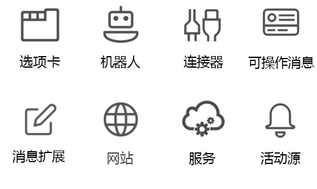

# Microsoft Teams 团队合作 API 概述

Microsoft Teams 是团队合作和智能通信的终极中心。 Microsoft Teams 基于 Office 365 超过 1.2 亿用户的实力和规模，提供了基于聊天的协作、会议、通话和企业语音功能。

## 为什么与 Microsoft Teams 集成？

与 Microsoft Teams 集成，可使你轻松构建自己的服务和应用，覆盖数百万的企业用户，并帮助人们协同工作。 你可以使用 Microsoft Graph 来创建和管理团队、渠道、消息等。

### 在任何类型的应用中使用 Microsoft Graph

在 Microsoft Graph 上构建的 Microsoft Teams 应用为工作小组提供了一种新的工具，使协作成为一种更高效、更具吸引力的体验。 使用 Microsoft Teams，工作组用户可共享资产、通过聊天进行交互，并在团队日历上安排事件。 通过基于 Microsoft Teams API 的应用添加团队、渠道和会话自动化，从而提高 Microsoft Teams 的价值。

网站、服务和本机平台应用程序不在 Microsoft Teams 用户体验中运行，但可用于调用 Microsoft Teams API 来支持 Microsoft Teams 自动化方案。

**为 Microsoft Teams 启用的应用类型**

这些协作工具包括启用了 Microsoft Graph 的选项卡或在 Microsoft Teams 内运行的机器人应用。 此外，还可以在 Microsoft Teams 应用以外调用 Microsoft Graph，如从网站或者 Web 服务进行调用。 如果已为 Microsoft Graph 启用网站，则可以通过使用 [Microsoft Teams 开发者平台](https://docs.microsoft.com/zh-CN/microsoftteams/platform/#pivot=home&panel=home-all)创建使用现有网站代码的选项卡应用，将此项工作用于 Microsoft Teams。

如果 Microsoft Teams 选项卡或机器人应用不是完成指定方案的理想方式，请选择以下应用类型之一。

|应用类型|方案描述|
|:-------|:-------------------|
|选项卡|Microsoft Teams 中的表面增强内容。|
|连接器|向渠道发布增强的更新。|
|可操作消息|将增强交互添加到连接器卡。|
|网站|网页中的表面增强内容。|
|机器人|帮助用户在对话中完成任务。|
|活动源|通过源通知吸引用户。|
|消息扩展|允许用户查询和共享对话中的增强卡。|
|服务|通过 Web 服务使用 Microsoft Graph 数据增强客户端应用程序。|

### 创建多个团队和渠道

允许客户创建链接到应用的新[团队](../api-reference/beta/resources/team.md)和[渠道](../api-reference/beta/resources/channel.md)。 通过使用 Microsoft Teams API，可以创建大量团队并使用户和渠道轻松填充它们。

### 自动化团队生命周期

当出现新的业务问题时，使用 Microsoft Graph 创建一个新的虚拟团队，用合适的人员[填充团队](../api-reference/v1.0/api/group_post_members.md)，并使用渠道配置团队。 若要围绕新业务问题进行一次团队渠道讨论，你可以使用新的对话线程来播种该渠道，以便向新团队成员发布欢迎消息。 如果想要让新团队一起讨论业务问题，请在团队日历中添加一个新事件，然后邀请团队成员参与事件。

当业务问题得到解决并不再需要虚拟团队时，可使用 Microsoft Teams API 来解散团队。 如果在创建虚拟团队时已了解虚拟团队的最长持续时间，则可为团队设置 [Office 365 组过期策略](https://support.office.com/en-us/article/office-365-group-expiration-policy-8d253fe5-0e09-4b3c-8b5e-f48def064733?ui=en-US&rs=en-US&ad=US)，以便根据该策略自动删除团队。

## 后续步骤

- 了解如何[使用 Microsoft Teams API](../api-reference/beta/resources/teams_api_overview.md)。
- 深入了解[团队](../api-reference/beta/resources/team.md)、[渠道](../api-reference/beta/resources/channel.md)和[组](.../api-reference/v1.0/resources/group.md)资源的方法、属性和关系。
- 尝试 [Graph 浏览器](https://developer.microsoft.com/zh-CN/graph/graph-explorer)中的 API。
- 阅读更多有关 [Microsoft Teams 编程模型](https://docs.microsoft.com/zh-CN/microsoftteams/platform/concepts/concepts-overview)的信息。
- 立即开始使用[示例代码](https://github.com/OfficeDev/microsoft-teams-sample-graph)。

