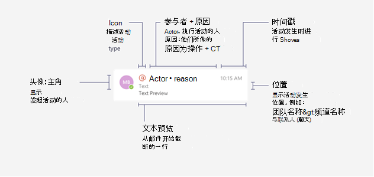
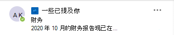
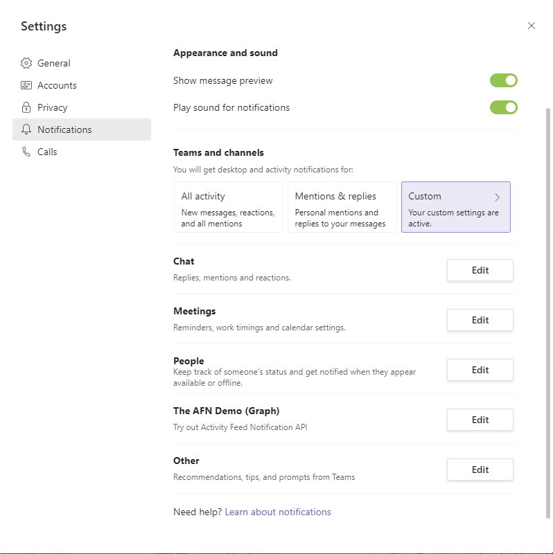

# <a name="send-activity-feed-notifications-to-users-in-microsoft-teams"></a>向用户发送活动源通知Microsoft Teams

通过Microsoft Teams活动源，用户可以通过通知用户更改来对需要关注的项目进行分类。 可以使用 Microsoft 应用中的活动源通知 API Graph将此功能扩展到你的应用。 这允许应用提供更丰富的体验，并且通过帮助用户了解其使用的工具和工作流中的更改，从而更好地吸引用户。

## <a name="understanding-the-basics-of-activity-feed-notification"></a>了解活动源通知的基础知识

活动源Microsoft Teams由多个信息位组成，一起显示，如下图所示。



这些组件包括：
- 发起活动的人
- 表示活动类型的图标
- 参与者执行活动的原因
- 文本预览
- 时间戳
- 活动的位置

以下示例演示这些组件如何一起提供有关通知的详细信息。 此示例是有关在社区中提及的用户Yammer通知。



## <a name="requirements-for-using-the-activity-feed-notification-apis"></a>使用活动源通知 API 的要求

活动源 API 用于Teams[应用](/microsoftteams/platform/overview)。 以下是发送活动源通知的要求：

- 应用Teams清单必须将 Azure AD 应用 ID 添加到 `webApplicationInfo` 部分中。 有关详细信息，请参阅 [清单架构](/microsoftteams/platform/resources/schema/manifest-schema)。
- 活动类型必须在 部分中 `activities` 声明。 有关详细信息，请参阅 [清单架构](/microsoftteams/platform/resources/schema/manifest-schema)。
- 必须Teams个人、团队或聊天中为收件人安装该应用程序。 [](/graph/api/resources/team?preserve-view=true) [](/graph/api/resources/chat?preserve-view=true) 有关详细信息，请参阅Teams[应用安装](/graph/api/resources/teamsappinstallation?preserve-view=true)。

### <a name="teams-app-manifest-changes"></a>Teams应用清单更改

本部分介绍需要添加到应用清单Teams的更改。 请注意，必须使用应用清单Teams[或](/microsoftteams/platform/resources/schema/manifest-schema) `1.7` 更高版本。

```json
"$schema": "https://developer.microsoft.com/json-schemas/teams/v1.7/MicrosoftTeams.schema.json",
"manifestVersion": "1.7",
````

#### <a name="webapplicationinfo-section-changes"></a>webApplicationInfo 部分更改

```json
"webApplicationInfo":
{
    "id": "a3111f15-658e-457c-9689-fd20fe907330",
    "resource": "https://contosoapp.com"
}
```

|参数|类型|说明|
|:---|:---|:---|
|id|string|Azure AD 应用 ID (客户端 ID) 。|
|resource|string|与 Azure AD 应用关联的资源。 也称为 Azure 门户中的回复或重定向 URL。|

> **注意：** 如果团队、聊天或用户Teams同一 Azure AD 应用 (，你) 收到错误。 确保你使用的是唯一的 Azure AD 应用。

#### <a name="activities-section-changes"></a>activities 节更改

```json
"activities":
{
  "activityTypes": [
    {
      "type": "taskCreated",
      "description": "Task Created Activity",
      "templateText": "{actor} created task {taskId} for you"
    },
    {
      "type": "approvalRequired",
      "description": "Deployment requires your approval",
      "templateText": "{actor} created a new deployment {deploymentId}"
    }
  ]
}
```

|参数|类型|说明|
|:---|:---|:---|
|类型|string|活动的类型。 这需在特定的清单中是唯一的。|
|说明|string|可读简短说明。 这将在客户端上Microsoft Teams显示。|
|templateText|字符串|活动通知的模板文本。 可以通过封装 中的参数来声明参数 `{}` 。|

>**注意：** `actor` 是一个始终采用调用方名称的特殊参数。 在委派呼叫中 `actor` ， 是用户名。 在仅应用程序调用中，它采用应用程序Teams的名称。

### <a name="installing-the-teams-app"></a>安装 Teams 应用

Teams应用可以安装在团队、聊天或用户个人中，并且可以通过多种方式分发。 有关详细信息，请参阅Teams[分配方法](/microsoftteams/platform/concepts/deploy-and-publish/overview)。 通常， [旁加载](/microsoftteams/platform/concepts/deploy-and-publish/apps-upload) 优先用于开发目的。 开发后，你可以根据是想要分发到一个租户还是所有租户来选择正确的分发方法。

此外，还可[Teams应用安装](/graph/api/resources/teamsappinstallation?preserve-view=true)API 来管理Teams安装。

## <a name="sending-activity-feed-notifications-to-users"></a>向用户发送活动源通知

由于Teams用户、团队或聊天中可以安装应用程序，因此也可在这三种上下文中发送通知：

- [在聊天中向用户发送通知](/graph/api/chat-sendactivitynotification)
- [向团队中的用户发送通知](/graph/api/team-sendactivitynotification)
- [向用户发送通知](/graph/api/userteamwork-sendactivitynotification)

有关每种方案支持哪些主题的详细信息，请参阅特定 API。 所有方案都支持基于文本的自定义主题。

### <a name="example-1-notify-a-user-about-a-task-created-in-a-chat"></a>示例 1：通知用户在聊天中创建的任务

此示例演示如何发送在聊天中创建的新任务的活动源通知。 在这种情况下，Teams应用必须安装在具有 Id 的聊天中，并且用户也必须是聊天的一 `chatId` `569363e2-4e49-4661-87f2-16f245c5d66a` 部分。

#### <a name="request"></a>请求
<!-- {
  "blockType": "request",
  "name": "chat_sendactivitynotification"
}
-->
``` http
POST https://graph.microsoft.com/beta/chats/{chatId}/sendActivityNotification
Content-Type: application/json

{
    "topic": {
        "source": "entityUrl",
        "value": "https://graph.microsoft.com/beta/chats/{chatId}"
    },
    "activityType": "taskCreated",
    "previewText": {
        "content": "New Task Created"
    },
    "recipient": {
        "@odata.type": "microsoft.graph.aadUserNotificationRecipient",
        "userId": "569363e2-4e49-4661-87f2-16f245c5d66a"
    },
    "templateParameters": [
        {
            "name": "taskId",
            "value": "12322"
        }
    ]
}
```

#### <a name="response"></a>响应
<!-- {
  "blockType": "response",
  "truncated": false
}
-->
``` http
HTTP/1.1 204 No Content
```

### <a name="example-2-notify-a-user-about-a-task-created-in-a-team"></a>示例 2：通知用户有关在团队中创建的任务

此示例演示如何发送团队的活动源通知。 此示例通知工作组所有者已创建的新任务，该任务需要工作组所有者注意。

#### <a name="request"></a>请求
<!-- {
  "blockType": "request",
  "name": "team_sendactivitynotification"
}
-->
``` http
POST https://graph.microsoft.com/beta/teams/{teamId}/sendActivityNotification
Content-Type: application/json

{
    "topic": {
        "source": "entityUrl",
        "value": "https://graph.microsoft.com/beta/teams/{teamId}"
    },
    "activityType": "taskCreated",
    "previewText": {
        "content": "New Task Created"
    },
    "recipient": {
        "@odata.type": "microsoft.graph.aadUserNotificationRecipient",
        "userId": "569363e2-4e49-4661-87f2-16f245c5d66a"
    },
    "templateParameters": [
        {
            "name": "taskId",
            "value": "12322"
        }
    ]
}
```

#### <a name="response"></a>响应
<!-- {
  "blockType": "response",
  "truncated": false
}
-->
``` http
HTTP/1.1 204 No Content
```

### <a name="example-3-notify-a-user-about-an-event-using-a-custom-topic"></a>示例 3：使用自定义主题通知用户事件

如前面的示例中所示，你可以链接到团队或聊天的不同方面。 但是，如果要链接到不是团队的一部分或不由 Microsoft Graph 表示的方面，或者如果你想要自定义名称，可以将 的源设置为 并传递自定义值。 `topic` `text` 此外， `webUrl` 在将 source 用作 时 `topic` 是必需的 `text` 。

前面Yammer的通知示例使用自定义主题，Yammer Microsoft Graph。

> **注意：** `webUrl`必须以域Microsoft Teams开始 (teams.microsoft.com 例如) 。

#### <a name="request"></a>请求
<!-- {
  "blockType": "request",
  "name": "team_sendactivitynotification"
}
-->
``` http
POST https://graph.microsoft.com/beta/teams/{teamId}/sendActivityNotification
Content-Type: application/json

{
    "topic": {
        "source": "text",
        "value": "Deployment Approvals Channel",
        "webUrl": "https://teams.microsoft.com/l/message/19:448cfd2ac2a7490a9084a9ed14cttr78c@thread.skype/1605223780000?tenantId=c8b1bf45-3834-4ecf-971a-b4c755ee677d&groupId=d4c2a937-f097-435a-bc91-5c1683ca7245&parentMessageId=1605223771864&teamName=Approvals&channelName=Azure%20DevOps&createdTime=1605223780000"
    },
    "activityType": "approvalRequired",
    "previewText": {
        "content": "New deployment requires your approval"
    },
    "recipient": {
        "@odata.type": "Microsoft.Teams.GraphSvc.aadUserNotificationRecipient",
        "userId": "569363e2-4e49-4661-87f2-16f245c5d66a"
    },
    "templateParameters": [
        {
            "name": "deploymentId",
            "value": "6788662"
        }
    ]
}
```

#### <a name="response"></a>响应
<!-- {
  "blockType": "response",
  "truncated": false
}
-->
``` http
HTTP/1.1 204 No Content
```

### <a name="example-4-notify-the-team-members-about-an-event"></a>示例 4：向团队成员通知事件

此示例演示如何向所有团队成员发送活动源通知。 本示例向团队成员通知新事件。 

> **注意：** 向所有团队成员发送通知的能力当前仅在 beta 版中可用。

#### <a name="request"></a>请求
<!-- {
  "blockType": "request",
  "name": "team_sendactivitynotification"
}
-->
``` http
POST https://graph.microsoft.com/beta/teams/7155e3c8-175e-4311-97ef-572edc3aa3db/sendActivityNotification
Content-Type: application/json

{
    "topic": {
        "source": "text",
        "value": "Weekly Virtual Social",
        "webUrl": "Teams webUrl"
    },
    "previewText": {
        "content": "It will be fun!"
    },
    "activityType": "eventCreated",
    "recipient": {
        "@odata.type": "microsoft.graph.teamMembersNotificationRecipient",
        "teamId": "7155e3c8-175e-4311-97ef-572edc3aa3db"
    }
}
```

#### <a name="response"></a>响应
<!-- {
  "blockType": "response",
  "truncated": false
}
-->
``` http
HTTP/1.1 204 No Content
```

### <a name="example-5-notify-the-channel-members-about-an-event"></a>示例 5：通知频道成员事件

此示例演示如何向所有频道成员发送活动源通知。 此示例向频道成员通知新事件。 

> **注意：** 向所有频道成员发送通知的能力当前仅在 beta 版中可用。

#### <a name="request"></a>请求
<!-- {
  "blockType": "request",
  "name": "team_sendactivitynotification"
}
-->
``` http
POST https://graph.microsoft.com/beta/teams/7155e3c8-175e-4311-97ef-572edc3aa3db/sendActivityNotification
Content-Type: application/json

{
    "topic": {
        "source": "text",
        "value": "Weekly Virtual Social",
        "webUrl": "Teams webUrl"
    },
    "previewText": {
        "content": "It will be fun!"
    },
    "activityType": "eventCreated",
    "recipient": {
        "@odata.type": "microsoft.graph.channelMembersNotificationRecipient",
        "teamId": "7155e3c8-175e-4311-97ef-572edc3aa3db",
        "channelId": "19:0ea5de04de4743bcb4cd20cb99235d99@thread.tacv2"
    }
}
```

#### <a name="response"></a>响应
<!-- {
  "blockType": "response",
  "truncated": false
}
-->
``` http
HTTP/1.1 204 No Content
```

### <a name="example-6-notify-the-chat-members-about-an-event"></a>示例 6：向聊天成员通知事件

此示例演示如何向所有聊天成员发送活动源通知。 此示例向聊天成员通知新事件。 

> **注意：** 向所有聊天成员发送通知的能力当前仅在 beta 版中可用。

#### <a name="request"></a>请求
<!-- {
  "blockType": "request",
  "name": "chat_sendactivitynotification"
}
-->

``` http
POST https://graph.microsoft.com/beta/chats/19:d65713bc498c4a428c71ef9353e6ce20@thread.v2/sendActivityNotification
Content-Type: application/json

{
    "topic": {
        "source": "text",
        "value": "Weekly Virtual Social",
        "webUrl": "Teams webUrl"
    },
    "previewText": {
        "content": "It will be fun!"
    },
    "activityType": "eventCreated",
    "recipient": {
        "@odata.type": "microsoft.graph.chatMembersNotificationRecipient",
        "chatId": "19:d65713bc498c4a428c71ef9353e6ce20@thread.v2"
    }
}
```

#### <a name="response"></a>响应
<!-- {
  "blockType": "response",
  "truncated": false
}
-->
``` http
HTTP/1.1 204 No Content
```

## <a name="customizing-how-the-notifications-alert-you"></a>自定义通知通知的提醒

Microsoft Teams用户可以自定义其订阅源中作为横幅显示的通知，等等。 还可以自定义通过活动源 API 生成的通知。 用户可以选择通过 Microsoft Teams 中的设置通知他们Microsoft Teams。 Teams应用将显示在列表中供用户选择，如以下屏幕截图所示。



用户可以单击 **应用** 旁边的"编辑"并自定义通知，如以下示例所示。 将显示 `description` 应用程序Teams中的字段。


## <a name="faqs"></a>常见问题解答

### <a name="who-needs-to-install-the-teams-app"></a>Who安装应用Teams？

目标用户必须安装Teams通知的应用。

### <a name="can-a-user-send-notifications-to-themselves"></a>用户能否向自己发送通知？

否，用户无法向自己发送通知。 对于此方案，请使用应用程序权限。

### <a name="can-a-teams-app-control-how-the-notifications-are-shown-to-the-user"></a>应用Teams控制如何向用户显示通知？

否，仅允许用户更改通知设置。

### <a name="i-installed-my-app-why-dont-i-see-notification-settings-under-the-user-account"></a>我安装了应用，为什么我在用户帐户下看不到通知设置？

设置将在应用发送第一个通知Teams显示。 这将减少用户看到的设置数。

### <a name="i-started-getting-a-409-conflict-error-how-do-i-resolve-it"></a>我开始收到 409 (冲突) 错误，如何解决该问题？

`Conflict`错误主要发生在Teams安装在同一作用域中的多个 (应用（团队、聊天、用户等) 清单部分具有相同的 Azure AD appId）。 `webApplicationInfo` 发生这种情况时，你将看到一个错误，如 `Found multiple applications with the same Azure AD App ID 'Your AzureAD AppId'.` 。 请确保将唯一的 Azure AD 应用用于唯Teams应用。 请注意，可以在多个范围Teams团队 + 用户安装 (应用，例如) 。

## <a name="see-also"></a>另请参阅

[使用活动源Microsoft Teams的最佳实践](activity-feed-notifications-best-practices.md)。