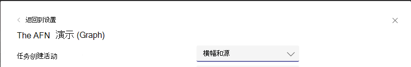

# <a name="send-activity-feed-notifications-to-users-in-microsoft-teams"></a>在Microsoft Teams中向用户发送活动源通知

通过Microsoft Teams活动源，用户可以通过通知用户更改来对需要注意的项进行会审。 可以使用 Microsoft Graph 中的活动源通知 API 将此功能扩展到应用。 这使你的应用能够提供更丰富的体验，并通过帮助用户随时了解他们使用的工具和工作流的更改，从而更好地吸引用户。

## <a name="understanding-the-basics-of-activity-feed-notification"></a>了解活动源通知的基础信息

Microsoft Teams中的活动源通知由多个信息位组成，一起显示，如下图所示。


组件包括：
- 发起活动的执行组件
- 代表活动类型的图标
- 行动者执行活动的原因
- 文本预览
- 时间戳
- 活动位置

以下示例演示这些组件如何一起提供有关通知的详细信息。 此示例是有关Yammer社区中提到的用户的通知。


## <a name="requirements-for-using-the-activity-feed-notification-apis"></a>使用活动源通知 API 的要求

活动源 API 适用于[Teams应用](/microsoftteams/platform/overview)。 以下是发送活动源通知的要求：

- Teams应用清单必须将 Azure AD 应用 ID 添加到该`webApplicationInfo`部分。 有关详细信息，请参阅 [清单架构](/microsoftteams/platform/resources/schema/manifest-schema)。
- 活动类型必须在节中 `activities` 声明。 有关详细信息，请参阅 [清单架构](/microsoftteams/platform/resources/schema/manifest-schema)。
- 必须为收件人安装Teams应用，无论是个人还是[在团队](/graph/api/resources/team?preserve-view=true)或[聊天](/graph/api/resources/chat?preserve-view=true)中，他们都是其中的一部分。 有关详细信息，请参阅[Teams应用安装](/graph/api/resources/teamsappinstallation?preserve-view=true)。

### <a name="teams-app-manifest-changes"></a>Teams应用清单更改

本部分介绍需要添加到应用清单Teams更改。 请注意，必须使用[Teams应用清单](/microsoftteams/platform/resources/schema/manifest-schema)版本或更高版本`1.7`。

```json
"$schema": "https://developer.microsoft.com/json-schemas/teams/v1.7/MicrosoftTeams.schema.json",
"manifestVersion": "1.7",
````

#### <a name="webapplicationinfo-section-changes"></a>webApplicationInfo 部分更改

```json
"webApplicationInfo":
{
    "id": "a3111f15-658e-457c-9689-fd20fe907330",
    "resource": "https://contosoapp.com"
}
```

|参数|类型|说明|
|:---|:---|:---|
|id|string|Azure AD 应用 ID (客户端 ID) 。|
|resource|string|与 Azure AD 应用关联的资源。 也称为 Azure 门户中的回复或重定向 URL。|

> **注意：** 如果团队、聊天或用户) 在同一范围内的多个 (Teams应用使用同一 Azure AD 应用，则可能会出现错误。 确保使用的是唯一的 Azure AD 应用。

#### <a name="activities-section-changes"></a>活动部分更改

```json
"activities":
{
  "activityTypes": [
    {
      "type": "taskCreated",
      "description": "Task Created Activity",
      "templateText": "{actor} created task {taskId} for you"
    },
    {
      "type": "approvalRequired",
      "description": "Deployment requires your approval",
      "templateText": "{actor} created a new deployment {deploymentId}"
    }
  ]
}
```

|参数|类型|描述|
|:---|:---|:---|
|类型|string|活动的类型。 这需要在特定清单中是唯一的。|
|说明|string|人为可读的简短说明。 这将在Microsoft Teams客户端上可见。|
|templateText|string|活动通知的模板文本。 可以通过封装参数来声明参数 `{}`。|

>**注意：** `actor` 是始终采用调用方名称的特殊参数。 在委托的调用中， `actor` 是用户的名称。 在仅限应用程序的调用中，它采用Teams应用的名称。

### <a name="installing-the-teams-app"></a>安装Teams应用

Teams应用可以安装在团队、聊天或用户个人中，并且可以通过多种方式进行分发。 有关详细信息，请参阅[Teams应用分发方法](/microsoftteams/platform/concepts/deploy-and-publish/overview)。 通常， [旁加载](/microsoftteams/platform/concepts/deploy-and-publish/apps-upload) 是用于开发目的的首选。 开发后，可以选择正确的分发方法，具体取决于是要分发到一个租户还是要分配给所有租户。

还可以使用[Teams应用安装](/graph/api/resources/teamsappinstallation?preserve-view=true) API 来管理Teams应用安装。

## <a name="sending-activity-feed-notifications-to-users"></a>向用户发送活动源通知

由于可以为用户、团队或聊天中安装Teams应用，因此也可以在以下三个上下文中发送通知：

- [在聊天中向用户发送通知](/graph/api/chat-sendactivitynotification)
- [向团队中的用户发送通知](/graph/api/team-sendactivitynotification)
- [向用户发送通知](/graph/api/userteamwork-sendactivitynotification)

此外，一次最多可以向 100 个用户批量发送通知：

* [批量向多个用户发送通知](/graph/api/teamwork-sendactivitynotificationtorecipients)

有关每个方案支持哪些主题的详细信息，请参阅特定 API。 所有方案都支持自定义基于文本的主题。

> **注意：** 活动图标基于发出请求的上下文。 如果请求是使用委派权限发出的，则用户的照片将显示为头像，而Teams应用图标将显示为活动图标。 在仅限应用程序的上下文中，Teams应用图标用作头像，活动图标被省略。

### <a name="example-1-notify-a-user-about-a-task-created-in-a-chat"></a>示例 1：通知用户在聊天中创建的任务

此示例演示如何为聊天中创建的新任务发送活动源通知。 在这种情况下，必须使用 ID `chatId` 在聊天中安装Teams应用，并且用户`569363e2-4e49-4661-87f2-16f245c5d66a`也必须是聊天的一部分。

#### <a name="request"></a>请求
<!-- {
  "blockType": "request",
  "name": "chat_sendactivitynotification"
}
-->
``` http
POST https://graph.microsoft.com/beta/chats/{chatId}/sendActivityNotification
Content-Type: application/json

{
    "topic": {
        "source": "entityUrl",
        "value": "https://graph.microsoft.com/beta/chats/{chatId}"
    },
    "activityType": "taskCreated",
    "previewText": {
        "content": "New Task Created"
    },
    "recipient": {
        "@odata.type": "microsoft.graph.aadUserNotificationRecipient",
        "userId": "569363e2-4e49-4661-87f2-16f245c5d66a"
    },
    "templateParameters": [
        {
            "name": "taskId",
            "value": "12322"
        }
    ]
}
```

#### <a name="response"></a>响应
<!-- {
  "blockType": "response",
  "truncated": false
}
-->
``` http
HTTP/1.1 204 No Content
```

### <a name="example-2-notify-a-user-about-a-task-created-in-a-team"></a>示例 2：向用户通知有关在团队中创建的任务

此示例演示如何为团队发送活动源通知。 此示例向团队所有者通知有关创建的新任务，该任务需要他们注意。

#### <a name="request"></a>请求
<!-- {
  "blockType": "request",
  "name": "team_sendactivitynotification"
}
-->
``` http
POST https://graph.microsoft.com/beta/teams/{teamId}/sendActivityNotification
Content-Type: application/json

{
    "topic": {
        "source": "entityUrl",
        "value": "https://graph.microsoft.com/beta/teams/{teamId}"
    },
    "activityType": "taskCreated",
    "previewText": {
        "content": "New Task Created"
    },
    "recipient": {
        "@odata.type": "microsoft.graph.aadUserNotificationRecipient",
        "userId": "569363e2-4e49-4661-87f2-16f245c5d66a"
    },
    "templateParameters": [
        {
            "name": "taskId",
            "value": "12322"
        }
    ]
}
```

#### <a name="response"></a>响应
<!-- {
  "blockType": "response",
  "truncated": false
}
-->
``` http
HTTP/1.1 204 No Content
```

### <a name="example-3-notify-a-user-about-an-event-using-a-custom-topic"></a>示例 3：使用自定义主题通知用户有关事件的信息

如前面的示例中所示，可以链接到团队或聊天的不同方面。 但是，如果要链接到不属于团队的某个方面，或者未由 Microsoft Graph 表示，或者要自定义名称，则可以设置该名称的`topic``text`源，并为其传递自定义值。 此外， `webUrl` 在使用 `topic` 源时是必需的 `text`。

前面显示的Yammer通知示例使用自定义主题，因为 Microsoft Graph 不支持Yammer的资源。

> **注意：** `webUrl`必须从Microsoft Teams域 (teams.microsoft.com（例如) ）开始。

#### <a name="request"></a>请求
<!-- {
  "blockType": "request",
  "name": "team_sendactivitynotification"
}
-->
``` http
POST https://graph.microsoft.com/beta/teams/{teamId}/sendActivityNotification
Content-Type: application/json

{
    "topic": {
        "source": "text",
        "value": "Deployment Approvals Channel",
        "webUrl": "https://teams.microsoft.com/l/message/19:448cfd2ac2a7490a9084a9ed14cttr78c@thread.skype/1605223780000?tenantId=c8b1bf45-3834-4ecf-971a-b4c755ee677d&groupId=d4c2a937-f097-435a-bc91-5c1683ca7245&parentMessageId=1605223771864&teamName=Approvals&channelName=Azure%20DevOps&createdTime=1605223780000"
    },
    "activityType": "approvalRequired",
    "previewText": {
        "content": "New deployment requires your approval"
    },
    "recipient": {
        "@odata.type": "microsoft.graph.aadUserNotificationRecipient",
        "userId": "569363e2-4e49-4661-87f2-16f245c5d66a"
    },
    "templateParameters": [
        {
            "name": "deploymentId",
            "value": "6788662"
        }
    ]
}
```

#### <a name="response"></a>响应
<!-- {
  "blockType": "response",
  "truncated": false
}
-->
``` http
HTTP/1.1 204 No Content
```

### <a name="example-4-notify-the-team-members-about-an-event"></a>示例 4：通知团队成员有关事件的信息

此示例演示如何向所有团队成员发送活动源通知。 此示例将新事件通知团队成员。 

> **注意：** 向所有团队成员发送通知的功能目前仅在 beta 中可用。

#### <a name="request"></a>请求
<!-- {
  "blockType": "request",
  "name": "team_sendactivitynotification"
}
-->
``` http
POST https://graph.microsoft.com/beta/teams/7155e3c8-175e-4311-97ef-572edc3aa3db/sendActivityNotification
Content-Type: application/json

{
    "topic": {
        "source": "text",
        "value": "Weekly Virtual Social",
        "webUrl": "Teams webUrl"
    },
    "previewText": {
        "content": "It will be fun!"
    },
    "activityType": "eventCreated",
    "recipient": {
        "@odata.type": "microsoft.graph.teamMembersNotificationRecipient",
        "teamId": "7155e3c8-175e-4311-97ef-572edc3aa3db"
    }
}
```

#### <a name="response"></a>响应
<!-- {
  "blockType": "response",
  "truncated": false
}
-->
``` http
HTTP/1.1 204 No Content
```

### <a name="example-5-notify-the-channel-members-about-an-event"></a>示例 5：通知频道成员有关事件的信息

此示例演示如何向所有通道成员发送活动源通知。 此示例将新事件通知频道成员。 

> **注意：** 向所有频道成员发送通知的功能目前仅在 beta 中可用。

#### <a name="request"></a>请求
<!-- {
  "blockType": "request",
  "name": "team_sendactivitynotification"
}
-->
``` http
POST https://graph.microsoft.com/beta/teams/7155e3c8-175e-4311-97ef-572edc3aa3db/sendActivityNotification
Content-Type: application/json

{
    "topic": {
        "source": "text",
        "value": "Weekly Virtual Social",
        "webUrl": "Teams webUrl"
    },
    "previewText": {
        "content": "It will be fun!"
    },
    "activityType": "eventCreated",
    "recipient": {
        "@odata.type": "microsoft.graph.channelMembersNotificationRecipient",
        "teamId": "7155e3c8-175e-4311-97ef-572edc3aa3db",
        "channelId": "19:0ea5de04de4743bcb4cd20cb99235d99@thread.tacv2"
    }
}
```

#### <a name="response"></a>响应
<!-- {
  "blockType": "response",
  "truncated": false
}
-->
``` http
HTTP/1.1 204 No Content
```

### <a name="example-6-notify-the-chat-members-about-an-event"></a>示例 6：通知聊天成员有关事件的信息

此示例演示如何向所有聊天成员发送活动源通知。 此示例将新事件通知聊天成员。 

> **注意：** 向所有聊天成员发送通知的功能目前仅在 beta 中可用。

#### <a name="request"></a>请求
<!-- {
  "blockType": "request",
  "name": "chat_sendactivitynotification"
}
-->

``` http
POST https://graph.microsoft.com/beta/chats/19:d65713bc498c4a428c71ef9353e6ce20@thread.v2/sendActivityNotification
Content-Type: application/json

{
    "topic": {
        "source": "text",
        "value": "Weekly Virtual Social",
        "webUrl": "Teams webUrl"
    },
    "previewText": {
        "content": "It will be fun!"
    },
    "activityType": "eventCreated",
    "recipient": {
        "@odata.type": "microsoft.graph.chatMembersNotificationRecipient",
        "chatId": "19:d65713bc498c4a428c71ef9353e6ce20@thread.v2"
    }
}
```

#### <a name="response"></a>响应
<!-- {
  "blockType": "response",
  "truncated": false
}
-->
``` http
HTTP/1.1 204 No Content
```

### <a name="example-7-notify-multiple-users-about-pending-finance-approval-requests"></a>示例 7：通知多个用户有关挂起的财务审批请求

以下示例演示如何批量向多个用户发送活动源通知。 此示例通知多个利益干系人有关挂起的财务审批请求。

> **注意：** 目前只能在 beta 中批量向多个用户发送通知。

#### <a name="request"></a>请求

<!-- {
  "blockType": "request",
  "name": "teamwork_sendactivitynotificationtorecipients"
}
-->

``` http
POST https://graph.microsoft.com/beta/teamwork/sendActivityNotificationToRecipients
Content-Type: application/json

{
    "topic": {
        "source": "entityUrl",
        "value": "https://graph.microsoft.com/beta/appCatalogs/teamsApps/{teamsAppId}"
    },
    "activityType": "pendingFinanceApprovalRequests",
    "previewText": {
        "content": "Internal spending team has a pending finance approval requests"
    },
    "recipients": [
        {
            "@odata.type": "microsoft.graph.aadUserNotificationRecipient",
            "userId": "569363e2-4e49-4661-87f2-16f245c5d66a"
        },
        {
            "@odata.type": "microsoft.graph.aadUserNotificationRecipient",
            "userId": "ab88234e-0874-477c-9638-d144296ed04f"
        },
        {
            "@odata.type": "microsoft.graph.aadUserNotificationRecipient",
            "userId": "01c64f53-69aa-42c7-9b7f-9f75195d6bfc"
        }
    ],
    "templateParameters": [
        {
            "name": "pendingRequestCount",
            "value": "5"
        }
    ] 
}
```

#### <a name="response"></a>响应

<!-- {
  "blockType": "response",
  "truncated": false
}
-->

``` http
HTTP/1.1 202 Accepted
```

## <a name="customizing-how-the-notifications-alert-you"></a>自定义通知警报方式

Microsoft Teams用户可以自定义他们在源中看到的通知、横幅等。 也可以自定义通过活动源 API 生成的通知。 用户可以选择如何通过Microsoft Teams中的设置通知他们。 Teams应用将显示在列表中供用户选择，如以下屏幕截图所示。


用户可以单击应用旁边的 **“编辑** ”并自定义通知，如以下示例所示。 将`description`显示Teams应用清单中的字段。



## <a name="faqs"></a>常见问题解答

### <a name="who-needs-to-install-the-teams-app"></a>Who需要安装Teams应用？

目标用户必须安装发送通知的Teams应用。

### <a name="can-a-user-send-notifications-to-themselves"></a>用户是否可以向自己发送通知？

否，用户无法向自己发送通知。 对于此方案，请使用应用程序权限。

### <a name="can-a-teams-app-control-how-the-notifications-are-shown-to-the-user"></a>Teams应用是否可以控制如何向用户显示通知？

否，仅允许用户更改通知设置。

### <a name="i-installed-my-app-why-dont-i-see-notification-settings-under-the-user-account"></a>我安装了我的应用，为什么在用户帐户下看不到通知设置？

设置将在Teams应用发送第一个通知后显示。 这会减少用户看到的设置数。

### <a name="i-started-getting-a-409-conflict-error-how-do-i-resolve-it"></a>我开始收到 409 (冲突) 错误，如何解决它？

`Conflict`当多个Teams应用安装在同一范围 (团队、聊天、用户等) 清单部分具有`webApplicationInfo`相同的 Azure AD appId 时，主要会发生错误。 发生这种情况时，你会收到一个错误，例如 `Found multiple applications with the same Azure AD App ID 'Your AzureAD AppId'.`。 确保对唯一的Teams应用使用唯一的 Azure AD 应用。 请注意，可以将相同的Teams应用安装在多个范围 (团队 + 用户，例如) 。

## <a name="see-also"></a>另请参阅

* [使用Microsoft Teams活动源通知的最佳做法](teams-activity-feed-notifications-best-practices.md)
* [为Microsoft Teams设计活动源通知](/microsoftteams/platform/concepts/design/activity-feed-notifications?tabs=mobile)
