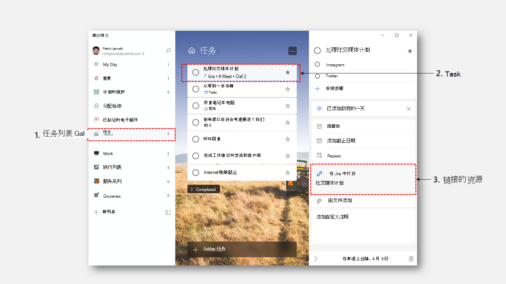

# 微软待办 API 概述
微软待办提供了一种简单的方法便于用户管理其任务和计划日常工作。 任务以任务列表形式组织，可以从任何设备跨微软待办客户端、Outlook 和 Teams 访问。

**微软待办 Windows 应用**

## 为什么与微软待办集成？

### 轻松整理和跟踪任务
微软待办可帮助你为任何内容创建列表，从工作分配到家庭项目再到杂货。 可通过添加提醒、截止日期和备注来跟踪最后期限。 可使用适用于 iOS、Android、Mac、Windows 和 Web 的微软待办应用从任意位置访问列表。 

### 跨 Microsoft 365 集成
微软待办是 Microsoft 365 中唯一存放个人任务的位置。 因此，它与 Microsoft 365 中心、Outlook 和 Teams 紧密集成。 在这些产品中创建的任务将与微软待办同步，以便你可以跨设备访问和管理它们。 微软待办集成可以帮助你吸引数百万使用微软待办的用户将 Outlook 和 Teams 中的任务收集到一个集成视图中。  

### 支持使用链接的资源完成任务
微软待办提供了一个称为“_链接的资源_”的新实体，你可以使用该实体创建可链接回其原始源的任务。 可通过创建链接到你的产品或服务的任务，使用此功能在你的工作流中无缝集成微软待办。 

## 常用微软待办 API 操作

|操作|请求|
|:--------|:--|
| 列出所有任务列表 | 获取 https://graph.microsoft.com/v1.0/me/todo/lists |
| 列出任务列表中的所有任务 | 获取 https://graph.microsoft.com/v1.0/me/todo/lists/{todoTaskListId}/tasks |
| 创建新任务 | 发布 https://graph.microsoft.com/v1.0/me/todo/lists/{todoTaskListId}/tasks |
| 更新任务 | 修补 https://graph.microsoft.com/v1.0/me/todo/lists/{todoTaskListId}/tasks/{todoTaskId} |
| 删除任务 | 删除 https://graph.microsoft.com/v1.0/me/todo/lists/{todoTaskListId}/tasks/{todoTaskId} |

## API 参考
在查找此服务的 API 参考？

- [Microsoft Graph 中的微软待办 API](/graph/api/resources/todo-overview)
