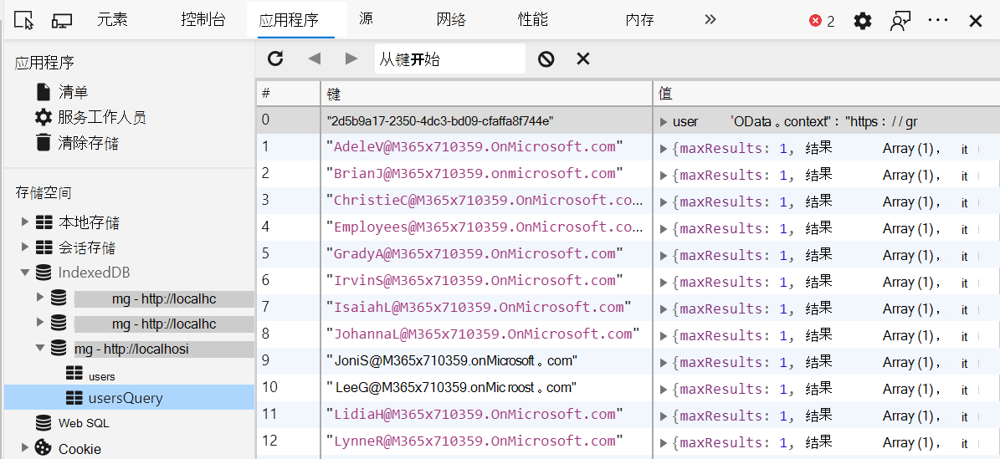

# <a name="microsoft-graph-toolkit-caching"></a>Microsoft Graph Toolkit缓存

Microsoft Graph Toolkit支持缓存选择 Microsoft Graph API 调用。 呼叫按实体（如人员、联系人、照片）进行缓存。 这允许一个组件检索数据和其他组件以重复使用它，而无需调用 Microsoft Graph。

> [!TIP]
> 有关每个组件缓存哪些实体的信息，请参阅组件的文档。

由 mgt 创建的用于缓存的数据库的前缀为 `mgt-` 。 每个实体的数据都存储在单独的对象存储中。 若要检查缓存，请使用开发人员面板中的"应用程序"选项卡 (F12 工具) - 在"存储"部分下，单击 **"IndexedDB"** 选项卡。  



## <a name="cache-configuration"></a>缓存配置

可以通过静态类对象读取和写入缓存 `CacheService.config` 选项。 它的格式如下所示。

```TypeScript
let config = {
  defaultInvalidationPeriod: number,
  isEnabled: boolean,
  people: {
    invalidationPeriod: number,
    isEnabled: boolean
  },
  photos: {
    invalidationPeriod: number,
    isEnabled: boolean
  },
  users: {
    invalidationPeriod: number,
    isEnabled: boolean
  },
  presence: {
    invalidationPeriod: number,
    isEnabled: boolean
  },
  groups: {
    invalidationPeriod: number,
    isEnabled: boolean
  },
  response: {
    invalidationPeriod: number,
    isEnabled: boolean
  },
  files: {
    invalidationPeriod: number,
    isEnabled: boolean
  },
  fileLists: {
    invalidationPeriod: number,
    isEnabled: boolean
  }
};
```

在 config 对象中，单个缓存无效时段默认为 ，默认为 60 分钟内的常规值 `null` `defaultInvalidationPeriod` 3，600，000 ms (60 分钟) 。 传入的任何值 `config.x.invalidationPeriod` 都将替代 `defaultInvalidationPeriod` 。

状态存储是唯一的例外，其默认值为 300000 毫秒（即 5 分钟）。

### <a name="examples"></a>示例

若要单独禁用存储，只需将存储的 config 属性的值设置为 `isEnabled` false：
```JavaScript
import { CacheService } from '@microsoft/mgt';

CacheService.config.users.isEnabled = false;
```
禁用缓存不会 **清除** 缓存。

更改失效期类似：

```JavaScript
import { CacheService } from '@microsoft/mgt';

CacheService.config.users.invalidationPeriod = 1800000;
```

## <a name="clearing-the-cache"></a>清除缓存

当用户退出时，将自动清除缓存。也可以手动清除它。

如果清除缓存中所有的存储，类的 方法将清除 CacheService 维护的所有 `clearCaches()` `CacheService` 存储。

```JavaScript
import { CacheService } from '@microsoft/mgt';

CacheService.clearCaches();
```

## <a name="creating-your-own-cache-stores"></a>创建自己的缓存存储

如果要为自定义组件创建和填充自己的缓存存储，可以使用静态 `CacheService` 类。

```JavaScript
CacheService.getCache(schema: CacheSchema, storeName: String);
```
> **注意：** 调用 `storeName` 中引用的 必须与 `getCache()` 对象中列出的存储之一 `CacheSchema` 匹配。

对象 `CacheSchema` 是键/值对的字典。

```TypeScript
import { CacheSchema } from '@microsoft/mgt';
const cacheSchema: CacheSchema = {
  name: string,
  stores: {
    store1: {},
    store2: {},
    ...
  },
  version: number
};
```

以下示例演示缓存实现。

```TypeScript
import { CacheItem, CacheSchema, CacheService, CacheStore } from '@microsoft/mgt';

const cacheSchema: CacheSchema = {
  name: 'users',
  stores: {
    users: {},
    usersQuery: {}
  },
  version: 1
};

interface CacheUser extends CacheItem {
  user?: string;
}

// retrieves invalidation time from cache config
const getUserInvalidationTime = (): number =>
  CacheService.config.users.invalidationPeriod || CacheService.config.defaultInvalidationPeriod;

// checks for if cache is enabled
const usersCacheEnabled = (): boolean => CacheService.config.users.isEnabled && CacheService.config.isEnabled;

// declare the desired cache store
let cache: CacheStore<CacheUser>

// check if the cache is enabled
if (usersCacheEnabled()) {
  cache = CacheService.getCache<CacheUser>(cacheSchema, 'users');
  const user = await cache.getValue(query);

  // check if an item is retrieved, and if it's not expired
  if (user && getUserInvalidationTime() > Date.now() - user.timeCached) {
    return JSON.parse(user.user);
  }
}

// graph call
const graphRes = graph
  .api('me')
  .middlewareOptions(prepScopes('user.read'))
  .get();

// store graph result into the cache if cache is enabled
if (usersCacheEnabled()) {
  cache.putValue(userId, { user: JSON.stringify(graphRes) });
}
```
