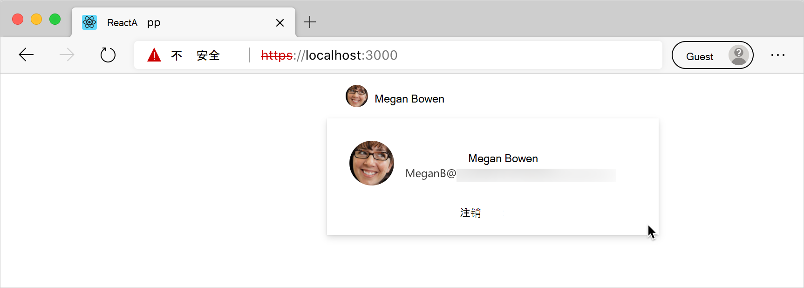

# <a name="use-the-microsoft-graph-toolkit-with-react"></a>将 Microsoft Graph Toolkit与 React

Microsoft Graph Toolkit 是一组 Web 组件，可简化连接到 Microsoft Graph并让你专注于应用程序。 Microsoft Graph Toolkit作为一组通过 npm 包分发的常规 `@microsoft/mgt` Web 组件提供。

如果你使用 React 生成应用，可以使用 包 ，它将 Microsoft [ `@microsoft/mgt-react` ](./mgt-react.md)Graph Toolkit Web 组件包装在 React 组件中，并更轻松地传递复杂数据。

本文介绍使用 Microsoft Graph Toolkit创建应用并React应用并连接到Microsoft 365。 完成这些步骤后，你将拥有一个React应用，该应用显示当前登录用户即将从 Microsoft 365。

## <a name="prerequisites"></a>先决条件

若要按照本文中的步骤操作，你需要一个Microsoft 365和一些工具。 有关详细信息，请参阅 [入门](./overview.md)。

## <a name="create-a-react-app"></a>创建React应用

通过运行React创建新的应用程序应用程序。 这将使用 TypeScript React一个新的应用，这将帮助你编写更可靠的代码并避免运行时错误。

```Command Line
npx create-react-app my-m365-app --template typescript --use-npm
```

将工作目录更改为新创建的应用。

```Command Line
cd my-m365-app
```

接下来，安装 `mgt-react` npm 包，其中包含 Microsoft Graph Toolkit React组件。

```Command Line
npm i @microsoft/mgt-react
```

同时安装 `mgt-msal2-provider` `mgt-element` 和 npm 包，其中包含 MSAL 2.0 身份验证提供程序。

```Command Line
npm i @microsoft/mgt-element @microsoft/mgt-msal2-provider
```

确认你可以运行该应用。

```Command Line
npm start
```

你应该能够通过 在浏览器中打开你的应用 `http://localhost:3000` 。

[!INCLUDE [AAD with implicit flow app registration](../includes/aad-app-registration-spa.md)]

## <a name="connect-react-app-to-microsoft-365"></a>连接 React应用Microsoft 365

现在，你已经使用 Azure AD Azure Active Directory (注册) ，你可以将 React 应用连接到 Microsoft 365。 首先，允许用户使用其 Microsoft 帐户登录应用。

### <a name="copy-the-azure-ad-application-registration-id"></a>复制 Azure AD 应用程序注册 ID

1. 在 Azure 门户中，转到应用程序注册。
1. 验证是否位于"概述 **"** 页上。
1. 从 **Essentials** 部分，复制 Application **(client) ID** 属性的值

### <a name="configure-the-microsoft-graph-toolkit-authentication-provider"></a>配置 Microsoft Graph Toolkit身份验证提供程序

接下来，配置 Microsoft Graph Toolkit使用的身份验证提供程序。 在这种情况下，你将使用 MSAL，这是生成独立应用程序的好默认值。 如果使用扩展点中的任意扩展点Microsoft 365，Teams或SharePoint[提供程序。](../providers/providers.md)

>[!NOTE] 
>如果当前正在使用 MSAL 提供程序，并且要更新到 MSAL 2 提供程序，请按照 [MSAL 2](../providers/msal2.md#migrating-from-msal-provider-to-msal-2-provider) 提供程序文章中的步骤操作。

1. 在代码编辑器中，打开 **"src/index"。** 文件，并添加到导入列表，添加：

    ```TypeScript
    import { Providers } from '@microsoft/mgt-element';
    import { Msal2Provider } from '@microsoft/mgt-msal2-provider';
    ```

1. 最后一 `import` 个语句之后，使用 MSAL Graph Toolkit Microsoft 应用程序。

    ```TypeScript
    Providers.globalProvider = new Msal2Provider({
      clientId: 'REPLACE_WITH_CLIENTID'
    });
    ```

    将 属性的值替换为之前在 Azure 门户中 `clientId` `Application (client) ID` 复制的属性的值。

通过这些更改 **，src/index.tsx** 文件将如下所示。

  ```tsx
  import React from 'react';
  import ReactDOM from 'react-dom';
  import App from './App';
  import './index.css';
  import * as serviceWorker from './serviceWorker';

  import { Providers } from '@microsoft/mgt-element';
  import { Msal2Provider } from '@microsoft/mgt-msal2-provider';
  
  Providers.globalProvider = new Msal2Provider({
    clientId: 'REPLACE_WITH_CLIENTID'
  });
  
  ReactDOM.render(
    <React.StrictMode>
      <App />
    </React.StrictMode>,
    document.getElementById('root')
  );
  
  // If you want your app to work offline and load faster, you can change
  // unregister() to register() below. Note this comes with some pitfalls.
  // Learn more about service workers: https://bit.ly/CRA-PWA
  serviceWorker.unregister();
  ```

### <a name="add-the-sign-in-button"></a>添加"登录"按钮

添加 **登录** Microsoft Graph Toolkit React组件，该组件将显示"登录"按钮，用户可以使用它的 Microsoft 帐户登录你的应用。

1. 在代码编辑器中，打开 **src/App.tsx** 文件，并添加到导入列表添加：

    ```TypeScript
    import { Login } from '@microsoft/mgt-react';
    ```

1. 在 函数中，将 子句的内容替换为基本结构，包括 `App` `return` Microsoft Graph Toolkit 登录组件：

    ```TypeScript
    <div className="App">
      <header>
        <Login />
      </header>
    </div>
    ```

通过这些更改 **，src/App.tsx** 文件将如下所示。
```TypeScript

import { Login } from '@microsoft/mgt-react';
import React from 'react';
import './App.css';

function App() {
  return (
    <div className="App">
      <header>
        <Login />
      </header>
    </div>
  );
}

export default App;
```

### <a name="test-signing-in-to-your-application"></a>测试应用程序登录

你现在应该能够使用 Microsoft 帐户登录应用程序。

1. 返回到运行应用React浏览器。 现在应该会看到" **登录"** 按钮。
1. 单击" **登录** "按钮时，系统将提示你使用 Microsoft 帐户登录 (可以使用与使用) 访问 Azure 门户的帐户相同的帐户。
1. 因为这是你第一次使用此 Azure AD 应用程序，你需要同意在组织中使用它。
1. 登录后，你将被重定向到你的React应用。 请注意 **，"登录**"按钮已更改，显示用户的名称React显示使用 Microsoft Microsoft 365 检索到的用户  Graph Toolkit。

## <a name="load-data-from-microsoft-365"></a>从服务器加载Microsoft 365

Microsoft Graph Toolkit不仅简化了对 Microsoft 365 的身份验证，还加载了数据。 本示例中，将显示登录人的日历。

### <a name="specify-permissions-needed-for-your-application"></a>指定应用程序所需的权限

您必须先指定Microsoft 365访问用户数据的权限范围列表，然后才能从应用程序加载数据。 这些范围因要显示的信息类型而不同。 在这种情况下，您需要访问人员日历，以及访问日历中也显示的人的信息的基本访问权限。 可以在 Microsoft Graph API 文档中找到每个[API 所需的范围](/graph/api/overview)。

1. 在代码编辑器中，打开 **src/index.tsx** 文件，并更新提供程序初始化代码。

    ```TypeScript
    Providers.globalProvider = new Msal2Provider({
      clientId: 'REPLACE_WITH_CLIENTID',
      scopes: ['calendars.read', 'user.read', 'openid', 'profile', 'people.read', 'user.readbasic.all']
    });
    ```

### <a name="show-users-data-after-signing-in"></a>登录后显示用户数据

接下来，扩展应用程序以显示来自用户日历的数据。 只有在用户登录后，才能访问此信息。 为此，你需要跟踪用户的登录状态，在用户使用其 Microsoft 帐户登录后显示日历数据。

#### <a name="track-users-sign-in-state"></a>跟踪用户的登录状态

若要跟踪应用程序中的用户登录状态，你需要将 React 和挂钩与提供程序 `useState` `useEffect` 事件处理程序结合使用。

1. 在代码编辑器中，打开 **src/App.tsx** 文件并扩展现有 React `import` 语句。

    ```TypeScript
    import React, { useState, useEffect } from 'react';
    ```

1. 通过将 `Provider` 和 `ProviderState` 类型添加到 `mgt-element` 导入，从 导入 。

    ```TypeScript
    import { Providers, ProviderState } from '@microsoft/mgt-element';
    ```

1. 添加名为 的自定义函数，以在应用程序中跟踪 `useIsSignedIn` 用户的登录状态。

    ```TypeScript
    function useIsSignedIn(): [boolean] {
      const [isSignedIn, setIsSignedIn] = useState(false);
    
      useEffect(() => {
        const updateState = () => {
          const provider = Providers.globalProvider;
          setIsSignedIn(provider && provider.state === ProviderState.SignedIn);
        };
    
        Providers.onProviderUpdated(updateState);
        updateState();
    
        return () => {
          Providers.removeProviderUpdatedListener(updateState);
        }
      }, []);
    
      return [isSignedIn];
    }
    ```

此函数执行两项操作。 首先，使用React `useState` 挂钩，它可以在组件内启用跟踪状态。 只要状态发生更改，React将重新呈现组件。 其次，使用 React 挂钩，它通过跟踪 Microsoft Graph Toolkit 提供程序中的更改并在必要时更新组件来扩展 `useEffect` 组件的生命周期。

#### <a name="load-users-calendar-if-user-is-signed-in"></a>如果用户已登录，则加载用户的日历

现在，在应用程序中跟踪用户的登录状态，可以在用户登录后显示其日历。

1. 在代码编辑器中，打开 **src/App.tsx** 文件，然后使用"议程"组件 `import` 扩展 **组件** 语句。

    ```TypeScript
    import { Agenda, Login } from '@microsoft/mgt-react';
    ```

1. 接下来，在 **App** 函数内，添加：

    ```TypeScript
    const [isSignedIn] = useIsSignedIn();
    ```

    这将定义一个布尔常量，该常量可用于确定用户当前是否已 `isSignedIn` 登录到您的应用程序。

1. 使用附加和 Microsoft `return` Graph Toolkit 组件扩展 `div` 子句的内容。

    ```TypeScript
    <div>
      {isSignedIn &&
        <Agenda />}
    </div>
    ```

通过这些更改 **，src/App.tsx** 文件应如下所示。

```TypeScript
import { Providers, ProviderState } from '@microsoft/mgt';
import { Agenda, Login } from '@microsoft/mgt-react';
import React, { useState, useEffect } from 'react';
import './App.css';

function useIsSignedIn(): [boolean] {
  const [isSignedIn, setIsSignedIn] = useState(false);

  useEffect(() => {
    const updateState = () => {
      const provider = Providers.globalProvider;
      setIsSignedIn(provider && provider.state === ProviderState.SignedIn);
    };

    Providers.onProviderUpdated(updateState);
    updateState();

    return () => {
      Providers.removeProviderUpdatedListener(updateState);
    }
  }, []);

  return [isSignedIn];
}

function App() {
  const [isSignedIn] = useIsSignedIn();

  return (
    <div className="App">
      <header>
        <Login />
      </header>
      <div>
        {isSignedIn &&
          <Agenda />}
      </div>
    </div>
  );
}

export default App;
```

### <a name="test-showing-users-calendar-after-they-signed-in"></a>在用户登录后显示用户日历的测试

通过这些更改，使用 Microsoft 帐户登录应用程序后，应该可以看到日历。

1. To see the changes， close the browser and open it again， and go to `http://localhost:3000` . 这样做是因为你更改了 属性的值，这会影响从 `scopes` Azure AD 请求的访问令牌。
1. 选择 **"登录"** 按钮，然后使用你的 Microsoft 帐户登录。 请注意同意提示中请求的权限列表的新增内容。 这是因为在 属性中包含了其他 `scope` 权限。
1. 同意使用应用程序后，应看到有关当前用户及其日历的信息。


## <a name="next-steps"></a>后续步骤

- 请参阅[Microsoft Graph Toolkit](../overview.md)中Graph Toolkit。
- 尝试在运动场中的 [组件](https://mgt.dev)。
- 在 Stack [Overflow 上提问](https://aka.ms/mgt-question)。
- 报告 Bug 或将功能请求[保留GitHub。](https://aka.ms/mgt)
