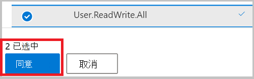
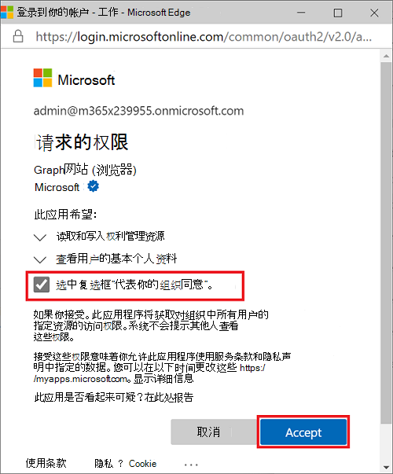

# <a name="tutorial-manage-access-to-resources-in-active-directory-entitlement-management-using-microsoft-graph-apis"></a>教程：使用 Microsoft Graph API 管理 Active Directory 权利管理中资源的访问权限

管理对员工所需的所有资源（如组、应用程序和站点）的访问权限是组织的重要功能。 你希望向员工授予所需的适当级别的访问权限，并在不再需要访问权限时将其删除。 [使用 Microsoft Graph API Azure Active Directory (Azure AD) 权利管理](/azure/active-directory/governance/entitlement-management-overview)，可以管理此类访问权限。

在本教程中，你被要求开发代码，为内部用户可以自助请求的营销活动创建资源包。 请求不需要审批，用户的访问权限将在 30 天后过期。 在本教程中，营销活动资源只是单个组的成员身份，但可以是组、应用程序或SharePoint Online 网站的集合。

>**注意：** 本教程中显示的响应对象可能会缩短以实现可读性。 

## <a name="prerequisites"></a>先决条件

若要成功完成本教程，请确保具备必需的先决条件：
- Azure AD 权利管理需要特定的许可证。 有关详细信息，请参阅 [许可证要求](/azure/active-directory/governance/entitlement-management-overview#license-requirements)。 租户中需要以下许可证：
    - Azure AD Premium P2
    - 企业移动性 + 安全性 (EMS) E5 许可证
- 本教程的前提是使用 Microsoft Graph Explorer，但是可以使用 Postman，也可以创建自己的客户端应用程序来调用 Microsoft Graph。 如果要在本教程中调用 Microsoft Graph API，需要使用具有全局管理员角色和适当权限的帐户。 在本教程中`User.ReadWrite.All``Group.ReadWrite.All`，需要具有委派权限和`EntitlementManagement.ReadWrite.All`委派权限。 完成以下步骤以在 Microsoft Graph Explorer 中设置权限：
    1. 启动 [Microsoft Graph 浏览器](https://developer.microsoft.com/graph/graph-explorer)。
    2. 选择“**使用 Microsoft 登录**”，然后使用 Azure AD 全局管理员账户登录。 成功登录后，可在左侧窗格中看到用户帐户详细信息。
    3. 选择用户帐户详细信息右侧的设置图标，然后选择“**权限**”。

        
        
    4. 滚动浏览权限的 `Group` 权限列表，展开 **组 (2)**，选择 **Group.ReadWrite.All** 权限。 向下滚动权限列表 `User` ，展开 **用户 (8)**，然后选择 **User.ReadWrite.All** 权限。

        
    
    5. 选择“**同意**”，然后选择“**接受**”，以接受同意权限。 你不需要代表组织同意这些权限。
    6. 搜索 `EntitlementManagement` 权限，展开 **EntitlementManagement (2)**，选择 **Entitlement.ReadWrite.All** 权限，然后选择 **“同意**”。 由于此权限需要管理员同意，并且在本教程中创建的用户帐户需要此权限，因此必须 **代表组织选择“同意**”。

        

    7. 选择 **“接受** ”以接受权限的同意。

## <a name="step-1-create-a-user-account-and-a-group"></a>步骤 1：创建用户帐户和组

在此步骤中，将在目录中创建名为“ **营销资源** ”的组，该组是权利管理的目标资源。 还可以创建一个设置为内部请求程序的用户帐户。

### <a name="create-a-user-account"></a>创建用户账户

在本教程中，你将创建一个用户帐户，用于请求访问包中的资源。 进行这些调用时，请更改 `contoso.onmicrosoft.com` 为租户的域名。 可在 Azure Active Directory 概述页面上找到租户信息。 记录要在本教程后面使用的 **ID** 属性的值。

#### <a name="request"></a>请求

``` http
POST https://graph.microsoft.com/v1.0/users
Content-type: application/json

{
  "accountEnabled":true,
  "displayName":"Requestor1",
  "mailNickname":"Requestor1",
  "userPrincipalName":"Requestor1@contoso.onmicrosoft.com",
  "passwordProfile": {
    "forceChangePasswordNextSignIn":true,
    "password":"Contoso1234"
  }
}
```

#### <a name="response"></a>响应

```http
{
  "@odata.context": "https://graph.microsoft.com/v1.0/$metadata#users/$entity",
  "id": "007d1c7e-7fa8-4e33-b678-5e437acdcddc",
  "deletedDateTime": null,
  "accountEnabled": true,
  "ageGroup": null,
  "businessPhones": [],
  "city": null,
  "createdDateTime": null,
  "creationType": null,
  "companyName": null,
  "consentProvidedForMinor": null,
  "country": null,
  "department": null,
  "displayName": "Requestor1",
  "employeeId": null,
  "faxNumber": null,
  "givenName": null,
  "imAddresses": [],
  "infoCatalogs": [],
  "isResourceAccount": null,
  "jobTitle": null,
  "legalAgeGroupClassification": null,
  "mail": null,
  "mailNickname": "Requestor1",
}
```

### <a name="create-a-group"></a>创建群组

在本教程中，将创建一个名为 **“市场营销资源** ”的组，该组是权利管理的目标资源。 如果已有一个组，则可以使用现有组。 记录本教程后面要使用的 **ID** 属性的值。 

#### <a name="request"></a>请求

```http
POST https://graph.microsoft.com/v1.0/groups
Content-type: application/json

{
  "description":"Marketing group",
  "displayName":"Marketing resources",
  "mailEnabled":false,
  "mailNickname":"markres",
  "securityEnabled":true
}
```

#### <a name="response"></a>响应

```http
{
  "@odata.context": "https://graph.microsoft.com/v1.0/$metadata#groups/$entity",
  "id": "e93e24d1-2b65-4a6c-a1dd-654a12225487",
  "deletedDateTime": null,
  "classification": null,
  "createdDateTime": "2020-06-24T16:47:37Z",
  "createdByAppId": "de8bc8b5-d9f9-48b1-a8ad-b748da725064",
  "description": "Marketing group",
  "displayName": "Marketing resources",
  "expirationDateTime": null,
  "groupTypes": [],
  "infoCatalogs": [],
  "isAssignableToRole": null,
  "mail": null,
  "mailEnabled": false,
  "mailNickname": "markres"
}
```

## <a name="step-2-add-resources-to-a-catalog-and-create-an-access-package"></a>步骤 2：将资源添加到目录并创建访问包

*访问包* 是团队或项目需要并受策略约束的资源捆绑包。 访问包在称为目录的容器中定义。 目录可以引用访问包中使用的资源，例如组、应用和站点。 在此步骤中，将在“常规”目录中创建一个 **市场营销活动** 访问包。 如果有其他目录，请在下一部分使用其名称。

### <a name="get-the-catalog-identifier"></a>获取目录标识符

若要将资源添加到目录，必须先获取其标识符。 如果使用的是常规目录，请运行以下请求以获取其标识符。 如果使用的是其他 Calalog，请将请求中的筛选器值更改为目录的名称。 记录本教程后面要使用的 **ID** 属性的值。

#### <a name="request"></a>请求

```http
GET https://graph.microsoft.com/beta/identityGovernance/entitlementManagement/accessPackageCatalogs?$filter=(displayName eq 'General')
```

#### <a name="response"></a>响应

```http
{
  "@odata.context": "https://graph.microsoft.com/beta/$metadata#accessPackageCatalogs",
  "value": [ 
    {
      "id": "cec5d6ab-c75d-47c0-9c1c-92e89f66e384",
      "displayName": "General",
      "description": "Built-in catalog.",
      "catalogType": "ServiceDefault",
      "catalogStatus": "Published",
      "isExternallyVisible": true,
      "createdBy": "Azure AD",
      "createdDateTime": "2020-05-30T10:58:05.363Z",
      "modifiedBy": "Azure AD",
      "modifiedDateTime": "2020-05-30T10:58:05.363Z"
    }
  ]
}
```

响应应仅包含在请求中提供的名称的目录。 如果没有返回值，请在继续操作之前检查目录的名称是否正确。

### <a name="add-the-group-to-the-catalog"></a>将组添加到目录

若要将创建的组添加到目录，请提供以下属性值：
- **catalogId** - 正在使用的目录的 **ID**
- **displayName** - 组的名称
- **description** - 组的说明
- **originId** - 创建的组的 **ID**

#### <a name="request"></a>请求

```http
POST https://graph.microsoft.com/beta/identityGovernance/entitlementManagement/accessPackageResourceRequests
Content-type: application/json

{
  "catalogId":"cec5d6ab-c75d-47c0-9c1c-92e89f66e384",
  "requestType": "AdminAdd",
  "justification": "",
  "accessPackageResource": {
    "displayName": "Marketing resources",
    "description": "Marketing group",
    "resourceType": "AadGroup",
    "originId": "e93e24d1-2b65-4a6c-a1dd-654a12225487",
    "originSystem": "AadGroup"
  }
}
```

#### <a name="response"></a>响应

```http
{
  "@odata.context": "https://graph.microsoft.com/beta/$metadata#identityGovernance/entitlementManagement/accessPackageResourceRequests/$entity",
  "catalogId": "cec5d6ab-c75d-47c0-9c1c-92e89f66e384",
  "executeImmediately": false,
  "id": "44e521e0-fb6b-4d5e-a282-e7e68dc59493",
  "requestType": "AdminAdd",
  "requestState": "Delivered",
  "requestStatus": "Fulfilled",
  "isValidationOnly": false,
  "expirationDateTime": null,
  "justification": ""
}
```

### <a name="get-catalog-resources"></a>获取目录资源

在本教程的后续步骤中，需要分配给目录中的组资源的 **ID** 。 此标识符表示组作为目录中的资源，不同于 Microsoft Graph 中组本身的标识符。 这是因为目录可以包含未在 Microsoft Graph 中表示的资源。

在请求中，提供正在使用的目录的 **ID** 。 记录组目录资源的 **ID** 属性的值。

#### <a name="request"></a>请求

```http
GET https://graph.microsoft.com/beta/identityGovernance/entitlementManagement/accessPackageCatalogs/cec5d6ab-c75d-47c0-9c1c-92e89f66e384/accessPackageResources?$filter=(displayName eq 'Marketing resources')
```

#### <a name="response"></a>响应

```http
{
  "@odata.context": "https://graph.microsoft.com/beta/$metadata#accessPackageResources",
  "value": [
    {
      "id": "4a1e21c5-8a76-4578-acb1-641160e076e8",
      "displayName": "Marketing resources",
      "description": "Marketing group",
      "url": "https://account.activedirectory.windowsazure.com/r?tenantId=d3030981-8fb9-4919-9980-5580caeddd75#/manageMembership?objectType=Group&objectId=e93e24d1-2b65-4a6c-a1dd-654a12225487",
      "resourceType": "Security Group",
      "originId": "e93e24d1-2b65-4a6c-a1dd-654a12225487",
      "originSystem": "AadGroup",
      "isPendingOnboarding": false,
      "addedBy": "admin@contoso.onmicrosoft.com",
      "addedOn": "2020-08-21T19:27:29.967Z"
    }
  ]
}
```

### <a name="get-resources-roles"></a>获取资源角色

访问包将用户分配给资源的角色。 组的典型角色是成员角色。 其他资源（如 SharePoint Online 网站和应用程序）可能具有许多角色。 访问包中使用的组的典型角色是成员角色。 在本教程后面向访问包添加资源角色时，需要成员角色。 

在请求中，使用你记录的目录中的目录的目录 **ID** 和组资源 **的 ID** 来获取成员资源角色的 **originId** 。 记录要在本教程后面使用的 **originId** 属性的值。

#### <a name="request"></a>请求

```http
GET https://graph.microsoft.com/beta/identityGovernance/entitlementManagement/accessPackageCatalogs/cec5d6ab-c75d-47c0-9c1c-92e89f66e384/accessPackageResourceRoles?$filter=(originSystem+eq+%27AadGroup%27+and+accessPackageResource/id+eq+%274a1e21c5-8a76-4578-acb1-641160e076e8%27+and+displayName+eq+%27Member%27)&$expand=accessPackageResource
```

#### <a name="response"></a>响应

```http
{
  "@odata.context": "https://graph.microsoft.com/beta/$metadata#identityGovernance/entitlementManagement/accessPackageCatalogs('ede67938-cda7-4127-a9ca-7c7bf86a19b7')/accessPackageResourceRoles(accessPackageResource())",
  "value": [
    {
      "id": "00000000-0000-0000-0000-000000000000",
      "displayName": "Member",
      "description": null,
      "originSystem": "AadGroup",
      "originId": "Member_e93e24d1-2b65-4a6c-a1dd-654a12225487",
      "accessPackageResource": {
        "id": "4a1e21c5-8a76-4578-acb1-641160e076e8",
        "displayName": "Marketing resources",
        "description": "Marketing group",
        "url": "https://account.activedirectory.windowsazure.com/r?tenantId=d3030981-8fb9-4919-9980-5580caeddd75#/manageMembership?objectType=Group&objectId=e93e24d1-2b65-4a6c-a1dd-654a12225487",
        "resourceType": "Security Group",
        "originId": "e93e24d1-2b65-4a6c-a1dd-654a12225487",
        "originSystem": "AadGroup",
        "isPendingOnboarding": false,
        "addedBy": "admin@contoso.onmicrosoft.com",
        "addedOn": "2020-06-26T17:13:23.723Z",
        "accessPackageResourceScopes": []
      }
    }
  ]
}
```

如果成功，则返回一个值，该值表示该组的成员角色。 如果未返回任何角色，请检查目录和访问包资源的 **ID** 值。

### <a name="create-the-access-package"></a>创建访问包

此时，你有一个包含组资源的目录，并且你知道你将在访问包中使用组成员的资源角色。 下一步是创建访问包。 拥有访问包后，可以向其添加资源角色，并创建策略，了解用户如何请求对该资源角色的访问权限。 使用前面记录的目录 **ID** 创建访问包。 记录要在本教程后面使用的访问包的 **ID** 。

#### <a name="request"></a>请求

```http
POST https://graph.microsoft.com/beta/identityGovernance/entitlementManagement/accessPackages
Content-type: application/json

{
  "catalogId": "cec5d6ab-c75d-47c0-9c1c-92e89f66e384",
  "displayName": "Marketing Campaign",
  "description": "Access to resources for the campaign"
}
```

#### <a name="response"></a>响应

```http
{
  "@odata.context": "https://graph.microsoft.com/beta/$metadata#identityGovernance/entitlementManagement/accessPackages/$entity",
  "id": "88203d16-0e31-41d4-87b2-dd402f1435e9",
  "catalogId": "cec5d6ab-c75d-47c0-9c1c-92e89f66e384",
  "displayName": "Marketing Campaign",
  "description": "Access to resources for the campaign",
  "isHidden": false,
  "isRoleScopesVisible": false,
  "createdBy": "admin@contoso.onmicrosoft.com",
  "createdDateTime": "2020-08-21T19:45:33.2042281Z",
  "modifiedBy": "admin@contoso.onmicrosoft.com",
  "modifiedDateTime": "2020-08-21T19:45:33.2042281Z"
}
```

### <a name="add-a-resource-role-to-the-access-package"></a>将资源角色添加到访问包

将组资源的成员角色添加到访问包。 在请求中，提供访问包的 **ID** 。 在请求正文中，提供 accessPackageResource 的组目录资源 **的 ID** ，并提供之前记录的成员角色的 **originId** 。

#### <a name="request"></a>请求

```http
POST https://graph.microsoft.com/beta/identityGovernance/entitlementManagement/accessPackages/88203d16-0e31-41d4-87b2-dd402f1435e9/accessPackageResourceRoleScopes
Content-type: application/json

{
  "accessPackageResourceRole": {
    "originId":"Member_e93e24d1-2b65-4a6c-a1dd-654a12225487",
    "displayName":"Member",
    "originSystem":"AadGroup",
    "accessPackageResource": {
      "id":"4a1e21c5-8a76-4578-acb1-641160e076e8","resourceType":"Security Group",  
      "originId":"e93e24d1-2b65-4a6c-a1dd-654a12225487","originSystem":"AadGroup"
    }
  },
  "accessPackageResourceScope": {
    "originId":"e93e24d1-2b65-4a6c-a1dd-654a12225487","originSystem":"AadGroup"
  }
}
```

#### <a name="response"></a>响应

```http
{
  "@odata.context": "https://graph.microsoft.com/beta/$metadata#identityGovernance/entitlementManagement/accessPackages('88203d16-0e31-41d4-87b2-dd402f1435e9')/accessPackageResourceRoleScopes/$entity",
  "id": "e081321b-2802-4834-a6ca-6f598ce3cdf7_6dbd2209-9d14-4c76-b92b-fcb00e835fe1",
  "createdBy": "admin@contoso.onmicrosoft.com",
  "createdDateTime": "2020-08-21T19:56:00.6320729Z",
  "modifiedBy": "admin@contoso.onmicrosoft.com",
  "modifiedDateTime": "2020-08-21T19:56:00.6320729Z"
}
```

访问包现在具有一个资源角色，即组成员身份。 该角色分配给具有访问包的任何用户。

### <a name="create-an-access-package-policy"></a>创建访问包策略

创建访问包并添加资源和角色后，可以通过创建访问包策略来决定谁可以访问它。 在本教程中，你将启用创建的 **Requestor1** 帐户，以请求访问包中资源的访问权限。 对于此任务，需要以下值：
-  **accessPackageId** 属性值的访问包 ID
-  **allowedRequestors** 中 **ID** 属性值的 **Requestor1** 用户帐户 ID
 
**durationInDays** 属性的值使 **Requestor1** 帐户能够访问访问包中的资源长达 30 天。 记录本教程后面要使用的 **ID** 属性的值。 

#### <a name="request"></a>请求

```http
POST https://graph.microsoft.com/beta/identityGovernance/entitlementManagement/accessPackageAssignmentPolicies
Content-type: application/json

{
  "accessPackageId": "88203d16-0e31-41d4-87b2-dd402f1435e9",
  "displayName": "Specific users",
  "description": "Specific users can request assignment",
  "accessReviewSettings": null,
  "durationInDays": 30,
  "requestorSettings": {
    "scopeType": "SpecificDirectorySubjects",
    "acceptRequests": true,
    "allowedRequestors": [
       {
         "@odata.type": "#microsoft.graph.singleUser",
         "isBackup": false,
         "id": "007d1c7e-7fa8-4e33-b678-5e437acdcddc",
         "description": "Requestor1"
       }
    ]
  },
  "requestApprovalSettings": {
    "isApprovalRequired": false,
    "isApprovalRequiredForExtension": false,
    "isRequestorJustificationRequired": false,
    "approvalMode": "NoApproval",
    "approvalStages": []
  }
}
```

#### <a name="response"></a>响应

```http
{
  "@odata.context": "https://graph.microsoft.com/beta/$metadata#accessPackageAssignmentPolicies/$entity",
  "id": "db440482-1210-4a60-9b55-3ac7a72f63ba",
  "accessPackageId": "88203d16-0e31-41d4-87b2-dd402f1435e9",
  "displayName": "Specific users",
  "description": "Specific users can request assignment",
  "canExtend": false,
  "durationInDays": 30,
  "expirationDateTime": null,
  "createdBy": "admin@contoso.onmicrosoft.com",
  "createdDateTime": "2020-06-29T19:47:44.7399675Z",
  "modifiedBy": "admin@contoso.onmicrosoft.com",
  "modifiedDateTime": "2020-06-29T19:47:44.7555489Z",
  "accessReviewSettings": null,
  "requestorSettings": {
    "scopeType": "SpecificDirectorySubjects",
    "acceptRequests": true,
    "allowedRequestors": [
      {
        "@odata.type": "#microsoft.graph.singleUser",
        "isBackup": false,
        "id": "007d1c7e-7fa8-4e33-b678-5e437acdcddc",
        "description": "Requestor1"
      }
    ]
  },
  "requestApprovalSettings": {
    "isApprovalRequired": false,
    "isApprovalRequiredForExtension": false,
    "isRequestorJustificationRequired": false,
    "approvalMode": "NoApproval",
    "approvalStages": []
  }
}
```

## <a name="step-3-request-access"></a>步骤 3：请求访问权限

在此步骤中， **Requestor1** 用户帐户请求访问访问包中的资源。

若要请求访问访问包中的资源，需要提供以下值：
- 为 **targetId** 属性的值创建的 **Requestor1** 用户帐户的 **ID**
-  **assignmentPolicyId** 属性值的分配策略 ID
-  **accessPackageId** 属性值的访问包 ID

在响应中，可以看到 **“已接受** ”状态和“ **已提交**”状态。 记录返回的 **ID** 属性的值，以便稍后获取请求的状态。

如果尚未执行此操作，请注销在 Microsoft Graph Explorer 中使用的管理员帐户。 登录到创建的 **Requestor1** 用户帐户。 如果是第一次登录，系统将要求你更改密码。

#### <a name="request"></a>请求

```http
POST https://graph.microsoft.com/beta/identityGovernance/entitlementManagement/accessPackageAssignmentRequests
Content-type: application/json

{
  "requestType": "UserAdd",
  "accessPackageAssignment":{
     "targetId":"007d1c7e-7fa8-4e33-b678-5e437acdcddc",
     "assignmentPolicyId":"db440482-1210-4a60-9b55-3ac7a72f63ba",
     "accessPackageId":"88203d16-0e31-41d4-87b2-dd402f1435e9"
  }
}
```

#### <a name="response"></a>响应

```http
{
  "@odata.context": "https://graph.microsoft.com/beta/$metadata#accessPackageAssignmentRequests/$entity",
    "createdDateTime": null,
    "completedDate": null,
    "id": "a6bb6942-3ae1-4259-9908-0133aaee9377",
    "requestType": "UserAdd",
    "requestState": "Submitted",
    "requestStatus": "Accepted",
    "isValidationOnly": false,
    "expirationDateTime": null,
    "justification": null
}
```

## <a name="step-4-validate-that-access-has-been-assigned"></a>步骤 4：验证是否已分配访问权限

在此步骤中，你将确认 **已为 Requestor1** 用户帐户分配了访问包，并且他们现在是 **市场营销资源** 组的成员。

注销 Requestor1 帐户并登录到管理员帐户，查看请求的状态。

### <a name="get-the-status-of-the-request"></a>获取请求的状态

使用请求的 **ID** 属性的值获取请求的当前状态。 在响应中，可以看到状态已更改为 **“已完成** ”，状态已更改为 **“已送达**”。

#### <a name="request"></a>请求

```http
GET https://graph.microsoft.com/beta/identityGovernance/entitlementManagement/accessPackageAssignmentRequests/a6bb6942-3ae1-4259-9908-0133aaee9377
```

#### <a name="response"></a>响应

```http
{
  "@odata.context": "https://graph.microsoft.com/beta/$metadata#accessPackageAssignmentRequests/$entity",
  "createdDateTime": "2020-06-29T20:24:24.683Z",
  "completedDate": "2020-06-29T20:24:47.937Z",
  "id": "a6bb6942-3ae1-4259-9908-0133aaee9377",
  "requestType": "UserAdd",
  "requestState": "Delivered",
  "requestStatus": "FulfilledNotificationTriggered",
  "isValidationOnly": false,
  "expirationDateTime": null,
  "justification": null
}
```

### <a name="get-access-package-assignments"></a>获取访问包分配

还可以使用创建的访问包策略的 **ID** 来查看资源已分配到 **Requestor1** 用户帐户。

#### <a name="request"></a>请求

```http
GET https://graph.microsoft.com/beta/identityGovernance/entitlementManagement/accessPackageAssignments?$filter=accessPackageAssignmentPolicy/Id eq 'db440482-1210-4a60-9b55-3ac7a72f63ba'&$expand=target,accessPackageAssignmentResourceRoles
```

#### <a name="response"></a>响应

```http
{
  "@odata.context": "https://graph.microsoft.com/beta/$metadata#accessPackageAssignments",
  "value": [
    {
      "id": "a6bb6942-3ae1-4259-9908-0133aaee9377",
      "catalogId": "cec5d6ab-c75d-47c0-9c1c-92e89f66e384",
      "accessPackageId": "88203d16-0e31-41d4-87b2-dd402f1435e9",
      "assignmentPolicyId": "db440482-1210-4a60-9b55-3ac7a72f63ba",
      "targetId": "2bc42425-6dc5-4f2a-9ebb-7a7464481eb0",
      "assignmentStatus": "Delivered",
      "assignmentState": "Delivered",
      "isExtended": false,
      "expiredDateTime": null,
      "target": {
         "id": "8586ddc8-0ff7-4c24-9c79-f192bc3566e3",
         "objectId": "2bc42425-6dc5-4f2a-9ebb-7a7464481eb0"
      },
      "accessPackageAssignmentResourceRoles": [
         {
            "id": "bdb7e0a0-a927-42ab-bf30-c5b5533dc54a",
            "originSystem": "AadGroup",
            "status": "Fulfilled"
         }
      ]
    }
  ]
}
```

### <a name="get-the-members-of-the-group"></a>获取组的成员

授予请求后，可以使用为 **市场营销资源** 组记录的 **ID** 来查看已向其添加 **了 Requestor1** 用户帐户。

#### <a name="request"></a>请求

```http
GET https://graph.microsoft.com/v1.0/groups/e93e24d1-2b65-4a6c-a1dd-654a12225487/members
```

#### <a name="response"></a>响应：

```http
{
  "@odata.context": "https://graph.microsoft.com/beta/$metadata#directoryObjects",
  "value": [
    {
      "@odata.type": "#microsoft.graph.user",
      "id": "007d1c7e-7fa8-4e33-b678-5e437acdcddc",
      "deletedDateTime": null,
      "accountEnabled": true,
      "ageGroup": null,
      "businessPhones": [],
      "city": null,
      "createdDateTime": "2020-06-23T18:43:24Z",
      "creationType": null,
      "companyName": null,
      "consentProvidedForMinor": null,
      "country": null,
      "department": null,
      "displayName": "Requestor1",
      "employeeId": null,
      "faxNumber": null,
      "givenName": null,
      "imAddresses": [],
      "infoCatalogs": [],
      "isResourceAccount": null,
      "jobTitle": null,
      "legalAgeGroupClassification": null,
      "mail": null,
      "mailNickname": "Requestor1"
    }
  ]
}
```

## <a name="step-5-clean-up-resources"></a>步骤 5：清理资源

在此步骤中，将删除所做的更改并删除 **市场营销活动** 访问包。

### <a name="remove-an-access-package-assignment"></a>删除访问包分配

必须先删除对访问包的任何分配，然后才能将其删除。 使用之前记录的分配请求的 **ID** 将其删除。

#### <a name="request"></a>请求

```http
POST https://graph.microsoft.com/beta/identityGovernance/entitlementManagement/accessPackageAssignmentRequests
Content-type: application/json

{
  "requestType": "AdminRemove",
  "accessPackageAssignment":{
     "id": "a6bb6942-3ae1-4259-9908-0133aaee9377"
  }
}
```

#### <a name="response"></a>响应

```http
{
    "@odata.context": "https://graph.microsoft.com/beta/$metadata#accessPackageAssignmentRequests/$entity",
    "createdDateTime": null,
    "completedDate": null,
    "id": "78eaee8c-e6cf-48c9-8f99-aae44c35e379",
    "requestType": "AdminRemove",
    "requestState": "Submitted",
    "requestStatus": "Accepted",
    "isValidationOnly": false,
    "expirationDateTime": null,
    "justification": null
}
```

### <a name="delete-the-access-package-assignment-policy"></a>删除访问包分配策略

使用之前记录的分配策略的 **ID** 将其删除。 请确保首先删除所有分配。

#### <a name="request"></a>请求

```http
DELETE https://graph.microsoft.com/beta/identityGovernance/entitlementManagement/accessPackageAssignmentPolicies/6c1f65ec-8c25-4a45-83c2-a1de2a6d0e9f
```

#### <a name="response"></a>响应

```http
No Content - 204
```

### <a name="delete-the-access-package"></a>删除访问包

使用之前记录的访问包的 **ID** 将其删除。

#### <a name="request"></a>请求

```http
DELETE https://graph.microsoft.com/beta/identityGovernance/entitlementManagement/accessPackages/cf54c6ca-d717-49bc-babe-d140d035dfdd
```

#### <a name="response"></a>响应

```http
No Content - 204
```

### <a name="delete-the-user-account"></a>删除用户账户

删除 **Requestor1** 用户帐户。

#### <a name="request"></a>请求

```http
DELETE https://graph.microsoft.com/v1.0/users/ce02eca8-752b-4ecf-ac29-aa9bccd87606
```

#### <a name="response"></a>响应

```http
No Content - 204
```

### <a name="delete-the-group"></a>添加或删除组成员

删除 **市场营销资源** 组。

#### <a name="request"></a>请求

```http
DELETE https://graph.microsoft.com/v1.0/groups/a468eaea-ed6c-4290-98d2-a96bb1cb4209
```

#### <a name="response"></a>响应

```http
No Content - 204
```

## <a name="see-also"></a>另请参阅

在本教程中，你使用了许多 API 来完成任务。 浏览这些 API 的 API 参考，详细了解 API 可以执行哪些操作。


- [使用 Azure AD 权利管理 API](/graph/api/resources/entitlementmanagement-overview?view=graph-rest-beta&preserve-view=true)
- [accessPackageCatalog](/graph/api/resources/accesspackagecatalog?view=graph-rest-beta&preserve-view=true)
- [accessPackageResourceRequest](/graph/api/resources/accesspackageresourcerequest?view=graph-rest-beta&preserve-view=true)
- [accessPackage](/graph/api/resources/accesspackage?view=graph-rest-beta&preserve-view=true)
- [accessPackageResourceRoleScope](/graph/api/resources/accesspackageresourcerolescope?view=graph-rest-beta&preserve-view=true)
- [accessPackageAssignmentPolicy](/graph/api/resources/accesspackageassignmentpolicy?view=graph-rest-beta&preserve-view=true)
- [accessPackageAssignmentRequest](/graph/api/resources/accesspackageassignmentrequest?view=graph-rest-beta&preserve-view=true)
- [组](/graph/api/resources/group)
- [用户](/graph/api/resources/user?)
