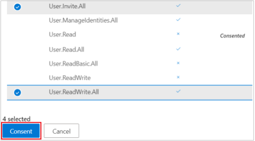

# <a name="tutorial-use-the-access-reviews-api-to-review-guest-access-to-your-microsoft-365-groups"></a><span data-ttu-id="5fda4-103">教程：使用访问评审 API 查看来宾对组Microsoft 365访问</span><span class="sxs-lookup"><span data-stu-id="5fda4-103">Tutorial: Use the access reviews API to review guest access to your Microsoft 365 groups</span></span>

<span data-ttu-id="5fda4-104">在本教程中，你将使用 Graph 资源管理器创建和阅读访问评审，这些评论面向租户Microsoft 365来宾用户的所有组。</span><span class="sxs-lookup"><span data-stu-id="5fda4-104">In this tutorial, you will use Graph Explorer to create and read access reviews that targets all Microsoft 365 groups with guest users in the tenant.</span></span> <span data-ttu-id="5fda4-105">若要实现此目的，你将首先使用 Azure AD B2B 邀请并创建租户中的来宾用户（也称为外部标识）。</span><span class="sxs-lookup"><span data-stu-id="5fda4-105">To achieve this, you'll first use Azure AD B2B to invite and create a guest user, also referred to as an external identity, in your tenant.</span></span> <span data-ttu-id="5fda4-106">然后，在创建和阅读访问评审之前，Microsoft 365此来宾用户添加到你的组。</span><span class="sxs-lookup"><span data-stu-id="5fda4-106">Then, you'll add this guest user to your Microsoft 365 group prior to creating and reading the access review.</span></span>

>[!NOTE]
><span data-ttu-id="5fda4-107">为了可读性，本教程中显示的响应对象可能会缩短。</span><span class="sxs-lookup"><span data-stu-id="5fda4-107">The response objects shown in this tutorial might be shortened for readability.</span></span>

## <a name="prerequisites"></a><span data-ttu-id="5fda4-108">先决条件</span><span class="sxs-lookup"><span data-stu-id="5fda4-108">Prerequisites</span></span>

<span data-ttu-id="5fda4-109">若要完成本教程，需要以下资源和权限：</span><span class="sxs-lookup"><span data-stu-id="5fda4-109">To complete this tutorial, you need the following resources and privileges:</span></span>

+ <span data-ttu-id="5fda4-110">启用 Azure AD 或 EMS E5 许可证高级版 Azure AD 租户。</span><span class="sxs-lookup"><span data-stu-id="5fda4-110">A working Azure AD tenant with an Azure AD Premium P2 or EMS E5 license enabled.</span></span> 
+ <span data-ttu-id="5fda4-111">不同 Azure AD 租户中的帐户或作为来宾用户邀请的社交标识 (B2B) 。</span><span class="sxs-lookup"><span data-stu-id="5fda4-111">An account in a different Azure AD tenant or a social identity that you can invite as a guest user (B2B user).</span></span>
+ <span data-ttu-id="5fda4-112">以用户[Graph](https://developer.microsoft.com/graph/graph-explorer)用户登录浏览器全局管理员角色。</span><span class="sxs-lookup"><span data-stu-id="5fda4-112">Sign in to [Graph Explorer](https://developer.microsoft.com/graph/graph-explorer) as a user in a global administrator role.</span></span> 
+ <span data-ttu-id="5fda4-113">以下委派权限 `User.Invite.All` `AccessReview.ReadWrite.All` ：、、、。 `Group.ReadWrite.All` `User.ReadWrite.All`</span><span class="sxs-lookup"><span data-stu-id="5fda4-113">The following delegated permissions: `User.Invite.All`, `AccessReview.ReadWrite.All`, `Group.ReadWrite.All`, `User.ReadWrite.All`.</span></span>

<span data-ttu-id="5fda4-114">若要同意在浏览器浏览器中Graph权限：</span><span class="sxs-lookup"><span data-stu-id="5fda4-114">To consent to the required permissions in Graph Explorer:</span></span>
1. <span data-ttu-id="5fda4-115">选择用户帐户详细信息右侧设置图标，然后选择"**选择权限"。**</span><span class="sxs-lookup"><span data-stu-id="5fda4-115">Select the settings icon to the right of the user account details, and then choose **Select permissions**.</span></span>
   
   <span data-ttu-id="5fda4-116">
   </span><span class="sxs-lookup"><span data-stu-id="5fda4-116">
</span></span><!--:::image type="content" source="../images/../concepts/images/tutorial-accessreviews-api/settings.png" alt-text="Select the Microsoft Graph permissions":::-->

2. <span data-ttu-id="5fda4-117">滚动浏览这些权限的权限列表：</span><span class="sxs-lookup"><span data-stu-id="5fda4-117">Scroll through the list of permissions to these permissions:</span></span>
   + <span data-ttu-id="5fda4-118">AccessReviews (3) ，展开，然后选择 **AccessReviews.ReadWrite.All**。</span><span class="sxs-lookup"><span data-stu-id="5fda4-118">AccessReviews (3), expand and then select **AccessReviews.ReadWrite.All**.</span></span>
   + <span data-ttu-id="5fda4-119">将 (2) ，展开，然后选择 **Group.ReadWrite.All。**</span><span class="sxs-lookup"><span data-stu-id="5fda4-119">Group (2), expand and then select **Group.ReadWrite.All**.</span></span>
   + <span data-ttu-id="5fda4-120">用户 (8) ，展开，然后选择 **User.Invite.All** 和 **User.ReadWrite.All。**</span><span class="sxs-lookup"><span data-stu-id="5fda4-120">User (8), expand and then select **User.Invite.All** and **User.ReadWrite.All**.</span></span>
   
   <span data-ttu-id="5fda4-121">选择“**同意**”，然后选择“**接受**”，以接受同意权限。</span><span class="sxs-lookup"><span data-stu-id="5fda4-121">Select **Consent**, and then select **Accept** to accept the consent of the permissions.</span></span> <span data-ttu-id="5fda4-122">你不需要代表组织同意这些权限。</span><span class="sxs-lookup"><span data-stu-id="5fda4-122">You do not need to consent on behalf of your organization for these permissions.</span></span>
   
   <span data-ttu-id="5fda4-123">
   </span><span class="sxs-lookup"><span data-stu-id="5fda4-123">
</span></span><!--:::image type="content" source="../images/../concepts/images/tutorial-accessreviews-api/consentpermissions_M365.png" alt-text="Consent to the Microsoft Graph permissions":::-->

## <a name="step-1-create-a-test-user-in-your-tenant"></a><span data-ttu-id="5fda4-124">步骤 1：在租户中创建测试用户</span><span class="sxs-lookup"><span data-stu-id="5fda4-124">Step 1: Create a test user in your tenant</span></span>

### <a name="request"></a><span data-ttu-id="5fda4-125">请求</span><span class="sxs-lookup"><span data-stu-id="5fda4-125">Request</span></span>

```http
POST /users
Content-Type: application/json

{
    "accountEnabled": true,
    "displayName": "Aline Dupuy",
    "mailNickname": "AlineD",
    "userPrincipalName": "AlineD@contoso.com",
    "passwordProfile": {
        "forceChangePasswordNextSignIn": true,
        "password": "xWwvJ]6NMw+bWH-d"
    }
}
```

### <a name="response"></a><span data-ttu-id="5fda4-126">响应</span><span class="sxs-lookup"><span data-stu-id="5fda4-126">Response</span></span>

```http
HTTP/1.1 201 Created
Content-type: application/json

{
    "@odata.context": "https://graph.microsoft.com/beta/$metadata#users/$entity",
    "id": "c9a5aff7-9298-4d71-adab-0a222e0a05e4",
    "displayName": "Aline Dupuy",
    "userPrincipalName": "AlineD@contoso.com",
    "userType": "Member"
}
```

## <a name="step-2-invite-a-guest-user-into-your-tenant"></a><span data-ttu-id="5fda4-127">步骤 2：将来宾用户邀请到租户</span><span class="sxs-lookup"><span data-stu-id="5fda4-127">Step 2: Invite a guest user into your tenant</span></span>

<span data-ttu-id="5fda4-128">使用电子邮件地址邀请来宾用户 **john@tailspintoys.com** 租户。</span><span class="sxs-lookup"><span data-stu-id="5fda4-128">Invite a guest user with the email address **john@tailspintoys.com** to your tenant.</span></span>

### <a name="request"></a><span data-ttu-id="5fda4-129">请求</span><span class="sxs-lookup"><span data-stu-id="5fda4-129">Request</span></span>

```http
POST https://graph.microsoft.com/beta/invitations
Content-Type: application/json

{
    "invitedUserDisplayName": "John Doe (Tailspin Toys)",
    "invitedUserEmailAddress": "john@tailspintoys.com",
    "sendInvitationMessage": false,
    "inviteRedirectUrl": "https://myapps.microsoft.com"
}
```

### <a name="response"></a><span data-ttu-id="5fda4-130">响应</span><span class="sxs-lookup"><span data-stu-id="5fda4-130">Response</span></span>

```http
HTTP/1.1 201 Created
Content-type: application/json

{
    "@odata.context": "https://graph.microsoft.com/beta/$metadata#invitations/$entity",
    "invitedUser": {
        "id": "baf1b0a0-1f9a-4a56-9884-6a30824f8d20"
    }    
}
```

## <a name="step-3-create-a-new-microsoft-365-group-and-add-the-guest-user"></a><span data-ttu-id="5fda4-131">步骤 3：新建Microsoft 365组并添加来宾用户</span><span class="sxs-lookup"><span data-stu-id="5fda4-131">Step 3: Create a new Microsoft 365 group and add the guest user</span></span>

<span data-ttu-id="5fda4-132">在此步骤中：</span><span class="sxs-lookup"><span data-stu-id="5fda4-132">In this step:</span></span>
1. <span data-ttu-id="5fda4-133">创建一个名为"Microsoft 365 **市场营销活动"的新组**。</span><span class="sxs-lookup"><span data-stu-id="5fda4-133">Create a new Microsoft 365 group named **Feelgood marketing campaign**.</span></span>
2. <span data-ttu-id="5fda4-134">将自己分配为组所有者。</span><span class="sxs-lookup"><span data-stu-id="5fda4-134">Assign yourself as the group owner.</span></span>
3. <span data-ttu-id="5fda4-135">添加 john@tailspintoys.com 作为组成员。</span><span class="sxs-lookup"><span data-stu-id="5fda4-135">Add john@tailspintoys.com as a group member.</span></span> <span data-ttu-id="5fda4-136">他们访问组是由你（组所有者）审查的主题。</span><span class="sxs-lookup"><span data-stu-id="5fda4-136">Their access to the group is the subject of review by you, the group owner.</span></span>

### <a name="request"></a><span data-ttu-id="5fda4-137">请求</span><span class="sxs-lookup"><span data-stu-id="5fda4-137">Request</span></span>
<span data-ttu-id="5fda4-138">在此调用中，替换：</span><span class="sxs-lookup"><span data-stu-id="5fda4-138">In this call, replace:</span></span>
+ <span data-ttu-id="5fda4-139">`cdb555e3-b33e-4fd5-a427-17fadacbdfa7` 与 **id 一起**。若要检索 **id，** 请运行 `GET` `https://graph.microsoft.com/beta/me` 。</span><span class="sxs-lookup"><span data-stu-id="5fda4-139">`cdb555e3-b33e-4fd5-a427-17fadacbdfa7` with your **id**. To retrieve your **id**, run `GET` on `https://graph.microsoft.com/beta/me`.</span></span>
+ <span data-ttu-id="5fda4-140">`baf1b0a0-1f9a-4a56-9884-6a30824f8d20`john@tailspintoys.com 步骤 2 **中响应** 的 id。</span><span class="sxs-lookup"><span data-stu-id="5fda4-140">`baf1b0a0-1f9a-4a56-9884-6a30824f8d20` with **john@tailspintoys.com**'s **id** from the response in Step 2.</span></span>

```http
POST https://graph.microsoft.com/beta/groups
Content-Type: application/json

{
    "description": "Feelgood Marketing Campaign with external partners and vendors.",
    "displayName": "Feelgood Marketing Campaign",
    "groupTypes": [
        "Unified"
    ],
    "mailEnabled": true,
    "mailNickname": "FeelGoodCampaign",
    "securityEnabled": true,
    "owners@odata.bind": [
        "https://graph.microsoft.com/beta/users/cdb555e3-b33e-4fd5-a427-17fadacbdfa7"
    ],
    "members@odata.bind": [
        "https://graph.microsoft.com/beta/users/baf1b0a0-1f9a-4a56-9884-6a30824f8d20"
    ]
}
```

### <a name="response"></a><span data-ttu-id="5fda4-141">响应</span><span class="sxs-lookup"><span data-stu-id="5fda4-141">Response</span></span>

```http
HTTP/1.1 201 Created
Content-type: application/json

{
    "@odata.context": "https://graph.microsoft.com/beta/$metadata#groups/$entity",
    "id": "59ab642a-2776-4e32-9b68-9ff7a47b7f6a",
    "displayName": "Feelgood Marketing Campaign",
    "groupTypes": [
        "Unified"
    ]
}
```

<span data-ttu-id="5fda4-142">现在，你有一Microsoft 365来宾用户的组。</span><span class="sxs-lookup"><span data-stu-id="5fda4-142">You now have a Microsoft 365 group with a guest user.</span></span>

## <a name="step-4-create-an-access-review-for-all-microsoft-365-groups-with-guest-users"></a><span data-ttu-id="5fda4-143">步骤 4：为具有来宾用户的所有Microsoft 365组创建访问评审</span><span class="sxs-lookup"><span data-stu-id="5fda4-143">Step 4: Create an access review for all Microsoft 365 groups with guest users</span></span>

<span data-ttu-id="5fda4-144">为具有来宾用户的所有 Microsoft 365 组创建定期访问评审系列时，安排定期查看来宾对 Microsoft 365 组的访问权限。</span><span class="sxs-lookup"><span data-stu-id="5fda4-144">When you create a recurring access review series for all Microsoft 365 groups with guest users, you schedule a periodic review of the guests' access to the Microsoft 365 group.</span></span> <span data-ttu-id="5fda4-145">为 **"Feelgood 市场营销活动"组** 进行此操作。</span><span class="sxs-lookup"><span data-stu-id="5fda4-145">Do this for the **Feelgood Marketing Campaign** group.</span></span>

<span data-ttu-id="5fda4-146">访问评审系列使用下列设置：</span><span class="sxs-lookup"><span data-stu-id="5fda4-146">The access review series uses following settings:</span></span>
+ <span data-ttu-id="5fda4-147">这是定期访问评审，每季度查看一次。</span><span class="sxs-lookup"><span data-stu-id="5fda4-147">It's a recurring access review and reviewed quarterly.</span></span>
+ <span data-ttu-id="5fda4-148">组所有者查看来宾用户的持续访问权限。</span><span class="sxs-lookup"><span data-stu-id="5fda4-148">The group owners review the continued access of guest users.</span></span>
+ <span data-ttu-id="5fda4-149">审查范围仅限于仅限Microsoft 365 **来宾用户的组**。</span><span class="sxs-lookup"><span data-stu-id="5fda4-149">The review scope is limited to Microsoft 365 groups with **Guest users** only.</span></span> <span data-ttu-id="5fda4-150">有关配置范围的更多选项，请参阅另 [请参阅部分](#see-also) 。</span><span class="sxs-lookup"><span data-stu-id="5fda4-150">For more options for configuring the scope, see the [See also](#see-also) section.</span></span> 
+ <span data-ttu-id="5fda4-151">备份审阅者。</span><span class="sxs-lookup"><span data-stu-id="5fda4-151">A backup reviewer.</span></span> <span data-ttu-id="5fda4-152">这可以是回退用户或可在组未分配任何所有者的情况下查看访问权限的组。</span><span class="sxs-lookup"><span data-stu-id="5fda4-152">This can be a fallback user or a group that can review the access in case the group doesn't have any owners assigned.</span></span> <span data-ttu-id="5fda4-153">有关配置审阅者的更多选项，请参阅另 [请参阅部分](#see-also) 。</span><span class="sxs-lookup"><span data-stu-id="5fda4-153">For more options for configuring the reviewers, see the [See also](#see-also) section.</span></span>
+ <span data-ttu-id="5fda4-154">**autoApplyDecisionsEnabled** 设置为 `true` 。</span><span class="sxs-lookup"><span data-stu-id="5fda4-154">**autoApplyDecisionsEnabled** is set to `true`.</span></span> <span data-ttu-id="5fda4-155">在这种情况下，一旦审阅者完成访问评审或访问评审持续时间结束，将自动应用决策。</span><span class="sxs-lookup"><span data-stu-id="5fda4-155">In this case, decisions are applied automatically once the reviewer completes the access review or the access review duration ends.</span></span> <span data-ttu-id="5fda4-156">如果未启用，则用户必须在审阅完成后手动应用决策。</span><span class="sxs-lookup"><span data-stu-id="5fda4-156">If not enabled, a user must, after the review completes, apply the decisions manually.</span></span>
+ <span data-ttu-id="5fda4-157">将 **removeAccessApplyAction** 操作应用于拒绝的来宾用户。</span><span class="sxs-lookup"><span data-stu-id="5fda4-157">Apply **removeAccessApplyAction** action to denied guest users.</span></span> <span data-ttu-id="5fda4-158">这将删除被拒绝来宾组的成员身份。</span><span class="sxs-lookup"><span data-stu-id="5fda4-158">This removes the membership in the group of the denied guest.</span></span> <span data-ttu-id="5fda4-159">来宾用户仍可登录到你的租户。</span><span class="sxs-lookup"><span data-stu-id="5fda4-159">The guest user can still sign in to your tenant.</span></span>

### <a name="request"></a><span data-ttu-id="5fda4-160">请求</span><span class="sxs-lookup"><span data-stu-id="5fda4-160">Request</span></span>
<span data-ttu-id="5fda4-161">在此调用中，替换以下内容：</span><span class="sxs-lookup"><span data-stu-id="5fda4-161">In this call, replace the following:</span></span>

+ <span data-ttu-id="5fda4-162">`c9a5aff7-9298-4d71-adab-0a222e0a05e4` 使用 **要** 指定为备份审阅者的用户的 ID。</span><span class="sxs-lookup"><span data-stu-id="5fda4-162">`c9a5aff7-9298-4d71-adab-0a222e0a05e4` with the **id** of the user you are designating as a backup reviewer.</span></span> <span data-ttu-id="5fda4-163">这是步骤 1 中响应的 **ID。**</span><span class="sxs-lookup"><span data-stu-id="5fda4-163">This is the **id** from the response in Step 1.</span></span>
+ <span data-ttu-id="5fda4-164">**startDate** 的值，其当前日期和 **endDate** 值，其日期为从开始日期起一年。</span><span class="sxs-lookup"><span data-stu-id="5fda4-164">Value of **startDate** with today's date and value of **endDate** with a date one year from the start date.</span></span> 

```http
POST https://graph.microsoft.com/beta/identityGovernance/accessReviews/definitions
Content-type: application/json

{
    "displayName": "Group owners review guest across Microsoft 365 groups in the tenant (Quarterly)",
    "descriptionForAdmins": "",
    "descriptionForReviewers": "",
    "scope": {
        "query": "./members/microsoft.graph.user/?$count=true&$filter=(userType eq 'Guest')",
        "queryType": "MicrosoftGraph"
    },
    "instanceEnumerationScope": {
        "query": "/groups?$filter=(groupTypes/any(c:c+eq+'Unified'))&$count=true",
        "queryType": "MicrosoftGraph"
    },
    "reviewers": [
        {
            "query": "./owners",
            "queryType": "MicrosoftGraph",
            "queryRoot": null
        }
    ],
    "backupReviewers": [
        {
            "query": "/users/c9a5aff7-9298-4d71-adab-0a222e0a05e4",
            "queryType": "MicrosoftGraph",
            "queryRoot": null
        }
    ],
    "settings": {
        "mailNotificationsEnabled": true,
        "reminderNotificationsEnabled": true,
        "justificationRequiredOnApproval": true,
        "defaultDecisionEnabled": true,
        "defaultDecision": "Approve",
        "instanceDurationInDays": 0,
        "autoApplyDecisionsEnabled": true,
        "recommendationsEnabled": true,
        "recurrence": {
            "pattern": {
                "type": "absoluteMonthly",
                "interval": 3,
                "month": 0,
                "dayOfMonth": 0,
                "daysOfWeek": [],
                "firstDayOfWeek": "sunday",
                "index": "first"
            },
            "range": {
                "type": "numbered",
                "numberOfOccurrences": 0,
                "recurrenceTimeZone": null,
                "startDate": "2021-02-10",
                "endDate": "2022-12-21"
            }
        },
        "applyActions": [
            {
                "@odata.type": "#microsoft.graph.removeAccessApplyAction"
            }
        ]
    }
}
```

### <a name="response"></a><span data-ttu-id="5fda4-165">响应</span><span class="sxs-lookup"><span data-stu-id="5fda4-165">Response</span></span>

```http
HTTP/1.1 201 Created
Content-type: application/json

{
    "@odata.context": "https://graph.microsoft.com/beta/$metadata#identityGovernance/accessReviews/definitions/$entity",
    "id": "c22ae540-b89a-4d24-bac0-4ef35e6591ea",
    "displayName": "Group owners review guest across Microsoft 365 groups in the tenant (Quarterly)",
    "status": "NotStarted",
    "createdBy": {
        "id": "cdb555e3-b33e-4fd5-a427-17fadacbdfa7",
        "displayName": "MOD Administrator",
        "userPrincipalName": "admin@contoso.com"
    },
    "scope": {
        "query": "./members/microsoft.graph.user/?$count=true&$filter=(userType eq 'Guest')",
        "queryType": "MicrosoftGraph"
    },
    "instanceEnumerationScope": {
        "query": "/groups?$filter=(groupTypes/any(c:c+eq+'Unified'))&$count=true",
        "queryType": "MicrosoftGraph"
    },
    "reviewers": [
        {
            "query": "./owners",
            "queryType": "MicrosoftGraph",
            "queryRoot": null
        }
    ],
    "backupReviewers": [
        {
            "query": "/users/c9a5aff7-9298-4d71-adab-0a222e0a05e4",
            "queryType": "MicrosoftGraph",
            "queryRoot": null
        }
    ],
    "settings": {
        "defaultDecisionEnabled": true,
        "defaultDecision": "Approve",
        "autoApplyDecisionsEnabled": true,
        "recommendationsEnabled": true,
        "recurrence": {
            "pattern": {
                "type": "absoluteMonthly",
                "interval": 3,
                "month": 0,
                "dayOfMonth": 0,
                "daysOfWeek": [],
                "firstDayOfWeek": "sunday",
                "index": "first"
            },
            "range": {
                "type": "numbered",
                "numberOfOccurrences": 0,
                "recurrenceTimeZone": null,
                "startDate": "2021-02-10",
                "endDate": "2022-12-21"
            }
        },
        "applyActions": [
            {
                "@odata.type": "#microsoft.graph.removeAccessApplyAction"
            }
        ]
    }
}
```

## <a name="step-5-list-instances-of-the-access-review"></a><span data-ttu-id="5fda4-166">步骤 5：列出访问评审的实例</span><span class="sxs-lookup"><span data-stu-id="5fda4-166">Step 5: List instances of the access review</span></span>

<span data-ttu-id="5fda4-167">以下查询列出了访问评审定义的所有实例。</span><span class="sxs-lookup"><span data-stu-id="5fda4-167">The following query lists all instances of the access review definition.</span></span> <span data-ttu-id="5fda4-168">如果测试租户包含Microsoft 365用户的其他组，此请求将为租户中具有来宾Microsoft 365组返回一个实例。</span><span class="sxs-lookup"><span data-stu-id="5fda4-168">If your test tenant contains other Microsoft 365 groups with guest users, this request will return one instance for every Microsoft 365 group with guest users in the tenant.</span></span>

### <a name="request"></a><span data-ttu-id="5fda4-169">请求</span><span class="sxs-lookup"><span data-stu-id="5fda4-169">Request</span></span>
<span data-ttu-id="5fda4-170">在此调用中， `c22ae540-b89a-4d24-bac0-4ef35e6591ea` 将 替换为步骤 4 中返回的访问评审定义的 ID。</span><span class="sxs-lookup"><span data-stu-id="5fda4-170">In this call, replace `c22ae540-b89a-4d24-bac0-4ef35e6591ea` with the **id** of your access review definition returned in Step 4.</span></span>

```http
GET https://graph.microsoft.com/beta/identityGovernance/accessReviews/definitions/c22ae540-b89a-4d24-bac0-4ef35e6591ea/instances
```

### <a name="response"></a><span data-ttu-id="5fda4-171">响应</span><span class="sxs-lookup"><span data-stu-id="5fda4-171">Response</span></span>
<span data-ttu-id="5fda4-172">在此响应中，范围包括一个 **id** 为 (在步骤 3 中创建的 Feelgood 市场营销活动组) `59ab642a-2776-4e32-9b68-9ff7a47b7f6a` 因为它有来宾用户。 </span><span class="sxs-lookup"><span data-stu-id="5fda4-172">In this response, the scope includes a group with **id** `59ab642a-2776-4e32-9b68-9ff7a47b7f6a` (the **Feelgood marketing campaign** group created in Step 3) because it has a guest user.</span></span>

```http
HTTP/1.1 200 OK
Content-type: application/json

{
    "@odata.context": "https://graph.microsoft.com/beta/$metadata#identityGovernance/accessReviews/definitions('c22ae540-b89a-4d24-bac0-4ef35e6591ea')/instances",
    "value": [
        {
            "id": "6392b1a7-9c25-4844-83e5-34e23c88e16a",
            "startDateTime": "2021-02-10T17:00:36.96Z",
            "endDateTime": "2021-02-10T17:00:36.96Z",
            "status": "InProgress",
            "scope": {
                "query": "/groups/59ab642a-2776-4e32-9b68-9ff7a47b7f6a/members/microsoft.graph.user/?$count=true&$filter=(userType eq 'Guest')",
                "queryType": "MicrosoftGraph"
            }
        }
    ]
}
```
<span data-ttu-id="5fda4-173">在此响应中，访问评审实例当前为 `InProgress` 。</span><span class="sxs-lookup"><span data-stu-id="5fda4-173">In this response, the access review instance is currently `InProgress`.</span></span> <span data-ttu-id="5fda4-174">因为这是每季度评审一次，每 3 个月将自动创建一个新的审阅实例，并且审阅者可以应用新决策。</span><span class="sxs-lookup"><span data-stu-id="5fda4-174">Because this is a quarterly review, every 3 months, a new review instance is created automatically and you—the reviewer—can apply new decisions.</span></span>

## <a name="step-6-get-decisions"></a><span data-ttu-id="5fda4-175">步骤 6：获取决策</span><span class="sxs-lookup"><span data-stu-id="5fda4-175">Step 6: Get decisions</span></span>

<span data-ttu-id="5fda4-176">获取针对访问评审实例做出的决策。</span><span class="sxs-lookup"><span data-stu-id="5fda4-176">Get the decisions taken for the instance of an access review.</span></span>

### <a name="request"></a><span data-ttu-id="5fda4-177">请求</span><span class="sxs-lookup"><span data-stu-id="5fda4-177">Request</span></span>
<span data-ttu-id="5fda4-178">在此调用中：</span><span class="sxs-lookup"><span data-stu-id="5fda4-178">In this call:</span></span>
+ <span data-ttu-id="5fda4-179">将 `c22ae540-b89a-4d24-bac0-4ef35e6591ea` 替换为步骤 4 中返回的访问评审定义的 ID。</span><span class="sxs-lookup"><span data-stu-id="5fda4-179">Replace `c22ae540-b89a-4d24-bac0-4ef35e6591ea` with the **id** of your access review definition returned in Step 4.</span></span>
+ <span data-ttu-id="5fda4-180">将 `6392b1a7-9c25-4844-83e5-34e23c88e16a` 替换为步骤 5 中返回的访问评审实例的 ID。</span><span class="sxs-lookup"><span data-stu-id="5fda4-180">Replace `6392b1a7-9c25-4844-83e5-34e23c88e16a` with the **id** of your access review instance returned in Step 5.</span></span>

```http
GET https://graph.microsoft.com/beta/identityGovernance/accessReviews/definitions/c22ae540-b89a-4d24-bac0-4ef35e6591ea/instances/6392b1a7-9c25-4844-83e5-34e23c88e16a/decisions
```

### <a name="response"></a><span data-ttu-id="5fda4-181">响应</span><span class="sxs-lookup"><span data-stu-id="5fda4-181">Response</span></span>

<span data-ttu-id="5fda4-182">以下响应显示为评价实例做出的决定。</span><span class="sxs-lookup"><span data-stu-id="5fda4-182">The following response shows the decision taken for the instance of the review.</span></span>

```http
HTTP/1.1 200 OK
Content-type: application/json

{
    "@odata.context": "https://graph.microsoft.com/beta/$metadata#identityGovernance/accessReviews/definitions('c22ae540-b89a-4d24-bac0-4ef35e6591ea')/instances('6392b1a7-9c25-4844-83e5-34e23c88e16a')/decisions",
    "@odata.count": 1,
    "value": [
        {
            "id": "0e76ee07-b4c6-469e-bc9d-e73fc9a8d660",
            "accessReviewId": "6392b1a7-9c25-4844-83e5-34e23c88e16a",
            "reviewedDateTime": "2021-02-10T17:06:26.147Z",
            "decision": "Approve",
            "justification": "",
            "appliedDateTime": null,
            "applyResult": "New",
            "recommendation": "Deny",
            "reviewedBy": {
                "id": "00000000-0000-0000-0000-000000000000",
                "displayName": "AAD Access Reviews",
                "userPrincipalName": "AAD Access Reviews"
            },
            "appliedBy": {
                "id": "00000000-0000-0000-0000-000000000000",
                "displayName": "",
                "userPrincipalName": ""
            },
            "target": {
                "@odata.type": "#microsoft.graph.accessReviewInstanceDecisionItemUserTarget",
                "userId": "baf1b0a0-1f9a-4a56-9884-6a30824f8d20",
                "userDisplayName": "John Doe (Tailspin Toys)",
                "userPrincipalName": "john@tailspintoys.com"
            },
            "principal": {
                "@odata.type": "#microsoft.graph.userIdentity",
                "id": "baf1b0a0-1f9a-4a56-9884-6a30824f8d20",
                "displayName": "John Doe (Tailspin Toys)",
                "userPrincipalName": "john@tailspintoys.com"
            }
        }
    ]
}
```

<span data-ttu-id="5fda4-183">因为这是季度评审，并且只要定义仍处于活动状态（即重复的 **endDate** 不是过去日期，每 3 个月创建一次新的审阅实例，您作为审阅者就可以应用新决策。</span><span class="sxs-lookup"><span data-stu-id="5fda4-183">Because this is a quarterly review and as long as the definition is still active, that is, the recurrence **endDate** is not a past date, every 3 months when a new review instance is created, you as the reviewer can apply new decisions.</span></span>

## <a name="step-7-clean-up-resources"></a><span data-ttu-id="5fda4-184">第 7 步：清理资源</span><span class="sxs-lookup"><span data-stu-id="5fda4-184">Step 7: Clean up resources</span></span>

<span data-ttu-id="5fda4-185">删除为本教程创建的资源- 体验市场营销活动组、访问 **评审** 计划定义、来宾用户和测试用户。</span><span class="sxs-lookup"><span data-stu-id="5fda4-185">Delete the resources that you created for this tutorial—**Feelgood marketing campaign** group, the access review schedule definition, the guest user, and the test user.</span></span>

### <a name="delete-the-microsoft-365-group"></a><span data-ttu-id="5fda4-186">删除Microsoft 365组</span><span class="sxs-lookup"><span data-stu-id="5fda4-186">Delete the Microsoft 365 group</span></span>

#### <a name="request"></a><span data-ttu-id="5fda4-187">请求</span><span class="sxs-lookup"><span data-stu-id="5fda4-187">Request</span></span>
<span data-ttu-id="5fda4-188">在此调用中， `59ab642a-2776-4e32-9b68-9ff7a47b7f6a` 将 替换为 **你的 Feelgood 市场营销活动的** **id** Microsoft 365组。</span><span class="sxs-lookup"><span data-stu-id="5fda4-188">In this call, replace `59ab642a-2776-4e32-9b68-9ff7a47b7f6a` with the **id** of your **Feelgood marketing campaign** Microsoft 365 group.</span></span>

```http
DELETE https://graph.microsoft.com/beta/groups/59ab642a-2776-4e32-9b68-9ff7a47b7f6a
```

#### <a name="response"></a><span data-ttu-id="5fda4-189">响应</span><span class="sxs-lookup"><span data-stu-id="5fda4-189">Response</span></span>

```http
HTTP/1.1 204 No Content
Content-type: text/plain
```

### <a name="delete-the-access-review-definition"></a><span data-ttu-id="5fda4-190">删除访问评审定义</span><span class="sxs-lookup"><span data-stu-id="5fda4-190">Delete the access review definition</span></span>

<span data-ttu-id="5fda4-191">在此调用中， `c22ae540-b89a-4d24-bac0-4ef35e6591ea` 将 替换为 **访问** 评审定义的 ID。</span><span class="sxs-lookup"><span data-stu-id="5fda4-191">In this call, replace `c22ae540-b89a-4d24-bac0-4ef35e6591ea` with the **id** of your access review definition.</span></span> <span data-ttu-id="5fda4-192">由于访问评审计划定义是访问评审的蓝图，删除该定义将删除与访问评审相关的设置、实例和决策。</span><span class="sxs-lookup"><span data-stu-id="5fda4-192">Since the access review schedule definition is the blueprint for the access review, deleting the definition will remove the settings, instances, and decisions associated with the access review.</span></span>

#### <a name="request"></a><span data-ttu-id="5fda4-193">请求</span><span class="sxs-lookup"><span data-stu-id="5fda4-193">Request</span></span>
```http
DELETE https://graph.microsoft.com/beta/identityGovernance/accessReviews/definitions/c22ae540-b89a-4d24-bac0-4ef35e6591ea
```

#### <a name="response"></a><span data-ttu-id="5fda4-194">响应</span><span class="sxs-lookup"><span data-stu-id="5fda4-194">Response</span></span>
```http
HTTP/1.1 204 No Content
Content-type: text/plain
```
### <a name="remove-the-guest-user"></a><span data-ttu-id="5fda4-195">删除来宾用户</span><span class="sxs-lookup"><span data-stu-id="5fda4-195">Remove the guest user</span></span>

<span data-ttu-id="5fda4-196">在此调用中， `baf1b0a0-1f9a-4a56-9884-6a30824f8d20` 将 替换为 **来宾用户的 ID，john@tailspintoys.com。**</span><span class="sxs-lookup"><span data-stu-id="5fda4-196">In this call, replace `baf1b0a0-1f9a-4a56-9884-6a30824f8d20` with the **id** of the guest user, john@tailspintoys.com.</span></span>

#### <a name="request"></a><span data-ttu-id="5fda4-197">请求</span><span class="sxs-lookup"><span data-stu-id="5fda4-197">Request</span></span>
```http
DELETE https://graph.microsoft.com/beta/users/baf1b0a0-1f9a-4a56-9884-6a30824f8d20
```

#### <a name="response"></a><span data-ttu-id="5fda4-198">响应</span><span class="sxs-lookup"><span data-stu-id="5fda4-198">Response</span></span>
```http
HTTP/1.1 204 No Content
Content-type: text/plain
```

### <a name="delete-the-test-user"></a><span data-ttu-id="5fda4-199">删除测试用户</span><span class="sxs-lookup"><span data-stu-id="5fda4-199">Delete the test user</span></span>

#### <a name="request"></a><span data-ttu-id="5fda4-200">请求</span><span class="sxs-lookup"><span data-stu-id="5fda4-200">Request</span></span>
<span data-ttu-id="5fda4-201">在此调用中， `c9a5aff7-9298-4d71-adab-0a222e0a05e4` 将 替换为 **测试** 用户的 ID。</span><span class="sxs-lookup"><span data-stu-id="5fda4-201">In this call, replace `c9a5aff7-9298-4d71-adab-0a222e0a05e4` with the **id** of your test user.</span></span>

```http
DELETE https://graph.microsoft.com/beta/users/c9a5aff7-9298-4d71-adab-0a222e0a05e4
```

#### <a name="response"></a><span data-ttu-id="5fda4-202">响应</span><span class="sxs-lookup"><span data-stu-id="5fda4-202">Response</span></span>

```http
HTTP/1.1 204 No Content
Content-type: text/plain
```

<span data-ttu-id="5fda4-203">恭喜！</span><span class="sxs-lookup"><span data-stu-id="5fda4-203">Congratulations!</span></span> <span data-ttu-id="5fda4-204">你已针对租户中 Microsoft 365 组的所有来宾用户创建了访问评审，并计划每季度评估并证明来宾用户的访问权限。</span><span class="sxs-lookup"><span data-stu-id="5fda4-204">You have created an access review for all guest users in Microsoft 365 groups in your tenant, and scheduled quarterly for the evaluation and attestation of the guest users' access.</span></span> <span data-ttu-id="5fda4-205">组所有者将在这些周期内查看访问权限，选择批准或拒绝访问。</span><span class="sxs-lookup"><span data-stu-id="5fda4-205">The group owners will review access during these cycles, choosing either to approve or deny access.</span></span>

## <a name="see-also"></a><span data-ttu-id="5fda4-206">另请参阅</span><span class="sxs-lookup"><span data-stu-id="5fda4-206">See also</span></span>

+ [<span data-ttu-id="5fda4-207">访问评审 API 参考</span><span class="sxs-lookup"><span data-stu-id="5fda4-207">Access reviews API Reference</span></span>](/graph/api/resources/accessreviewsv2-root?view=graph-rest-beta&preserve-view=true)
+ [<span data-ttu-id="5fda4-208">使用 Microsoft Graph API 配置访问评审定义的范围</span><span class="sxs-lookup"><span data-stu-id="5fda4-208">Configure the scope of your access review definition using the Microsoft Graph API</span></span>](/graph/accessreviews-scope-concept)
+ [<span data-ttu-id="5fda4-209">使用 Microsoft Graph API 将审阅者分配给你的访问Graph定义</span><span class="sxs-lookup"><span data-stu-id="5fda4-209">Assign reviewers to your access review definition using the Microsoft Graph API</span></span>](/graph/accessreviews-reviewers-concept)
+ [<span data-ttu-id="5fda4-210">访问评审概述和许可证要求</span><span class="sxs-lookup"><span data-stu-id="5fda4-210">Access reviews overview and license requirements</span></span>](/azure/active-directory/governance/access-reviews-overview)
+ [<span data-ttu-id="5fda4-211">创建对应用程序应用程序的组&评审</span><span class="sxs-lookup"><span data-stu-id="5fda4-211">Create an access review of groups & applications</span></span>](/azure/active-directory/governance/create-access-review)
+ [<span data-ttu-id="5fda4-212">邀请/添加来宾用户到组织</span><span class="sxs-lookup"><span data-stu-id="5fda4-212">Invite/add guest users to your organization</span></span>](/graph/api/resources/invitation?view=graph-rest-beta&preserve-view=true)

