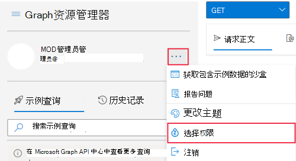
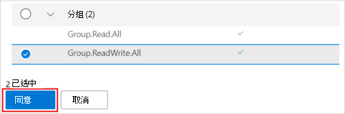
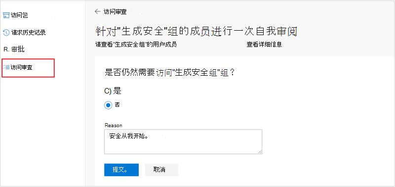

# <a name="tutorial-use-the-access-reviews-api-to-review-access-to-your-security-groups"></a>教程：使用访问评审 API 查看对安全组的访问权限

在本教程中，你将使用 Graph 资源管理器查看对租户中安全组的访问权限。

可以使用浏览器Graph Postman 尝试和测试访问评审 API 调用，然后再将它们自动化到脚本或应用中。 这通过帮助您正确定义和验证查询而无需重复重新编译应用程序来节省时间。

>[!NOTE]
>为了可读性，本教程中显示的响应对象可能会缩短。

## <a name="prerequisites"></a>先决条件

若要完成本教程，需要以下资源和权限：

+ 启用 Azure AD 或 EMS E5 许可证高级版 Azure AD 租户。
+ 以用户[Graph](https://developer.microsoft.com/graph/graph-explorer)登录资源管理器全局管理员角色。
  + [可选]启动新的 **隐身** 或 **InPrivate** 浏览器会话或在匿名浏览器中启动会话。 你将在本教程的稍后部分登录。
+ 以下委派权限 `AccessReview.ReadWrite.All` `Group.ReadWrite.All` ：、。

若要同意在浏览器浏览器中Graph权限：
1. 选择用户帐户详细信息右边的设置齿轮图标，然后选择"**选择权限"。**
   
   
   <!--:::image type="content" source="../images/../concepts/images/tutorial-accessreviews-api/settings.png" alt-text="Select the Microsoft Graph permissions":::-->

2. 滚动浏览这些权限的权限列表：
   + AccessReviews (3) ，展开，然后选择 **AccessReviews.ReadWrite.All**。
   + 将 (2) ，展开，然后选择 **Group.ReadWrite.All。**
  
    选择 **"** 同意"，然后在弹出窗口中选择"代表你的组织同意"，然后选择"接受"接受权限同意。
   
   
   <!--:::image type="content" source="../images/../concepts/images/tutorial-accessreviews-api/consentpermissions_M365.png" alt-text="Consent to the Microsoft Graph permissions":::-->

## <a name="step-1-create-test-users-in-your-tenant"></a>步骤 1：在租户内创建测试用户

通过运行下面的请求三次，每次更改 **displayName、mailNickname** 和 **userPrincipalName** 属性，创建三个新的测试用户。 记录 **其 ID。**

### <a name="request"></a>请求

```http
POST /users
Content-Type: application/json

{
    "accountEnabled": true,
    "displayName": "Aline Dupuy",
    "mailNickname": "AlineD",
    "userPrincipalName": "AlineD@contoso.com",
    "passwordProfile": {
        "forceChangePasswordNextSignIn": true,
        "password": "xWwvJ]6NMw+bWH-d"
    }
}
```

### <a name="response"></a>响应

```http
HTTP/1.1 201 Created
Content-type: application/json

{
    "@odata.context": "https://graph.microsoft.com/beta/$metadata#users/$entity",
    "id": "43b12b0c-ee2c-4257-96fe-505d823e06ab",
    "displayName": "Aline Dupuy",
    "mailNickname": "AlineD",
    "userPrincipalName": "AlineD@contoso.com",
    "userType": "Member"
}
```

## <a name="step-2-create-a-security-group-assign-owners-and-add-members"></a>步骤 2：创建安全组、分配所有者和添加成员

创建一个名为 **"生成安全** 组"的安全组，该组是本教程中访问评审的目标。 为此组分配两个组所有者和两个成员。 这些成员将是组所有者审查的主题。

### <a name="request"></a>请求
在此调用中，替换：
+ `010b2de0-0ed4-4ece-bfa2-22fff71d0497` 以及 `b828cc0e-4240-46ed-bb25-888744487e2d` 两 **个** 组所有者的 ID。
  + 其中一 **个 ID** 属于你在步骤 1 中创建的用户之一。
  + 另一个是你的 **id**。若要检索 **id，** 请运行 `GET` `https://graph.microsoft.com/beta/me` 。
+ `43b12b0c-ee2c-4257-96fe-505d823e06ab``859924d0-7115-422a-9ee8-ea8c0c014707`以及两个组的成员的 ID。 这些是在步骤 1 中创建的其他两个成员。

```http
POST https://graph.microsoft.com/beta/groups
Content-Type: application/json

{
    "description": "Building security group",
    "displayName": "Building security group",
    "groupTypes": [],
    "mailEnabled": false,
    "mailNickname": "buildingsecurity",
    "securityEnabled": true,
    "owners@odata.bind": [
        "https://graph.microsoft.com/beta/users/010b2de0-0ed4-4ece-bfa2-22fff71d0497",
        "https://graph.microsoft.com/beta/users/b828cc0e-4240-46ed-bb25-888744487e2d"
    ],
    "members@odata.bind": [
        "https://graph.microsoft.com/beta/users/43b12b0c-ee2c-4257-96fe-505d823e06ab",
        "https://graph.microsoft.com/beta/users/859924d0-7115-422a-9ee8-ea8c0c014707"
    ]
}
```

### <a name="response"></a>响应

```http
HTTP/1.1 201 Created
Content-type: application/json

{
    "@odata.context": "https://graph.microsoft.com/beta/$metadata#groups/$entity",
    "id": "825f1b5e-6fb2-4d9a-b393-d491101acc0c",
    "displayName": "Building security group",
    "groupTypes": []
}
```
在响应中，记录新组的 **ID，** 以在本教程的稍后部分使用它。

## <a name="step-3-create-an-access-review"></a>步骤 3：创建访问评审

使用下列设置为安全组的成员创建访问评审：
+ 这是一个自我审阅的访问评审。 在这种情况下，被审阅的用户将自行证明其访问组的需求。
+ 这是一次访问评审。 在这种情况下，授予访问权限后，用户无需在访问评审期间再次自证明。
+ 审阅范围仅限于构建 **安全组 的成员**。

### <a name="request"></a>请求
在此调用中，替换以下内容：
+ `825f1b5e-6fb2-4d9a-b393-d491101acc0c`具有 **"生成****安全组"的 ID。**
+ 作用域指定将审阅应用于"生成安全"组 **的所有组的成员**。 有关配置范围的更多选项，请参阅另 [请参阅部分](#see-also) 。
+ **startDate** 的值，其当前日期和 **endDate** 值，其日期为从开始日期起一年。

如果未能指定 **reviewers** 属性的值，则此访问评审被配置为具有审阅者的成员的自我审阅。

```http
POST https://graph.microsoft.com/beta/identityGovernance/accessReviews/definitions
Content-type: application/json

{
    "displayName": "One-time self-review for members of Building security group",
    "descriptionForAdmins": "One-time self-review for members of Building security group",
    "descriptionForReviewers": "One-time self-review for members of Building security group",
    "scope": {
        "query": "/groups/825f1b5e-6fb2-4d9a-b393-d491101acc0c/transitiveMembers",
        "queryType": "MicrosoftGraph"
    },
    "instanceEnumerationScope": {
        "query": "/groups/825f1b5e-6fb2-4d9a-b393-d491101acc0c",
        "queryType": "MicrosoftGraph"
    },
    "reviewers": [],
    "settings": {
        "mailNotificationsEnabled": true,
        "reminderNotificationsEnabled": true,
        "justificationRequiredOnApproval": true,
        "defaultDecisionEnabled": false,
        "defaultDecision": "Deny",
        "instanceDurationInDays": 0,
        "autoApplyDecisionsEnabled": true,
        "recommendationsEnabled": true,
        "recurrence": {
            "pattern": null,
            "range": {
                "type": "numbered",
                "numberOfOccurrences": 0,
                "recurrenceTimeZone": null,
                "startDate": "2021-02-09",
                "endDate": "2022-12-31"
            }
        },
        "applyActions": [
            {
                "@odata.type": "#microsoft.graph.removeAccessApplyAction"
            }
        ]
    }
}
```

### <a name="response"></a>响应

```http
HTTP/1.1 201 Created
Content-type: application/json

{
    "@odata.context": "https://graph.microsoft.com/beta/$metadata#identityGovernance/accessReviews/definitions/$entity",
    "id": "d7286a17-3a01-406a-b872-986b6b40317c",
    "displayName": "One-time self-review for members of Building security group",
    "status": "NotStarted",
    "createdBy": {
        "id": "b828cc0e-4240-46ed-bb25-888744487e2d",
        "displayName": "MOD Administrator",
        "userPrincipalName": "admin@contoso.com"
    },
    "scope": {
        "query": "/groups/825f1b5e-6fb2-4d9a-b393-d491101acc0c/transitiveMembers",
        "queryType": "MicrosoftGraph"
    },
    "instanceEnumerationScope": {
        "query": "/groups/825f1b5e-6fb2-4d9a-b393-d491101acc0c",
        "queryType": "MicrosoftGraph"
    },
    "reviewers": [],
    "backupReviewers": [],
    "settings": {
        "defaultDecisionEnabled": false,
        "defaultDecision": "Deny",
        "autoApplyDecisionsEnabled": true,
        "recommendationsEnabled": true,
        "recurrence": {
            "pattern": null,
            "range": {
                "type": "numbered",
                "numberOfOccurrences": 0,
                "recurrenceTimeZone": null,
                "startDate": "2021-02-09",
                "endDate": "2022-12-31"
            }
        },
        "applyActions": [
            {
                "@odata.type": "#microsoft.graph.removeAccessApplyAction"
            }
        ]
    }
}
```

## <a name="step-4-list-instances-of-the-access-review"></a>步骤 4：列出访问评审的实例

以下查询列出了访问评审定义的所有实例。 由于在步骤 3 中创建了一次访问评审，因此请求仅返回其 **id** 与访问定义的 id 相同的一 **个实例**。

### <a name="request"></a>请求
在此调用中， `d7286a17-3a01-406a-b872-986b6b40317c` 将 替换为步骤 3 中返回的访问评审定义的 ID。

```http
GET https://graph.microsoft.com/beta/identityGovernance/accessReviews/definitions/d7286a17-3a01-406a-b872-986b6b40317c/instances
```

### <a name="response"></a>响应

在此响应中， **访问** 评审实例的状态是 `InProgress` **，因为 startDateTime** 已过去 **，endDateTime** 在将来。 如果 **startDateTime** 在将来，则状态将为 `NotStarted` 。 另一方面，如果 **endDateTime** 过去，状态将为 `Completed` 。

```http
HTTP/1.1 200 OK
Content-type: application/json

{
    "@odata.context": "https://graph.microsoft.com/beta/$metadata#identityGovernance/accessReviews/definitions('d7286a17-3a01-406a-b872-986b6b40317c')/instances",
    "value": [
        {
            "id": "d7286a17-3a01-406a-b872-986b6b40317c",
            "startDateTime": "2021-02-10T15:09:40.153Z",
            "endDateTime": "2022-12-31T08:00:00Z",
            "status": "InProgress",
            "scope": {
                "query": "/groups/825f1b5e-6fb2-4d9a-b393-d491101acc0c/transitiveMembers",
                "queryType": "MicrosoftGraph"
            }
        }
    ]
}
```

## <a name="step-5-get-decisions"></a>步骤 5：获取决策

您有兴趣做出有关访问评审实例的决策。

### <a name="request"></a>请求
在此调用中， `d7286a17-3a01-406a-b872-986b6b40317c` 将 替换为步骤 3 中返回的访问评审定义的 ID。

```http
GET https://graph.microsoft.com/beta/identityGovernance/accessReviews/definitions/d7286a17-3a01-406a-b872-986b6b40317c/instances/d7286a17-3a01-406a-b872-986b6b40317c/decisions
```

### <a name="response"></a>响应

以下响应显示为评价实例做出的决定。

```http
HTTP/1.1 200 OK
Content-type: application/json

{
    "@odata.context": "https://graph.microsoft.com/beta/$metadata#identityGovernance/accessReviews/definitions('d7286a17-3a01-406a-b872-986b6b40317c')/instances('d7286a17-3a01-406a-b872-986b6b40317c')/decisions",
    "@odata.count": 2,
    "value": [
        {
            "id": "1c74f500-9082-4dfe-80ac-784a6edb71d7",
            "accessReviewId": "d7286a17-3a01-406a-b872-986b6b40317c",
            "decision": "NotReviewed",
            "applyResult": "New",
            "recommendation": "Approve",
            "reviewedBy": {
                "id": "00000000-0000-0000-0000-000000000000",
                "displayName": "",
                "userPrincipalName": ""
            },
            "appliedBy": {
                "id": "00000000-0000-0000-0000-000000000000",
                "displayName": "",
                "userPrincipalName": ""
            },
            "target": {
                "@odata.type": "#microsoft.graph.accessReviewInstanceDecisionItemUserTarget",
                "userId": "43b12b0c-ee2c-4257-96fe-505d823e06ab",
                "userDisplayName": "Alex Wilber",
                "userPrincipalName": "AlexW@contoso.com"
            },
            "principal": {
                "@odata.type": "#microsoft.graph.userIdentity",
                "id": "43b12b0c-ee2c-4257-96fe-505d823e06ab",
                "displayName": "Alex Wilber",
                "userPrincipalName": "AlexW@contoso.com"
            }
        },
        {
            "id": "7744be81-7d17-40c9-8fd3-c9072b1ccace",
            "accessReviewId": "d7286a17-3a01-406a-b872-986b6b40317c",
            "decision": "NotReviewed",
            "applyResult": "New",
            "recommendation": "Approve",
            "reviewedBy": {
                "id": "00000000-0000-0000-0000-000000000000",
                "displayName": "",
                "userPrincipalName": ""
            },
            "appliedBy": {
                "id": "00000000-0000-0000-0000-000000000000",
                "displayName": "",
                "userPrincipalName": ""
            },
            "target": {
                "@odata.type": "#microsoft.graph.accessReviewInstanceDecisionItemUserTarget",
                "userId": "859924d0-7115-422a-9ee8-ea8c0c014707",
                "userDisplayName": "Allan Deyoung",
                "userPrincipalName": "AllanD@contoso.com"
            },
            "principal": {
                "@odata.type": "#microsoft.graph.userIdentity",
                "id": "859924d0-7115-422a-9ee8-ea8c0c014707",
                "displayName": "Allan Deyoung",
                "userPrincipalName": "AllanD@contoso.com"
            }
        }
    ]
}
```

在调用中 **，decision** 属性的值为 `NotReviewed` 。 这是因为这两个成员都未完成自证明。 按照步骤 6 了解每个成员如何自行证明其访问评审需求。

## <a name="step-6-self-review-your-pending-access"></a>步骤 6：自行查看待定访问权限

在步骤 3 中，您将访问评审配置为自我审阅。 这意味着"生成安全"组的两个成员都必须自行证明其维护对组的访问权限需求。 您将以构建安全组的两个成员之一完成此步骤。

在此步骤中，您将执行以下操作：
1. 列出待处理的访问评审实例。
2. 完成访问评审自证明过程。

在隐身或 **InPrivate** 浏览模式下，或通过匿名浏览器启动新的浏览器会话，并作为构建安全组的两个成员之 **一登录**。  这样，你将不会作为用户中断当前会话，全局管理员角色。 或者，你可以中断当前会话，Graph资源管理器中注销并作为两个组的成员之一重新登录。

### <a name="list-your-pending-access-review-instances"></a>列出待处理的访问评审实例

在隐身浏览器会话和 Graph 资源管理器中，运行以下查询以列出待定访问评审实例：

#### <a name="request"></a>请求

```http
GET /me/pendingAccessReviewInstances
```

#### <a name="response"></a>响应
在下面的响应中，id 的用户 Alex  Wilber `43b12b0c-ee2c-4257-96fe-505d823e06ab` 有 1 个待自证明的访问评审。

```http
HTTP/1.1 200 OK
Content-type: application/json

{
    "@odata.context": "https://graph.microsoft.com/beta/$metadata#users('43b12b0c-ee2c-4257-96fe-505d823e06ab')/pendingAccessReviewInstances",
    "@odata.count": 1,
    "value": [
        {
            "id": "d7286a17-3a01-406a-b872-986b6b40317c",
            "startDateTime": "2021-02-10T15:09:40.153Z",
            "endDateTime": "2022-12-31T08:00:00Z",
            "status": "InProgress",
            "scope": {
                "query": "/groups/825f1b5e-6fb2-4d9a-b393-d491101acc0c/transitiveMembers",
                "queryType": "MicrosoftGraph"
            }
        }
    ]
}
```
在用户 `/me/pendingAccessReviewInstances` 上下文中使用调用有很多优点：
+ 不需要任何服务主体。 用户可以调用和读取其挂起的访问评审操作。
+ 小组件或 Intranet 页面上的插件，或作为后台服务运行的机器人或守护程序可以使用。 这些通知可以通知你新的访问评审或访问评审的更新。 

### <a name="complete-the-access-review-self-attestation"></a>完成访问评审自证明

在同一个隐身浏览器会话中，登录 https://myaccess.microsoft.com/ 以完成自证明。 从右侧导航栏中，选择 **访问评审** ，然后选择你的访问评审。 选择 **"是**，你仍然需要对构建安全 **组** 的访问权限"，输入原因，然后单击"提交 **"。**

   
   <!--:::image type="content" source="../images/../concepts/images/tutorial-accessreviews-api/selfattest.png" alt-text="Self-attest to access review":::-->

现在可以注销并退出无法识别的浏览器会话。

返回到你仍以全局管理员用户身份登录的主浏览器会话中，重复步骤 4 以查看已完成步骤 5 的成员的决策属性现在为 `Approve` 。

恭喜！ 你已创建访问评审并自行证明访问权限需求。 只需执行一次此操作，并保持访问权限，直到访问评审定义过期。

## <a name="step-7-clean-up-resources"></a>第 7 步：清理资源

删除为本教程创建的资源-**生成** 安全组、访问评审计划定义和三个测试用户。

### <a name="delete-the-security-group"></a>删除安全组

#### <a name="request"></a>请求
在此调用中，将 `825f1b5e-6fb2-4d9a-b393-d491101acc0c` 替换为"生成 **安全****组"的 ID。**

```http
DELETE https://graph.microsoft.com/beta/groups/825f1b5e-6fb2-4d9a-b393-d491101acc0c
```

#### <a name="response"></a>响应

```http
HTTP/1.1 204 No Content
Content-type: text/plain
```

### <a name="delete-the-access-review-definition"></a>删除访问评审定义

在此调用中， `d7286a17-3a01-406a-b872-986b6b40317c` 将 替换为 **访问** 评审定义的 ID。 由于访问评审计划定义是访问评审的蓝图，删除该定义将删除与访问评审相关的设置、实例和决策。

#### <a name="request"></a>请求
```http
DELETE https://graph.microsoft.com/beta/identityGovernance/accessReviews/definitions/d7286a17-3a01-406a-b872-986b6b40317c
```

#### <a name="response"></a>响应
```http
HTTP/1.1 204 No Content
Content-type: text/plain
```

### <a name="delete-the-three-test-users"></a>删除三个测试用户

#### <a name="request"></a>请求
在此调用中， `43b12b0c-ee2c-4257-96fe-505d823e06ab` 将 替换为 **测试** 用户的 ID。 对另外两个用户的 **ID** 重复这两次以删除它们。

```http
DELETE https://graph.microsoft.com/beta/users/43b12b0c-ee2c-4257-96fe-505d823e06ab
```

#### <a name="response"></a>响应

```http
HTTP/1.1 204 No Content
Content-type: text/plain
```


## <a name="see-also"></a>另请参阅

+ [访问评审 API 参考](/graph/api/resources/accessreviewsv2-root?view=graph-rest-beta&preserve-view=true)
+ [使用 Microsoft Graph API 配置访问评审定义的范围](/graph/accessreviews-scope-concept)
+ [访问评审概述和许可证要求](/azure/active-directory/governance/access-reviews-overview)
+ [创建对应用程序应用程序的组&评审](/azure/active-directory/governance/create-access-review)

