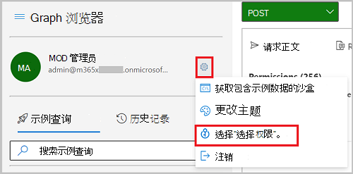
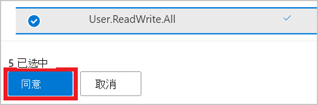
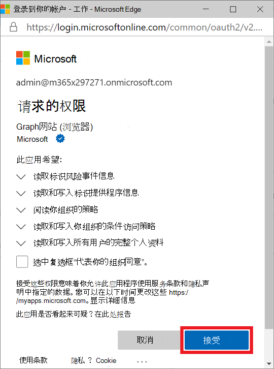
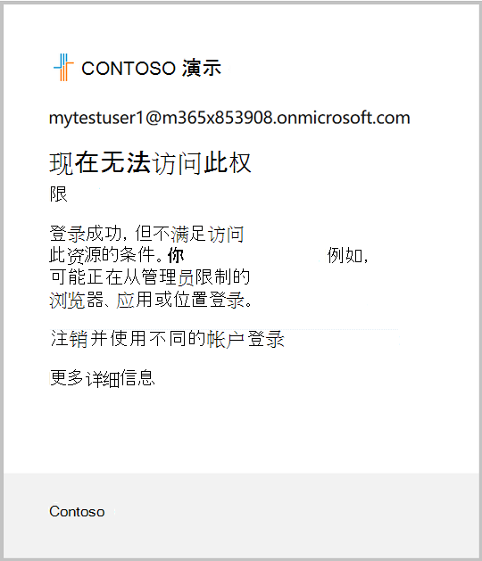

# <a name="tutorial-identify-and-remediate-risks-using-microsoft-graph-apis"></a><span data-ttu-id="d55bd-103">教程：使用 Microsoft Graph API 识别和修正风险</span><span class="sxs-lookup"><span data-stu-id="d55bd-103">Tutorial: Identify and remediate risks using Microsoft Graph APIs</span></span>

<span data-ttu-id="d55bd-104">Azure AD Identity Protection 使组织能够深入了解基于标识的风险以及调查和自动修正风险的不同方法。</span><span class="sxs-lookup"><span data-stu-id="d55bd-104">Azure AD Identity Protection provides organizations insight into identity-based risk and different ways to investigate and automatically remediate risk.</span></span> <span data-ttu-id="d55bd-105">本教程中使用的 Identity Protection API 可以帮助您识别风险，并配置工作流以确认泄露或启用修正。</span><span class="sxs-lookup"><span data-stu-id="d55bd-105">The Identity Protection APIs used in this tutorial can help you identify risk and configure a workflow to confirm compromise or enable remediation.</span></span> <span data-ttu-id="d55bd-106">有关详细信息，请参阅 [什么是风险？](/azure/active-directory/identity-protection/concept-identity-protection-risks)</span><span class="sxs-lookup"><span data-stu-id="d55bd-106">For more information, see [What is risk?](/azure/active-directory/identity-protection/concept-identity-protection-risks)</span></span>

<span data-ttu-id="d55bd-107">本教程介绍如何生成有风险的登录，以及如何使用要求多重身份验证和 MFA 身份验证的条件访问策略修正用户 (状态) 。</span><span class="sxs-lookup"><span data-stu-id="d55bd-107">In this tutorial, you learn how to generate a risky sign-in and remediate the risk status of the user with a conditional access policy that requires multi-factor authentication (MFA).</span></span> <span data-ttu-id="d55bd-108">可选部分展示了如何阻止用户也使用条件访问策略登录，并消除用户风险。</span><span class="sxs-lookup"><span data-stu-id="d55bd-108">An optional section shows you how to block the user from signing in also using a conditional access policy, and dismissing the user risk.</span></span>

><span data-ttu-id="d55bd-109">**注意：** 为了可读性，本教程中显示的响应对象可能会缩短。</span><span class="sxs-lookup"><span data-stu-id="d55bd-109">**Note:** The response objects shown in this tutorial might be shortened for readability.</span></span> 

## <a name="prerequisites"></a><span data-ttu-id="d55bd-110">先决条件</span><span class="sxs-lookup"><span data-stu-id="d55bd-110">Prerequisites</span></span>

<span data-ttu-id="d55bd-111">若要成功完成本教程，请确保满足以下先决条件：</span><span class="sxs-lookup"><span data-stu-id="d55bd-111">To successfully complete this tutorial, make sure that you have the required prerequisites:</span></span>

- <span data-ttu-id="d55bd-112">必须具有 Azure AD Premium P1 或 P2 许可证才能使用风险检测 API。</span><span class="sxs-lookup"><span data-stu-id="d55bd-112">You must have an Azure AD Premium P1 or P2 license to use the risk detection API.</span></span>
- <span data-ttu-id="d55bd-113">本教程使用 Tor 浏览器匿名登录 Azure 门户。</span><span class="sxs-lookup"><span data-stu-id="d55bd-113">This tutorial uses the Tor browser to sign in to the Azure portal anonymously.</span></span> <span data-ttu-id="d55bd-114">可以使用任何匿名浏览器来完成该任务。</span><span class="sxs-lookup"><span data-stu-id="d55bd-114">You can use any anonymous browser to accomplish the task.</span></span> <span data-ttu-id="d55bd-115">若要下载 Tor 浏览器，请参阅 [下载 Tor 浏览器](https://www.torproject.org/download/)。</span><span class="sxs-lookup"><span data-stu-id="d55bd-115">To download the Tor browser, see [Download Tor Browser](https://www.torproject.org/download/).</span></span>
- <span data-ttu-id="d55bd-116">本教程的前提是使用 Microsoft Graph Explorer，但是可以使用 Postman，也可以创建自己的客户端应用程序来调用 Microsoft Graph。</span><span class="sxs-lookup"><span data-stu-id="d55bd-116">This tutorial assumes that you are using Microsoft Graph Explorer, but you can use Postman, or create your own client app to call Microsoft Graph.</span></span> <span data-ttu-id="d55bd-117">如果要在本教程中调用 Microsoft Graph API，需要使用具有全局管理员角色和适当权限的帐户。</span><span class="sxs-lookup"><span data-stu-id="d55bd-117">To call the Microsoft Graph APIs in this tutorial, you need to use an account with the global administrator role and the appropriate permissions.</span></span> <span data-ttu-id="d55bd-118">完成以下步骤以在 Microsoft Graph Explorer 中设置权限：</span><span class="sxs-lookup"><span data-stu-id="d55bd-118">Complete the following steps to set permissions in Microsoft Graph Explorer:</span></span>
    1. <span data-ttu-id="d55bd-119">启动 [Microsoft Graph 浏览器](https://developer.microsoft.com/graph/graph-explorer)。</span><span class="sxs-lookup"><span data-stu-id="d55bd-119">Start [Microsoft Graph Explorer](https://developer.microsoft.com/graph/graph-explorer).</span></span>
    2. <span data-ttu-id="d55bd-120">选择“**使用 Microsoft 登录**”，然后使用 Azure AD 全局管理员账户登录。</span><span class="sxs-lookup"><span data-stu-id="d55bd-120">Select **Sign-In with Microsoft** and sign in using an Azure AD global administrator account.</span></span> <span data-ttu-id="d55bd-121">成功登录后，可在左侧窗格中看到用户帐户详细信息。</span><span class="sxs-lookup"><span data-stu-id="d55bd-121">After you successfully sign in, you can see the user account details in the left-hand pane.</span></span>
    3. <span data-ttu-id="d55bd-122">选择用户帐户详细信息右侧的设置图标，然后选择“**权限**”。</span><span class="sxs-lookup"><span data-stu-id="d55bd-122">Select the settings icon to the right of the user account details, and then select **Select permissions**.</span></span>

        
        
    4. <span data-ttu-id="d55bd-124">滚动浏览这些权限的权限列表：</span><span class="sxs-lookup"><span data-stu-id="d55bd-124">Scroll through the list of permissions to these permissions:</span></span>
        - <span data-ttu-id="d55bd-125">**IdentityRiskEvents (2) ，** 展开并选择 `IdentityRiskEvent.Read.All`</span><span class="sxs-lookup"><span data-stu-id="d55bd-125">**IdentityRiskEvents (2)**, expand and then select `IdentityRiskEvent.Read.All`</span></span>
        - <span data-ttu-id="d55bd-126">**IdentityRiskyUser (2) ，** 展开并选择 `IdentityRiskyUser.ReadWrite.All`</span><span class="sxs-lookup"><span data-stu-id="d55bd-126">**IdentityRiskyUser (2)**, expand and then select `IdentityRiskyUser.ReadWrite.All`</span></span>
        - <span data-ttu-id="d55bd-127">**策略 (13) ，** 展开，然后选择 `Policy.Read.All``Policy.ReadWrite.ConditionalAccess`</span><span class="sxs-lookup"><span data-stu-id="d55bd-127">**Policy (13)**, expand and then select `Policy.Read.All` and `Policy.ReadWrite.ConditionalAccess`</span></span>
        - <span data-ttu-id="d55bd-128">**用户 (8) ，** 展开并选择 `User.ReadWrite.All`</span><span class="sxs-lookup"><span data-stu-id="d55bd-128">**User (8)**, expand and then select `User.ReadWrite.All`</span></span>
        
        
    
    5. <span data-ttu-id="d55bd-130">选择“**同意**”，然后选择“**接受**”，以接受同意权限。</span><span class="sxs-lookup"><span data-stu-id="d55bd-130">Select **Consent**, and then select **Accept** to accept the consent of the permissions.</span></span> <span data-ttu-id="d55bd-131">你不需要代表组织同意这些权限。</span><span class="sxs-lookup"><span data-stu-id="d55bd-131">You do not need to consent on behalf of your organization for these permissions.</span></span>

        

## <a name="step-1-create-a-user-account"></a><span data-ttu-id="d55bd-133">步骤 1：创建用户帐户</span><span class="sxs-lookup"><span data-stu-id="d55bd-133">Step 1: Create a user account</span></span>

<span data-ttu-id="d55bd-134">对于本教程，你将创建用于测试风险检测的用户帐户。</span><span class="sxs-lookup"><span data-stu-id="d55bd-134">For this tutorial, you create a user account that is used to test risk detections.</span></span> <span data-ttu-id="d55bd-135">在请求正文中， `contoso.com` 更改为租户的域名。</span><span class="sxs-lookup"><span data-stu-id="d55bd-135">In the request body, change `contoso.com` to the domain name of your tenant.</span></span> <span data-ttu-id="d55bd-136">可在 Azure Active Directory 概述页面上找到租户信息。</span><span class="sxs-lookup"><span data-stu-id="d55bd-136">You can find tenant information on the Azure Active Directory overview page.</span></span>

### <a name="request"></a><span data-ttu-id="d55bd-137">请求</span><span class="sxs-lookup"><span data-stu-id="d55bd-137">Request</span></span>

``` http
POST https://graph.microsoft.com/v1.0/users
Content-type: application/json

{
  "accountEnabled":true,
  "displayName":"MyTestUser1",
  "mailNickname":"MyTestUser1",
  "userPrincipalName":"MyTestUser1@contoso.com",
  "passwordProfile": {
    "forceChangePasswordNextSignIn":true,
    "password":"Contoso1234"
  }
}
```

### <a name="response"></a><span data-ttu-id="d55bd-138">响应</span><span class="sxs-lookup"><span data-stu-id="d55bd-138">Response</span></span>

```http
{
  "@odata.context": "https://graph.microsoft.com/v1.0/$metadata#users/$entity",
  "id": "4628e7df-dff3-407c-a08f-75f08c0806dc",
  "businessPhones": [],
  "displayName": "MyTestUser1",
  "givenName": null,
  "jobTitle": null,
  "mail": null,
  "mobilePhone": null,
  "officeLocation": null,
  "preferredLanguage": null,
  "surname": null,
  "userPrincipalName": "MyTestUser1@contoso.com"
}
```

## <a name="step-2-trigger-a-risk-detection"></a><span data-ttu-id="d55bd-139">步骤 2：触发风险检测</span><span class="sxs-lookup"><span data-stu-id="d55bd-139">Step 2: Trigger a risk detection</span></span>

### <a name="trigger-a-risk-detection"></a><span data-ttu-id="d55bd-140">触发风险检测</span><span class="sxs-lookup"><span data-stu-id="d55bd-140">Trigger a risk detection</span></span>

<span data-ttu-id="d55bd-141">触发用户帐户风险检测的一种方式是匿名登录 Azure 门户。</span><span class="sxs-lookup"><span data-stu-id="d55bd-141">One way to trigger a risk detection on a user account is to sign in to the Azure portal anonymously.</span></span> <span data-ttu-id="d55bd-142">在本教程中，Tor 浏览器用于匿名登录。</span><span class="sxs-lookup"><span data-stu-id="d55bd-142">In this tutorial, the Tor browser is used to sign in anonymously.</span></span> 

1. <span data-ttu-id="d55bd-143">打开浏览器并输入 `portal.azure.com` 站点地址。</span><span class="sxs-lookup"><span data-stu-id="d55bd-143">Open the browser and enter `portal.azure.com` for the site address.</span></span>
2. <span data-ttu-id="d55bd-144">使用之前创建的 **MyTestUser1** 帐户的凭据登录门户。</span><span class="sxs-lookup"><span data-stu-id="d55bd-144">Sign in to the portal using the credentials for the **MyTestUser1** account that you previously created.</span></span> <span data-ttu-id="d55bd-145">将要求您更改现有密码。</span><span class="sxs-lookup"><span data-stu-id="d55bd-145">You will be asked to change the existing password.</span></span>

### <a name="list-risk-detections"></a><span data-ttu-id="d55bd-146">列出风险检测</span><span class="sxs-lookup"><span data-stu-id="d55bd-146">List risk detections</span></span>

<span data-ttu-id="d55bd-147">使用匿名浏览器登录 Azure 门户时， `anonymizedIPAddress` 检测到风险事件。</span><span class="sxs-lookup"><span data-stu-id="d55bd-147">When you signed in to the Azure portal using the anonymous browser, an `anonymizedIPAddress` risk event was detected.</span></span> <span data-ttu-id="d55bd-148">查询参数可用于 `$filter` 仅获取与 **MyTestUser1** 用户帐户关联的风险检测。</span><span class="sxs-lookup"><span data-stu-id="d55bd-148">You can use the `$filter` query parameter to get only the risk detections that are associated with the **MyTestUser1** user account.</span></span>

#### <a name="request"></a><span data-ttu-id="d55bd-149">请求</span><span class="sxs-lookup"><span data-stu-id="d55bd-149">Request</span></span>

``` http
GET https://graph.microsoft.com/v1.0/identityProtection/riskDetections?$filter=userDisplayName eq 'MyTestUser1'
```

#### <a name="response"></a><span data-ttu-id="d55bd-150">响应</span><span class="sxs-lookup"><span data-stu-id="d55bd-150">Response</span></span>

```http
{
  "@odata.context": "https://graph.microsoft.com/v1.0/$metadata#riskDetections",
  "value": [
    {
      "id": "d52a631815aaa527bf642b196715da5cf0f35b6879204ea5b5c99b21bd4c16f4",
      "requestId": "06f7fd18-b8f1-407d-86a3-f6cbe3a4be00",
      "correlationId": "2a38abff-5701-4073-a81e-fd3aac09cba3",
      "riskType": "anonymizedIPAddress",
      "riskEventType": "anonymizedIPAddress",
      "riskState": "atRisk",
      "riskLevel": "medium",
      "riskDetail": "none",
      "source": "IdentityProtection",
      "detectionTimingType": "realtime",
      "activity": "signin",
      "tokenIssuerType": "AzureAD",
      "ipAddress": "178.17.170.23",
      "activityDateTime": "2020-11-03T20:51:34.6245276Z",
      "detectedDateTime": "2020-11-03T20:51:34.6245276Z",
      "lastUpdatedDateTime": "2020-11-03T20:53:12.1984203Z",
      "userId": "4628e7df-dff3-407c-a08f-75f08c0806dc",
      "userDisplayName": "MyTestUser1",
      "userPrincipalName": "MyTestUser1@contoso.com",
      "additionalInfo": "[{\"Key\":\"userAgent\",\"Value\":\"Mozilla/5.0 (Windows NT 10.0; rv:78.0) Gecko/20100101 Firefox/78.0\"}]",
      "location": {
        "city": "Chisinau",
        "state": "Chisinau",
        "countryOrRegion": "MD",
        "geoCoordinates": {
          "latitude": 47.0269,
          "longitude": 28.8416
        }
      }
    }
  ]
}
```

> <span data-ttu-id="d55bd-151">**注意：** 可能需要几分钟时间才能返回事件。</span><span class="sxs-lookup"><span data-stu-id="d55bd-151">**Note:** It may take a few minutes for the event to be returned.</span></span>

## <a name="step-3-create-a-conditional-access-policy"></a><span data-ttu-id="d55bd-152">步骤 3：创建条件访问策略</span><span class="sxs-lookup"><span data-stu-id="d55bd-152">Step 3: Create a conditional access policy</span></span>

<span data-ttu-id="d55bd-153">可以在组织中利用条件访问策略，以允许用户在检测到风险时进行自我修正。</span><span class="sxs-lookup"><span data-stu-id="d55bd-153">You can leverage conditional access policies in your organization to allow users to self-remediate when risk is detected.</span></span> <span data-ttu-id="d55bd-154">利用自修正功能，用户可以在完成策略提示后取消阻止自己安全地访问其资源。</span><span class="sxs-lookup"><span data-stu-id="d55bd-154">Self-remediation enables your users to unblock themselves to access their resources securely after completing the policy prompt.</span></span> <span data-ttu-id="d55bd-155">在此步骤中，将创建一个条件访问策略，要求用户在出现中等或高风险检测时使用 MFA 登录。</span><span class="sxs-lookup"><span data-stu-id="d55bd-155">In this step, you create a conditional access policy that requires the user to sign in using MFA if a medium or high risk detection occurs.</span></span>

### <a name="set-up-multi-factor-authentication"></a><span data-ttu-id="d55bd-156">设置多重身份验证</span><span class="sxs-lookup"><span data-stu-id="d55bd-156">Set up multi-factor authentication</span></span>

<span data-ttu-id="d55bd-157">为 MFA 设置帐户时，可以从多种方法中选择用于验证用户的方法。</span><span class="sxs-lookup"><span data-stu-id="d55bd-157">When setting up an account for MFA, you can choose from several methods for authenticating the user.</span></span> <span data-ttu-id="d55bd-158">选择最适合你的情况来完成本教程的方法。</span><span class="sxs-lookup"><span data-stu-id="d55bd-158">Choose the best method for your situation to complete this tutorial.</span></span> 

1. <span data-ttu-id="d55bd-159">使用 **MyTestUser1** [帐户](https://aka.ms/MFASetup)登录 以保持帐户安全网站。</span><span class="sxs-lookup"><span data-stu-id="d55bd-159">Sign in the to the [keep your account secure](https://aka.ms/MFASetup) site using the **MyTestUser1** account.</span></span>
2. <span data-ttu-id="d55bd-160">使用适用于你的情况的方法完成 MFA 设置过程，例如向手机发送短信。</span><span class="sxs-lookup"><span data-stu-id="d55bd-160">Complete the MFA setup procedure using the appropriate method for your situation, such as having a text message sent to your phone.</span></span>

### <a name="create-the-conditional-access-policy"></a><span data-ttu-id="d55bd-161">创建条件访问策略</span><span class="sxs-lookup"><span data-stu-id="d55bd-161">Create the conditional access policy</span></span>

<span data-ttu-id="d55bd-162">条件访问策略提供设置策略条件以确定登录风险级别的能力。</span><span class="sxs-lookup"><span data-stu-id="d55bd-162">The conditional access policy provides the ability to set the conditions of the policy to identify sign-in risk levels.</span></span> <span data-ttu-id="d55bd-163">风险级别可以是 `low` `medium` `high` `none` 、、、。</span><span class="sxs-lookup"><span data-stu-id="d55bd-163">Risk levels can be `low`, `medium`, `high`, `none`.</span></span> <span data-ttu-id="d55bd-164">在列出 **MyTestUser1** 的风险检测返回的响应中，可以看到风险级别为 `medium` 。</span><span class="sxs-lookup"><span data-stu-id="d55bd-164">In the response that was returned from listing the risk detections for **MyTestUser1**, we can see that the risk level is `medium`.</span></span> <span data-ttu-id="d55bd-165">此示例演示如何要求被标识为风险用户的 **MyTestUser1** 进行 MFA。</span><span class="sxs-lookup"><span data-stu-id="d55bd-165">This example shows how to require MFA for **MyTestUser1** who was identified as a risky user.</span></span>

#### <a name="request"></a><span data-ttu-id="d55bd-166">请求</span><span class="sxs-lookup"><span data-stu-id="d55bd-166">Request</span></span> 

```http
POST https://graph.microsoft.com/v1.0/identity/conditionalAccess/policies 
Content-type: application/json
 
{ 
  "displayName": "Policy for risky sign-in", 
  "state": "enabled", 
  "conditions": { 
    "signInRiskLevels": [ 
      "high", 
      "medium" 
    ], 
    "applications": { 
      "includeApplications": ["All"]
    }, 
    "users": { 
      "includeUsers": [ 
        "4628e7df-dff3-407c-a08f-75f08c0806dc" 
      ] 
    } 
  }, 
  "grantControls": { 
    "operator": "OR", 
    "builtInControls": [ 
      "mfa" 
    ] 
  } 
} 
```

#### <a name="response"></a><span data-ttu-id="d55bd-167">响应</span><span class="sxs-lookup"><span data-stu-id="d55bd-167">Response</span></span> 

```
{ 
  "@odata.context": "https://graph.microsoft.com/v1.0/$metadata#identity/conditionalAccess/policies/$entity", 
  "id": "9ad78153-b1f8-4714-adc1-1445727678a8", 
  "displayName": "Policy for risky sign-in", 
  "createdDateTime": "2020-11-03T20:56:38.6210843Z", 
  "modifiedDateTime": null, 
  "state": "enabled", 
  "sessionControls": null, 
  "conditions": { 
    "signInRiskLevels": [ 
      "high", 
      "medium" 
    ], 
    "clientAppTypes": [  
      "all"  
    ], 
    "platforms": null, 
    "locations": null, 
    "applications": { 
      "includeApplications": [ 
        "All" 
      ], 
      "excludeApplications": [], 
      "includeUserActions": [] 
    }, 
    "users": { 
      "includeUsers": [ 
        "4628e7df-dff3-407c-a08f-75f08c0806dc" 
      ], 
      "excludeUsers": [], 
      "includeGroups": [], 
      "excludeGroups": [], 
      "includeRoles": [], 
      "excludeRoles": [] 
    } 
  }, 
  "grantControls": { 
    "operator": "OR", 
    "builtInControls": [ 
      "mfa" 
    ], 
    "customAuthenticationFactors": [], 
    "termsOfUse": [] 
  } 
} 
```

<span data-ttu-id="d55bd-168">在设置此条件访问策略后，现在需要 **MyTestUser1** 帐户在登录时使用 MFA，因为登录风险级别为中或   高。</span><span class="sxs-lookup"><span data-stu-id="d55bd-168">With this conditional access policy in place, the **MyTestUser1** account is now required to use MFA when signing in because the sign-in risk level is medium or high.</span></span> 

### <a name="sign-in-and-complete-multi-factor-authentication"></a><span data-ttu-id="d55bd-169">登录并完成多重身份验证</span><span class="sxs-lookup"><span data-stu-id="d55bd-169">Sign in and complete multi-factor authentication</span></span> 

<span data-ttu-id="d55bd-170">通过登录匿名浏览器，将检测到风险，但会通过完成 MFA 进行修正。</span><span class="sxs-lookup"><span data-stu-id="d55bd-170">By signing in to the anonymous browser, a risk is detected, but it is remediated by completing MFA.</span></span> 

1. <span data-ttu-id="d55bd-171">打开浏览器并输入  `portal.azure.com`   站点地址。</span><span class="sxs-lookup"><span data-stu-id="d55bd-171">Open the browser and enter `portal.azure.com` for the site address.</span></span> 
2. <span data-ttu-id="d55bd-172">使用 **MyTestUser1** 帐户的凭据登录门户并   完成 MFA 过程。</span><span class="sxs-lookup"><span data-stu-id="d55bd-172">Sign in to the portal using the credentials for the **MyTestUser1** account and complete the MFA process.</span></span> 

### <a name="list-risk-detections"></a><span data-ttu-id="d55bd-173">列出风险检测</span><span class="sxs-lookup"><span data-stu-id="d55bd-173">List risk detections</span></span>

<span data-ttu-id="d55bd-174">因为 MFA 已完成。</span><span class="sxs-lookup"><span data-stu-id="d55bd-174">Because MFA was completed.</span></span> <span data-ttu-id="d55bd-175">现在，当你列出风险检测时 **，riskState** 将事件显示为 `remediated` 。</span><span class="sxs-lookup"><span data-stu-id="d55bd-175">Now, when you list risk detections the **riskState** shows the event as `remediated`.</span></span>

#### <a name="request"></a><span data-ttu-id="d55bd-176">请求</span><span class="sxs-lookup"><span data-stu-id="d55bd-176">Request</span></span>

``` http
GET https://graph.microsoft.com/v1.0/identityProtection/riskDetections?$filter=userDisplayName eq 'MyTestUser1'
```

#### <a name="response"></a><span data-ttu-id="d55bd-177">响应</span><span class="sxs-lookup"><span data-stu-id="d55bd-177">Response</span></span>

```http
{
  "id": "ba9d45f16d8f87f6ae974efda7336b2120962a398cb362dfd9e5bdc8e9d149d0",
  "requestId": "156c01fb-31cf-4a10-b9a9-beee93e6a400",
  "correlationId": "a8aaac45-fe22-46df-babf-10a8dba85d62",
  "riskType": "anonymizedIPAddress",
  "riskEventType": "anonymizedIPAddress",
  "riskState": "remediated",
  "riskLevel": "medium",
  "riskDetail": "userPassedMFADrivenByRiskBasedPolicy",
  "source": "IdentityProtection",
  "detectionTimingType": "realtime",
  "activity": "signin",
  "tokenIssuerType": "AzureAD",
  "ipAddress": "185.220.101.213",
  "activityDateTime": "2020-11-12T23:45:22.4092789Z",
  "detectedDateTime": "2020-11-12T23:45:22.4092789Z",
  "lastUpdatedDateTime": "2020-11-12T23:47:57.7831423Z",
  "userId": "4b608561-9258-44ba-8cdb-3286dcbf0e3b",
  "userDisplayName": "MyTestUser1",
  "userPrincipalName": "MyTestUser1@contoso.com",
    "additionalInfo": "[{\"Key\":\"userAgent\",\"Value\":\"Mozilla/5.0 (Windows NT 10.0; rv:78.0) Gecko/20100101 Firefox/78.0\"}]",
  "location": {
    "city": "Schoenwalde-Glien",
    "state": "Brandenburg",
    "countryOrRegion": "DE",
    "geoCoordinates": {
      "latitude": 52.61983,
      "longitude": 13.12743
    }
  }
}
```

## <a name="step-4-optional-block-the-user-from-signing-in"></a><span data-ttu-id="d55bd-178">步骤 4 (可选) 阻止用户登录</span><span class="sxs-lookup"><span data-stu-id="d55bd-178">Step 4 (Optional) Block the user from signing in</span></span>

<span data-ttu-id="d55bd-179">你可以阻止用户登录，而不是为用户提供自行修正的机会。</span><span class="sxs-lookup"><span data-stu-id="d55bd-179">Instead of providing the opportunity for the user to self-remediate, you can block the user from signing in.</span></span> <span data-ttu-id="d55bd-180">在此步骤中，您将创建一个新的条件访问策略，在出现中等或高风险检测时阻止用户登录。</span><span class="sxs-lookup"><span data-stu-id="d55bd-180">In this step, you create a new conditional access policy that blocks the user from signing in if a medium or high risk detection occurs.</span></span> <span data-ttu-id="d55bd-181">策略中的区别在于 **，builtInControls** 设置为 `block` 。</span><span class="sxs-lookup"><span data-stu-id="d55bd-181">The difference in policies is that the **builtInControls** is set to `block`.</span></span>

### <a name="request"></a><span data-ttu-id="d55bd-182">请求</span><span class="sxs-lookup"><span data-stu-id="d55bd-182">Request</span></span>

```http
POST https://graph.microsoft.com/v1.0/identity/conditionalAccess/policies
Content-type: application/json

{
  "displayName": "Policy for risky sign-in block access",
  "state": "enabled",
  "conditions": {
    "signInRiskLevels": [
      "high",
      "medium"
    ],
    "applications": {
      "includeApplications": ["All"]
    },
    "users": {
      "includeUsers": [
        "4628e7df-dff3-407c-a08f-75f08c0806dc"
      ]
    }
  },
  "grantControls": {
    "operator": "OR",
    "builtInControls": [
      "block"
    ]
  }
}
```

### <a name="response"></a><span data-ttu-id="d55bd-183">响应</span><span class="sxs-lookup"><span data-stu-id="d55bd-183">Response</span></span>

```http
{
  "@odata.context": "https://graph.microsoft.com/v1.0/$metadata#identity/conditionalAccess/policies/$entity",
  "id": "9ad78153-b1f8-4714-adc1-1445727678a8",
  "displayName": "Policy for risky sign-in block access",
  "createdDateTime": "2020-11-03T20:56:38.6210843Z",
  "modifiedDateTime": null,
  "state": "enabled",
  "sessionControls": null,
  "conditions": {
    "signInRiskLevels": [
      "high",
      "medium"
    ],
    "clientAppTypes": [ 
      "all" 
    ],
    "platforms": null,
    "locations": null,
    "applications": {
      "includeApplications": [
        "All"
      ],
      "excludeApplications": [],
      "includeUserActions": []
    },
    "users": {
      "includeUsers": [
        "4628e7df-dff3-407c-a08f-75f08c0806dc"
      ],
      "excludeUsers": [],
      "includeGroups": [],
      "excludeGroups": [],
      "includeRoles": [],
      "excludeRoles": []
    }
  },
  "grantControls": {
    "operator": "OR",
    "builtInControls": [
      "block"
    ],
    "customAuthenticationFactors": [],
    "termsOfUse": []
  }
}
```

<span data-ttu-id="d55bd-184">在设置此条件访问策略后 **，MyTestUser1** 帐户现在被阻止登录，因为登录风险级别是 `medium` 或 `high` 。</span><span class="sxs-lookup"><span data-stu-id="d55bd-184">With this conditional access policy in place, the **MyTestUser1** account is now blocked from signing in because the sign-in risk level is `medium` or `high`.</span></span>



## <a name="step-5-dismiss-risky-users"></a><span data-ttu-id="d55bd-186">步骤 5：消除有风险的用户</span><span class="sxs-lookup"><span data-stu-id="d55bd-186">Step 5: Dismiss risky users</span></span>

<span data-ttu-id="d55bd-187">如果您认为用户没有风险，并且不希望强制执行条件访问策略，您可以手动消除存在风险的用户。</span><span class="sxs-lookup"><span data-stu-id="d55bd-187">If you believe the user is not at risk, and you don’t want to enforce a conditional access policy, you can manually dismiss the risky user.</span></span>

### <a name="dismiss-the-risky-user"></a><span data-ttu-id="d55bd-188">消除有风险的用户</span><span class="sxs-lookup"><span data-stu-id="d55bd-188">Dismiss the risky user</span></span>

#### <a name="request"></a><span data-ttu-id="d55bd-189">请求</span><span class="sxs-lookup"><span data-stu-id="d55bd-189">Request</span></span>

```http
POST https://graph.microsoft.com/v1.0/identityProtection/riskyUsers/dismiss
Content-Type: application/json

{
  "userIds": [
    "4628e7df-dff3-407c-a08f-75f08c0806dc"
  ]
}
```

#### <a name="response"></a><span data-ttu-id="d55bd-190">响应</span><span class="sxs-lookup"><span data-stu-id="d55bd-190">Response</span></span>

```http
HTTP/1.1 204 No Content
```        

### <a name="list-risky-users"></a><span data-ttu-id="d55bd-191">列出有风险的用户</span><span class="sxs-lookup"><span data-stu-id="d55bd-191">List risky users</span></span>

<span data-ttu-id="d55bd-192">消除风险用户后，在列出存在风险的用户时，可以在响应中看到 **MyTestUser1** 用户帐户现在的风险级别为 `none` ，riskState 为 `dismissed` 。</span><span class="sxs-lookup"><span data-stu-id="d55bd-192">After dismissing the risk user, you can see in the response when listing risky users that the **MyTestUser1** user account now has a risk level of `none` and a riskState of `dismissed`.</span></span>

#### <a name="request"></a><span data-ttu-id="d55bd-193">请求</span><span class="sxs-lookup"><span data-stu-id="d55bd-193">Request</span></span>

```http
GET https://graph.microsoft.com/v1.0/identityProtection/riskyUsers?$filter=userDisplayName eq 'MyTestUser1'
```

#### <a name="response"></a><span data-ttu-id="d55bd-194">响应</span><span class="sxs-lookup"><span data-stu-id="d55bd-194">Response</span></span>

```http
{
  "@odata.context": "https://graph.microsoft.com/beta/$metadata#riskyUsers",
  "value": [
    {
      "id": "4628e7df-dff3-407c-a08f-75f08c0806dc",
      "isDeleted": false,
      "isProcessing": false,
      "riskLevel": "none",
      "riskState": "dismissed",
      "riskDetail": "adminDismissedAllRiskForUser",
      "riskLastUpdatedDateTime": "2020-11-03T21:48:53.4298425Z",
      "userDisplayName": "MyTestUser1",
      "userPrincipalName": "MyTestUser1@contoso.com"
    }
  ]
}
```

## <a name="step-6-clean-up-resources"></a><span data-ttu-id="d55bd-195">步骤 6：清理资源</span><span class="sxs-lookup"><span data-stu-id="d55bd-195">Step 6: Clean up resources</span></span>

<span data-ttu-id="d55bd-196">在此步骤中，将删除创建的资源。</span><span class="sxs-lookup"><span data-stu-id="d55bd-196">In this step, you remove the resources that you created.</span></span>

### <a name="delete-the-user-account"></a><span data-ttu-id="d55bd-197">删除用户账户</span><span class="sxs-lookup"><span data-stu-id="d55bd-197">Delete the user account</span></span>

<span data-ttu-id="d55bd-198">删除 **MyTestUser1** 用户帐户。</span><span class="sxs-lookup"><span data-stu-id="d55bd-198">Delete the **MyTestUser1** user account.</span></span>

#### <a name="request"></a><span data-ttu-id="d55bd-199">请求</span><span class="sxs-lookup"><span data-stu-id="d55bd-199">Request</span></span>

```http
DELETE https://graph.microsoft.com/v1.0/users/4628e7df-dff3-407c-a08f-75f08c0806dc
```

#### <a name="response"></a><span data-ttu-id="d55bd-200">响应</span><span class="sxs-lookup"><span data-stu-id="d55bd-200">Response</span></span>

```http
No Content - 204
```

### <a name="delete-the-conditional-access-policy"></a><span data-ttu-id="d55bd-201">删除条件访问策略</span><span class="sxs-lookup"><span data-stu-id="d55bd-201">Delete the conditional access policy</span></span>

<span data-ttu-id="d55bd-202">删除创建的条件访问策略。</span><span class="sxs-lookup"><span data-stu-id="d55bd-202">Delete the conditional access policy that you created.</span></span>

#### <a name="request"></a><span data-ttu-id="d55bd-203">请求</span><span class="sxs-lookup"><span data-stu-id="d55bd-203">Request</span></span>

```http
DELETE https://graph.microsoft.com/v1.0/groups/9ad78153-b1f8-4714-adc1-1445727678a8
```

#### <a name="response"></a><span data-ttu-id="d55bd-204">响应</span><span class="sxs-lookup"><span data-stu-id="d55bd-204">Response</span></span>

```http
No Content - 204
```

## <a name="see-also"></a><span data-ttu-id="d55bd-205">另请参阅</span><span class="sxs-lookup"><span data-stu-id="d55bd-205">See also</span></span>

<span data-ttu-id="d55bd-206">在本教程中，你使用了许多 API 来完成任务。</span><span class="sxs-lookup"><span data-stu-id="d55bd-206">In this tutorial, you used many APIs to accomplish tasks.</span></span> <span data-ttu-id="d55bd-207">浏览这些 API 的 API 参考，详细了解 API 可以执行哪些操作。</span><span class="sxs-lookup"><span data-stu-id="d55bd-207">Explore the API reference for these APIs to learn more about what the APIs can do.</span></span>

- [<span data-ttu-id="d55bd-208">什么是标识保护？</span><span class="sxs-lookup"><span data-stu-id="d55bd-208">What is Identity Protection?</span></span>](/azure/active-directory/identity-protection/overview-identity-protection)
- [<span data-ttu-id="d55bd-209">什么是条件访问？</span><span class="sxs-lookup"><span data-stu-id="d55bd-209">What is Conditional Access?</span></span>](/azure/active-directory/conditional-access/overview)
- [<span data-ttu-id="d55bd-210">工作原理：Azure 多重身份验证</span><span class="sxs-lookup"><span data-stu-id="d55bd-210">How it works: Azure Multi-Factor Authentication</span></span>](/azure/active-directory/authentication/concept-mfa-howitworks)
- [<span data-ttu-id="d55bd-211">conditionalAccessPolicy</span><span class="sxs-lookup"><span data-stu-id="d55bd-211">conditionalAccessPolicy</span></span>](/graph/api/resources/conditionalaccesspolicy?view=graph-rest-1.0)
- [<span data-ttu-id="d55bd-212">riskDetection</span><span class="sxs-lookup"><span data-stu-id="d55bd-212">riskDetection</span></span>](/graph/api/resources/riskdetection?view=graph-rest-1.0)
- [<span data-ttu-id="d55bd-213">riskyUser</span><span class="sxs-lookup"><span data-stu-id="d55bd-213">riskyUser</span></span>](/graph/api/resources/riskyuser?view=graph-rest-1.0)
- [<span data-ttu-id="d55bd-214">user</span><span class="sxs-lookup"><span data-stu-id="d55bd-214">user</span></span>](/graph/api/resources/user?view=graph-rest-1.0)
