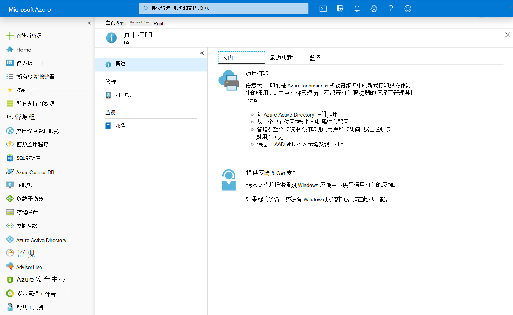

# 通用打印云打印 API 概述

通用打印是一种新式打印解决方案，组织可以使用它通过 Microsoft 云服务来管理自己的打印基础设施。

## 为什么要使用通用打印？

通用打印将关键的 Windows Server 打印功能迁移到 Microsoft 365 云中，这样组织就不再需要本地打印服务器，也不需要在设备上安装打印机驱动程序。 此外，通用打印还带来了一些关键功能，如用于授予打印机访问权限的安全组、基于位置的打印机发现和丰富的管理员体验。

随着组织采用通用打印，组织和独立软件供应商 (ISV) 可使用 Microsoft Graph 中的通用打印 API 来生成和扩展应用程序，从而支持新方案。

### 从 Web 和移动应用打印文档

将打印基础设施迁移到云中，可直接从 Web 和移动应用打印文档。
- 用户可将打印作业提交到 printerShare。
- 打印机管理员还可将打印作业提交到打印机，以便在与组织共享打印机之前执行初步测试。

请按照以下步骤将打印作业提交到 printerShare：

1. [创建打印作业](/graph/api/printershare-post-jobs)，并存储生成的文档 ID。
2. 为文档[创建 uploadSession](/graph/api/printdocument-createuploadsession) 
3. [将字节上传到已创建的上传会话中](./upload-data-to-upload-session.md)
4. [启动打印作业](/graph/api/printjob-start)。

### 管理打印机

跟踪组织的打印机、打印机配置和打印机使用情况是一项很复杂的任务。 通用打印 API 可以在所有三个方面实现集成。

* 使用 [列出打印机](/graph/api/print-list-printers)和 [printerStatus](/graph/api/resources/printerstatus)，**监视打印机状态、配置和可用性**。

* 使用报告 API，**了解谁在使用打印机以及打印进度**：
  * [列出 dailyPrintUsageByUser](/graph/api/reportroot-list-dailyprintusagebyuser)
  * [列出 monthlyPrintUsageByUser](/graph/api/reportroot-list-monthlyprintusagebyuser)
  * [列出 dailyPrintUsageByPrinter](/graph/api/reportroot-list-dailyprintusagebyprinter)
  * [列出 monthlyPrintUsageByPrinter](/graph/api/reportroot-list-monthlyprintusagebyprinter)

* 通过修改打印机上的用户和组成员资格，**配置用户权限**：
  * [列出 allowedUsers](/graph/api/printershare-list-allowedusers)
  * [添加 allowedUser](/graph/api/printershare-post-allowedusers)
  * [删除 allowedUser](/graph/api/printershare-delete-alloweduser)
  * [列出 allowedGroups](/graph/api/printershare-list-allowedgroups)
  * [添加 allowedGroup](/graph/api/printershare-post-allowedgroups)
  * [删除 allowedGroup](/graph/api/printershare-delete-allowedgroup)

### 无缝更换或更新打印机硬件

用户只能看到[共享](/graph/api/print-post-shares)的打印机，这样管理员可以精细地控制哪个打印机硬件在给定时间可用。

共享打印机会创建 [printerShare](/graph/api/resources/printershare) 资源，它可随时更新为指向其他打印机，这样就能轻松更换损坏的打印机硬件，或让打印机脱机接受维护。

若要在应用程序中使用此功能，请使用[更新 printerShare](/graph/api/printershare-update) 来更新 printerShare 的 `printer` 引用。

### 扩展通用打印以支持拉取打印

Microsoft Graph 通用打印 API 使你的应用程序能够支持拉取打印。若要设置拉取打印，你需要注册触发器，以便在发生某些打印事件（例如正在启动打印作业）时通知应用程序（通过服务到服务通信）。

这些触发器可使应用程序中断打印工作流，以执行将作业重定向到其他打印机和修改文档负载等操作。

按以下步骤启用拉取打印：

1. 使用应用程序权限[创建 printTaskDefinition](/graph/api/print-post-taskdefinitions)。 此抽象任务定义将用于创建为应用程序保留作业的任务。 你需要为每个租户定义至少一个任务定义，可使用任务触发器将其与租户中任意数量的打印机关联（参阅步骤 4）。

2. 使用管理员身份验证令牌和 `null` **physicalDeviceId** [注册一个或多个虚拟打印机](/graph/api/printer-create)。 “虚拟打印机”只是通用打印中没有连接物理设备的打印机对象。 通常，用户将打印到虚拟打印机，然后在物理打印设备上执行打印作业。 请参阅步骤 6。

3. 使用应用程序权限和 `application/ipp` 介质类型[更新虚拟打印机的属性](/graph/api/printer-update)（参阅示例）。

4. 使用将任务定义与虚拟打印机相关联的管理员身份验证令牌来[为虚拟打印机创建任务触发器](/graph/api/printer-post-tasktriggers)。 用于生成访问令牌的应用 ID 应与用于创建任务定义的应用 ID 相同。

5. 将打印作业提交到虚拟打印机后，由于 [printTaskTrigger](/graph/api/resources/printtasktrigger)，它将暂停。 将根据关联的 [printTaskDefinition](/graph/api/resources/printtaskdefinition) 创建状态为 `processing` 的 [printTask](/graph/api/resources/printtask)。

6. 当用户在物理打印机设备上刷卡时，打印机将通知你的应用程序。 此时，应用程序可以[获取关联虚拟打印机的作业](/graph/api/printer-list-jobs)，并将列表筛选为当前用户创建的作业。

7. 当用户选择要打印的一个或多个作业时，应用程序可以[将打印作业重定向到物理打印机](/graph/api/printjob-redirect)，作业将开始打印！ 仅当关联打印机上有一个 [printTask](/graph/api/resources/printtask) 处于 `processing` 状态时，重定向调用才会成功，该打印机是由此应用在步骤 4 中创建的触发器启动的。 重定向任务后，该任务将自动设置为 `completed` 状态。

## API 参考
在查找此服务的 API 参考？

- [Microsoft Graph 中的通用打印 API](/graph/api/resources/print)

## 提供反馈

欢迎在提供有关通用打印 API 的反馈。 在 [Microsoft 365 开发者平台创意论坛](https://techcommunity.microsoft.com/t5/microsoft-365-developer-platform/idb-p/Microsoft365DeveloperPlatform/label-name/Microsoft%20Graph)中提出你的建议。

## 另请参阅

- [什么是通用打印](/universal-print/fundamentals/universal-print-whatis)
