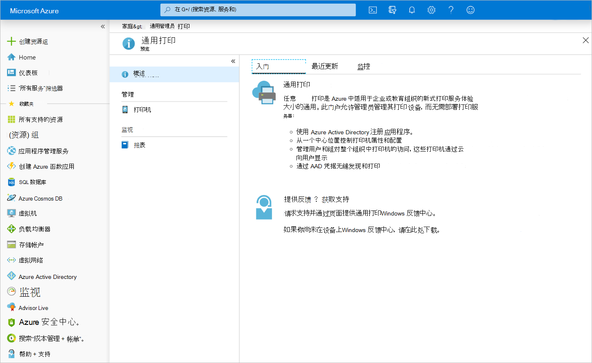

# 通用打印 API 概述Universal Print API overview

通用打印是一种新式打印解决方案，组织可以使用它通过 Microsoft 云服务来管理自己的打印基础设施。Universal Print is a modern print solution that organizations can use to manage their print infrastructure through cloud services from Microsoft.

## 为什么要使用通用打印？Why use Universal Print?

通用打印将关键的 Windows Server 打印功能迁移到 Microsoft 365 云中，这样组织就不再需要本地打印服务器，也不需要在设备上安装打印机驱动程序。Universal Print moves key Windows Server print functionality to the Microsoft 365 cloud, so organizations no longer need on-premises print servers and do not need to install printer drivers on devices. 此外，通用打印还带来了一些关键功能，如用于授予打印机访问权限的安全组、基于位置的打印机发现和丰富的管理员体验。In addition, Universal Print adds key functionality like security groups for printer access, location-based printer discovery, and a rich administrator experience.

随着组织采用通用打印，组织和独立软件供应商 (ISV) 可使用 Microsoft Graph 中的通用打印 API 来生成和扩展应用程序，从而支持新方案。As organizations adopt Universal Print, organizations and independent software vendors (ISVs) can use the Universal Print API in Microsoft Graph to build and extend applications to support new scenarios.

### 从 Web 和移动应用打印文档Print documents from web and mobile applications

将打印基础设施迁移到云中，可直接从 Web 和移动应用打印文档。Moving print infrastructure to the cloud enables printing documents directly from web and mobile applications.

若要开始使用通用打印 API，请执行以下操作：To get started with the Universal Print API:

1. [创建打印作业](/graph/api/printer-post-jobs?view=graph-rest-beta)，并存储生成的文档 ID。[Create a print job](/graph/api/printer-post-jobs?view=graph-rest-beta) and store the resulting document ID.
2. [将文档数据上传](/graph/api/printdocument-uploaddata?view=graph-rest-beta)到文档。[Upload document data](/graph/api/printdocument-uploaddata?view=graph-rest-beta) to the document.
3. [启动打印作业](/graph/api/printjob-startprintjob?view=graph-rest-beta)。[Start the print job](/graph/api/printjob-startprintjob?view=graph-rest-beta).

### 管理打印机Manage printers

跟踪组织的打印机、打印机配置和打印机使用情况是一项很复杂的任务。Keeping track of an organization's printers, printer configurations, and printer usage is a complex task. 通用打印 API 可以在所有三个方面实现集成。The Universal Print API enables integration in all three areas.

* 使用[列出打印机](/graph/api/print-list-printers?view=graph-rest-beta)和 [printerStatus](/graph/api/resources/printerstatus?view=graph-rest-beta)，**监视打印机状态、配置和可用性**。**Keep an eye on printer status, configurations, and availability** by using [List printers](/graph/api/print-list-printers?view=graph-rest-beta) and [printerStatus](/graph/api/resources/printerstatus?view=graph-rest-beta).

* 使用报告 API，**了解谁在使用打印机以及打印进度**：**See who's using your printers and how much they're printing** by using the reporting APIs:
  * [列出 dailyPrintUsageSummariesByUserList dailyPrintUsageSummariesByUser](/graph/api/reportroot-list-dailyprintusagesummariesbyuser?view=graph-rest-beta)
  * [列出 monthlyPrintUsageSummariesByUserList monthlyPrintUsageSummariesByUser](/graph/api/reportroot-list-monthlyprintusagesummariesbyuser?view=graph-rest-beta)
  * [列出 dailyPrintUsageSummariesByPrinterList dailyPrintUsageSummariesByPrinter](/graph/api/reportroot-list-dailyprintusagesummariesbyprinter?view=graph-rest-beta)
  * [列出 monthlyPrintUsageSummariesByPrinterList monthlyPrintUsageSummariesByPrinter](/graph/api/reportroot-list-monthlyprintusagesummariesbyprinter?view=graph-rest-beta)

* 通过修改打印机上的用户和组成员资格，**配置用户权限**：**Configure user permissions** by modifying user and group membership on printers:
  * [列出 allowedUsersList allowedUsers](/graph/api/printer-list-allowedusers?view=graph-rest-beta)
  * [添加 allowedUserAdd allowedUser](/graph/api/printer-post-allowedusers?view=graph-rest-beta)
  * [删除 allowedUserRemove allowedUser](/graph/api/printer-delete-alloweduser?view=graph-rest-beta)
  * [列出 allowedGroupsList allowedGroups](/graph/api/printer-list-allowedgroups?view=graph-rest-beta)
  * [添加 allowedGroupAdd allowedGroup](/graph/api/printer-post-allowedgroups?view=graph-rest-beta)
  * [删除 allowedGroupRemove allowedGroup](/graph/api/printer-delete-allowedgroup?view=graph-rest-beta)

### 无缝更换或更新打印机硬件Seamlessly replace or update printer hardware

用户只能看到[共享](/graph/api/print-post-printershares?view=graph-rest-beta)的打印机，这样管理员可以精细地控制哪个打印机硬件在给定时间可用。Printers are not visible to users until they are [shared](/graph/api/print-post-printershares?view=graph-rest-beta), providing administrators fine-grained control over which printer hardware is available at a given time.

共享打印机会创建 [printerShare](/graph/api/resources/printershare?view=graph-rest-beta) 资源，它可随时更新为指向其他打印机，这样就能轻松更换损坏的打印机硬件，或让打印机脱机接受维护。Sharing a printer creates a [printerShare](/graph/api/resources/printershare?view=graph-rest-beta) resource that can be updated at any time to point to a different printer, making it easy to replace broken printer hardware or take printers offline for maintenance.

若要在应用程序中使用此功能，请使用[更新 printerShare](/graph/api/printershare-update?view=graph-rest-beta) 来更新 printerShare 的 `printer` 引用。To use this in your application, use [Update printerShare](/graph/api/printershare-update?view=graph-rest-beta) to update the printerShare's `printer` reference.

## API 参考API reference
在查找此服务的 API 参考？Looking for the API reference for this service?

- [Microsoft Graph Beta 中的通用打印 APIUniversal Print API in Microsoft Graph beta](/graph/api/resources/print?view=graph-rest-beta)

## 另请参阅See also

* 欢迎在 [UserVoice](https://microsoftgraph.uservoice.com/forums/920506-microsoft-graph-feature-requests) 上提供有关通用打印 API 的反馈！We'd love to hear your feedback about the Universal Print APIs over at [UserVoice](https://microsoftgraph.uservoice.com/forums/920506-microsoft-graph-feature-requests)!
