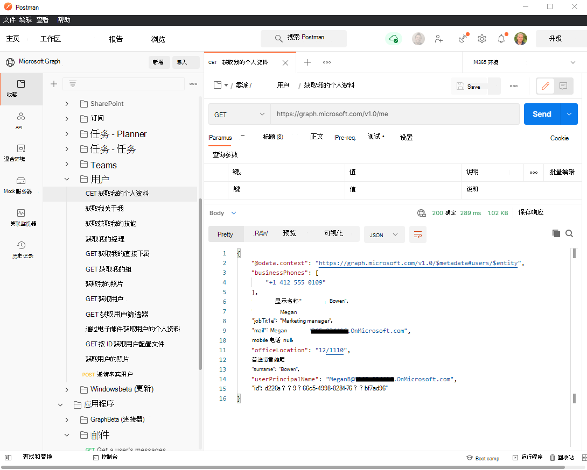

# 结合使用 Postman 和 Microsoft Graph API

使用 Microsoft Graph Postman 集合，只需几分钟，即可开始使用 Microsoft Graph API。

本文介绍了如何快速掌握 Postman 和 Microsoft Graph。 此外，还可以使用 [Graph 管理器](https://developer.microsoft.com/graph/graph-explorer)直接在 Web 浏览器中浏览 Microsoft Graph API。

有关如何操作的详细信息，请跟随此文章中的步骤或观看 [Microsoft Graph Postman 工作区入门](https://youtu.be/3RTHY3jScmA)视频。

## 第一步 - 创建 Microsoft Graph Postman 集合分支

要使用 Postman 集合，请创建其分支到你的 Postman 工作区。 在 web 浏览器中进行该操作。

1. 转到 [Postman](https://www.postman.com/) 并登录。
1. 转到标签名为 [Microsoft Graph](https://www.postman.com/microsoftgraph/workspace/microsoft-graph/collection/455214-085f7047-1bec-4570-9ed0-3a7253be148c/fork) 的 Postman 集合。
1. 为你的分支填充标签。 此值可以是任何文本。
1. 在工作区下，请确保在下拉列表中选中 **我的工作区**。
1. 单击 **分支集合**。

随后会重定向至你的工作区中主要 Microsoft Graph Postman 集合的一个分支。

## 第二步 - （可选 - 仅针对 Postman web 浏览器）下载 Postman 代理。

要在 web 浏览器中使用此 Postman 集合，请下载 [Postman 桌面代理](https://www.postman.com/downloads)。 由于 web 浏览器的限制，无法在未下载此代理的情况下在 web 上使用 Postman。

如果你正在使用 Postman for Windows 应用，则不需要此代理。 打开 Postman for Windows 后，你会在工作区中看到这个分支集合。

## 第三步 - 创建 Azure AD 应用程序

要在你的开发者租户中使用此集合，请创建一个 Azure AD 应用程序并根据想要调用的请求给予其合适的权限。 如果没有开发者租户，你可以通过 [Microsoft 365 开发人员计划](https://developer.microsoft.com/microsoft-365/dev-program)注册一个。

1. 转到 [portal.azure.com](https://portal.azure.com/) 并使用开发者租户管理员帐户登录。
1. 单击 “**Azure Services**” 下的 “**Azure Active Directory**”。
1. 在左侧菜单中，单击“**应用注册**”。
1. 在水平菜单中，单击“**新建注册**”。
1. 将“**应用名称**”设置为“`Postman`”。
1. 将“**重定向 URI**”设置为“`https://oauth.pstmn.io/v1/browser-callback`”。
1. 单击“**注册**”。
1. 在左侧菜单中，单击 “**API 权限**”。
1. 在水平菜单中，单击“**添加权限**”，选择 “**Microsoft Graph**”，然后选择“**委派权限**”。
1. 键入“`Mail.`”，展开“**邮件**”选项，然后检查 **Mail.Read**.
1. 单击“**应用权限**”然后键入“`User.`”，随后检查“**应用权限**”。
1. 展开“**用户**”选项并检查 **User.Read.All**。
1. 单击“**添加权限**”。
1. 在水平菜单中，单击“**授予管理员许可**”，并单击“**确定**”。
1. 在左侧菜单中，单击“**概述**”。 你可以从这里获取“**应用程序（客户端）ID**” 和“**目录（客户端）ID**”。 这些会在第四步中用到。
1. 单击左侧菜单中的“**证书和机密**”。
1. 单击“**新建客户端机密**”，并输入简短说明，然后单击“**添加**”。 将鼠标光标悬浮在新的客户端机密 **值** 上并复制。 第四步中会用到它。

Azure AD 应用程序现已具有代表用户提出调用 Mail.Read 请求的权限并成为 User.Read.All 的一个应用。

## 步骤 4 - 在 Postman 中配置身份验证

在此步骤中，将设置用于检索访问令牌的环境变量。

1. 转到 [分叉](https://www.postman.com/microsoftgraph/workspace/microsoft-graph/environment/455214-efbc69b2-69bd-402e-9e72-850b3a49bb21/fork)。
1. 添加标签分叉。 此值可以是任何文本。
1. 在工作区下，请确保在下拉列表中选中 **我的工作区**。
1. 单击 **分叉环境**。
1. 在 `ClientID`中， **步骤 3.15** 应用程序（客户端）ID 值设置当前值。
1. 在 `ClientSecret`中， **3.17** 客户端密码值设置当前值。
1. 在 `TenantID`中， **3.15** 目录（租户）ID 值设置当前值。
1. 在右上方，单击 **保存**。
1. 关闭" **"选项卡** "。
1. 在右上方眼睛图标旁边，验证是否选择了 **"M365 环境** "，而不是" **没有**。

## 第五步 - 获取委派的访问令牌

由于这是你第一次通过委派身份验证流程运行请求，你需要获取访问令牌。

1. 将鼠标光标悬浮在“**委派**”文件夹上，单击省略号，然后选择“**编辑**”。
1. 单击“**授权**”选项卡。
1. 在右侧下滑并单击“**获取新的访问令牌**”。
1. 使用你的开发者租户管理员账户登录。
1. 单击“**继续**”，然后单击“**使用令牌**”按钮。
1. 在该对话框的右下角，单击“**更新**”。

你现在已具有用于委派请求的有效访问令牌。

## 第六步 - 运行你的第一个委派请求

在 **"委派** 文件夹内是各种您可以呼叫的 Microsoft Graph 工作负载的请求。

1. 展开 **的** 文件夹，然后展开 **邮件** 文件夹。
1. 双击“**获取我的邮件**”来打开请求。
1. 在右上角，单击“**发送**”。

你已经成功地使用委派身份验证完成了一次 Microsoft Graph 调用。

## 第七步 - 获取应用程序访问令牌

由于这是你第一次通过应用程序身份验证流程运行请求，你需要获取访问令牌。

1. 将鼠标光标悬浮在“**应用程序**”文件夹上，单击省略号，然后选择“**编辑**”。
1. 单击“**授权**”选项卡。
1. 在右侧下滑并单击“**获取新的访问令牌**”。
1. 单击“**继续**”，然后单击“**使用令牌**”按钮。
1. 在该对话框的右下角，单击“**更新**”。

你现在已具有用于委派请求的有效访问令牌。

## 第八步 - 运行你的第一个应用程序请求

“**应用程序**”文件夹中是你可以调用的各种 Microsoft Graph 工作负载请求。

1. 展开“**应用程序**”文件夹，然后展开“**用户**”文件夹。
1. 双击“**获取用户**”来打开请求。
1. 在右上角，单击“**发送**”。

你已经成功地使用应用程序身份验证完成了一次 Microsoft Graph 调用。

可以按照这些步骤向 Microsoft Graph 提出其他请求。请记住，需要向 Azure AD 应用程序添加权限来使其他请求正常运行; 否则，将会在响应中得到权限拒绝的错误。

### 参与集合

若要贡献你自己的请求，需要 Postman 许可。 你可以对分支集合做出更改，然后将鼠标光标悬浮在集合的顶端节点，然后选择“**创建拉取请求**”。

## 另请参阅

有关如何操作的详细信息，请观看 [Microsoft Graph Postman 工作区入门](https://youtu.be/3RTHY3jScmA)视频。
