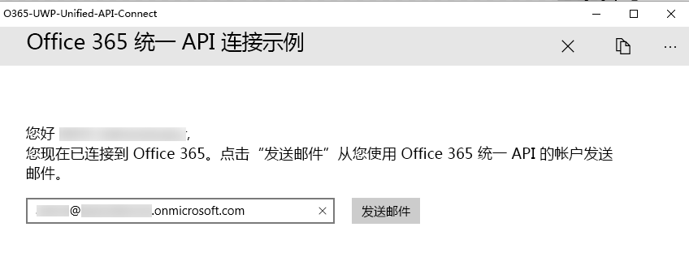

# <a name="get-started-with-microsoft-graph-in-a-universal-windows-10-app"></a><span data-ttu-id="8287e-101">在通用 Windows 10 应用中开始使用 Microsoft Graph</span><span class="sxs-lookup"><span data-stu-id="8287e-101">Get started with Microsoft Graph in a universal Windows 10 app</span></span>

> <span data-ttu-id="8287e-p101">**为企业客户生成应用？** 如果企业客户启用企业移动性安全功能，如<a href="https://azure.microsoft.com/en-us/documentation/articles/active-directory-conditional-access-device-policies/" target="_newtab">条件性设备访问</a>，应用可能无法运行。在这种情况下，你可能不知道，而且客户可能会遇到错误。</span><span class="sxs-lookup"><span data-stu-id="8287e-p101">**Building apps for enterprise customers?** Your app may not work if your enterprise customer turns on enterprise mobility security features like <a href="https://azure.microsoft.com/en-us/documentation/articles/active-directory-conditional-access-device-policies/" target="_newtab">conditional device access</a>. In this case, you may not know and your customers may experience errors.</span></span> 

> <span data-ttu-id="8287e-p102">若要跨**所有企业方案**支持**全部企业客户**，必须使用 Azure AD 终结点，并使用 [Azure 门户](https://aka.ms/aadapplist)管理应用。有关详细信息，请参阅[在 Azure AD 和 Azure AD v2.0 终结点之间进行选择](../concepts/auth_overview.md#deciding-between-the-azure-ad-and-azure-ad-v20-endpoints)。</span><span class="sxs-lookup"><span data-stu-id="8287e-p102">To support **all enterprise customers** across **all enterprise scenarios**, you must use the Azure AD endpoint and manage your apps using the [Azure portal](https://aka.ms/aadapplist). For more information, see [Deciding between the Azure AD and Azure AD v2.0 endpoints](../concepts/auth_overview.md#deciding-between-the-azure-ad-and-azure-ad-v20-endpoints).</span></span>

<span data-ttu-id="8287e-p103">本文介绍了从 [Azure AD v2.0 终结点](https://developer.microsoft.com/zh-CN/graph/docs/concepts/converged_auth)获取访问令牌和调用 Microsoft Graph 所需的任务。本文演示了[适用于 UWP（库）的 Microsoft Graph Connect 示例](https://github.com/microsoftgraph/uwp-csharp-connect-sample)中的代码，以说明在使用 Microsoft Graph 的应用中必须实现的主要概念。</span><span class="sxs-lookup"><span data-stu-id="8287e-p103">This article describes the tasks required to get an access token from the [Azure AD v2.0 endpoint](https://developer.microsoft.com/zh-CN/graph/docs/concepts/converged_auth) and call Microsoft Graph. It walks you through the code inside the [Microsoft Graph Connect Sample for UWP (Library)](https://github.com/microsoftgraph/uwp-csharp-connect-sample) samples to explain the main concepts that you have to implement in an app that uses Microsoft Graph.</span></span>

<span data-ttu-id="8287e-p104">**不想生成一个应用吗？** 使用 [Microsoft Graph 快速入门](https://developer.microsoft.com/graph/quick-start)快速准备就绪并开始运行，或下载本文基于的[适用于 UWP（库）的 Microsoft Graph Connect 示例](https://github.com/microsoftgraph/uwp-csharp-connect-sample)。此外请注意，我们有[此示例的 REST 版本](https://github.com/microsoftgraph/uwp-csharp-connect-rest-sample)。</span><span class="sxs-lookup"><span data-stu-id="8287e-p104">**Don't feel like building an app?** Use the [Microsoft Graph quick start](https://developer.microsoft.com/graph/quick-start) to get up and running fast, or download the [Microsoft Graph Connect Sample for UWP (Library)](https://github.com/microsoftgraph/uwp-csharp-connect-sample) that this article is based on. Also note that we have a [REST version of this sample](https://github.com/microsoftgraph/uwp-csharp-connect-rest-sample).</span></span>

## <a name="sample-user-interface"></a><span data-ttu-id="8287e-112">示例用户界面</span><span class="sxs-lookup"><span data-stu-id="8287e-112">Sample user interface</span></span>

<span data-ttu-id="8287e-113">该示例包含一个非常简单的用户界面，其中包括一个顶部命令栏、一个**连接按钮**、一个**发送邮件**按钮，以及一个会自动填充登录用户电子邮件地址的文本框，但是该文本框可以进行编辑。</span><span class="sxs-lookup"><span data-stu-id="8287e-113">The sample contains a very simple user interface, consisting of a top command bar, a **connect button**, a **send mail** button, and a text box that is automatically populated with the signed-in user's e-mail address but that can be edited.</span></span>

<span data-ttu-id="8287e-114">当用户未连接时，**发送邮件**按钮处于禁用状态：</span><span class="sxs-lookup"><span data-stu-id="8287e-114">The **send mail** button is disabled when the user has not connected:</span></span>


<span data-ttu-id="8287e-116">当用户已连接时，顶部命令栏包含一个断开连接按钮。</span><span class="sxs-lookup"><span data-stu-id="8287e-116">The top command bar contains a disconnect button when the user has connected:</span></span>



<span data-ttu-id="8287e-118">所有示例的 UI 字符串均存储在 Assets 文件夹中的 Resources.resw 文件中。</span><span class="sxs-lookup"><span data-stu-id="8287e-118">All of the sample's UI strings are stored in the Resources.resw file inside the Assets folder.</span></span>

## <a name="prerequisites"></a><span data-ttu-id="8287e-119">先决条件</span><span class="sxs-lookup"><span data-stu-id="8287e-119">Prerequisites</span></span>

<span data-ttu-id="8287e-120">若要开始，将需要以下各项：</span><span class="sxs-lookup"><span data-stu-id="8287e-120">To get started, you'll need:</span></span> 

- <span data-ttu-id="8287e-121">[Microsoft 帐户](https://www.outlook.com/) 或[工作或学校帐户](https://docs.microsoft.com/zh-CN/office/developer-program/office-365-developer-program-faq#account-types)</span><span class="sxs-lookup"><span data-stu-id="8287e-121">A [Microsoft account](https://www.outlook.com/) or a [work or school account](https://docs.microsoft.com/zh-CN/office/developer-program/office-365-developer-program-faq#account-types)</span></span>
- <span data-ttu-id="8287e-122">Visual Studio 2017</span><span class="sxs-lookup"><span data-stu-id="8287e-122">Visual Studio 2017</span></span> 
- <span data-ttu-id="8287e-p105">[适用于 UWP（库）的 Microsoft Graph 初学者项目](https://github.com/microsoftgraph/uwp-csharp-connect-sample/tree/master/starter)。两个模板均包含可向其中添加代码的空类。它们还包含资源字符串。要获取此项目，请克隆或下载[适用于 UWP（库）的 Microsoft Graph Connect 示例](https://github.com/microsoftgraph/uwp-csharp-connect-sample)，并打开**初学者**文件夹内的解决方案。</span><span class="sxs-lookup"><span data-stu-id="8287e-p105">The [Microsoft Graph Starter Project for UWP (Library)](https://github.com/microsoftgraph/uwp-csharp-connect-sample/tree/master/starter). Both templates contain empty classes that you'll add code to. They also contains resource strings. To get this project, clone or download the [Microsoft Graph Connect Sample for UWP (Library)](https://github.com/microsoftgraph/uwp-csharp-connect-sample) and then open the solution inside the **starter** folder.</span></span>


## <a name="register-the-app"></a><span data-ttu-id="8287e-127">注册应用</span><span class="sxs-lookup"><span data-stu-id="8287e-127">Register the app</span></span>
 
1. <span data-ttu-id="8287e-128">使用个人或工作或学校帐户登录到[应用注册门户](https://apps.dev.microsoft.com/)。</span><span class="sxs-lookup"><span data-stu-id="8287e-128">Sign into the [App Registration Portal](https://apps.dev.microsoft.com/) using either your personal or work or school account.</span></span>
2. <span data-ttu-id="8287e-129">选择“**添加应用**”。</span><span class="sxs-lookup"><span data-stu-id="8287e-129">Select **Add an app**.</span></span>
3. <span data-ttu-id="8287e-130">为应用输入名称，并选择“**创建应用程序**”。</span><span class="sxs-lookup"><span data-stu-id="8287e-130">Enter a name for the app, and select **Create application**.</span></span>
    
    <span data-ttu-id="8287e-131">将显示注册页，其中列出应用的属性。</span><span class="sxs-lookup"><span data-stu-id="8287e-131">The registration page displays, listing the properties of your app.</span></span>
 
4. <span data-ttu-id="8287e-132">在“平台”**** 下，选择“添加平台”****。</span><span class="sxs-lookup"><span data-stu-id="8287e-132">Under **Platforms**, select **Add platform**.</span></span>
5. <span data-ttu-id="8287e-133">选择“本机应用程序”****。</span><span class="sxs-lookup"><span data-stu-id="8287e-133">Select **Native Application**.</span></span>
6. <span data-ttu-id="8287e-p106">将客户端 ID（应用程序 ID）和重定向 URL 值复制到剪切板。将需要在示例应用中输入这些值。</span><span class="sxs-lookup"><span data-stu-id="8287e-p106">Copy both the Client Id (App Id) and Redirect URI values to the clipboard. You'll need to enter these values into the sample app.</span></span>

    <span data-ttu-id="8287e-p107">应用 ID 是应用的唯一标识符。重定向 URL 是由 Windows 10 为每个应用提供的唯一 URI，以确保发送到该 URI 的邮件只发送到该应用程序。</span><span class="sxs-lookup"><span data-stu-id="8287e-p107">The app id is a unique identifier for your app. The redirect URI is a unique URI provided by Windows 10 for each application to ensure that messages sent to that URI are only sent to that application.</span></span> 

7. <span data-ttu-id="8287e-138">选择“**保存**”。</span><span class="sxs-lookup"><span data-stu-id="8287e-138">Select **Save**.</span></span>

## <a name="configure-the-project"></a><span data-ttu-id="8287e-139">配置项目</span><span class="sxs-lookup"><span data-stu-id="8287e-139">Configure the project</span></span>

1. <span data-ttu-id="8287e-140">在 Visual Studio 中打开初学者项目的解决方案文件。</span><span class="sxs-lookup"><span data-stu-id="8287e-140">Open the solution file for the starter project in Visual Studio.</span></span>
2. <span data-ttu-id="8287e-p108">打开项目的 **App.xaml** 文件，并找到 `Application.Resources` 节点。使用注册应用的相应值替换应用程序 ID 和重定向 URI 占位符。</span><span class="sxs-lookup"><span data-stu-id="8287e-p108">Open the project's **App.xaml** file and locate the `Application.Resources` node. Replace the application ID and redirect URI placeholders with the corresponding values of the app you registered.</span></span>


```xml
    <Application.Resources>
        <!-- Add your Client Id here. -->
        <x:String x:Key="ida:ClientID">ENTER_YOUR_CLIENT_ID</x:String>
        <!-- Add your Redirect URI here. -->
        <x:String x:Key="ida:ReturnUrl">ENTER_YOUR_REDIRECT_URI</x:String>
    </Application.Resources>
```

## <a name="send-an-email-with-microsoft-graph"></a><span data-ttu-id="8287e-143">使用 Microsoft Graph 发送电子邮件</span><span class="sxs-lookup"><span data-stu-id="8287e-143">Send an email with Microsoft Graph</span></span>

<span data-ttu-id="8287e-p109">打开初学者项目中的 MailHelper.cs 文件。该文件中包含构建并发送电子邮件的代码。它包含一个方法 -- ``ComposeAndSendMailAsync`` -- 该方法构建 POST 请求并将其发送到 **https://graph.microsoft.com/v1.0/me/microsoft.graph.SendMail** 终结点。</span><span class="sxs-lookup"><span data-stu-id="8287e-p109">Open the MailHelper.cs file in your starter project. This file contains the code that constructs and sends an email. It consists of a single method --  -- that constructs and sends a POST request to the https://graph.microsoft.com/v1.0/me/microsoft.graph.SendMail endpoint.</span></span> 

<span data-ttu-id="8287e-p110">``ComposeAndSendMailAsync`` 方法采用三个字符串值 -- ``subject``、``bodyContent`` 和 ``recipients`` -- 通过 MainPage.xaml.cs 文件将这些值传递给它。``subject`` 和 ``bodyContent`` 字符串随所有其他 UI 字符串存储在 Resources.resw 文件中。``recipients`` 字符串来自应用界面中的地址框中。</span><span class="sxs-lookup"><span data-stu-id="8287e-p110">The ``ComposeAndSendMailAsync`` method takes three string values -- ``subject``, ``bodyContent``, and ``recipients`` -- that are passed to it by the MainPage.xaml.cs file. The ``subject`` and ``bodyContent`` strings are stored, along with all other UI strings, in the Resources.resw file. The ``recipients`` string comes from the address box in the app's interface.</span></span> 

<span data-ttu-id="8287e-p111">``ComposeAndSendMailAsync`` 方法中的第一个任务是通过 Microsoft Graph 获取当前用户的照片。此行调用 `GetCurrentUserPhotoStreamAsync` 方法：</span><span class="sxs-lookup"><span data-stu-id="8287e-p111">The first task inside the ``ComposeAndSendMailAsync`` method is to get the current user's photo from Microsoft Graph. This line calls the `GetCurrentUserPhotoStreamAsync` method:</span></span>

```
            // Get current user photo
            Stream photoStream = await GetCurrentUserPhotoStreamAsync();
```

<span data-ttu-id="8287e-152">完整的 `GetCurrentUserPhotoStreamAsync` 方法如下所示：</span><span class="sxs-lookup"><span data-stu-id="8287e-152">This is what the complete `GetCurrentUserPhotoStreamAsync` method looks like:</span></span>

```
        // Gets the stream content of the signed-in user's photo. 
        // This snippet doesn't work with consumer accounts.
        public async Task<Stream> GetCurrentUserPhotoStreamAsync()
        {
            Stream currentUserPhotoStream = null;

            try
            {
                var graphClient = AuthenticationHelper.GetAuthenticatedClient();
                currentUserPhotoStream = await graphClient.Me.Photo.Content.Request().GetAsync();

            }

            // If the user account is MSA (not work or school), the service will throw an exception.
            catch (ServiceException)
            {
                return null;
            }

            return currentUserPhotoStream;

        }
```

<span data-ttu-id="8287e-153">如果用户没有照片，此逻辑会获取项目中包含的其他图像文件：</span><span class="sxs-lookup"><span data-stu-id="8287e-153">If the user doesn't have a photo, this logic gets another image file that has been included with the project:</span></span>

```
            // If the user doesn't have a photo, or if the user account is MSA, we use a default photo

            if (photoStream == null)
            {
                StorageFile file = await Windows.ApplicationModel.Package.Current.InstalledLocation.GetFileAsync("test.jpg");
                photoStream = (await file.OpenReadAsync()).AsStreamForRead();
            }
```

<span data-ttu-id="8287e-154">现在我们已拥有图像流，可以通过调用 `UploadFileToOneDriveAsync` 方法将此文件上载到 OneDrive：</span><span class="sxs-lookup"><span data-stu-id="8287e-154">Now that we have an image stream, we can upload the file to OneDrive by calling the `UploadFileToOneDriveAsync` method:</span></span>

```
            MemoryStream photoStreamMS = new MemoryStream();
            // Copy stream to MemoryStream object so that it can be converted to byte array.
            photoStream.CopyTo(photoStreamMS);

            DriveItem photoFile = await UploadFileToOneDriveAsync(photoStreamMS.ToArray());
```

<span data-ttu-id="8287e-155">完整的 `UploadFileToOneDriveAsync` 方法如下所示：</span><span class="sxs-lookup"><span data-stu-id="8287e-155">This is what the complete `UploadFileToOneDriveAsync` method looks like:</span></span>

```
        // Uploads the specified file to the user's root OneDrive directory.
        public async Task<DriveItem> UploadFileToOneDriveAsync(byte[] file)
        {
            DriveItem uploadedFile = null;

            try
            {
                var graphClient = AuthenticationHelper.GetAuthenticatedClient();
                MemoryStream fileStream = new MemoryStream(file);
                uploadedFile = await graphClient.Me.Drive.Root.ItemWithPath("me.png").Content.Request().PutAsync<DriveItem>(fileStream);

            }


            catch (ServiceException)
            {
                return null;
            }

            return uploadedFile;
        }
```

<span data-ttu-id="8287e-156">我们还可以使用该流创建可以随消息传递的 `MessageAttachmentsCollectionPage` 对象。</span><span class="sxs-lookup"><span data-stu-id="8287e-156">We can also use this stream to create a `MessageAttachmentsCollectionPage` object that we can pass along with the message:</span></span>

```
            MessageAttachmentsCollectionPage attachments = new MessageAttachmentsCollectionPage();
            attachments.Add(new FileAttachment
            {
                ODataType = "#microsoft.graph.fileAttachment",
                ContentBytes = photoStreamMS.ToArray(),
                ContentType = "image/png",
                Name = "me.png"
            });
```

<span data-ttu-id="8287e-p112">我们可以通过调用 `GetSharingLinkAsync` 方法获取新上载的 OneDrive 文件的共享链接。`bodyContent` 字符串包含共享链接的占位符：</span><span class="sxs-lookup"><span data-stu-id="8287e-p112">We can get a sharing link for the newly uploaded OneDrive file by calling the `GetSharingLinkAsync` method. The `bodyContent` string contains a placeholder for the sharing link:</span></span>

```
            // Get the sharing link and insert it into the message body.
            Permission sharingLink = await GetSharingLinkAsync(photoFile.Id);
            string bodyContentWithSharingLink = String.Format(bodyContent, sharingLink.Link.WebUrl);
```

<span data-ttu-id="8287e-159">完整的 `GetSharingLinkAsync` 方法如下所示：</span><span class="sxs-lookup"><span data-stu-id="8287e-159">This is what the complete `GetSharingLinkAsync` method looks like:</span></span>

```
        public static async Task<Permission> GetSharingLinkAsync(string Id)
        {
            Permission permission = null;

            try
            {
                var graphClient = AuthenticationHelper.GetAuthenticatedClient();
                permission = await graphClient.Me.Drive.Items[Id].CreateLink("view").Request().PostAsync();
            }

            catch (ServiceException)
            {
                return null;
            }

            return permission;
        }
```

<span data-ttu-id="8287e-160">由于用户可以传递多个地址，因此下一项任务是将 ``recipients`` 字符串拆分为一组可用于构建 `Recipients` 对象列表的 `EmailAddress` 对象，然后能够以请求 POST 正文的形式传递这些对象：</span><span class="sxs-lookup"><span data-stu-id="8287e-160">Since the user can potentially pass more than one address, the next task is to split the ``recipients`` string into a set of `EmailAddress` objects that can then be used to construct the list of `Recipients` objects that will be passed in the POST body of the request:</span></span>

```
            // Prepare the recipient list
            string[] splitter = { ";" };
            var splitRecipientsString = recipients.Split(splitter, StringSplitOptions.RemoveEmptyEntries);
            List<Recipient> recipientList = new List<Recipient>();

            foreach (string recipient in splitRecipientsString)
            {
                recipientList.Add(new Recipient { EmailAddress = new EmailAddress { Address = recipient.Trim() } });
            }
```

<span data-ttu-id="8287e-p113">最后一项任务是构建 `Message` 对象，然后通过 `GraphServiceClient` 将它发送至 **me/microsoft.graph.SendMail** 终结点。由于 ``bodyContent`` 字符串是一个 HTML 文档，因此请求将 **ContentType** 值设置为 HTML。</span><span class="sxs-lookup"><span data-stu-id="8287e-p113">The last task is to construct a `Message` object and send it to the **me/microsoft.graph.SendMail** endpoint through the `GraphServiceClient`. Since the ``bodyContent`` string is an HTML document, the request sets the **ContentType** value to HTML.</span></span>

```
            try
            {
                var graphClient = AuthenticationHelper.GetAuthenticatedClient();

                var email = new Message
                {
                    Body = new ItemBody
                    {
                        Content = bodyContentWithSharingLink,
                        ContentType = BodyType.Html,
                    },
                    Subject = subject,
                    ToRecipients = recipientList,
                    Attachments = attachments
                };

                try
                {
                    await graphClient.Me.SendMail(email, true).Request().PostAsync();
                }
                catch (ServiceException exception)
                {
                    throw new Exception("We could not send the message: " + exception.Error == null ? "No error message returned." : exception.Error.Message);
                }


            }

            catch (Exception e)
            {
                throw new Exception("We could not send the message: " + e.Message);
            }
```

<span data-ttu-id="8287e-163">完整的类如下所示：</span><span class="sxs-lookup"><span data-stu-id="8287e-163">The complete class will look like this:</span></span>

```
    public class MailHelper
    {
        /// <summary>
        /// Compose and send a new email.
        /// </summary>
        /// <param name="subject">The subject line of the email.</param>
        /// <param name="bodyContent">The body of the email.</param>
        /// <param name="recipients">A semicolon-separated list of email addresses.</param>
        /// <returns></returns>
        public async Task ComposeAndSendMailAsync(string subject,
                                                            string bodyContent,
                                                            string recipients)
        {

            // Get current user photo
            Stream photoStream = await GetCurrentUserPhotoStreamAsync();


            // If the user doesn't have a photo, or if the user account is MSA, we use a default photo

            if (photoStream == null)
            {
                StorageFile file = await Windows.ApplicationModel.Package.Current.InstalledLocation.GetFileAsync("test.jpg");
                photoStream = (await file.OpenReadAsync()).AsStreamForRead();
            }

            MemoryStream photoStreamMS = new MemoryStream();
            // Copy stream to MemoryStream object so that it can be converted to byte array.
            photoStream.CopyTo(photoStreamMS);

            DriveItem photoFile = await UploadFileToOneDriveAsync(photoStreamMS.ToArray());

            MessageAttachmentsCollectionPage attachments = new MessageAttachmentsCollectionPage();
            attachments.Add(new FileAttachment
            {
                ODataType = "#microsoft.graph.fileAttachment",
                ContentBytes = photoStreamMS.ToArray(),
                ContentType = "image/png",
                Name = "me.png"
            });

            // Get the sharing link and insert it into the message body.
            Permission sharingLink = await GetSharingLinkAsync(photoFile.Id);
            string bodyContentWithSharingLink = String.Format(bodyContent, sharingLink.Link.WebUrl);

            // Prepare the recipient list
            string[] splitter = { ";" };
            var splitRecipientsString = recipients.Split(splitter, StringSplitOptions.RemoveEmptyEntries);
            List<Recipient> recipientList = new List<Recipient>();

            foreach (string recipient in splitRecipientsString)
            {
                recipientList.Add(new Recipient { EmailAddress = new EmailAddress { Address = recipient.Trim() } });
            }

            try
            {
                var graphClient = AuthenticationHelper.GetAuthenticatedClient();

                var email = new Message
                {
                    Body = new ItemBody
                    {
                        Content = bodyContentWithSharingLink,
                        ContentType = BodyType.Html,
                    },
                    Subject = subject,
                    ToRecipients = recipientList,
                    Attachments = attachments
                };

                try
                {
                    await graphClient.Me.SendMail(email, true).Request().PostAsync();
                }
                catch (ServiceException exception)
                {
                    throw new Exception("We could not send the message: " + exception.Error == null ? "No error message returned." : exception.Error.Message);
                }


            }

            catch (Exception e)
            {
                throw new Exception("We could not send the message: " + e.Message);
            }
        }


        // Gets the stream content of the signed-in user's photo. 
        // This snippet doesn't work with consumer accounts.
        public async Task<Stream> GetCurrentUserPhotoStreamAsync()
        {
            Stream currentUserPhotoStream = null;

            try
            {
                var graphClient = AuthenticationHelper.GetAuthenticatedClient();
                currentUserPhotoStream = await graphClient.Me.Photo.Content.Request().GetAsync();

            }

            // If the user account is MSA (not work or school), the service will throw an exception.
            catch (ServiceException)
            {
                return null;
            }

            return currentUserPhotoStream;

        }

        // Uploads the specified file to the user's root OneDrive directory.
        public async Task<DriveItem> UploadFileToOneDriveAsync(byte[] file)
        {
            DriveItem uploadedFile = null;

            try
            {
                var graphClient = AuthenticationHelper.GetAuthenticatedClient();
                MemoryStream fileStream = new MemoryStream(file);
                uploadedFile = await graphClient.Me.Drive.Root.ItemWithPath("me.png").Content.Request().PutAsync<DriveItem>(fileStream);

            }


            catch (ServiceException)
            {
                return null;
            }

            return uploadedFile;
        }

        public static async Task<Permission> GetSharingLinkAsync(string Id)
        {
            Permission permission = null;

            try
            {
                var graphClient = AuthenticationHelper.GetAuthenticatedClient();
                permission = await graphClient.Me.Drive.Items[Id].CreateLink("view").Request().PostAsync();
            }

            catch (ServiceException)
            {
                return null;
            }

            return permission;
        }

    }
``` 

 
<span data-ttu-id="8287e-164">现在，已经执行了与 Microsoft Graph 进行交互所需的步骤：应用注册、用户身份验证和发出请求。</span><span class="sxs-lookup"><span data-stu-id="8287e-164">You've now performed the steps required for interacting with Microsoft Graph: app registration, user authentication, and making the requests.</span></span> 

## <a name="run-the-app"></a><span data-ttu-id="8287e-165">运行应用</span><span class="sxs-lookup"><span data-stu-id="8287e-165">Run the app</span></span>
1. <span data-ttu-id="8287e-166">按 F5 生成和运行此应用。</span><span class="sxs-lookup"><span data-stu-id="8287e-166">Press F5 to build and run the app.</span></span> 

2. <span data-ttu-id="8287e-167">使用个人帐户、工作或学校帐户登录，并授予所请求的权限。</span><span class="sxs-lookup"><span data-stu-id="8287e-167">Sign in with your personal or work or school account and grant the requested permissions.</span></span>

3. <span data-ttu-id="8287e-p114">选择“发送电子邮件”**** 按钮。在发送邮件后，将在按钮下方显示成功消息。此邮件包含附件形式的照片，同时还提供到 OneDrive 中上载的文件的共享链接。</span><span class="sxs-lookup"><span data-stu-id="8287e-p114">Choose the **Send email** button. When the mail is sent, a Success message is displayed below the button. the mail message includes the photo as an attachment and also provides a sharing link to the uploaded file in OneDrive.</span></span>

## <a name="next-steps"></a><span data-ttu-id="8287e-171">后续步骤</span><span class="sxs-lookup"><span data-stu-id="8287e-171">Next steps</span></span>
- <span data-ttu-id="8287e-172">使用 [Graph 浏览器](https://developer.microsoft.com/zh-CN/graph/graph-explorer)试用 REST API。</span><span class="sxs-lookup"><span data-stu-id="8287e-172">Try out the REST API using the [Graph explorer](https://developer.microsoft.com/zh-CN/graph/graph-explorer).</span></span>
- <span data-ttu-id="8287e-173">在 [Microsoft Graph UWP 代码段示例 (SDK)](https://github.com/microsoftgraph/uwp-csharp-snippets-sample) 和 [Microsoft Graph UWP 代码段示例 (REST)](https://github.com/microsoftgraph/uwp-csharp-snippets-rest-sample) 中查找 REST 和 SDK 操作的常见操作示例，或在 GitHub 上浏览我们的其他 [UWP 示例](https://github.com/microsoftgraph?utf8=%E2%9C%93&query=uwp)。</span><span class="sxs-lookup"><span data-stu-id="8287e-173">Find examples of common operations for both REST and SDK operations in the [Microsoft Graph UWP Snippets Sample (SDK)](https://github.com/microsoftgraph/uwp-csharp-snippets-sample) and the [Microsoft Graph UWP Snippets Sample (REST)](https://github.com/microsoftgraph/uwp-csharp-snippets-rest-sample), or explore our other [UWP samples](https://github.com/microsoftgraph?utf8=%E2%9C%93&query=uwp) on GitHub.</span></span>

## <a name="see-also"></a><span data-ttu-id="8287e-174">另请参阅</span><span class="sxs-lookup"><span data-stu-id="8287e-174">See also</span></span>
- [<span data-ttu-id="8287e-175">Microsoft Graph.NET 客户端库</span><span class="sxs-lookup"><span data-stu-id="8287e-175">Microsoft Graph .NET Client Library</span></span>](https://github.com/microsoftgraph/msgraph-sdk-dotnet)
- [<span data-ttu-id="8287e-176">Azure AD v2.0 协议</span><span class="sxs-lookup"><span data-stu-id="8287e-176">Azure AD v2.0 protocols</span></span>](https://azure.microsoft.com/zh-CN/documentation/articles/active-directory-v2-protocols/)
- [<span data-ttu-id="8287e-177">Azure AD v2.0 令牌</span><span class="sxs-lookup"><span data-stu-id="8287e-177">Azure AD v2.0 tokens</span></span>](https://azure.microsoft.com/zh-CN/documentation/articles/active-directory-v2-tokens/)

