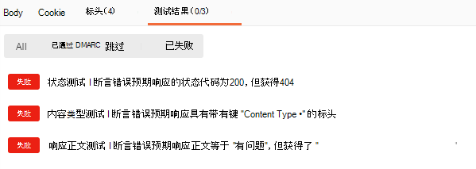

# <a name="set-up-notifications-for-changes-in-user-data"></a>设置用户数据更改的通知

Microsoft Graph API 使用 Webhook 机制将更改通知传递到客户端。客户端是用于配置自身的 URL 以接收更改通知的 Web 服务。客户端应用使用更改通知在更改时更新其状态。

Microsoft Graph 接受订阅请求之后，它将更改通知推送到订阅中指定的 URL。然后应用程序根据其业务逻辑执行操作。例如，它获取更多数据，更新缓存和视图等。


> [!VIDEO https://www.youtube-nocookie.com/embed/rC1bunenaq4]
 
> [!div class="nextstepaction"]
> [教程：在 Microsoft Graph 中使用变更通知和变更跟踪](/learn/modules/msgraph-changenotifications-trackchanges)

默认情况下，更改通知不包含资源数据，`id` 除外。 如果应用需要资源数据，则可以调用 Microsoft Graph API 以获取完整资源。 本文使用 **用户** 资源作为使用更改通知的示例。

应用还可订阅包含资源数据的更改通知，避免执行其他 API 调用来访问数据。 此类应用将需要实现额外的代码来处理此类通知的要求，具体而言：响应订阅生命周期通知，验证通知的真实性，以及解密资源数据。 有关如何使用这些通知的详细信息，请参阅[设置包含资源数据的更改通知](webhooks-with-resource-data.md)。

## <a name="supported-resources"></a>支持的资源

使用 Microsoft Graph API，应用可以订阅以下资源的更改：

- 云打印 [打印机][]
- 云打印 [printTaskDefinition][]
- 用户个人 OneDrive 上 _任何_ [driveItem][] 文件夹层次结构内的内容
- OneDrive for Business 上 [driveItem][] _根文件夹_ 层次结构内的内容
- [组][]
- Microsoft 365 组[对话][]
- Outlook [事件][]
- Outlook [邮件][]
- Outlook 个人[联系人][]
- 安全[警报][]
- SharePoint [列表][]
- Teams [callRecord][]
- Teams [频道][]
- Teams [聊天][]
- Teams [chatMessage][]
- Teams [conversationMember][]
- Teams [状态][]（预览版）
- Teams [团队][]
- [todoTask][]（预览版）
- [用户][]

可以创建对特定 Outlook 文件夹的订阅，例如收件箱：`me/mailFolders('inbox')/messages`

或以下顶级资源的订阅：`/me/messages`、`/me/contacts`、`/me/events`、`users`、`groups`、`/communications/callRecords`

或以下特定资源实例的订阅：`users/{id}`、`groups/{id}`、`groups/{id}/conversations`、`sites/{site-id}/lists/{list-id}`、`/communications/presences/{id}`

或用户个人 OneDrive 中任何文件夹的订阅：`/drives/{id}/root`
`/drives/{id}/root/subfolder`

或 SharePoint/OneDrive for Business 驱动器根文件夹的订阅：`/drive/root`

或对新[安全性 API](security-concept-overview.md) 警报的订阅：`/security/alerts?$filter=status eq 'newAlert'`、`/security/alerts?$filter=vendorInformation/provider eq 'ASC'`

或对用户的待办事项列表中的任务的订阅：`/me/todo/lists/{todoTaskListId}/tasks`

### <a name="azure-ad-resource-limitations"></a>Azure AD 资源限制

基于 Azure AD 的资源（用户、组）采用了某些限制，超出限制时将会产生错误：

> **请注意**：这些限制不适用于来自 Azure AD 以外的服务的资源。 例如，应用可以创建许多更多的 `message` 或 `event` 资源订阅，这些订阅受到 Microsoft Graph 中的 Exchange Online 服务支持。

- 最大订阅配额：

  - 每个应用（适用于所有组合租户）：50,000 总订阅
  - 每个租户（适用于所有组合的应用）：总计 1000 个所有应用订阅
  - 每个应用和租户组合：总订阅数 100

超出限制时，尝试创建订阅将导致[错误响应](errors.md) - `403 Forbidden`。 `message` 属性将说明已超出什么限制。

- 不支持 Azure AD B2C 租户。

- 个人 Microsoft 帐户不支持用户实体的更改通知。

- 用户和租订阅存在一个[已知问题](known-issues.md#change-notifications)。

### <a name="outlook-resource-limitations"></a>Outlook 资源限制

订阅 Outlook 资源（如 **邮件**、**事件** 或 **联系人**）时，如果选择使用资源路径中的 *用户主体名称* UPN，则在 UPN 包含撇号的情况下，订阅请求可能会失败。 请考虑使用 GUID 用户 ID 而不是 UPN，以避免遇到此问题。 例如，请勿使用资源路径：

`/users/sh.o'neal@contoso.com/messages`

请使用：

`/users/{guid-user-id}/messages`

对于所有应用程序，每个邮箱最多允许 1000 个活动订阅。

### <a name="teams-resource-limitations"></a>Teams 资源限制

每个 Teams 资源都有不同的订阅配额。

- 对于 **callRecords** 的订阅：
  - 每个组织：总共 100 个订阅

- 对于 **chatMessages**（频道或聊天）的订阅：
  - 每个应用和频道或聊天组合：1 个订阅
  - 每个组织：总共 10,000 个订阅

## <a name="subscription-lifetime"></a>订阅生命周期

订阅的生命周期有限。 应用需要在订阅到期前续订订阅。 否则，需要新建订阅。 有关最长有效期的列表，请参阅[每个资源类型的最长订阅有效期](/graph/api/resources/subscription#maximum-length-of-subscription-per-resource-type)。

应用还可以随时取消订阅，以停止接收更改通知。

## <a name="managing-subscriptions"></a>管理订阅

客户端可以创建订阅、续订订阅和删除订阅。

### <a name="creating-a-subscription"></a>创建订阅

创建订阅是开始接收资源变更通知的第一步。订阅流程如下所示：

1. 客户端发送特定资源的订阅 (POST) 请求。

1. Microsoft Graph 验证请求。

    - 如果请求有效，Microsoft Graph 将验证令牌发送到通知 URL。
    - 如果该请求无效，Microsoft Graph 将发送包含代码和详细信息的错误响应。

1. 客户端将验证令牌发送回 Microsoft Graph。

1. Microsoft Graph 将响应发送回客户端。

客户端必须存储订阅 ID 以便将更改通知与订阅关联。

#### <a name="subscription-request-example"></a>订阅请求示例

```http
POST https://graph.microsoft.com/v1.0/subscriptions
Content-Type: application/json
{
  "changeType": "created,updated",
  "notificationUrl": "https://webhook.azurewebsites.net/notificationClient",
  "resource": "/me/mailfolders('inbox')/messages",
  "expirationDateTime": "2016-03-20T11:00:00.0000000Z",
  "clientState": "SecretClientState"
}
```

`changeType`、`notificationUrl`、`resource` 和 `expirationDateTime` 属性是必需的。 如需属性定义和值，请参阅[订阅资源类型](/graph/api/resources/subscription)。

`resource` 属性指定要被监视以进行更改的资源。 例如，可以创建特定邮件文件夹的订阅：`me/mailFolders('inbox')/messages`，或代表由管理员同意的用户：`users/john.doe@onmicrosoft.com/mailFolders('inbox')/messages`。

虽然不需要 `clientState`，但必须包括它才能符合我们建议的更改通知处理过程。 通过设置此属性后，可以确认收到的更改通知来自 Microsoft Graph 服务。 因此，该属性的值应保密，并且只有你的应用程序和 Microsoft Graph 服务知道。

如果成功，Microsoft Graph 将在正文中返回 `201 Created` 代码和 [subscription](/graph/api/resources/subscription) 对象。

> **注意：** 传递通知时，**notificationURL** 属性中包含的任何查询字符串参数都将包含在 HTTP POST 请求中。

#### <a name="notification-endpoint-validation"></a>通知终结点验证

Microsoft Graph 在创建订阅之前验证订阅请求的 `notificationUrl` 属性中提供的通知终结点。 验证流程如下所示：

1. Microsoft Graph 对验证令牌进行编码，并将其包含在通知 URL 的 POST 请求中：

    ``` http
    Content-Type: text/plain; charset=utf-8
    POST https://{notificationUrl}?validationToken={opaqueTokenCreatedByMicrosoftGraph}
    ```

1. 客户端必须对上一步中提供的 `validationToken`查询参数进行正确的URL解码，并转义任何 HTML / JavaScript。

   转义是一种很好的做法，因为恶意参与者可将通知终结点用于跨网站脚本类型的攻击。

   通常，将验证令牌值视为不透明，因为令牌格式通常可以更改，恕不另行通知。 Microsoft Graph 从不发送任何包含 HTML 或 JavaScript 代码的值。

1. 客户端必须在第 1 步的 10 秒内提供具有以下特性的响应：

    - `HTTP 200 OK` 状态代码。
    - `text/plain` 的内容类型。
    - 包含 _已解码URL_ 验证令牌的正文。 只需将 `validationToken`查询参数中发送的相同字符串反射回来即可。

    在响应中提供验证令牌之后，客户端应放弃验证令牌。

    > **重要提示：** 如果客户端返回已编码的验证令牌，验证将失败。

另外，可以使用 [Microsoft Graph Postman Collection](use-postman.md) 来确认终结点能否正确实现验证请求。 “杂项”文件夹中的“订阅验证”请求提供了单元测试，可验证终结点提供的响应。  



### <a name="renewing-a-subscription"></a>续订订阅

客户端可以续订特定过期日期的订阅，自请求时间起长达三天。 `expirationDateTime` 属性是必需的。

#### <a name="subscription-renewal-example"></a>订阅续订示例

```http
PATCH https://graph.microsoft.com/v1.0/subscriptions/{id}
Content-Type: application/json

{
  "expirationDateTime": "2016-03-22T11:00:00.0000000Z"
}
```

如果成功，Microsoft Graph 将在正文中返回 `200 OK` 代码和 [subscription](/graph/api/resources/subscription) 对象。 subscription 对象包括新的 `expirationDateTime` 值。

### <a name="deleting-a-subscription"></a>删除订阅

客户端可以通过使用其 ID 删除订阅来停止接收更改通知。

```http
DELETE https://graph.microsoft.com/v1.0/subscriptions/{id}
```

如果成功，Microsoft Graph 将返回 `204 No Content` 代码。

## <a name="change-notifications"></a>更改通知

通过客户端订阅对资源的更改，只要资源发生更改，Microsoft Graph 就会向通知 URL 发送一个 `POST` 请求。 仅对订阅中指定类型的更改（例如 `created`）发送通知。

> **注意：** 如果客户端拥有监视相同资源并使用相同通知 URL 的多个订阅，则 Microsoft Graph 可以发送与不同订阅对应的多个更改通知，每个都显示相应的订阅 ID。 无法保证 `POST` 请求中的所有更改通知都属于单个订阅。

### <a name="change-notification-example"></a>更改通知示例

本节显示创建邮件的通知示例。 用户收到电子邮件时，Microsoft Graph 将发送更改通知，如以下示例所示。
请注意，此通知位于 `value` 字段中表示的集合中。 有关通知负载的详细信息，请参见 [changeNotificationCollection](/graph/api/resources/changenotificationcollection)。 

发生许多更改时，Microsoft Graph 可能会在同一 `POST` 请求中发送对应于不同订阅的多个通知。

```json
{
  "value": [
    {
      "id": "lsgTZMr9KwAAA",
      "subscriptionId":"{subscription_guid}",
      "subscriptionExpirationDateTime":"2016-03-19T22:11:09.952Z",
      "clientState":"secretClientValue",
      "changeType":"created",
      "resource":"users/{user_guid}@{tenant_guid}/messages/{long_id_string}",
      "tenantId": "84bd8158-6d4d-4958-8b9f-9d6445542f95",
      "resourceData":
      {
        "@odata.type":"#Microsoft.Graph.Message",
        "@odata.id":"Users/{user_guid}@{tenant_guid}/Messages/{long_id_string}",
        "@odata.etag":"W/\"CQAAABYAAADkrWGo7bouTKlsgTZMr9KwAAAUWRHf\"",
        "id":"{long_id_string}"
      }
    }
  ]
}
```

### <a name="processing-the-change-notification"></a>处理更改通知

进程应处理收到的每个更改通知。 应用程序必须至少执行以下任务来处理更改通知：

1. 你的进程应处理它收到的每个更改通知并发送 2xx 类代码。 如果Microsoft Graph在 3 秒内未收到 2xx 类代码，它将尝试在大约 4 小时的时间内多次发布更改通知;之后，更改通知将被删除，并且不会送达。 如果进程在 3 秒内一致未响应，则通知可能会受到限制。

    如果处理预计需要 3 秒以上，则应保留通知，在响应Microsoft Graph时返回 `202 - Accepted` 状态代码，然后处理通知。 如果通知未保留，则返回 5xx 类代码以指示错误，以便重试通知。

    如果处理预计花费不到 3 秒，则应处理通知，并在响应Microsoft Graph时返回 `200 - Accepted` 状态代码。 如果通知未正确处理，则返回 5xx 类代码以指示错误，以便重试通知。

1. 验证 `clientState` 属性。 它必须与最初使用订阅创建请求提交的值匹配。

    > **注意：** 如果不符合这个条件，无需将其视为有效更改通知。 更改通知可能不是来自 Microsoft Graph，并且可能是由未授权操作者发送的。 还应调查更改通知来自何处并采取适当的措施。

1. 基于业务逻辑更新应用程序。

对请求中的其他更改通知重复该过程。

### <a name="throttling"></a>限制

收到更改通知后立即发送 `202 - Accepted` 状态代码，甚至在验证其真实性之前。 只是确认接收更改通知，防止不必要的重试。 对于大多数订阅，在发布期间通知不会受到任何其他延迟，除非服务遇到事件，否则所有通知都会在 SLA 中传递。 但是，如果订阅通知 URL 速度缓慢或响应失败，则与订阅关联的主机可能会限制通知。 以下过程用于确定何时限制以及如何处理受限制的终结点。

使用超时为 3 秒的 HTTP 客户端发布通知。 完成通知发布后，无论结果如何，都会跟踪尝试发布所用的总时间（包括网络延迟），以查找与通知 URL 关联的主机。 如果发布时间大于 2900 毫秒，则响应将被视为缓慢。 会为主机累积响应，并在收到 100 条通知后计算慢速响应的百分比。 当慢速响应的百分比达到 10% 时，与通知 URL 关联的主机将标记为慢速终结点。 由于慢速终结点与通知 URL 中的主机相关联，因此与主机关联的所有订阅的所有通知都将被视为评估，并受到限制。

评估将继续实时进行。 如果主机的发布时间低于 290 0ms，则此非慢速响应包含在响应总数中，将重新计算慢速响应的百分比，并重新评估终结点。 此外，响应的累积每 10 分钟刷新一次，评估会重新开始，等待 100 条通知，然后再评估终结点。 因此，在缓解延迟后，网络延迟或发布延迟的暂时高峰将会恢复。 超过 2900 毫秒的更持久的网络延迟或发布延迟将每 10 分钟持续重新评估一次。 

当终结点受到限制时，通知会受到以下额外延迟影响：
-   通知会自动卸载到专用于失败和受限制通知的一组辅助角色，并且会产生额外的 10 分钟延迟。
-   如果受限制的终结点慢 %为 >= 15%，则会删除通知。
-   由于 HTTP 调用失败而未能传送的通知将在 10 分钟后再次重试。


## <a name="code-samples"></a>代码示例

可在 GitHub 上获取以下代码示例。

- [Microsoft Graph 培训模块 - 在 Microsoft Graph 中使用变更通知和变更跟踪](https://github.com/microsoftgraph/msgraph-training-changenotifications)
- [面向 Node.js 的 Microsoft Graph Webhooks 示例](https://github.com/microsoftgraph/nodejs-webhooks-rest-sample)
- [适用于 ASP.NET Core 的 Microsoft Graph Webhook 示例](https://github.com/microsoftgraph/aspnetcore-webhooks-sample)
- [面向 Java Spring 的 Microsoft Graph Webhooks 示例](https://github.com/microsoftgraph/java-spring-webhooks-sample)

## <a name="firewall-configuration"></a>防火墙配置

可选择性地配置防火墙，以保护通知 URL，仅允许来自 Microsoft Graph 的入站连接。 这使你可以进一步降低发送到通知 URL 的无效更改通知的风险。 这些无效更改通知可能会试图触发已实施的自定义逻辑。 有关 Microsoft Graph 用于传递更改通知的 IP 地址的完整列表，请参阅 [Microsoft 365 的其他终结点](/office365/enterprise/additional-office365-ip-addresses-and-urls)。

> **注意：** 用于传递更改通知的已列出 IP 地址可以随时更新，恕不另行通知。

## <a name="latency"></a>延迟

下表列出了服务中发生的事件与传递更改通知之间的预计延迟时间。

| 资源 | 平均延迟 | 最大延迟 |
|:-----|:-----|:-----|
|[警报][] | 少于 3 分钟 | 5 分钟 |
|[callRecord][] | 少于 15 分钟 | 60 分钟 |
|[频道][] | 少于 10 秒 | 60 分钟 |
|[聊天][] | 少于 10 秒 | 60 分钟 |
|[chatMessage][] | 少于 10 秒 | 1 分钟 |
|[联系人][] | 未知 | 未知 |
|[对话][] | 未知 | 未知 |
|[conversationMember][] | 少于 10 秒 | 60 分钟 |
|[driveItem][] | 小于 1 分钟 | 5 分钟 |
|[事件][] | 未知 | 未知 |
|[组][] | 少于 2 分钟 | 15 分钟 |
|[列表][] | 小于 1 分钟 | 5 分钟 |
|[邮件][] | 未知 | 未知 |
|[状态][]（预览版） | 少于 10 秒 | 1 分钟 |
|[打印机][] | 小于 1 分钟 | 5 分钟 |
|[printTaskDefinition][] | 小于 1 分钟 | 5 分钟 |
|[团队][] | 少于 10 秒 | 60 分钟 |
|[todoTask][] | 少于 2 分钟 | 15 分钟 |
|[用户][] | 少于 2 分钟 | 15 分钟 |

>**注意**：为 **alert** 资源提供的延迟仅在创建 alert 后才适用。 它不包括规则从数据创建警报所需的时间。

## <a name="see-also"></a>另请参阅

- [订阅资源类型](/graph/api/resources/subscription?view=graph-rest-1.0&preserve-view=true)
- [获取订阅](/graph/api/subscription-get?view=graph-rest-1.0&preserve-view=true)
- [创建订阅](/graph/api/subscription-post-subscriptions?view=graph-rest-1.0&preserve-view=true)
- [changeNotification](/graph/api/resources/changenotification?view=graph-rest-beta&preserve-view=true) 资源类型
- [changeNotificationCollection](/graph/api/resources/changenotificationcollection?view=graph-rest-beta&preserve-view=true) 资源类型
- [更改通知和更改跟踪教程](/learn/modules/msgraph-changenotifications-trackchanges)
- [生命周期通知](./webhooks-lifecycle.md)

[联系人]: /graph/api/resources/contact
[对话]: /graph/api/resources/conversation
[driveItem]: /graph/api/resources/driveitem
[事件]: /graph/api/resources/event
[组]: /graph/api/resources/group
[邮件]: /graph/api/resources/message
[用户]: /graph/api/resources/user
[警报]: /graph/api/resources/alert
[callRecord]: /graph/api/resources/callrecords-callrecord
[状态]: /graph/api/resources/presence
[chatMessage]: /graph/api/resources/chatmessage
[列表]: /graph/api/resources/list
[打印机]: /graph/api/resources/printer
[printTaskDefinition]: /graph/api/resources/printtaskdefinition
[todoTask]: /graph/api/resources/todotask
[频道]: /graph/api/resources/channel
[聊天]: /graph/api/resources/chat
[conversationMember]: /graph/api/resources/conversationmember
[团队]: /graph/api/resources/team
