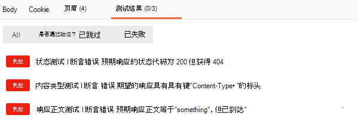

# <a name="set-up-notifications-for-changes-in-user-data"></a><span data-ttu-id="42e0c-105">设置用户数据更改的通知</span><span class="sxs-lookup"><span data-stu-id="42e0c-105">Set up notifications for changes in user data</span></span>

<span data-ttu-id="42e0c-p102">Microsoft Graph API 使用 Webhook 机制将通知传递到客户端。客户端是用于配置自身的 URL 以接收通知的 Web 服务。客户端应用使用通知在更改时更新其状态。</span><span class="sxs-lookup"><span data-stu-id="42e0c-p102">The Microsoft Graph API uses a webhook mechanism to deliver notifications to clients. A client is a web service that configures its own URL to receive notifications. Client apps use notifications to update their state upon changes.</span></span>

<span data-ttu-id="42e0c-109">Microsoft Graph 接受订阅请求之后，将通知推送到订阅中指定的 URL。</span><span class="sxs-lookup"><span data-stu-id="42e0c-109">After Microsoft Graph accepts the subscription request, it pushes notifications to the URL specified in the subscription.</span></span> <span data-ttu-id="42e0c-110">然后应用根据其业务逻辑执行操作。</span><span class="sxs-lookup"><span data-stu-id="42e0c-110">The app then takes action according to its business logic.</span></span> <span data-ttu-id="42e0c-111">例如，它提取更多数据、更新缓存和视图等。</span><span class="sxs-lookup"><span data-stu-id="42e0c-111">For example, it fetches more data, updates its cache and views, and so on.</span></span>


> [!VIDEO https://www.youtube-nocookie.com/embed/rC1bunenaq4]
 
> [!div class="nextstepaction"]
> [<span data-ttu-id="42e0c-112">使用 .NET Core 生成 Webhook 应用</span><span class="sxs-lookup"><span data-stu-id="42e0c-112">Build a webhook app with .NET Core</span></span>](/graph/tutorials/change-notifications)

<span data-ttu-id="42e0c-113">默认情况下，更改通知不包含资源数据，`id` 除外。</span><span class="sxs-lookup"><span data-stu-id="42e0c-113">By default, change notifications do not contain resource data, other than the `id`.</span></span> <span data-ttu-id="42e0c-114">如果应用需要资源数据，则可以调用 Microsoft Graph API 以获取完整资源。</span><span class="sxs-lookup"><span data-stu-id="42e0c-114">If the app requires resource data, it can make calls to Microsoft Graph APIs to get the full resource.</span></span> <span data-ttu-id="42e0c-115">本文使用**用户**资源作为使用通知的示例。</span><span class="sxs-lookup"><span data-stu-id="42e0c-115">This article uses the **user** resource as an example for working with notifications.</span></span>

<span data-ttu-id="42e0c-116">应用还可订阅包含资源数据的更改通知，避免执行其他 API 调用来访问数据。</span><span class="sxs-lookup"><span data-stu-id="42e0c-116">An app can also subscribe to change notifications that include resource data, to avoid having to make additonal API calls to access the data.</span></span> <span data-ttu-id="42e0c-117">此类应用将需要实现额外的代码来处理此类通知的要求，具体而言：响应订阅生命周期通知，验证通知的真实性，以及解密资源数据。</span><span class="sxs-lookup"><span data-stu-id="42e0c-117">Such apps will need to implement extra code to handle the requirements of such notifications, specifically: responding to subscription lifecycle notifications, validating the authenticity of notifications, and decrypting the resource data.</span></span> <span data-ttu-id="42e0c-118">将来会有更多资源类型支持此类型的通知。</span><span class="sxs-lookup"><span data-stu-id="42e0c-118">More resource types will support this type of notifications in the future.</span></span> <span data-ttu-id="42e0c-119">有关如何使用这些通知的详细信息，请参阅[设置包含资源数据的更改通知（预览版）](webhooks-with-resource-data.md)。</span><span class="sxs-lookup"><span data-stu-id="42e0c-119">For details about how to work with these notificatios, see [Set up change notifications that include resource data (preview)](webhooks-with-resource-data.md).</span></span>

## <a name="supported-resources"></a><span data-ttu-id="42e0c-120">支持的资源</span><span class="sxs-lookup"><span data-stu-id="42e0c-120">Supported resources</span></span>

<span data-ttu-id="42e0c-121">使用 Microsoft Graph API，应用可以订阅以下资源的更改：</span><span class="sxs-lookup"><span data-stu-id="42e0c-121">Using the Microsoft Graph API, an app can subscribe to changes on the following resources:</span></span>

- <span data-ttu-id="42e0c-122">Outlook [邮件][]</span><span class="sxs-lookup"><span data-stu-id="42e0c-122">Outlook [message][]</span></span>
- <span data-ttu-id="42e0c-123">Outlook [事件][]</span><span class="sxs-lookup"><span data-stu-id="42e0c-123">Outlook [event][]</span></span>
- <span data-ttu-id="42e0c-124">Outlook 个人[联系人][]</span><span class="sxs-lookup"><span data-stu-id="42e0c-124">Outlook personal [contact][]</span></span>
- <span data-ttu-id="42e0c-125">[用户][]</span><span class="sxs-lookup"><span data-stu-id="42e0c-125">[user][]</span></span>
- <span data-ttu-id="42e0c-126">[组][]</span><span class="sxs-lookup"><span data-stu-id="42e0c-126">[group][]</span></span>
- <span data-ttu-id="42e0c-127">Office 365 组[对话][]</span><span class="sxs-lookup"><span data-stu-id="42e0c-127">Office 365 group [conversation][]</span></span>
- <span data-ttu-id="42e0c-128">用户个人 OneDrive 上_任何_ [driveItem][] 文件夹层次结构内的内容</span><span class="sxs-lookup"><span data-stu-id="42e0c-128">Content within the hierarchy of _any folder_ [driveItem][] on a user's personal OneDrive</span></span>
- <span data-ttu-id="42e0c-129">OneDrive for Business 上 [driveItem][] _根文件夹_层次结构内的内容</span><span class="sxs-lookup"><span data-stu-id="42e0c-129">Content within the hierarchy of the _root folder_ [driveItem][] on OneDrive for Business</span></span>
- <span data-ttu-id="42e0c-130">安全[警报][]</span><span class="sxs-lookup"><span data-stu-id="42e0c-130">Security [alert][]</span></span>
- <span data-ttu-id="42e0c-131">Teams [callRecord][]（预览版）</span><span class="sxs-lookup"><span data-stu-id="42e0c-131">Teams [callRecord][] (preview)</span></span>
- <span data-ttu-id="42e0c-132">Teams [chatMessage][]（预览）</span><span class="sxs-lookup"><span data-stu-id="42e0c-132">Teams [chatMessage][] (preview)</span></span>

<span data-ttu-id="42e0c-133">可以创建对特定 Outlook 文件夹的订阅，例如收件箱：`me/mailFolders('inbox')/messages`</span><span class="sxs-lookup"><span data-stu-id="42e0c-133">You can create a subscription to a specific Outlook folder such as the Inbox: `me/mailFolders('inbox')/messages`</span></span>

<span data-ttu-id="42e0c-134">或以下顶级资源的订阅：`me/messages`、`me/contacts`、`me/events`、`users` 或 `groups`</span><span class="sxs-lookup"><span data-stu-id="42e0c-134">Or to a top-level resource: `me/messages`, `me/contacts`, `me/events`, `users`, or `groups`</span></span>

<span data-ttu-id="42e0c-135">或以下特定资源实例的订阅：`users/{id}`、`groups/{id}`、`groups/{id}/conversations`</span><span class="sxs-lookup"><span data-stu-id="42e0c-135">Or to a specific resource instance: `users/{id}`, `groups/{id}`, `groups/{id}/conversations`</span></span>

<span data-ttu-id="42e0c-136">或用户个人 OneDrive 中任何文件夹的订阅：`/drives/{id}/root`
`/drives/{id}/root/subfolder`</span><span class="sxs-lookup"><span data-stu-id="42e0c-136">Or to any folder in a user's personal OneDrive: `/drives/{id}/root`
`/drives/{id}/root/subfolder`</span></span>

<span data-ttu-id="42e0c-137">或 SharePoint/OneDrive for Business 驱动器根文件夹的订阅：`/drive/root`</span><span class="sxs-lookup"><span data-stu-id="42e0c-137">Or to the root folder of a SharePoint/OneDrive for Business drive: `/drive/root`</span></span>

<span data-ttu-id="42e0c-138">或对新[安全性 API](security-concept-overview.md) 警报的订阅：`/security/alerts?$filter=status eq 'newAlert'`、`/security/alerts?$filter=vendorInformation/provider eq 'ASC'`</span><span class="sxs-lookup"><span data-stu-id="42e0c-138">Or to a new [Security API](security-concept-overview.md) alert: `/security/alerts?$filter=status eq 'newAlert'`, `/security/alerts?$filter=vendorInformation/provider eq 'ASC'`</span></span>

### <a name="azure-ad-resource-limitations"></a><span data-ttu-id="42e0c-139">Azure AD 资源限制</span><span class="sxs-lookup"><span data-stu-id="42e0c-139">Azure AD resource limitations</span></span>

<span data-ttu-id="42e0c-140">基于 Azure AD 的资源（用户、组）采用了某些限制，超出限制时将会产生错误：</span><span class="sxs-lookup"><span data-stu-id="42e0c-140">Certain limits apply to Azure AD based resources (users, groups) and will generate errors when exceeded:</span></span>

> <span data-ttu-id="42e0c-141">**请注意**：这些限制不适用于来自 Azure AD 以外的服务的资源。</span><span class="sxs-lookup"><span data-stu-id="42e0c-141">**Note**: These limits do not apply to resources from services other than Azure AD.</span></span> <span data-ttu-id="42e0c-142">例如，应用可以创建许多更多的 `message` 或 `event` 资源订阅，这些订阅受到 Microsoft Graph 中的 Exchange Online 服务支持。</span><span class="sxs-lookup"><span data-stu-id="42e0c-142">For example, an app can create many more subscriptions to `message` or `event` resources, which are supported by the Exchange Online service as part of Microsoft Graph.</span></span>

- <span data-ttu-id="42e0c-143">最大订阅配额：</span><span class="sxs-lookup"><span data-stu-id="42e0c-143">Maximum subscription quotas:</span></span>

  - <span data-ttu-id="42e0c-144">每个应用：总订阅数 50,000</span><span class="sxs-lookup"><span data-stu-id="42e0c-144">Per app: 50,000 total subscriptions</span></span>
  - <span data-ttu-id="42e0c-145">每个租户：所有应用的总订阅数 1000</span><span class="sxs-lookup"><span data-stu-id="42e0c-145">Per tenant: 1000 total subscriptions across all apps</span></span>
  - <span data-ttu-id="42e0c-146">每个应用和租户组合：总订阅数 100</span><span class="sxs-lookup"><span data-stu-id="42e0c-146">Per app and tenant combination: 100 total subscriptions</span></span>

<span data-ttu-id="42e0c-147">超出限制时，尝试创建订阅将导致[错误响应](errors.md) - `403 Forbidden`。</span><span class="sxs-lookup"><span data-stu-id="42e0c-147">When the limits are exceeded, attempts to create a subscription will result in an [error response](errors.md) - `403 Forbidden`.</span></span> <span data-ttu-id="42e0c-148">`message` 属性将说明已超出什么限制。</span><span class="sxs-lookup"><span data-stu-id="42e0c-148">The `message` property will explain which limit has been exceeded.</span></span>

- <span data-ttu-id="42e0c-149">不支持 Azure AD B2C 租户。</span><span class="sxs-lookup"><span data-stu-id="42e0c-149">Azure AD B2C tenants are not supported.</span></span>

- <span data-ttu-id="42e0c-150">个人 Microsoft 帐户不支持用户实体的通知。</span><span class="sxs-lookup"><span data-stu-id="42e0c-150">Notification for user entities are not supported for personal Microsoft accounts.</span></span>

- <span data-ttu-id="42e0c-151">用户和租订阅存在一个[已知问题](known-issues.md#change-notifications)。</span><span class="sxs-lookup"><span data-stu-id="42e0c-151">A [known issue](known-issues.md#change-notifications) exists with user and group subscriptions.</span></span>

### <a name="outlook-resource-limitations"></a><span data-ttu-id="42e0c-152">Outlook 资源限制</span><span class="sxs-lookup"><span data-stu-id="42e0c-152">Outlook resource limitations</span></span>

<span data-ttu-id="42e0c-153">订阅 Outlook 资源（如**邮件**、**事件**或**联系人**）时，如果选择使用资源路径中的*用户主体名称* UPN，则在 UPN 包含撇号的情况下，订阅请求可能会失败。</span><span class="sxs-lookup"><span data-stu-id="42e0c-153">When subscribing to Outlook resources such as **messages**, **events** or **contacts**, if you choose to use the *user principal name* UPN in the resource path, the subscription request might fail if the UPN contains an apostrophe.</span></span> <span data-ttu-id="42e0c-154">请考虑使用 GUID 用户 ID 而不是 UPN，以避免遇到此问题。</span><span class="sxs-lookup"><span data-stu-id="42e0c-154">Consider using GUID user IDs instead of UPNs to avoid running into this problem.</span></span> <span data-ttu-id="42e0c-155">例如，请勿使用资源路径：</span><span class="sxs-lookup"><span data-stu-id="42e0c-155">For example, instead of using resource path:</span></span>

`/users/sh.o'neal@contoso.com/messages`

<span data-ttu-id="42e0c-156">请使用：</span><span class="sxs-lookup"><span data-stu-id="42e0c-156">Use:</span></span> 

`/users/{guid-user-id}/messages`

## <a name="subscription-lifetime"></a><span data-ttu-id="42e0c-157">订阅生命周期</span><span class="sxs-lookup"><span data-stu-id="42e0c-157">Subscription lifetime</span></span>

<span data-ttu-id="42e0c-158">订阅的生命周期有限。</span><span class="sxs-lookup"><span data-stu-id="42e0c-158">Subscriptions have a limited lifetime.</span></span> <span data-ttu-id="42e0c-159">应用需要在订阅到期前续订订阅。</span><span class="sxs-lookup"><span data-stu-id="42e0c-159">Apps need to renew their subscriptions before the expiration time.</span></span> <span data-ttu-id="42e0c-160">否则，需要新建订阅。</span><span class="sxs-lookup"><span data-stu-id="42e0c-160">Otherwise, they need to create a new subscription.</span></span> <span data-ttu-id="42e0c-161">有关最长有效期的列表，请参阅[每个资源类型的最长订阅有效期](/graph/api/resources/subscription?view=graph-rest-1.0#maximum-length-of-subscription-per-resource-type)。</span><span class="sxs-lookup"><span data-stu-id="42e0c-161">For a list of maximum expiration times, see [Maximum length of subscription per resource type](/graph/api/resources/subscription?view=graph-rest-1.0#maximum-length-of-subscription-per-resource-type).</span></span>

<span data-ttu-id="42e0c-162">应用还可以随时取消订阅，以停止接收通知。</span><span class="sxs-lookup"><span data-stu-id="42e0c-162">Apps can also unsubscribe at any time to stop getting notifications.</span></span>

## <a name="managing-subscriptions"></a><span data-ttu-id="42e0c-163">管理订阅</span><span class="sxs-lookup"><span data-stu-id="42e0c-163">Managing subscriptions</span></span>

<span data-ttu-id="42e0c-164">客户端可以创建订阅、续订订阅和删除订阅。</span><span class="sxs-lookup"><span data-stu-id="42e0c-164">Clients can create subscriptions, renew subscriptions, and delete subscriptions.</span></span>

### <a name="creating-a-subscription"></a><span data-ttu-id="42e0c-165">创建订阅</span><span class="sxs-lookup"><span data-stu-id="42e0c-165">Creating a subscription</span></span>

<span data-ttu-id="42e0c-p110">创建订阅是开始接收资源通知的第一步。订阅流程如下所示：</span><span class="sxs-lookup"><span data-stu-id="42e0c-p110">Creating a subscription is the first step to start receiving notifications for a resource. The subscription process is as follows:</span></span>

1. <span data-ttu-id="42e0c-168">客户端发送特定资源的订阅 (POST) 请求。</span><span class="sxs-lookup"><span data-stu-id="42e0c-168">The client sends a subscription (POST) request for a specific resource.</span></span>

1. <span data-ttu-id="42e0c-169">Microsoft Graph 验证请求。</span><span class="sxs-lookup"><span data-stu-id="42e0c-169">Microsoft Graph verifies the request.</span></span>

    - <span data-ttu-id="42e0c-170">如果请求有效，Microsoft Graph 将验证令牌发送到通知 URL。</span><span class="sxs-lookup"><span data-stu-id="42e0c-170">If the request is valid, Microsoft Graph sends a validation token to the notification URL.</span></span>
    - <span data-ttu-id="42e0c-171">如果该请求无效，Microsoft Graph 将发送包含代码和详细信息的错误响应。</span><span class="sxs-lookup"><span data-stu-id="42e0c-171">If the request is invalid, Microsoft Graph sends an error response with code and details.</span></span>

1. <span data-ttu-id="42e0c-172">客户端将验证令牌发送回 Microsoft Graph。</span><span class="sxs-lookup"><span data-stu-id="42e0c-172">The client sends the validation token back to Microsoft Graph.</span></span>

1. <span data-ttu-id="42e0c-173">Microsoft Graph 将响应发送回客户端。</span><span class="sxs-lookup"><span data-stu-id="42e0c-173">The Microsoft Graph sends a response back to the client.</span></span>

<span data-ttu-id="42e0c-174">客户端必须存储订阅 ID 以便将通知与订阅关联。</span><span class="sxs-lookup"><span data-stu-id="42e0c-174">The client must store the subscription ID to correlate notifications with the subscription.</span></span>

#### <a name="subscription-request-example"></a><span data-ttu-id="42e0c-175">订阅请求示例</span><span class="sxs-lookup"><span data-stu-id="42e0c-175">Subscription request example</span></span>

```http
POST https://graph.microsoft.com/v1.0/subscriptions
Content-Type: application/json
{
  "changeType": "created,updated",
  "notificationUrl": "https://webhook.azurewebsites.net/notificationClient",
  "resource": "/me/mailfolders('inbox')/messages",
  "expirationDateTime": "2016-03-20T11:00:00.0000000Z",
  "clientState": "SecretClientState"
}
```

<span data-ttu-id="42e0c-176">`changeType`、`notificationUrl`、`resource` 和 `expirationDateTime` 属性是必需的。</span><span class="sxs-lookup"><span data-stu-id="42e0c-176">The `changeType`, `notificationUrl`, `resource`, and `expirationDateTime` properties are required.</span></span> <span data-ttu-id="42e0c-177">如需属性定义和值，请参阅[订阅资源类型](/graph/api/resources/subscription?view=graph-rest-1.0)。</span><span class="sxs-lookup"><span data-stu-id="42e0c-177">See [subscription resource type](/graph/api/resources/subscription?view=graph-rest-1.0) for property definitions and values.</span></span>

<span data-ttu-id="42e0c-178">`resource` 属性指定要被监视以进行更改的资源。</span><span class="sxs-lookup"><span data-stu-id="42e0c-178">The `resource` property specifies the resource that will be monitored for changes.</span></span> <span data-ttu-id="42e0c-179">例如，可以创建特定邮件文件夹的订阅：`me/mailFolders('inbox')/messages`，或代表由管理员同意的用户：`users/john.doe@onmicrosoft.com/mailFolders('inbox')/messages`。</span><span class="sxs-lookup"><span data-stu-id="42e0c-179">For example, you can create a subscription to a specific mail folder: `me/mailFolders('inbox')/messages` or on behalf of a user given by an administrator  consent: `users/john.doe@onmicrosoft.com/mailFolders('inbox')/messages`.</span></span>

<span data-ttu-id="42e0c-180">虽然不需要 `clientState`，但必须包括它才能符合我们建议的通知处理过程。</span><span class="sxs-lookup"><span data-stu-id="42e0c-180">Although `clientState` is not required, you must include it to comply with our recommended notification handling process.</span></span> <span data-ttu-id="42e0c-181">通过设置此属性后，可以确认收到的通知来自 Microsoft Graph 服务。</span><span class="sxs-lookup"><span data-stu-id="42e0c-181">Setting this property will allow you to confirm that notifications you receive originate from the Microsoft Graph service.</span></span> <span data-ttu-id="42e0c-182">因此，该属性的值应保密，并且只有你的应用程序和 Microsoft Graph 服务知道。</span><span class="sxs-lookup"><span data-stu-id="42e0c-182">For this reason, the value of the property should remain secret and known only to your application and the Microsoft Graph service.</span></span>

<span data-ttu-id="42e0c-183">如果成功，Microsoft Graph 将在正文中返回 `201 Created` 代码和 [subscription](/graph/api/resources/subscription?view=graph-rest-1.0) 对象。</span><span class="sxs-lookup"><span data-stu-id="42e0c-183">If successful, Microsoft Graph returns a `201 Created` code and a [subscription](/graph/api/resources/subscription?view=graph-rest-1.0) object in the body.</span></span>

#### <a name="notification-endpoint-validation"></a><span data-ttu-id="42e0c-184">通知终结点验证</span><span class="sxs-lookup"><span data-stu-id="42e0c-184">Notification endpoint validation</span></span>

<span data-ttu-id="42e0c-185">Microsoft Graph 在创建订阅之前验证订阅请求的 `notificationUrl` 属性中提供的通知终结点。</span><span class="sxs-lookup"><span data-stu-id="42e0c-185">Microsoft Graph validates the notification endpoint provided in the `notificationUrl` property of the subscription request before creating the subscription.</span></span> <span data-ttu-id="42e0c-186">验证流程如下所示：</span><span class="sxs-lookup"><span data-stu-id="42e0c-186">The validation process occurs as follows:</span></span>

1. <span data-ttu-id="42e0c-187">Microsoft Graph 将 POST 请求发送到通知 URL：</span><span class="sxs-lookup"><span data-stu-id="42e0c-187">Microsoft Graph sends a POST request to the notification URL:</span></span>

    ``` http
    Content-Type: text/plain; charset=utf-8
    POST https://{notificationUrl}?validationToken={opaqueTokenCreatedByMicrosoftGraph}
    ```

    > <span data-ttu-id="42e0c-188">**重要说明：** 由于 `validationToken` 是查询参数，因此客户端必须根据 HTTP 编码做法正确解码它。</span><span class="sxs-lookup"><span data-stu-id="42e0c-188">**Important:** Since the `validationToken` is a query parameter it must be properly decoded by the client, as per HTTP coding practices.</span></span> <span data-ttu-id="42e0c-189">如果客户端没有解码令牌，而是在下一步（响应）中使用已编码值，那么验证将会失败。</span><span class="sxs-lookup"><span data-stu-id="42e0c-189">If the client does not decode the token, and instead uses the encoded value in the next step (response), validation will fail.</span></span> <span data-ttu-id="42e0c-190">此外，客户端还应将令牌值视为不透明，因为令牌格式今后可能会更改，而不另行通知。</span><span class="sxs-lookup"><span data-stu-id="42e0c-190">Also, the client should treat the token value as opaque since the token format may change in the future, without notice.</span></span>

1. <span data-ttu-id="42e0c-191">客户端必须在 10 秒内提供具有以下特性的响应：</span><span class="sxs-lookup"><span data-stu-id="42e0c-191">The client must provide a response with the following characteristics within 10 seconds:</span></span>

    - <span data-ttu-id="42e0c-192">200 (OK) 状态代码。</span><span class="sxs-lookup"><span data-stu-id="42e0c-192">A 200 (OK) status code.</span></span>
    - <span data-ttu-id="42e0c-193">内容类型必须是 `text/plain`。</span><span class="sxs-lookup"><span data-stu-id="42e0c-193">The content type must be `text/plain`.</span></span>
    - <span data-ttu-id="42e0c-194">正文必须包括 Microsoft Graph 提供的验证令牌。</span><span class="sxs-lookup"><span data-stu-id="42e0c-194">The body must include the validation token provided by Microsoft Graph.</span></span>

<span data-ttu-id="42e0c-195">在响应中提供验证令牌之后，客户端应放弃验证令牌。</span><span class="sxs-lookup"><span data-stu-id="42e0c-195">The client should discard the validation token after providing it in the response.</span></span>

<span data-ttu-id="42e0c-196">另外，可以使用 [Microsoft Graph Postman Collection](use-postman.md) 来确认终结点能否正确实现验证请求。</span><span class="sxs-lookup"><span data-stu-id="42e0c-196">Additionally, you can use the [Microsoft Graph Postman collection](use-postman.md) to confirm that your endpoint properly implements the validation request.</span></span> <span data-ttu-id="42e0c-197">“杂项”\*\*\*\* 文件夹中的“订阅验证”\*\*\*\* 请求提供了单元测试，可验证终结点提供的响应。</span><span class="sxs-lookup"><span data-stu-id="42e0c-197">The **Subscription Validation** request in the **Misc** folder provides unit tests that validate the response provided by your endpoint.</span></span>  



### <a name="renewing-a-subscription"></a><span data-ttu-id="42e0c-199">续订订阅</span><span class="sxs-lookup"><span data-stu-id="42e0c-199">Renewing a subscription</span></span>

<span data-ttu-id="42e0c-200">客户端可以续订特定过期日期的订阅，自请求时间起长达三天。</span><span class="sxs-lookup"><span data-stu-id="42e0c-200">The client can renew a subscription with a specific expiration date of up to three days from the time of request.</span></span> <span data-ttu-id="42e0c-201">`expirationDateTime` 属性是必需的。</span><span class="sxs-lookup"><span data-stu-id="42e0c-201">The `expirationDateTime` property is required.</span></span>

#### <a name="subscription-renewal-example"></a><span data-ttu-id="42e0c-202">订阅续订示例</span><span class="sxs-lookup"><span data-stu-id="42e0c-202">Subscription renewal example</span></span>

```http
PATCH https://graph.microsoft.com/v1.0/subscriptions/{id}
Content-Type: application/json

{
  "expirationDateTime": "2016-03-22T11:00:00.0000000Z"
}
```

<span data-ttu-id="42e0c-203">如果成功，Microsoft Graph 将在正文中返回 `200 OK` 代码和 [subscription](/graph/api/resources/subscription?view=graph-rest-1.0) 对象。</span><span class="sxs-lookup"><span data-stu-id="42e0c-203">If successful, Microsoft Graph returns a `200 OK` code and a [subscription](/graph/api/resources/subscription?view=graph-rest-1.0) object in the body.</span></span> <span data-ttu-id="42e0c-204">subscription 对象包括新的 `expirationDateTime` 值。</span><span class="sxs-lookup"><span data-stu-id="42e0c-204">The subscription object includes the new `expirationDateTime` value.</span></span>

### <a name="deleting-a-subscription"></a><span data-ttu-id="42e0c-205">删除订阅</span><span class="sxs-lookup"><span data-stu-id="42e0c-205">Deleting a subscription</span></span>

<span data-ttu-id="42e0c-206">客户端可以通过使用其 ID 删除订阅来停止接收通知。</span><span class="sxs-lookup"><span data-stu-id="42e0c-206">The client can stop receiving notifications by deleting the subscription using its ID.</span></span>

```http
DELETE https://graph.microsoft.com/v1.0/subscriptions/{id}
```

<span data-ttu-id="42e0c-207">如果成功，Microsoft Graph 将返回 `204 No Content` 代码。</span><span class="sxs-lookup"><span data-stu-id="42e0c-207">If successful, Microsoft Graph returns a `204 No Content` code.</span></span>

## <a name="notifications"></a><span data-ttu-id="42e0c-208">通知</span><span class="sxs-lookup"><span data-stu-id="42e0c-208">Notifications</span></span>

<span data-ttu-id="42e0c-209">客户端在创建订阅后开始接收通知。</span><span class="sxs-lookup"><span data-stu-id="42e0c-209">The client starts receiving notifications after creating the subscription.</span></span> <span data-ttu-id="42e0c-210">资源发生更改时，Microsoft Graph 将 POST 请求发送到通知 URL。</span><span class="sxs-lookup"><span data-stu-id="42e0c-210">Microsoft Graph sends a POST request to the notification URL when the resource changes.</span></span> <span data-ttu-id="42e0c-211">仅针对订阅中指定类型的更改发送通知，例如 `created`。</span><span class="sxs-lookup"><span data-stu-id="42e0c-211">Notification are sent only for the changes of the type specified in the subscription, for example, `created`.</span></span>

> <span data-ttu-id="42e0c-212">**注意：** 使用监视同一资源类型并使用同一通知 URL 的多个订阅时，可以发送包含具有不同订阅 ID 的多个通知的 POST。</span><span class="sxs-lookup"><span data-stu-id="42e0c-212">**Note:** When using multiple subscriptions that monitor the same resource type and use the same notification URL, a POST can be sent that will contain multiple notifications with different subscription IDs.</span></span> <span data-ttu-id="42e0c-213">无法保证 POST 中的所有通知都属于单个订阅。</span><span class="sxs-lookup"><span data-stu-id="42e0c-213">There is no guarantee that all notifications in the POST will belong to a single subscription.</span></span>

### <a name="notification-properties"></a><span data-ttu-id="42e0c-214">通知属性</span><span class="sxs-lookup"><span data-stu-id="42e0c-214">Notification properties</span></span>

<span data-ttu-id="42e0c-215">notification 对象具有以下属性：</span><span class="sxs-lookup"><span data-stu-id="42e0c-215">The notification object has the following properties:</span></span>

| <span data-ttu-id="42e0c-216">属性</span><span class="sxs-lookup"><span data-stu-id="42e0c-216">Property</span></span> | <span data-ttu-id="42e0c-217">类型</span><span class="sxs-lookup"><span data-stu-id="42e0c-217">Type</span></span> | <span data-ttu-id="42e0c-218">说明</span><span class="sxs-lookup"><span data-stu-id="42e0c-218">Description</span></span> |
|:---------|:-----|:------------|
| <span data-ttu-id="42e0c-219">subscriptionId</span><span class="sxs-lookup"><span data-stu-id="42e0c-219">subscriptionId</span></span> | <span data-ttu-id="42e0c-220">string</span><span class="sxs-lookup"><span data-stu-id="42e0c-220">string</span></span> | <span data-ttu-id="42e0c-221">生成通知的订阅的 ID。</span><span class="sxs-lookup"><span data-stu-id="42e0c-221">The ID of the subscription that generated the notification.</span></span> |
| <span data-ttu-id="42e0c-222">subscriptionExpirationDateTime</span><span class="sxs-lookup"><span data-stu-id="42e0c-222">subscriptionExpirationDateTime</span></span> | [<span data-ttu-id="42e0c-223">dateTime</span><span class="sxs-lookup"><span data-stu-id="42e0c-223">dateTime</span></span>](https://tools.ietf.org/html/rfc3339) | <span data-ttu-id="42e0c-224">订阅的过期时间。</span><span class="sxs-lookup"><span data-stu-id="42e0c-224">The expiration time for the subscription.</span></span> |
| <span data-ttu-id="42e0c-225">clientState</span><span class="sxs-lookup"><span data-stu-id="42e0c-225">clientState</span></span> | <span data-ttu-id="42e0c-226">string</span><span class="sxs-lookup"><span data-stu-id="42e0c-226">string</span></span> | <span data-ttu-id="42e0c-227">订阅请求中指定的 `clientState` 属性（如果有）。</span><span class="sxs-lookup"><span data-stu-id="42e0c-227">The `clientState` property specified in the subscription request (if any).</span></span> |
| <span data-ttu-id="42e0c-228">changeType</span><span class="sxs-lookup"><span data-stu-id="42e0c-228">changeType</span></span> | <span data-ttu-id="42e0c-229">string</span><span class="sxs-lookup"><span data-stu-id="42e0c-229">string</span></span> | <span data-ttu-id="42e0c-230">引发通知的事件类型。</span><span class="sxs-lookup"><span data-stu-id="42e0c-230">The event type that caused the notification.</span></span> <span data-ttu-id="42e0c-231">例如，邮件接收时为 `created`，或将邮件标记为已读时为 `updated`。</span><span class="sxs-lookup"><span data-stu-id="42e0c-231">For example, `created` on mail receive, or `updated` on marking a message read.</span></span> |
| <span data-ttu-id="42e0c-232">resource</span><span class="sxs-lookup"><span data-stu-id="42e0c-232">resource</span></span> | <span data-ttu-id="42e0c-233">string</span><span class="sxs-lookup"><span data-stu-id="42e0c-233">string</span></span> | <span data-ttu-id="42e0c-234">资源相对于 `https://graph.microsoft.com` 的 URI。</span><span class="sxs-lookup"><span data-stu-id="42e0c-234">The URI of the resource relative to `https://graph.microsoft.com`.</span></span> |
| <span data-ttu-id="42e0c-235">resourceData</span><span class="sxs-lookup"><span data-stu-id="42e0c-235">resourceData</span></span> | <span data-ttu-id="42e0c-236">object</span><span class="sxs-lookup"><span data-stu-id="42e0c-236">object</span></span> | <span data-ttu-id="42e0c-237">此属性的内容取决于要订阅资源的类型。</span><span class="sxs-lookup"><span data-stu-id="42e0c-237">The content of this property depends on the type of resource being subscribed to.</span></span> |
| <span data-ttu-id="42e0c-238">tenantId</span><span class="sxs-lookup"><span data-stu-id="42e0c-238">tenantId</span></span> | <span data-ttu-id="42e0c-239">string</span><span class="sxs-lookup"><span data-stu-id="42e0c-239">string</span></span> | <span data-ttu-id="42e0c-240">发出通知的租户的 ID。</span><span class="sxs-lookup"><span data-stu-id="42e0c-240">The ID of the tenant the notification originated from.</span></span> |

<span data-ttu-id="42e0c-241">例如，对于 Outlook 资源，`resourceData` 包含以下字段：</span><span class="sxs-lookup"><span data-stu-id="42e0c-241">For example, for Outlook resources, `resourceData` contains the following fields:</span></span>

| <span data-ttu-id="42e0c-242">属性</span><span class="sxs-lookup"><span data-stu-id="42e0c-242">Property</span></span> | <span data-ttu-id="42e0c-243">类型</span><span class="sxs-lookup"><span data-stu-id="42e0c-243">Type</span></span> | <span data-ttu-id="42e0c-244">说明</span><span class="sxs-lookup"><span data-stu-id="42e0c-244">Description</span></span> |
|:---------|:-----|:------------|
| <span data-ttu-id="42e0c-245">@odata.type</span><span class="sxs-lookup"><span data-stu-id="42e0c-245">@odata.type</span></span> | <span data-ttu-id="42e0c-246">string</span><span class="sxs-lookup"><span data-stu-id="42e0c-246">string</span></span> | <span data-ttu-id="42e0c-247">Microsoft Graph 中描述所表示对象的 OData 实体类型。</span><span class="sxs-lookup"><span data-stu-id="42e0c-247">The OData entity type in Microsoft Graph that describes the represented object.</span></span> |
| <span data-ttu-id="42e0c-248">@odata.id</span><span class="sxs-lookup"><span data-stu-id="42e0c-248">@odata.id</span></span> | <span data-ttu-id="42e0c-249">string</span><span class="sxs-lookup"><span data-stu-id="42e0c-249">string</span></span> | <span data-ttu-id="42e0c-250">对象的 OData 标识符。</span><span class="sxs-lookup"><span data-stu-id="42e0c-250">The OData identifier of the object.</span></span> |
| <span data-ttu-id="42e0c-251">@odata.etag</span><span class="sxs-lookup"><span data-stu-id="42e0c-251">@odata.etag</span></span> | <span data-ttu-id="42e0c-252">string</span><span class="sxs-lookup"><span data-stu-id="42e0c-252">string</span></span> | <span data-ttu-id="42e0c-253">表示对象版本的 HTTP 实体标记。</span><span class="sxs-lookup"><span data-stu-id="42e0c-253">The HTTP entity tag that represents the version of the object.</span></span> |
| <span data-ttu-id="42e0c-254">id</span><span class="sxs-lookup"><span data-stu-id="42e0c-254">id</span></span> | <span data-ttu-id="42e0c-255">string</span><span class="sxs-lookup"><span data-stu-id="42e0c-255">string</span></span> | <span data-ttu-id="42e0c-256">对象的标识符。</span><span class="sxs-lookup"><span data-stu-id="42e0c-256">The identifier of the object.</span></span> |

> <span data-ttu-id="42e0c-257">**注意：**`resourceData` 中提供的 `id` 值在生成通知时有效。</span><span class="sxs-lookup"><span data-stu-id="42e0c-257">**Note:** The `id` value provided in `resourceData` is valid at the time the notification was generated.</span></span> <span data-ttu-id="42e0c-258">某些操作（例如将邮件移动到另一个文件夹）可能会导致 `id` 在处理通知时不再有效。</span><span class="sxs-lookup"><span data-stu-id="42e0c-258">Some actions, such as moving a message to another folder, may result in the `id` no longer being valid when the notification is processed.</span></span>

### <a name="notification-example"></a><span data-ttu-id="42e0c-259">通知示例</span><span class="sxs-lookup"><span data-stu-id="42e0c-259">Notification example</span></span>

<span data-ttu-id="42e0c-260">用户收到电子邮件时，Microsoft Graph 将发送如下所示的通知：</span><span class="sxs-lookup"><span data-stu-id="42e0c-260">When the user receives an email, Microsoft Graph sends a notification like the following:</span></span>

```json
{
  "value": [
    {
      "subscriptionId":"<subscription_guid>",
      "subscriptionExpirationDateTime":"2016-03-19T22:11:09.952Z",
      "clientState":"secretClientValue",
      "changeType":"created",
      "resource":"users/{user_guid}@<tenant_guid>/messages/{long_id_string}",
      "tenantId": "84bd8158-6d4d-4958-8b9f-9d6445542f95",
      "resourceData":
      {
        "@odata.type":"#Microsoft.Graph.Message",
        "@odata.id":"Users/{user_guid}@<tenant_guid>/Messages/{long_id_string}",
        "@odata.etag":"W/\"CQAAABYAAADkrWGo7bouTKlsgTZMr9KwAAAUWRHf\"",
        "id":"<long_id_string>"
      }
    }
  ]
}
```

<span data-ttu-id="42e0c-261">请注意，`value` 字段是一个对象数组。</span><span class="sxs-lookup"><span data-stu-id="42e0c-261">Note the `value` field is an array of objects.</span></span> <span data-ttu-id="42e0c-262">如果有很多排队的通知，Microsoft Graph 可能会在单个请求中发送多个项目。</span><span class="sxs-lookup"><span data-stu-id="42e0c-262">When there are many queued notifications, Microsoft Graph may send multiple items in a single request.</span></span> <span data-ttu-id="42e0c-263">来自不同订阅的通知可以包含在同一通知请求中。</span><span class="sxs-lookup"><span data-stu-id="42e0c-263">Notifications from different subscriptions can be included in the same notification request.</span></span>

### <a name="processing-the-notification"></a><span data-ttu-id="42e0c-264">处理通知</span><span class="sxs-lookup"><span data-stu-id="42e0c-264">Processing the notification</span></span>

<span data-ttu-id="42e0c-265">应处理你的应用收到的每个通知。</span><span class="sxs-lookup"><span data-stu-id="42e0c-265">Each notification received by your app should be processed.</span></span> <span data-ttu-id="42e0c-266">应用程序必须至少执行以下任务来处理通知：</span><span class="sxs-lookup"><span data-stu-id="42e0c-266">The following are the minimum tasks that your app must perform to process a notification:</span></span>

1. <span data-ttu-id="42e0c-267">将响应中的 `202 - Accepted` 状态代码发送到 Microsoft Graph。</span><span class="sxs-lookup"><span data-stu-id="42e0c-267">Send a `202 - Accepted` status code in your response to Microsoft Graph.</span></span> <span data-ttu-id="42e0c-268">如果 Microsoft Graph 未收到 2xx 类代码，它将在大约 4 小时的一段时间内尝试多次发布通知，之后，通知将被删除，且不会发送。</span><span class="sxs-lookup"><span data-stu-id="42e0c-268">If Microsoft Graph doesn't receive a 2xx class code, it will try to publishing the notification a number of times, for a period of about 4 hours; after that, the notification will be dropped and won't be delivered.</span></span>

    > <span data-ttu-id="42e0c-269">**注意：** 收到通知后立即发送 `202 - Accepted` 状态代码，甚至在验证其真实性之前。</span><span class="sxs-lookup"><span data-stu-id="42e0c-269">**Note:** Send a `202 - Accepted` status code as soon as you receive the notification, even before validating its authenticity.</span></span> <span data-ttu-id="42e0c-270">只是确认接收通知，防止不必要的重试。</span><span class="sxs-lookup"><span data-stu-id="42e0c-270">You are simply acknowledging the receipt of the notification and preventing unnecessary retries.</span></span> <span data-ttu-id="42e0c-271">当前超时是 30 秒，但将来可能会减少，以优化服务性能。</span><span class="sxs-lookup"><span data-stu-id="42e0c-271">The current timeout is 30 seconds, but it might be reduced in the future to optimize service performance.</span></span>

1. <span data-ttu-id="42e0c-272">验证 `clientState` 属性。</span><span class="sxs-lookup"><span data-stu-id="42e0c-272">Validate the `clientState` property.</span></span> <span data-ttu-id="42e0c-273">它必须与最初使用订阅创建请求提交的值匹配。</span><span class="sxs-lookup"><span data-stu-id="42e0c-273">It must match the value originally submitted with the subscription creation request.</span></span>

    > <span data-ttu-id="42e0c-274">**注意：** 如果不符合这个条件，无需将其视为有效通知。</span><span class="sxs-lookup"><span data-stu-id="42e0c-274">**Note:** If this isn't true, you should not consider this a valid notification.</span></span> <span data-ttu-id="42e0c-275">通知可能不是来自 Microsoft Graph，并且可能是由未授权操作者发送的。</span><span class="sxs-lookup"><span data-stu-id="42e0c-275">It is possible that the notification has not originated from Microsoft Graph and may have been sent by a rogue actor.</span></span> <span data-ttu-id="42e0c-276">还应调查通知来自何处并采取适当的措施。</span><span class="sxs-lookup"><span data-stu-id="42e0c-276">You should also investigate where the notification comes from and take appropriate action.</span></span>

1. <span data-ttu-id="42e0c-277">基于业务逻辑更新应用程序。</span><span class="sxs-lookup"><span data-stu-id="42e0c-277">Update your application based on your business logic.</span></span>

<span data-ttu-id="42e0c-278">对请求中的其他通知重复该过程。</span><span class="sxs-lookup"><span data-stu-id="42e0c-278">Repeat for other notifications in the request.</span></span>

## <a name="code-samples"></a><span data-ttu-id="42e0c-279">代码示例</span><span class="sxs-lookup"><span data-stu-id="42e0c-279">Code samples</span></span>

<span data-ttu-id="42e0c-280">可在 GitHub 上获取以下代码示例。</span><span class="sxs-lookup"><span data-stu-id="42e0c-280">The following code samples are available on GitHub.</span></span>

- [<span data-ttu-id="42e0c-281">Microsoft Graph 培训模块 - 在 Microsoft Graph 中使用变更通知和变更跟踪</span><span class="sxs-lookup"><span data-stu-id="42e0c-281">Microsoft Graph Training Module - Using Change Notifications and Track Changes with Microsoft Graph</span></span>](https://github.com/microsoftgraph/msgraph-training-changenotifications)
- [<span data-ttu-id="42e0c-282">面向 Node.js 的 Microsoft Graph Webhooks 示例</span><span class="sxs-lookup"><span data-stu-id="42e0c-282">Microsoft Graph Webhooks Sample for Node.js</span></span>](https://github.com/microsoftgraph/nodejs-webhooks-rest-sample)
- [<span data-ttu-id="42e0c-283">适用于 ASP.NET Core 的 Microsoft Graph Webhook 示例</span><span class="sxs-lookup"><span data-stu-id="42e0c-283">Microsoft Graph Webhooks Sample for ASP.NET Core</span></span>](https://github.com/microsoftgraph/aspnetcore-webhooks-sample)
- [<span data-ttu-id="42e0c-284">面向 Java Spring 的 Microsoft Graph Webhooks 示例</span><span class="sxs-lookup"><span data-stu-id="42e0c-284">Microsoft Graph Webhooks Sample for Java Spring</span></span>](https://github.com/microsoftgraph/java-spring-webhooks-sample)

## <a name="see-also"></a><span data-ttu-id="42e0c-285">另请参阅</span><span class="sxs-lookup"><span data-stu-id="42e0c-285">See also</span></span>

- [<span data-ttu-id="42e0c-286">订阅资源类型</span><span class="sxs-lookup"><span data-stu-id="42e0c-286">Subscription resource type</span></span>](/graph/api/resources/subscription?view=graph-rest-1.0)
- [<span data-ttu-id="42e0c-287">获取订阅</span><span class="sxs-lookup"><span data-stu-id="42e0c-287">Get subscription</span></span>](/graph/api/subscription-get?view=graph-rest-1.0)
- [<span data-ttu-id="42e0c-288">创建订阅</span><span class="sxs-lookup"><span data-stu-id="42e0c-288">Create subscription</span></span>](/graph/api/subscription-post-subscriptions?view=graph-rest-1.0)
- [<span data-ttu-id="42e0c-289">更改通知教程</span><span class="sxs-lookup"><span data-stu-id="42e0c-289">Change notifications tutorial</span></span>](/graph/tutorials/change-notifications)
- [<span data-ttu-id="42e0c-290">生命周期通知（预览版）</span><span class="sxs-lookup"><span data-stu-id="42e0c-290">Lifecycle notifications (preview)</span></span>](/graph/concepts/webhooks-outlook-authz.md)

[联系人]: /graph/api/resources/contact?view=graph-rest-1.0
[contact]: /graph/api/resources/contact?view=graph-rest-1.0
[对话]: /graph/api/resources/conversation?view=graph-rest-1.0
[conversation]: /graph/api/resources/conversation?view=graph-rest-1.0
[driveItem]: /graph/api/resources/driveitem?view=graph-rest-1.0
[事件]: /graph/api/resources/event?view=graph-rest-1.0
[event]: /graph/api/resources/event?view=graph-rest-1.0
[组]: /graph/api/resources/group?view=graph-rest-1.0
[group]: /graph/api/resources/group?view=graph-rest-1.0
[邮件]: /graph/api/resources/message?view=graph-rest-1.0
[message]: /graph/api/resources/message?view=graph-rest-1.0
[用户]: /graph/api/resources/user?view=graph-rest-1.0
[user]: /graph/api/resources/user?view=graph-rest-1.0
[警报]: /graph/api/resources/alert?view=graph-rest-1.0
[alert]: /graph/api/resources/alert?view=graph-rest-1.0
[callRecord]: /graph/api/resources/callrecords-callrecord
[chatMessage]: /graph/api/resources/chatmessage
