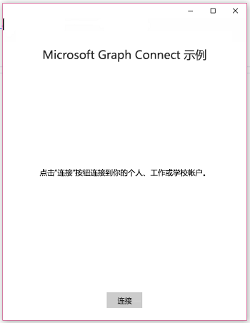
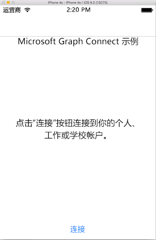
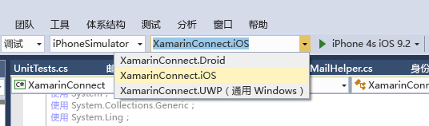

# <a name="get-started-with-microsoft-graph-in-a-xamarin-forms-app"></a>在 Xamarin Forms 应用中开始使用 Microsoft Graph

> **为企业客户生成应用？**如果企业客户启用企业移动性安全功能，如<a href="https://azure.microsoft.com/documentation/articles/active-directory-conditional-access-device-policies/" target="_newtab">条件性设备访问</a>，应用可能无法运行。在这种情况下，你可能不知道，而且客户可能会遇到错误。 

本文介绍了从 [Azure AD v2.0 终结点](https://developer.microsoft.com/graph/docs/concepts/converged_auth) 获取访问令牌和调用 Microsoft Graph 所需的任务。本文演示了 [适用于 Xamarin Forms 的 Microsoft Graph Connect 示例](https://github.com/microsoftgraph/xamarin-csharp-connect-sample) 示例中的代码，以说明在使用 Microsoft Graph 的应用中必须实现的主要概念。本文还介绍如何通过使用 [Microsoft Graph 客户端库](http://www.nuget.org/packages/Microsoft.Graph/) 来访问 Microsoft Graph。

这是将要创建的应用。

| UWP | Android | iOS |
| --- | ------- | ----|
|  |  |  |

**不想生成一个应用吗？**使用 [Microsoft Graph 快速入门](https://developer.microsoft.com/graph/quick-start) 快速准备就绪并开始运行，或下载本文基于的 [Xamarin Forms 的 Microsoft Graph Connect 示例](https://github.com/microsoftgraph/xamarin-csharp-connect-sample)。

## <a name="prerequisites"></a>先决条件

若要开始，将需要以下各项： 

- 一个 [Microsoft 帐户](https://www.outlook.com/) 或者一个[工作或学校帐户](http://dev.office.com/devprogram)
- Visual Studio 2015 
- [面向 Visual Studio 的 Xamarin](https://www.xamarin.com/visual-studio)
- Windows 10（[已启用开发模式](https://msdn.microsoft.com/library/windows/apps/xaml/dn706236.aspx)）
- [适用于 Xamarin Forms 的 Microsoft Graph Connect 初学者项目](https://github.com/microsoftgraph/xamarin-csharp-connect-sample/tree/master/starter)。此模板包含多个要向其中添加代码的类。它还包含完整视图和资源字符串。要获取此项目，请克隆或下载 [适用于 Xamarin Forms 的 Microsoft Graph Connect 示例](https://github.com/microsoftgraph/xamarin-csharp-connect-sample)，并打开“**初学者**”文件夹内的 **XamarinConnect** 解决方案。 

如果想要在此示例中运行 iOS 项目，则要求如下：

- 最新的 iOS SDK
- Xcode 的最新版本
- Mac OS X Sierra (10.12) 及更高版本 
- [Xamarin.iOS](https://docs.microsoft.com/visualstudio/mac/installation)
- [已连接到 Visual Studio 的 Xamarin Mac 代理](https://developer.xamarin.com/guides/ios/getting_started/installation/windows/connecting-to-mac/)


## <a name="register-the-app"></a>注册应用
 
1. 使用个人或工作或学校帐户登录到 [应用注册门户](https://apps.dev.microsoft.com/)。
2. 选择“添加应用”****。
3. 输入应用名称，然后选择“创建”****。
    
    此时，注册页会显示，并列出应用属性。
 
4. 在“平台”****下，选择“添加平台”****。
5. 选择“本机应用”****。
6. 复制应用 ID 值，以及在添加“本机应用”****平台时创建的自定义重定向 URI 值（在“本机应用”****标头下）。此 URI 应包含应用 ID 值，格式如下：`msal[Application Id]://auth`。需要在示例应用中输入这些值。

    应用 ID 是应用的唯一标识符。 

7. 选择“**保存**”。

## <a name="configure-the-project"></a>配置项目

1. 在 Visual Studio 中打开初学者项目的解决方案文件。
2. 打开 **XamarinConnect (可移植)** 项目中的 **App.cs** 文件，然后找到 `ClientId` 字段。使用注册应用的应用程序 ID 替换应用程序 ID 占位符。

    ```
    public static string ClientID = "ENTER_YOUR_CLIENT_ID";
    public static string RedirectUri = "msal" + ClientID + "://auth";
    public static string[] Scopes = { "User.Read", "Mail.Send", "Files.ReadWrite" };
    ```
    当用户进行身份验证时，`Scopes` 值将存储应用需要请求的 Microsoft Graph 权限范围。请注意，`App` 类构造函数使用 ClientID 值来实例化 MSAL `PublicClientApplication` 类的实例。稍后，将使用该类来验证用户身份。
    
    ```
    IdentityClientApp = new PublicClientApplication(ClientID);
    ```

3. 在文本编辑器中，打开 UserDetailsClient.iOS\info.plist 文件。遗憾的是，不能在 Visual Studio 中编辑此文件。在 `CFBundleURLSchemes` 键下查找 `<string>msalENTER_YOUR_CLIENT_ID</string>` 元素。

4. 将 `ENTER_YOUR_CLIENT_ID` 替换成注册应用时获取的应用 ID 值。请务必保留应用 ID 前面的 `msal`。生成的字符串值应如下所示：`<string>msal[application id]</string>`。

5. 打开 UserDetailsClient.Droid\Properties\AndroidManifest.xml 文件。查找以下元素：`<data android:scheme="msalENTER_YOUR_CLIENT_ID" android:host="auth" />`。

6. 将 `ENTER_YOUR_CLIENT_ID` 替换成注册应用时获取的应用 ID 值。请务必保留应用 ID 前面的 `msal`。生成的字符串值应如下所示：`<data android:scheme="msal[application id]" android:host="auth" />`。

## <a name="send-an-email-with-microsoft-graph"></a>使用 Microsoft Graph 发送电子邮件

打开初学者项目中的 MailHelper.cs 文件。该文件中包含构建并发送电子邮件的代码。它包含一个方法 -- ``ComposeAndSendMailAsync`` -- 该方法构建 POST 请求并将其发送到 **https://graph.microsoft.com/v1.0/me/microsoft.graph.SendMail** 终结点。 

``ComposeAndSendMailAsync`` 方法采用三个字符串值 -- ``subject``、``bodyContent`` 和 ``recipients`` -- 通过 MainPage.xaml.cs 文件将这些值传递给它。``subject`` 和 ``bodyContent`` 字符串随所有其他 UI 字符串存储在 AppResources.resx 文件中。``recipients`` 字符串来自应用界面中的地址框中。 

**使用声明**

请确保将这些声明置于文件顶部：

```
using System;
using System.Collections.Generic;
using System.Linq;
using System.Reflection;
using System.Threading.Tasks;
using Microsoft.Graph;
```

``ComposeAndSendMailAsync`` 方法中的第一个任务是从 Microsoft Graph 中获取当前用户的照片。此行调用无存根 `GetCurrentUserPhotoStreamAsync` 方法：

```
            // Get current user photo
            Stream photoStream = await GetCurrentUserPhotoStreamAsync();
```

完整的 `GetCurrentUserPhotoStreamAsync` 方法如下所示：

```
        // Gets the stream content of the signed-in user's photo. 
        // This snippet doesn't work with consumer accounts.
        public async Task<Stream> GetCurrentUserPhotoStreamAsync()
        {
            Stream currentUserPhotoStream = null;

            try
            {
                var graphClient = AuthenticationHelper.GetAuthenticatedClient();
                currentUserPhotoStream = await graphClient.Me.Photo.Content.Request().GetAsync();

            }

            // If the user account is MSA (not work or school), the service will throw an exception.
            catch (ServiceException)
            {
                return null;
            }

            return currentUserPhotoStream;

        }
```

如果用户没有照片，此逻辑会获取项目中包含的其他图像文件：

```
            // If the user doesn't have a photo, or if the user account is MSA, we use a default photo

            if (photoStream == null)
            {
                var assembly = typeof(MailHelper).GetTypeInfo().Assembly;
                photoStream = assembly.GetManifestResourceStream("XamarinConnect.test.jpg");
            }
```

现在已拥有图像流，可以通过调用无存根的 `UploadFileToOneDriveAsync` 方法将此文件上载到 OneDrive：

```
            MemoryStream photoStreamMS = new MemoryStream();
            // Copy stream to MemoryStream object so that it can be converted to byte array.
            photoStream.CopyTo(photoStreamMS);

            DriveItem photoFile = await UploadFileToOneDriveAsync(photoStreamMS.ToArray());
```

完整的 `UploadFileToOneDriveAsync` 方法如下所示：

```
        // Uploads the specified file to the user's root OneDrive directory.
        public async Task<DriveItem> UploadFileToOneDriveAsync(byte[] file)
        {
            DriveItem uploadedFile = null;

            try
            {
                var graphClient = AuthenticationHelper.GetAuthenticatedClient();
                MemoryStream fileStream = new MemoryStream(file);
                uploadedFile = await graphClient.Me.Drive.Root.ItemWithPath("me.png").Content.Request().PutAsync<DriveItem>(fileStream);

            }


            catch (ServiceException)
            {
                return null;
            }

            return uploadedFile;
        }
```

我们还可以使用该流创建可以随消息传递的 `MessageAttachmentsCollectionPage` 对象。

```
            MessageAttachmentsCollectionPage attachments = new MessageAttachmentsCollectionPage();
            attachments.Add(new FileAttachment
            {
                ODataType = "#microsoft.graph.fileAttachment",
                ContentBytes = photoStreamMS.ToArray(),
                ContentType = "image/png",
                Name = "me.png"
            });
```

我们可以通过调用无存根 `GetSharingLinkAsync` 方法获取新上载的 OneDrive 文件的共享链接。`bodyContent` 字符串包含共享链接的占位符。

```
            // Get the sharing link and insert it into the message body.
            Permission sharingLink = await GetSharingLinkAsync(photoFile.Id);
            string bodyContentWithSharingLink = String.Format(bodyContent, sharingLink.Link.WebUrl);
```

完整的 `GetSharingLinkAsync` 方法如下所示：

```
        public static async Task<Permission> GetSharingLinkAsync(string Id)
        {
            Permission permission = null;

            try
            {
                var graphClient = AuthenticationHelper.GetAuthenticatedClient();
                permission = await graphClient.Me.Drive.Items[Id].CreateLink("view").Request().PostAsync();
            }

            catch (ServiceException)
            {
                return null;
            }

            return permission;
        }
```

由于用户可以传递多个地址，因此下一项任务是将 ``recipients`` 字符串拆分为一组可用于构建 `Recipients` 对象列表的 `EmailAddress` 对象，然后能够以请求 POST 正文的形式传递这些对象：

```
            // Prepare the recipient list
            string[] splitter = { ";" };
            var splitRecipientsString = recipients.Split(splitter, StringSplitOptions.RemoveEmptyEntries);
            List<Recipient> recipientList = new List<Recipient>();

            foreach (string recipient in splitRecipientsString)
            {
                recipientList.Add(new Recipient { EmailAddress = new EmailAddress { Address = recipient.Trim() } });
            }
```

最后一项任务是构建 `Message` 对象，然后通过 `GraphServiceClient` 将它发送至 **me/microsoft.graph.SendMail** 终结点。由于 ``bodyContent`` 字符串是一个 HTML 文档，因此请求将 **ContentType** 值设置为 HTML。

```
            try
            {
                var graphClient = AuthenticationHelper.GetAuthenticatedClient();

                var email = new Message
                {
                    Body = new ItemBody
                    {
                        Content = bodyContentWithSharingLink,
                        ContentType = BodyType.Html,
                    },
                    Subject = subject,
                    ToRecipients = recipientList,
                    Attachments = attachments
                };

                try
                {
                    await graphClient.Me.SendMail(email, true).Request().PostAsync();
                }
                catch (ServiceException exception)
                {
                    throw new Exception("We could not send the message: " + exception.Error == null ? "No error message returned." : exception.Error.Message);
                }


            }

            catch (Exception e)
            {
                throw new Exception("We could not send the message: " + e.Message);
            }
```

完整的类如下所示：

```
    public class MailHelper
    {
        /// <summary>
        /// Compose and send a new email.
        /// </summary>
        /// <param name="subject">The subject line of the email.</param>
        /// <param name="bodyContent">The body of the email.</param>
        /// <param name="recipients">A semicolon-separated list of email addresses.</param>
        /// <returns></returns>
        public async Task ComposeAndSendMailAsync(string subject,
                                                            string bodyContent,
                                                            string recipients)
        {

            // Get current user photo
            Stream photoStream = await GetCurrentUserPhotoStreamAsync();


            // If the user doesn't have a photo, or if the user account is MSA, we use a default photo

            if (photoStream == null)
            {
                var assembly = typeof(MailHelper).GetTypeInfo().Assembly;
                photoStream = assembly.GetManifestResourceStream("XamarinConnect.test.jpg");
            }

            MemoryStream photoStreamMS = new MemoryStream();
            // Copy stream to MemoryStream object so that it can be converted to byte array.
            photoStream.CopyTo(photoStreamMS);

            DriveItem photoFile = await UploadFileToOneDriveAsync(photoStreamMS.ToArray());

            MessageAttachmentsCollectionPage attachments = new MessageAttachmentsCollectionPage();
            attachments.Add(new FileAttachment
            {
                ODataType = "#microsoft.graph.fileAttachment",
                ContentBytes = photoStreamMS.ToArray(),
                ContentType = "image/png",
                Name = "me.png"
            });

            // Get the sharing link and insert it into the message body.
            Permission sharingLink = await GetSharingLinkAsync(photoFile.Id);
            string bodyContentWithSharingLink = String.Format(bodyContent, sharingLink.Link.WebUrl);


            // Prepare the recipient list
            string[] splitter = { ";" };
            var splitRecipientsString = recipients.Split(splitter, StringSplitOptions.RemoveEmptyEntries);
            List<Recipient> recipientList = new List<Recipient>();

            foreach (string recipient in splitRecipientsString)
            {
                recipientList.Add(new Recipient { EmailAddress = new EmailAddress { Address = recipient.Trim() } });
            }

            try
            {
                var graphClient = AuthenticationHelper.GetAuthenticatedClient();

                var email = new Message
                {
                    Body = new ItemBody
                    {
                        Content = bodyContentWithSharingLink,
                        ContentType = BodyType.Html,
                    },
                    Subject = subject,
                    ToRecipients = recipientList,
                    Attachments = attachments
                };

                try
                {
                    await graphClient.Me.SendMail(email, true).Request().PostAsync();
                }
                catch (ServiceException exception)
                {
                    throw new Exception("We could not send the message: " + exception.Error == null ? "No error message returned." : exception.Error.Message);
                }


            }

            catch (Exception e)
            {
                throw new Exception("We could not send the message: " + e.Message);
            }
        }

        // Gets the stream content of the signed-in user's photo. 
        // This snippet doesn't work with consumer accounts.
        public async Task<Stream> GetCurrentUserPhotoStreamAsync()
        {
            Stream currentUserPhotoStream = null;

            try
            {
                var graphClient = AuthenticationHelper.GetAuthenticatedClient();
                currentUserPhotoStream = await graphClient.Me.Photo.Content.Request().GetAsync();

            }

            // If the user account is MSA (not work or school), the service will throw an exception.
            catch (ServiceException)
            {
                return null;
            }

            return currentUserPhotoStream;

        }

        // Uploads the specified file to the user's root OneDrive directory.
        public async Task<DriveItem> UploadFileToOneDriveAsync(byte[] file)
        {
            DriveItem uploadedFile = null;

            try
            {
                var graphClient = AuthenticationHelper.GetAuthenticatedClient();
                MemoryStream fileStream = new MemoryStream(file);
                uploadedFile = await graphClient.Me.Drive.Root.ItemWithPath("me.png").Content.Request().PutAsync<DriveItem>(fileStream);

            }


            catch (ServiceException)
            {
                return null;
            }

            return uploadedFile;
        }

        public static async Task<Permission> GetSharingLinkAsync(string Id)
        {
            Permission permission = null;

            try
            {
                var graphClient = AuthenticationHelper.GetAuthenticatedClient();
                permission = await graphClient.Me.Drive.Items[Id].CreateLink("view").Request().PostAsync();
            }

            catch (ServiceException)
            {
                return null;
            }

            return permission;
        }


    }
``` 

现在，已经执行了与 Microsoft Graph 进行交互所需的三个步骤：应用注册、用户身份验证以及进行请求。 

## <a name="run-the-app"></a>运行应用
1. 选择想要运行的项目。如果选择“通用 Windows 平台”选项，则可以在本地计算机上运行示例。如果想要运行 iOS 项目，则需连接到安装在其上的 [具有 Xamarin 工具的 Mac](https://developer.xamarin.com/guides/ios/getting_started/installation/windows/connecting-to-mac/)。（还可以在 Mac 上的 Xamarin Studio 中打开此解决方案并直接从此处运行示例。）如果想要运行 Android 项目，可以使用[适用于 Android 的 Visual Studio 模拟器](https://www.visualstudio.com/features/msft-android-emulator-vs.aspx)。 

    

2. 按 F5 进行构建和调试。运行此解决方案并使用个人或工作或学校帐户登录。
    > **注意** 可能需要打开生成配置管理器，以确保为 UWP 项目选择“生成”和“部署”步骤。 

3. 使用个人帐户、工作或学校帐户登录，并授予所请求的权限。

4. 选择“**发送邮件**”按钮。在邮件发送后，将显示成功消息。此邮件包含附件形式的照片，同时还提供到 OneDrive 中上载的文件的共享链接。

## <a name="next-steps"></a>后续步骤
- 使用 [Graph 浏览器](https://developer.microsoft.com/graph/graph-explorer) 试用 REST API。
- 在 [amarin.Forms 的 Microsoft Graph SDK 代码段库](https://github.com/microsoftgraph/xamarin-csharp-snippets-sample) 中查找常见操作示例，或在 GitHub 上浏览我们的其他 [Xamarin 示例](https://github.com/microsoftgraph?utf8=%E2%9C%93&query=xamarin)。

## <a name="see-also"></a>另请参阅
- [Microsoft Graph.NET 客户端库](https://github.com/microsoftgraph/msgraph-sdk-dotnet)
- [Azure AD v2.0 协议](https://azure.microsoft.com/documentation/articles/active-directory-v2-protocols/)
- [Azure AD v2.0 令牌](https://azure.microsoft.com/documentation/articles/active-directory-v2-tokens/)
