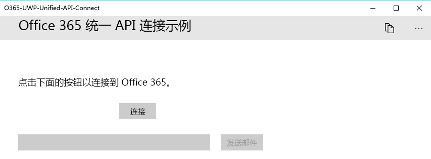

# <a name="get-started-with-microsoft-graph-in-a-universal-windows-10-app"></a>在通用 Windows 10 应用中开始使用 Microsoft Graph

> **为企业客户生成应用？**如果企业客户启用企业移动性安全功能，如<a href="https://azure.microsoft.com/en-us/documentation/articles/active-directory-conditional-access-device-policies/" target="_newtab">条件性设备访问</a>，应用可能无法运行。在这种情况下，你可能不知道，而且客户可能会遇到错误。 

> 若要在**所有企业方案**中支持**所有企业客户**，必须使用 Azure AD 终结点并使用 [Azure 管理门户](https://aka.ms/aadapplist)管理应用。有关详细信息，请参阅 [在 Azure AD 和 Azure AD v2.0 终结点之间进行选择](../concepts/auth_overview.md#deciding-between-the-azure-ad-and-azure-ad-v20-endpoints)。

本文介绍了从 [Azure AD v2.0 终结点](https://developer.microsoft.com/en-us/graph/docs/concepts/converged_auth)获取访问令牌和调用 Microsoft Graph 所需的任务。本文演示了[适用于 UWP（库）的 Microsoft Graph Connect 示例](https://github.com/microsoftgraph/uwp-csharp-connect-sample)中的代码，以说明在使用 Microsoft Graph 的应用中必须实现的主要概念。

**不想生成一个应用吗？**使用 [Microsoft Graph 快速入门](https://developer.microsoft.com/graph/quick-start)快速准备就绪并开始运行，或下载本文基于的[适用于 UWP（库）的 Microsoft Graph Connect 示例](https://github.com/microsoftgraph/uwp-csharp-connect-sample)。此外请注意，我们有[此示例的 REST 版本](https://github.com/microsoftgraph/uwp-csharp-connect-rest-sample)。

## <a name="sample-user-interface"></a>示例用户界面

该示例包含一个非常简单的用户界面，其中包括一个顶部命令栏、一个**连接按钮**、一个**发送邮件**按钮，以及一个会自动填充登录用户电子邮件地址的文本框，但是该文本框可以进行编辑。

当用户未连接时，**发送邮件**按钮处于禁用状态：



当用户已连接时，顶部命令栏包含一个断开连接按钮。


所有示例的 UI 字符串均存储在 Assets 文件夹中的 Resources.resw 文件中。

## <a name="prerequisites"></a>先决条件

若要开始，将需要以下各项： 

- 一个 [Microsoft 帐户](https://www.outlook.com/) 或者一个[工作或学校帐户](http://dev.office.com/devprogram)
- Visual Studio 2015 
- [适用于 UWP（库）的 Microsoft Graph 初学者项目](https://github.com/microsoftgraph/uwp-csharp-connect-sample/tree/master/starter)。两个模板均包含可向其中添加代码的空类。它们还包含资源字符串。要获取此项目，请克隆或下载[适用于 UWP（库）的 Microsoft Graph Connect 示例](https://github.com/microsoftgraph/uwp-csharp-connect-sample)，并打开**初学者**文件夹内的解决方案。


## <a name="register-the-app"></a>注册应用
 
1. 使用个人或工作或学校帐户登录到 [应用注册门户](https://apps.dev.microsoft.com/)。
2. 选择“**添加应用**”。
3. 为应用输入名称，并选择“**创建应用程序**”。
    
    将显示注册页，其中列出应用的属性。
 
4. 在“平台”****下，选择“添加平台”****。
5. 选择“本机应用程序”****。
6. 将客户端 ID（应用程序 ID）和重定向 URL 值复制到剪切板。将需要在示例应用中输入这些值。

    应用 ID 是应用的唯一标识符。重定向 URL 是由 Windows 10 为每个应用提供的唯一 URI，以确保发送到该 URI 的邮件只发送到该应用程序。 

7. 选择“**保存**”。

## <a name="configure-the-project"></a>配置项目

1. 在 Visual Studio 中打开初学者项目的解决方案文件。
2. 打开项目的 **App.xaml** 文件，并找到 `Application.Resources` 节点。使用注册应用的相应值替换应用程序 ID 和重定向 URI 占位符。


```xml
    <Application.Resources>
        <!-- Add your Client Id here. -->
        <x:String x:Key="ida:ClientID">ENTER_YOUR_CLIENT_ID</x:String>
        <!-- Add your Redirect URI here. -->
        <x:String x:Key="ida:ReturnUrl">ENTER_YOUR_REDIRECT_URI</x:String>
    </Application.Resources>
```

## <a name="install-the-microsoft-authentication-library-msal"></a>安装 Microsoft 身份验证库 (MSAL)

[Microsoft 身份验证库](https://www.nuget.org/packages/Microsoft.Identity.Client) 包含更容易通过 Azure AD v2.0 终结点对用户进行身份验证的类和方法。

1. 在解决方案资源管理器中，右键单击项目名称，并选择“**管理 NuGet 包...**”
2. 单击“浏览”，然后搜索 Microsoft.Identity.Client。
3. 选择最新版本的 Microsoft 身份验证库，然后单击“**安装**”。

## <a name="install-the-microsoft-graph-client-library"></a>安装 Microsoft Graph 客户端库

1. 在解决方案资源管理器中，右键单击项目名称，并选择“管理 NuGet 包...”****
2. 单击“浏览”，然后搜索 Microsoft.Graph。
3. 选择最新版本的 Microsoft Graph 客户端库，然后单击“安装”****。

## <a name="install-the-newtonsoftjson-library"></a>安装 Newtonsoft.JSON 库

1. 在解决方案资源管理器中，右键单击“XamarinConnect (可移植)”****项目并选择“管理 NuGet 包...”****
2. 单击“浏览”，然后搜索 NewtonSoft.JSON。
3. 选择 9.0.1 版本的 NewtonSoft.JSON 库，然后单击“安装”****。

## <a name="create-the-authenticationhelpercs-class"></a>创建 AuthenticationHelper.cs 类

打开初学者项目中的 AuthenticationHelper.cs 文件。该文件中包含所有身份验证代码，以及存储用户信息并仅在用户与应用断开连接时强制进行身份验证的其他逻辑。该类包含至少两种方法：`GetTokenForUserAsync` 和 `Signout`。如果使用的是 Microsoft Graph 客户端库，则需要添加第三种方法：`GetAuthenticatedClient`。

当用户进行身份验证并且之后应用每次调用 Microsoft Graph 时，都会运行 ``GetTokenHelperAsync`` 方法。

**使用声明**

***客户端库版本***

确保该文件包含以下声明：

```
using System;
using System.Diagnostics;
using System.Net.Http.Headers;
using System.Threading.Tasks;
using Microsoft.Graph;
using Microsoft.Identity.Client;
```

**类字段**

请确保将这些字段置于 AuthenticationHelper 类中：

```
// The Client ID is used by the application to uniquely identify itself to the Azure AD v2.0 endpoint.
static string clientId = App.Current.Resources["ida:ClientID"].ToString();
public static string[] Scopes = { "User.Read", "Mail.Send" };
public static PublicClientApplication IdentityClientApp = new PublicClientApplication(clientId);
public static string TokenForUser = null;
public static DateTimeOffset Expiration;
private static GraphServiceClient graphClient = null;
```

示例将 `GraphServicesClient` 存储在字段中，因此，只需构建一次。它使用 MSAL `PublicClientApplication` 类来验证用户身份。`Scopes` 字段存储当用户进行身份验证时，应用需要请求的 Microsoft Graph 权限范围。 


**GetTokenForUserAsync**

`GetTokenForUserAsync` 方法使用 PublicClientApplicationClass 和 ClientId 设置为用户获取访问令牌。如果用户尚未进行身份验证，它将启动身份验证 UI。

```
        public static async Task<string> GetTokenForUserAsync()
        {
            AuthenticationResult authResult;
            try
            {
                authResult = await IdentityClientApp.AcquireTokenSilentAsync(Scopes);
                TokenForUser = authResult.Token;
            }

            catch (Exception)
            {
                if (TokenForUser == null || Expiration <= DateTimeOffset.UtcNow.AddMinutes(5))
                {
                    authResult = await IdentityClientApp.AcquireTokenAsync(Scopes);

                    TokenForUser = authResult.Token;
                    Expiration = authResult.ExpiresOn;
                }
            }

            return TokenForUser;
        }
```

**注销**

`Signout` 方法注销通过 `PublicClientApplication` 登录的所有用户（在本例中只有一个用户），并置空 `TokenForUser` 值。它还置空 `GraphServicesClient` 值。

这是 `Signout` 方法的客户端库版本。

```
        public static void SignOut()
        {
            foreach (var user in IdentityClientApp.Users)
            {
                user.SignOut();
            }
            graphClient = null;
            TokenForUser = null;

        }
``` 

**GetAuthenticatedClient**

最后，将需要一个创建 `GraphServicesClient` 的方法。此方法创建一个客户端，以对每个从客户端到 Microsoft Graph 的调用使用 `GetTokenForUserAsync` 方法。

```
        public static GraphServiceClient GetAuthenticatedClient()
        {
            if (graphClient == null)
            {
                // Create Microsoft Graph client.
                try
                {
                    graphClient = new GraphServiceClient(
                        "https://graph.microsoft.com/v1.0",
                        new DelegateAuthenticationProvider(
                            async (requestMessage) =>
                            {
                                var token = await GetTokenForUserAsync();
                                requestMessage.Headers.Authorization = new AuthenticationHeaderValue("bearer", token);
                            }));
                    return graphClient;
                }

                catch (Exception ex)
                {
                    Debug.WriteLine("Could not create a graph client: " + ex.Message);
                }
            }

            return graphClient;
        }
```

## <a name="send-an-email-with-microsoft-graph"></a>使用 Microsoft Graph 发送电子邮件

打开初学者项目中的 MailHelper.cs 文件。该文件中包含构建并发送电子邮件的代码。它包含一个方法 -- ``ComposeAndSendMailAsync`` -- 该方法构建 POST 请求并将其发送到 **https://graph.microsoft.com/v1.0/me/microsoft.graph.SendMail** 终结点。 

``ComposeAndSendMailAsync`` 方法采用三个字符串值 -- ``subject``、``bodyContent`` 和 ``recipients`` -- 通过 MainPage.xaml.cs 文件将这些值传递给它。``subject`` 和 ``bodyContent`` 字符串随所有其他 UI 字符串存储在 Resources.resw 文件中。``recipients`` 字符串来自应用界面中的地址框中。 

请确保 MailHelper.cs 文件具有以下 `using` 声明：

```
using System;
using System.Collections.Generic;
using System.Linq;
using System.Text;
using System.IO;
using System.Threading.Tasks;
using Microsoft.Graph;
using Windows.Storage;
```

``ComposeAndSendMailAsync`` 方法中的第一个任务是从 Microsoft Graph 中获取当前用户的照片。此行调用 `GetCurrentUserPhotoStreamAsync` 方法：

```
            // Get current user photo
            Stream photoStream = await GetCurrentUserPhotoStreamAsync();
```

完整的 `GetCurrentUserPhotoStreamAsync` 方法如下所示：

```
        // Gets the stream content of the signed-in user's photo. 
        // This snippet doesn't work with consumer accounts.
        public async Task<Stream> GetCurrentUserPhotoStreamAsync()
        {
            Stream currentUserPhotoStream = null;

            try
            {
                var graphClient = AuthenticationHelper.GetAuthenticatedClient();
                currentUserPhotoStream = await graphClient.Me.Photo.Content.Request().GetAsync();

            }

            // If the user account is MSA (not work or school), the service will throw an exception.
            catch (ServiceException)
            {
                return null;
            }

            return currentUserPhotoStream;

        }
```

如果用户没有照片，则此逻辑获取项目随附的另一个图像文件：

```
            // If the user doesn't have a photo, or if the user account is MSA, we use a default photo

            if (photoStream == null)
            {
                StorageFile file = await Windows.ApplicationModel.Package.Current.InstalledLocation.GetFileAsync("test.jpg");
                photoStream = (await file.OpenReadAsync()).AsStreamForRead();
            }
```

现在我们已拥有图像流，可以通过调用 `UploadFileToOneDriveAsync` 方法将此文件上载到 OneDrive：

```
            MemoryStream photoStreamMS = new MemoryStream();
            // Copy stream to MemoryStream object so that it can be converted to byte array.
            photoStream.CopyTo(photoStreamMS);

            DriveItem photoFile = await UploadFileToOneDriveAsync(photoStreamMS.ToArray());
```

完整的 `UploadFileToOneDriveAsync` 方法如下所示：

```
        // Uploads the specified file to the user's root OneDrive directory.
        public async Task<DriveItem> UploadFileToOneDriveAsync(byte[] file)
        {
            DriveItem uploadedFile = null;

            try
            {
                var graphClient = AuthenticationHelper.GetAuthenticatedClient();
                MemoryStream fileStream = new MemoryStream(file);
                uploadedFile = await graphClient.Me.Drive.Root.ItemWithPath("me.png").Content.Request().PutAsync<DriveItem>(fileStream);

            }


            catch (ServiceException)
            {
                return null;
            }

            return uploadedFile;
        }
```

我们还可以使用该流创建可以随消息传递的 `MessageAttachmentsCollectionPage` 对象。

```
            MessageAttachmentsCollectionPage attachments = new MessageAttachmentsCollectionPage();
            attachments.Add(new FileAttachment
            {
                ODataType = "#microsoft.graph.fileAttachment",
                ContentBytes = photoStreamMS.ToArray(),
                ContentType = "image/png",
                Name = "me.png"
            });
```

我们可以通过调用 `GetSharingLinkAsync` 方法获取新上载的 OneDrive 文件的共享链接。`bodyContent` 字符串包含共享链接的占位符：

```
            // Get the sharing link and insert it into the message body.
            Permission sharingLink = await GetSharingLinkAsync(photoFile.Id);
            string bodyContentWithSharingLink = String.Format(bodyContent, sharingLink.Link.WebUrl);
```

完整的 `GetSharingLinkAsync` 方法如下所示：

```
        public static async Task<Permission> GetSharingLinkAsync(string Id)
        {
            Permission permission = null;

            try
            {
                var graphClient = AuthenticationHelper.GetAuthenticatedClient();
                permission = await graphClient.Me.Drive.Items[Id].CreateLink("view").Request().PostAsync();
            }

            catch (ServiceException)
            {
                return null;
            }

            return permission;
        }
```

由于用户可以传递多个地址，因此下一项任务是将 ``recipients`` 字符串拆分为一组可用于构建 `Recipients` 对象列表的 `EmailAddress` 对象，然后能够以请求 POST 正文的形式传递这些对象：

```
            // Prepare the recipient list
            string[] splitter = { ";" };
            var splitRecipientsString = recipients.Split(splitter, StringSplitOptions.RemoveEmptyEntries);
            List<Recipient> recipientList = new List<Recipient>();

            foreach (string recipient in splitRecipientsString)
            {
                recipientList.Add(new Recipient { EmailAddress = new EmailAddress { Address = recipient.Trim() } });
            }
```

最后一项任务是构建 `Message` 对象，然后通过 `GraphServiceClient` 将它发送至 **me/microsoft.graph.SendMail** 终结点。由于 ``bodyContent`` 字符串是一个 HTML 文档，因此请求将 **ContentType** 值设置为 HTML。

```
            try
            {
                var graphClient = AuthenticationHelper.GetAuthenticatedClient();

                var email = new Message
                {
                    Body = new ItemBody
                    {
                        Content = bodyContentWithSharingLink,
                        ContentType = BodyType.Html,
                    },
                    Subject = subject,
                    ToRecipients = recipientList,
                    Attachments = attachments
                };

                try
                {
                    await graphClient.Me.SendMail(email, true).Request().PostAsync();
                }
                catch (ServiceException exception)
                {
                    throw new Exception("We could not send the message: " + exception.Error == null ? "No error message returned." : exception.Error.Message);
                }


            }

            catch (Exception e)
            {
                throw new Exception("We could not send the message: " + e.Message);
            }
```

完整的类如下所示：

```
    public class MailHelper
    {
        /// <summary>
        /// Compose and send a new email.
        /// </summary>
        /// <param name="subject">The subject line of the email.</param>
        /// <param name="bodyContent">The body of the email.</param>
        /// <param name="recipients">A semicolon-separated list of email addresses.</param>
        /// <returns></returns>
        public async Task ComposeAndSendMailAsync(string subject,
                                                            string bodyContent,
                                                            string recipients)
        {

            // Get current user photo
            Stream photoStream = await GetCurrentUserPhotoStreamAsync();


            // If the user doesn't have a photo, or if the user account is MSA, we use a default photo

            if (photoStream == null)
            {
                StorageFile file = await Windows.ApplicationModel.Package.Current.InstalledLocation.GetFileAsync("test.jpg");
                photoStream = (await file.OpenReadAsync()).AsStreamForRead();
            }

            MemoryStream photoStreamMS = new MemoryStream();
            // Copy stream to MemoryStream object so that it can be converted to byte array.
            photoStream.CopyTo(photoStreamMS);

            DriveItem photoFile = await UploadFileToOneDriveAsync(photoStreamMS.ToArray());

            MessageAttachmentsCollectionPage attachments = new MessageAttachmentsCollectionPage();
            attachments.Add(new FileAttachment
            {
                ODataType = "#microsoft.graph.fileAttachment",
                ContentBytes = photoStreamMS.ToArray(),
                ContentType = "image/png",
                Name = "me.png"
            });

            // Get the sharing link and insert it into the message body.
            Permission sharingLink = await GetSharingLinkAsync(photoFile.Id);
            string bodyContentWithSharingLink = String.Format(bodyContent, sharingLink.Link.WebUrl);

            // Prepare the recipient list
            string[] splitter = { ";" };
            var splitRecipientsString = recipients.Split(splitter, StringSplitOptions.RemoveEmptyEntries);
            List<Recipient> recipientList = new List<Recipient>();

            foreach (string recipient in splitRecipientsString)
            {
                recipientList.Add(new Recipient { EmailAddress = new EmailAddress { Address = recipient.Trim() } });
            }

            try
            {
                var graphClient = AuthenticationHelper.GetAuthenticatedClient();

                var email = new Message
                {
                    Body = new ItemBody
                    {
                        Content = bodyContentWithSharingLink,
                        ContentType = BodyType.Html,
                    },
                    Subject = subject,
                    ToRecipients = recipientList,
                    Attachments = attachments
                };

                try
                {
                    await graphClient.Me.SendMail(email, true).Request().PostAsync();
                }
                catch (ServiceException exception)
                {
                    throw new Exception("We could not send the message: " + exception.Error == null ? "No error message returned." : exception.Error.Message);
                }


            }

            catch (Exception e)
            {
                throw new Exception("We could not send the message: " + e.Message);
            }
        }


        // Gets the stream content of the signed-in user's photo. 
        // This snippet doesn't work with consumer accounts.
        public async Task<Stream> GetCurrentUserPhotoStreamAsync()
        {
            Stream currentUserPhotoStream = null;

            try
            {
                var graphClient = AuthenticationHelper.GetAuthenticatedClient();
                currentUserPhotoStream = await graphClient.Me.Photo.Content.Request().GetAsync();

            }

            // If the user account is MSA (not work or school), the service will throw an exception.
            catch (ServiceException)
            {
                return null;
            }

            return currentUserPhotoStream;

        }

        // Uploads the specified file to the user's root OneDrive directory.
        public async Task<DriveItem> UploadFileToOneDriveAsync(byte[] file)
        {
            DriveItem uploadedFile = null;

            try
            {
                var graphClient = AuthenticationHelper.GetAuthenticatedClient();
                MemoryStream fileStream = new MemoryStream(file);
                uploadedFile = await graphClient.Me.Drive.Root.ItemWithPath("me.png").Content.Request().PutAsync<DriveItem>(fileStream);

            }


            catch (ServiceException)
            {
                return null;
            }

            return uploadedFile;
        }

        public static async Task<Permission> GetSharingLinkAsync(string Id)
        {
            Permission permission = null;

            try
            {
                var graphClient = AuthenticationHelper.GetAuthenticatedClient();
                permission = await graphClient.Me.Drive.Items[Id].CreateLink("view").Request().PostAsync();
            }

            catch (ServiceException)
            {
                return null;
            }

            return permission;
        }

    }
``` 

##<a name="create-the-user-interface-in-mainpagexaml"></a>在 MainPage.xaml 中创建用户界面

现在，已经编写了通过 Microsoft Graph 执行用户身份验证并发送邮件的代码，只需创建上述的简单界面。 

初学者项目中的 MainPage.xaml 文件已经包含了所有需要的 XAML。只需将驱动界面的代码添加到 MainPage.xaml.cs 文件。在项目中找到该文件并打开。

添加命名空间中的此代码来完成 MainPage.xaml.cs 中 MainPage 类的客户端库版本：

```
    public sealed partial class MainPage : Page
    {
        private string _mailAddress;
        private string _displayName = null;
        private MailHelper _mailHelper = new MailHelper();

        public MainPage()
        {
            this.InitializeComponent();
        }

        protected override void OnNavigatedTo(NavigationEventArgs e)
        {
            // Developer code - if you haven't registered the app yet, we warn you. 
            if (!App.Current.Resources.ContainsKey("ida:ClientID"))
            {
                InfoText.Text = ResourceLoader.GetForCurrentView().GetString("NoClientIdMessage");
                ConnectButton.IsEnabled = false;
            }
            else
            {
                InfoText.Text = ResourceLoader.GetForCurrentView().GetString("ConnectPrompt");
                ConnectButton.IsEnabled = true;
            }
        }

        /// <summary>
        /// Signs in the current user.
        /// </summary>
        /// <returns></returns>
        public async Task<bool> SignInCurrentUserAsync()
        {
            var graphClient = AuthenticationHelper.GetAuthenticatedClient();

            if (graphClient != null)
            {
                var user = await graphClient.Me.Request().GetAsync();
                string userId = user.Id;
                _mailAddress = user.UserPrincipalName;
                _displayName = user.DisplayName;
                return true;
            }
            else
            {
                return false;
            }

        }


        private async void ConnectButton_Click(object sender, RoutedEventArgs e)
        {
            ProgressBar.Visibility = Visibility.Visible;
            if (await SignInCurrentUserAsync())
            { 
                InfoText.Text = "Hi " + _displayName + "," + Environment.NewLine + ResourceLoader.GetForCurrentView().GetString("SendMailPrompt");
                MailButton.IsEnabled = true;
                EmailAddressBox.IsEnabled = true;
                ConnectButton.Visibility = Visibility.Collapsed;
                DisconnectButton.Visibility = Visibility.Visible;
                EmailAddressBox.Text = _mailAddress;
            }
            else
            {
                InfoText.Text = ResourceLoader.GetForCurrentView().GetString("AuthenticationErrorMessage");
            }

            ProgressBar.Visibility = Visibility.Collapsed;
        }

        private async void MailButton_Click(object sender, RoutedEventArgs e)
        {
            _mailAddress = EmailAddressBox.Text;
            ProgressBar.Visibility = Visibility.Visible;
            MailStatus.Text = string.Empty;
            try
            {
                await _mailHelper.ComposeAndSendMailAsync(ResourceLoader.GetForCurrentView().GetString("MailSubject"), ResourceLoader.GetForCurrentView().GetString("MailContents"), _mailAddress);
                MailStatus.Text = string.Format(ResourceLoader.GetForCurrentView().GetString("SendMailSuccess"), _mailAddress);
            }
            catch (Exception)
            {
                MailStatus.Text = ResourceLoader.GetForCurrentView().GetString("MailErrorMessage");
            }
            finally
            {
                ProgressBar.Visibility = Visibility.Collapsed;
            }
            
        }

        private void Disconnect_Click(object sender, RoutedEventArgs e)
        {
            ProgressBar.Visibility = Visibility.Visible;
            AuthenticationHelper.SignOut();
            ProgressBar.Visibility = Visibility.Collapsed;
            MailButton.IsEnabled = false;
            EmailAddressBox.IsEnabled = false;
            ConnectButton.Visibility = Visibility.Visible;
            InfoText.Text = ResourceLoader.GetForCurrentView().GetString("ConnectPrompt");
            this._displayName = null;
            this._mailAddress = null;
        }
    }
```
 
现在，已经执行了与 Microsoft Graph 进行交互所需的三个步骤：应用注册、用户身份验证以及进行请求。 

## <a name="run-the-app"></a>运行应用
1. 按 F5 生成和运行此应用。 

2. 使用个人帐户、工作或学校帐户登录，并授予所请求的权限。

3. 选择“发送电子邮件”****按钮。在发送邮件后，将在按钮下方显示成功消息。此邮件包含附件形式的照片，同时还提供到 OneDrive 中上载的文件的共享链接。

## <a name="next-steps"></a>后续步骤
- 使用 [Graph 浏览器](https://graph.microsoft.io/graph-explorer) 试用 REST API。
- 在 [Microsoft Graph UWP 代码段示例 (SDK)](https://github.com/microsoftgraph/uwp-csharp-snippets-sample) 和 [Microsoft Graph UWP 代码段示例 (REST)](https://github.com/microsoftgraph/uwp-csharp-snippets-rest-sample) 中查找 REST 和 SDK 操作的常见操作示例，或在 GitHub 上浏览我们的其他 [UWP 示例](https://github.com/microsoftgraph?utf8=%E2%9C%93&query=uwp)。

## <a name="see-also"></a>另请参阅
- [Microsoft Graph.NET 客户端库](https://github.com/microsoftgraph/msgraph-sdk-dotnet)
- [Azure AD v2.0 协议](https://azure.microsoft.com/en-us/documentation/articles/active-directory-v2-protocols/)
- [Azure AD v2.0 令牌](https://azure.microsoft.com/en-us/documentation/articles/active-directory-v2-tokens/)

