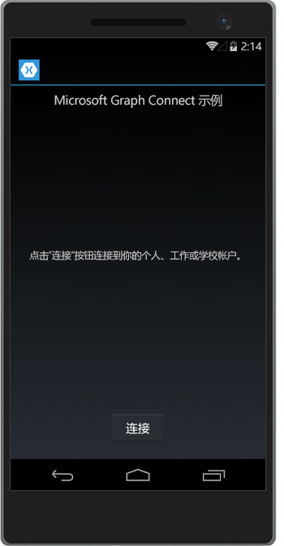

# <a name="get-started-with-microsoft-graph-in-a-xamarin-forms-app"></a>在 Xamarin Forms 应用中开始使用 Microsoft Graph

本文介绍了从 [Azure AD v2.0 终结点](https://developer.microsoft.com/en-us/graph/docs/authorization/converged_auth) 获取访问令牌和调用 Microsoft Graph 所需的任务。本文演示了 [适用于 Xamarin Forms 的 Microsoft Graph Connect 示例](https://github.com/microsoftgraph/xamarin-csharp-connect-sample) 示例中的代码，以说明在使用 Microsoft Graph 的应用中必须实现的主要概念。本文还介绍如何通过使用 [Microsoft Graph 客户端库](http://www.nuget.org/packages/Microsoft.Graph/) 来访问 Microsoft Graph。

这是将要创建的应用。

| UWP | Android | iOS |
| --- | ------- | ----|
|  |  |  |

**不想生成一个应用吗？**使用 [Microsoft Graph 快速入门](https://graph.microsoft.io/en-us/getting-started) 快速准备就绪并开始运行，或下载本文基于的 [Xamarin Forms 的 Microsoft Graph Connect 示例](https://github.com/microsoftgraph/xamarin-csharp-connect-sample)。

## <a name="prerequisites"></a>先决条件

若要开始，将需要以下各项： 

- 一个 [Microsoft 帐户](https://www.outlook.com/) 或者一个[工作或学校帐户](http://dev.office.com/devprogram)
- Visual Studio 2015 
- [面向 Visual Studio 的 Xamarin](https://www.xamarin.com/visual-studio)
- Windows 10（[已启用开发模式](https://msdn.microsoft.com/library/windows/apps/xaml/dn706236.aspx)）
- [适用于 Xamarin Forms 的 Microsoft Graph Connect 初学者项目](https://github.com/microsoftgraph/xamarin-csharp-connect-sample/tree/master/starter)。此模板包含多个要向其中添加代码的类。它还包含完整视图和资源字符串。要获取此项目，请克隆或下载 [适用于 Xamarin Forms 的 Microsoft Graph Connect 示例](https://github.com/microsoftgraph/xamarin-csharp-connect-sample)，并打开“**初学者**”文件夹内的 **XamarinConnect** 解决方案。 

如果想要在此示例中运行 iOS 项目，则要求如下：

- 最新的 iOS SDK
- Xcode 的最新版本
- Mac OS X Yosemite (10.10) 和更高版本 
- [Xamarin.iOS](https://developer.xamarin.com/guides/ios/getting_started/installation/mac/)
- [已连接到 Visual Studio 的 Xamarin Mac 代理](https://developer.xamarin.com/guides/ios/getting_started/installation/windows/connecting-to-mac/)


## <a name="register-the-app"></a>注册应用
 
1. 使用个人或工作或学校帐户登录到 [应用注册门户](https://apps.dev.microsoft.com/)。
2. 选择“**添加应用**”。
3. 为应用输入名称，并选择“**创建应用程序**”。
    
    将显示注册页，其中列出应用的属性。
 
4. 在“**平台**”下，选择“**添加平台**”。
5. 选择“**移动平台**”。
6. 复制应用程序 ID。将需要在示例应用中输入该值。

    应用程序 ID 是应用的唯一标识符。重定向 URL 是由 Windows 10 为每个应用提供的唯一 URI，以确保发送到该 URI 的邮件只发送到该应用程序。 

7. 选择“**保存**”。

## <a name="configure-the-project"></a>配置项目

1. 在 Visual Studio 中打开初学者项目的解决方案文件。
2. 打开 **XamarinConnect (可移植)** 项目中的 **App.cs** 文件，然后找到 `ClientId` 字段。使用注册应用的应用程序 ID 替换应用程序 ID 占位符。

```c#
public static string ClientID = "ENTER_YOUR_CLIENT_ID";
public static string[] Scopes = { "User.Read", "Mail.Send" };
```
当用户进行身份验证时，`Scopes` 值将存储应用需要请求的 Microsoft Graph 权限范围。请注意，`App` 类构造函数使用 ClientID 值来实例化 MSAL `PublicClientApplication` 类的实例。稍后，将使用该类来验证用户身份。

```c#
IdentityClientApp = new PublicClientApplication(ClientID);
```

## <a name="install-the-microsoft-authentication-library-msal"></a>安装 Microsoft 身份验证库 (MSAL)

[Microsoft 身份验证库](https://www.nuget.org/packages/Microsoft.Identity.Client) 包含更容易通过 v2.0 身份验证终结点对用户进行身份验证的类和方法。

1. 在解决方案资源管理器中，右键单击“**XamarinConnect (可移植)**”项目并选择“**管理 NuGet 包...**”
2. 单击“浏览”，然后搜索 Microsoft.Identity.Client。
3. 选择最新版本的 Microsoft 身份验证库，然后单击“**安装**”。

为 **XamarinConnect.Droid****XamarinConnect.iOS** 和 **XamarinConnect.UWP** 项目执行相同的步骤。如果未在所有四个项目中安装 MSA，将不会生成应用。

## <a name="install-the-microsoft-graph-client-library"></a>安装 Microsoft Graph 客户端库

1. 在解决方案资源管理器中，右键单击“**XamarinConnect (可移植)**”项目并选择“**管理 NuGet 包...**”
2. 单击“浏览”，然后搜索 Microsoft.Graph。
3. 选择最新版本的 Microsoft Graph 客户端库，然后单击“**安装**”。

## <a name="create-the-authenticationhelpercs-class"></a>创建 AuthenticationHelper.cs 类

打开 **XamarinConnect (可移植)** 项目内的 AuthenticationHelper.cs 文件。该文件中包含所有身份验证代码，以及存储用户信息并仅在用户与应用断开连接时强制进行身份验证的其他逻辑。该类包含至少三种方法：`GetTokenForUserAsync`、`Signout` 和 `GetAuthenticatedClient`

当用户进行身份验证并且之后应用每次调用 Microsoft Graph 时，都会运行 `GetTokenHelperAsync` 方法。

**使用声明**

请确保将这些声明置于文件顶部：

```c#
using Microsoft.Graph;
using System;
using System.Diagnostics;
using System.Net.Http.Headers;
using System.Threading.Tasks;
using Microsoft.Identity.Client;
```

**类字段**

请确保将这些字段置于 AuthenticationHelper 类中：

```c#
public static string TokenForUser = null;
public static DateTimeOffset expiration;
private static GraphServiceClient graphClient = null;
```

示例将 `GraphServicesClient` 存储在字段中，因此，只需构建一次。它存储访问令牌的到期 `DateTimeOffset`，以便它在现有令牌即将到期前不再提取新的令牌。

**GetTokenForUserAsync**

`GetTokenForUserAsync` 方法使用在 **App.cs** 文件中实例化的 `PublicClientApplicationClass` 为用户获取访问令牌。如果用户尚未进行身份验证，它将启动身份验证 UI。

```c#
        public static async Task<string> GetTokenForUserAsync()
        {
            if (TokenForUser == null || expiration <= DateTimeOffset.UtcNow.AddMinutes(5))
            {
                AuthenticationResult authResult = await App.IdentityClientApp.AcquireTokenAsync(App.Scopes);

                TokenForUser = authResult.Token;
                expiration = authResult.ExpiresOn;
            }

            return TokenForUser;
        }
```

**注销**

`Signout` 方法注销通过 `PublicClientApplication` 登录的所有用户（在本例中只有一个用户），并置空 `TokenForUser` 值。它还置空 `GraphServicesClient` 值。

```c#
        public static void SignOut()
        {
            foreach (var user in App.IdentityClientApp.Users)
            {
                user.SignOut();
            }
            graphClient = null;
            TokenForUser = null;

        }
``` 

**GetAuthenticatedClient**

最后，将需要一个创建 `GraphServicesClient` 的方法。此方法创建一个客户端，以对每个从客户端到 Microsoft Graph 的调用使用 `GetTokenForUserAsync` 方法。

```c#
        public static GraphServiceClient GetAuthenticatedClient()
        {
            if (graphClient == null)
            {
                // Create Microsoft Graph client.
                try
                {
                    graphClient = new GraphServiceClient(
                        "https://graph.microsoft.com/v1.0",
                        new DelegateAuthenticationProvider(
                            async (requestMessage) =>
                            {
                                var token = await GetTokenForUserAsync();
                                requestMessage.Headers.Authorization = new AuthenticationHeaderValue("bearer", token);
                            }));
                    return graphClient;
                }

                catch (Exception ex)
                {
                    Debug.WriteLine("Could not create a graph client: " + ex.Message);
                }
            }

            return graphClient;
        }
```

## <a name="send-an-email-with-microsoft-graph"></a>使用 Microsoft Graph 发送电子邮件

打开初学者项目中的 MailHelper.cs 文件。该文件中包含构建并发送电子邮件的代码。它包含一个方法 -- ``ComposeAndSendMailAsync`` -- 该方法构建 POST 请求并将其发送到 **https://graph.microsoft.com/v1.0/me/microsoft.graph.SendMail** 终结点。 

``ComposeAndSendMailAsync`` 方法采用三个字符串值 -- ``subject``、``bodyContent`` 和 ``recipients`` -- 通过 MainPage.xaml.cs 文件将这些值传递给它。``subject`` 和 ``bodyContent`` 字符串随所有其他 UI 字符串存储在 AppResources.resx 文件中。``recipients`` 字符串来自应用界面中的地址框中。 

**使用声明**

将这些声明添加到文件顶部：

```c#
using System;
using System.Collections.Generic;
using System.Threading.Tasks;
using Microsoft.Graph;
```

由于用户可以传递多个地址，因此第一项任务是将 ``recipients`` 字符串拆分为一组可用于构建 `Recipients` 对象列表的 `EmailAddress` 对象，然后能够以请求 POST 正文的形式传递这些对象：

```c#
            // Prepare the recipient list
            string[] splitter = { ";" };
            var splitRecipientsString = recipients.Split(splitter, StringSplitOptions.RemoveEmptyEntries);
            List<Recipient> recipientList = new List<Recipient>();

            foreach (string recipient in splitRecipientsString)
            {
                recipientList.Add(new Recipient { EmailAddress = new EmailAddress { Address = recipient.Trim() } });
            }
```

另一项任务是构建 `Message` 对象，然后通过 `GraphServiceClient` 将它发送至 **me/microsoft.graph.SendMail** 终结点。由于 ``bodyContent`` 字符串是一个 HTML 文档，因此请求将 **ContentType** 值设置为 HTML。

```c#
            try
            {
                var graphClient = AuthenticationHelper.GetAuthenticatedClient();

                var email = new Message
                {
                    Body = new ItemBody
                    {
                        Content = bodyContent,
                        ContentType = BodyType.Html,
                    },
                    Subject = subject,
                    ToRecipients = recipientList,
                };

                try
                {
                    await graphClient.Me.SendMail(email, true).Request().PostAsync();
                }
                catch (ServiceException exception)
                {
                    throw new Exception("We could not send the message: " + exception.Error == null ? "No error message returned." : exception.Error.Message);
                }


            }

            catch (Exception e)
            {
                throw new Exception("We could not send the message: " + e.Message);
            }
```

完整的类如下所示：

```c#
    public class MailHelper
    {
        /// <summary>
        /// Compose and send a new email.
        /// </summary>
        /// <param name="subject">The subject line of the email.</param>
        /// <param name="bodyContent">The body of the email.</param>
        /// <param name="recipients">A semicolon-separated list of email addresses.</param>
        /// <returns></returns>
        public async Task ComposeAndSendMailAsync(string subject,
                                                            string bodyContent,
                                                            string recipients)
        {

            // Prepare the recipient list
            string[] splitter = { ";" };
            var splitRecipientsString = recipients.Split(splitter, StringSplitOptions.RemoveEmptyEntries);
            List<Recipient> recipientList = new List<Recipient>();

            foreach (string recipient in splitRecipientsString)
            {
                recipientList.Add(new Recipient { EmailAddress = new EmailAddress { Address = recipient.Trim() } });
            }

            try
            {
                var graphClient = AuthenticationHelper.GetAuthenticatedClient();

                var email = new Message
                {
                    Body = new ItemBody
                    {
                        Content = bodyContent,
                        ContentType = BodyType.Html,
                    },
                    Subject = subject,
                    ToRecipients = recipientList,
                };

                try
                {
                    await graphClient.Me.SendMail(email, true).Request().PostAsync();
                }
                catch (ServiceException exception)
                {
                    throw new Exception("We could not send the message: " + exception.Error == null ? "No error message returned." : exception.Error.Message);
                }


            }

            catch (Exception e)
            {
                throw new Exception("We could not send the message: " + e.Message);
            }
        }
    }
``` 

现在，已经执行了与 Microsoft Graph 进行交互所需的三个步骤：应用注册、用户身份验证以及进行请求。 

## <a name="run-the-app"></a>运行应用
1. 选择想要运行的项目。如果选择“通用 Windows 平台”选项，则可以在本地计算机上运行示例。如果想要运行 iOS 项目，则需连接到安装在其上的 [具有 Xamarin 工具的 Mac](https://developer.xamarin.com/guides/ios/getting_started/installation/windows/connecting-to-mac/)。（还可以在 Mac 上的 Xamarin Studio 中打开此解决方案并直接从此处运行示例。）如果想要运行 Android 项目，可以使用[适用于 Android 的 Visual Studio 模拟器](https://www.visualstudio.com/features/msft-android-emulator-vs.aspx)。 

    

2. 按 F5 进行构建和调试。运行此解决方案并使用个人或工作或学校帐户登录。
    > **注意** 可能需要打开生成配置管理器，以确保为 UWP 项目选择“生成”和“部署”步骤。 

3. 使用你的个人、工作或学校帐户登录，并授予所请求的权限。

4. 选择“**发送邮件**”按钮。在邮件发送后，将显示成功消息。

## <a name="next-steps"></a>后续步骤
- 使用 [Graph 浏览器](https://graph.microsoft.io/graph-explorer) 试用 REST API。
- 在 [amarin.Forms 的 Microsoft Graph SDK 代码段库](https://github.com/microsoftgraph/xamarin-csharp-snippets-sample) 中查找常见操作示例，或在 GitHub 上浏览我们的其他 [Xamarin 示例](https://github.com/microsoftgraph?utf8=%E2%9C%93&query=xamarin)。

## <a name="see-also"></a>另请参阅
- [Microsoft Graph.NET 客户端库](https://github.com/microsoftgraph/msgraph-sdk-dotnet)
- [Azure AD v2.0 协议](https://azure.microsoft.com/en-us/documentation/articles/active-directory-v2-protocols/)
- [Azure AD v2.0 令牌](https://azure.microsoft.com/en-us/documentation/articles/active-directory-v2-tokens/)
