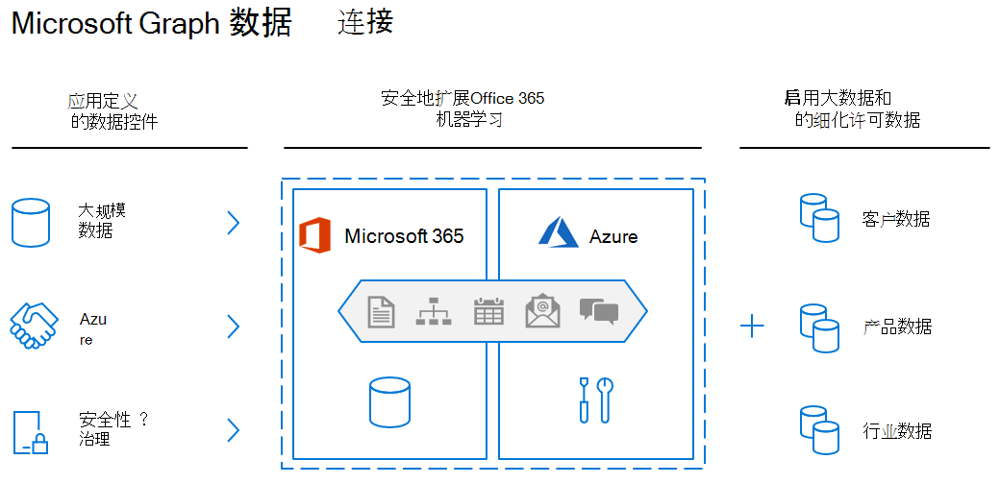

<!-- markdownlint-disable MD002 MD041 -->

Microsoft Graph 数据连接通过智能方式大规模访问丰富数据，增强了 Microsoft Graph 的事务性模型。 这些数据涵盖员工如何在 Microsoft 365 中的所有应用程序和服务之间进行沟通、协作和管理时间。 数据连接是大数据和机器学习的理想选择，让你能够通过将 Microsoft 365 数据扩展到 Azure 来开发用于分析、智能和业务流程优化的应用程序。 通过以这种方式集成，你将能够利用 Azure 中的大量计算、存储套件，同时保持符合行业标准并确保数据安全。

Microsoft Graph 数据连接使用 Azure 数据工厂以可配置的时间间隔将 Microsoft 365 数据复制到应用程序的存储中。 它还提供了一组工具来简化向 Microsoft Azure 传送此数据的过程，让你可以访问最适用的开发和托管工具。 数据连接还授权更精细的控制和同意模型：你可以管理数据，查看谁正在访问数据以及请求实体的特定属性。 这增强了 Microsoft Graph 模型，其授予或拒绝应用程序对整个实体的访问权限。

可以使用 Data Connect 为组织启用机器学习方案。 在这些方案中，你可以创建应用程序来为利益干系人提供宝贵信息、训练机器学习模型，甚至根据采集的大量数据进行预测。

## 入门

在本教程中，你将创建第一个 Microsoft Graph Data Connect 应用程序。 令人兴奋，对吧？ 我们也是这么想的！ 若要开始，需要先设置一些内容。

### 先决条件

若要完成此实验室，需要以下订阅或许可证。

1. **Microsoft 365 租赁**

   - 如果没有，可以通过注册 [Microsoft 365 开发人员计划](https://developer.microsoft.com/microsoft-365/dev-program)获得一个免费)  (。
   - 多个 Microsoft 365 用户，其中已发送和接收电子邮件。
   - 至少访问满足以下要求的两个帐户：
      - 必须分配 **全局管理员** 角色。
      - 必须有权访问Microsoft 365 管理中心。

1. **Microsoft Azure 订阅**

   - 如果没有，可以在 [Azure 网站](https://azure.microsoft.com/free/)中免费) 一个 (。
   - 用于登录的帐户必须向其授予 **全局管理员** 角色。
   - Azure 订阅必须与 Microsoft 365 租户位于同一租户中，因为 Graph Data Connect 只会将数据导出到同一租户中的 Azure 订阅，而不是跨租户导出数据。
   - Microsoft 365 和 Azure 租户必须位于相同的Microsoft Azure Active Directory租户中。

1. 确保已在开发计算机上安装 [Visual Studio](https://visualstudio.microsoft.com/vs/) 。

> [!NOTE]
> 此实验室中使用的屏幕截图和示例来自 Microsoft 365 测试租户，其中包含来自测试用户的示例电子邮件。 可以使用自己的 Microsoft 365 租户执行相同的步骤。 不会将任何数据写入 Microsoft 365。 电子邮件数据的副本从 Microsoft 365 租户中的所有用户中提取，并复制到一个Azure Blob 存储帐户，用于控制谁有权访问Azure Blob 存储中的数据。
