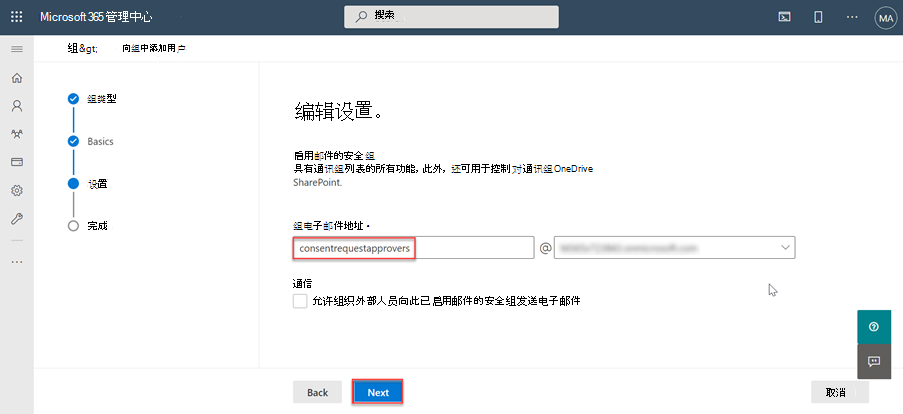

<!-- markdownlint-disable MD002 MD041 -->

首次使用 Microsoft Graph Data Connect 之前，需要配置 Microsoft 365 租户。 这涉及到启用服务并配置有权批准数据提取请求的安全组。

## 向 Azure AD 用户授予全局管理员角色

在此步骤中，你将确保 Microsoft 365 租户中的两个用户已启用 **全局管理员** 角色。

- [全局管理员内置角色](/azure/active-directory/roles/permissions-reference#global-administrator)。
- [提升访问权限以获取全局管理员角色](/azure/role-based-access-control/elevate-access-global-admin)。

## 配置 Microsoft Graph Data Connect 同意请求审批者组

在此步骤中，你将设置 Microsoft 365 租户以启用 Microsoft Graph 数据连接。

1. 打开浏览器并转到[Microsoft 365 管理门户](https://admin.microsoft.com/)。

1. 在侧栏导航中，选择 **“活动组**”。

    

1. 选择 **“添加组** ”按钮。

1. 使用以下命令创建 **新的启用邮件** 的安全组，然后选择 **“添加** ”按钮。
   - **类型**：启用邮件的安全性

    

   - **名称**：同意请求审批者

    

   - **Email前缀**：consentrequestapprovers

    

1. 新创建的组 **最多可能需要一个小时** 才能显示在列表中。 创建组后，选择它。

1. 再次转到 **“活动组”** 选项，搜索刚创建的组。

1. 选择该组，然后在 **“成员** ”选项卡中，选择 **“查看所有”并管理成员**。

1. 将启用 **全局管理员** 角色的两个用户添加到此新组。

## 在 Microsoft 365 租户中启用 Microsoft Graph 数据连接

在此步骤中，你将在 Microsoft 365 租户上启用 Microsoft Graph 数据连接服务。

1. 虽然你仍登录到Microsoft 365 管理门户，但 **请选择“设置”>“组织设置”** 菜单项。

1. 选择 **Microsoft Graph Data Connect** 服务。

    

1. 选中显示为 **整个组织打开或关闭 Microsoft Graph 数据连接** 以启用数据连接的复选框。

    

1. 输入 **同意请求审批者** (或之前在用户组中) 创建 **的组的名称，以做出审批决策** 并选择 **“保存**”。
