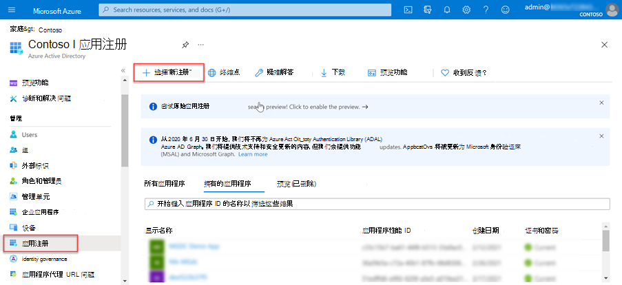
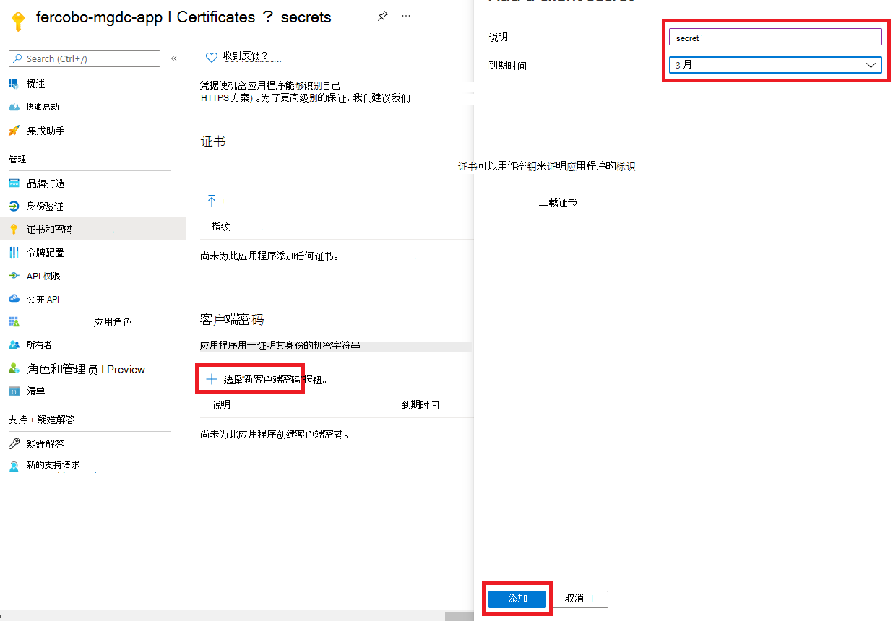

<!-- markdownlint-disable MD002 MD041 -->

在本练习中，你将创建、运行和批准一个Azure 数据工厂管道，以便将数据从 Microsoft 365 提取到 Azure 存储 Blob 以进行其他处理。

## 创建Microsoft Azure Active Directory应用程序注册

第一步是创建一个 Azure AD 应用程序，该应用程序将用作运行数据提取过程的安全主体。

1. 打开浏览器并转到 [Azure 门户](https://portal.azure.com/)。

1. 使用对 Azure 和 Microsoft 365 租户 **具有全局管理员** 权限的帐户登录。

1. 在侧栏导航中，选择 **Azure AD)  (Azure Active Directory** 。

1. 在“Azure AD 概述”页上，从菜单的“**管理**”部分中选择 **应用注册**。

1. 选择 **“新建注册** ”按钮。

    

1. 使用以下值创建新的 Azure AD 应用程序并选择 **“注册**”。

   - **名称**：Microsoft Graph 数据连接数据传输
   - **支持的帐户类型**：仅此组织目录中的帐户。
   - **重定向 URI**：保留默认值。

    

1. 找到 **应用程序 (客户端) ID** 并根据本教程后面需要复制它。 这称为服务主体 ID。

1. 找到 **目录 (租户) ID** 并将其复制，因为本教程稍后将需要它。 这称为租户 ID。

1. 在侧栏导航中，选择“**管理**”下的 **“证书和机密**”。

1. 选择 **“新建客户端机密”按钮**。 将 *说明* 设置为任何名称，将 **Expire 设置** 为下拉列表中的任何值，然后选择 **“添加**”。

    

    - 创建客户端机密后，请确保将 **值** 保存到安全的位置，因为它以后将不再可用，并且需要创建新的值。
    - 这会被引用为服务主体密钥。

1. 在应用程序的侧栏导航中，选择 **“所有者**”。

1. 验证帐户是否被列为应用程序的所有者。 如果它未作为所有者列出，请添加它。

    
