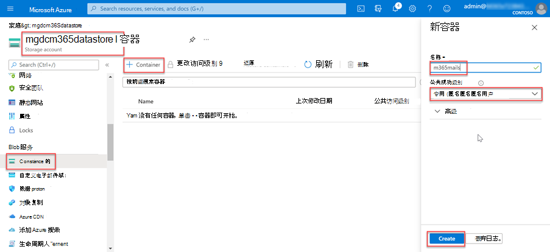

<!-- markdownlint-disable MD002 MD041 -->

在此步骤中，将创建一个 Azure 存储帐户，其中 Microsoft Graph 数据连接将存储从 Microsoft 365 提取的数据以供进一步处理。

1. 打开浏览器并转到 [Azure 门户](https://portal.azure.com/)。

1. 使用对 Azure 和 Microsoft 365 租户 **具有全局管理员** 权限的帐户登录。

1. 在侧栏导航上，选择 **“创建资源**”。

1. 找到 **存储帐户** 资源类型并使用以下值创建它，然后选择 **“查看 + 创建**”。

    - **订阅**：选择 Azure 订阅
    - **资源组**：GraphDataConnect (或选择现有资源组) 
    - **存储帐户名称**：mgdcm365datastore
    - **区域**：选择与 Microsoft 365 区域位于同一区域中的 Azure 区域
    - **性能**：标准
    - **冗余**：异地冗余存储 (GRS) 
    - **高级选项卡**：
      - **访问层**：热

1. 查看设置与上一步中显示的设置匹配，然后选择 **“创建**”。

1. 创建 Azure 存储帐户后，向之前创建的 Azure AD 应用程序授予对该帐户的适当访问权限。

    1. 选择 **Azure 存储帐户**。
    2. 在边栏菜单 **上，选择“访问”控件 (IAM)**。
    3. 在 **“添加角色分配**”块中选择 **“添加**”按钮。
    4. 使用以下值查找之前选择的应用程序以授予其 **存储 Blob 数据参与者** 角色，然后选择 **“保存**”。

        - **角色**：存储 Blob 数据参与者
        - **将访问权限分配给**：用户、组或服务主体
        - **选择**：Microsoft Graph 数据连接数据传输 (之前创建的 Azure AD 应用程序的名称) 

        

1. 在 **mgdcm365datastore** Azure 存储帐户中创建新容器。

    1. 选择 **mgdcm365datastore** Azure 存储帐户。
    2. 在边栏菜单上，选择 **“Blob** 服务”部分下的 **“容器**”。
    3. 选择页面顶部的 **“+容器** ”按钮并使用以下值，然后选择 **“创建**”。

        - **名称**：m365mails
        - **公共访问级别**：专用 (无匿名访问) 

        
