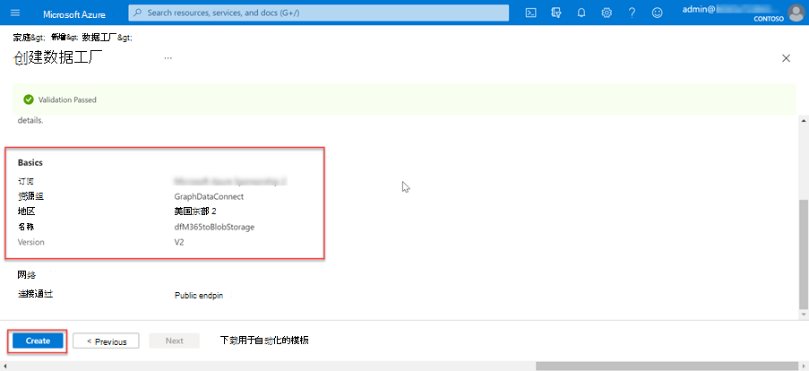
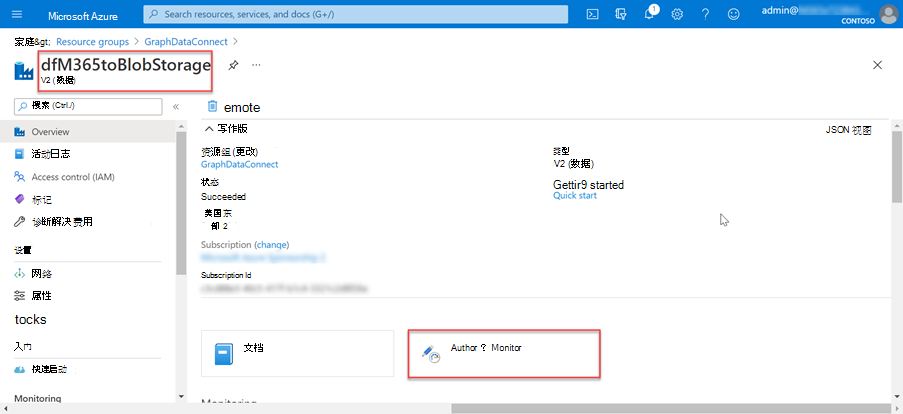
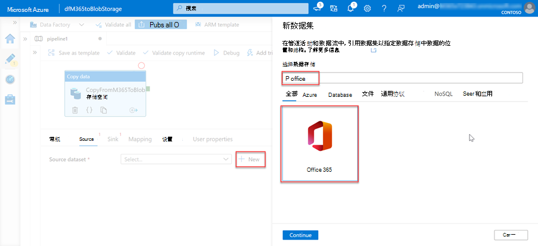
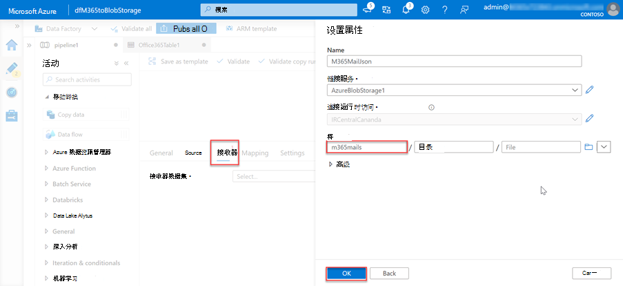
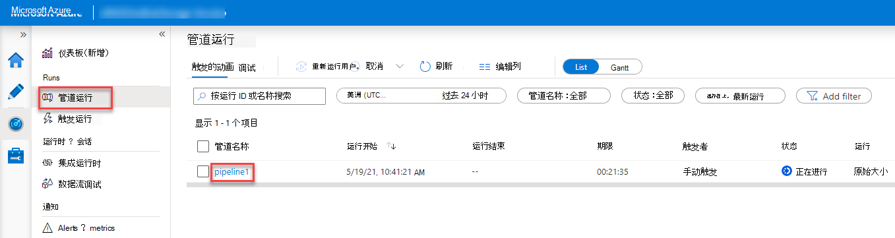
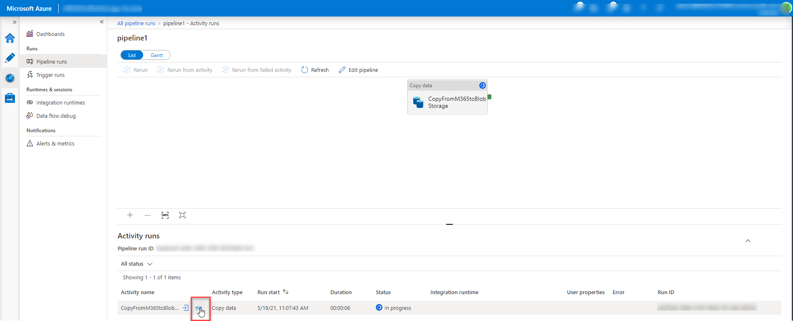

<!-- markdownlint-disable MD002 MD041 -->

下一步是使用Azure 数据工厂创建管道，以使用 Microsoft Graph 数据连接将数据从 Microsoft 365 提取到 Azure 存储帐户。

## 创建Azure 数据工厂管道

1. 打开浏览器并转到 [Azure 门户](https://portal.azure.com/)。

1. 使用对 Azure 和 Microsoft 365 租户 **具有全局管理员** 权限的帐户登录。

1. 在侧栏导航上，选择 **“创建资源**”。

1. 找到 **数据工厂** 资源类型并使用以下值创建它，然后选择 **“创建**”。

    1. **订阅**：选择 Azure 订阅
    2. **资源组**：GraphDataConnect
    3. **区域**：选择与 Microsoft 365 区域位于同一区域中的 Azure 区域
    4. **名称**：dfM365toBlobStorage
    5. **版本**：V2

        

    6. 在 **“Git 配置** ”选项卡中，确保配置 Git 或稍后选择“ _配置 Git”_ 选项。

1. 创建Azure 数据工厂资源后，选择 **“作者”和“监视器”** 磁贴以启动Azure 数据工厂全屏编辑器。

    

1. 从左侧导航中选择“ **概述** ”，切换到 **“管理** ”体验。

1. 默认情况下，Azure 数据工厂将使用自动解析区域的集成运行时。 由于 Data Connect 要求源和目标以及集成运行时存在于同一 Microsoft 365 区域中，因此建议创建具有固定区域的新集成运行时。

    1. 选择 **“集成运行时新建** > ”。
    2. 选择 **“Azure”、“自承载** ”并选择 **“继续**”。
    3. 选择用于网络环境的 **Azure** ，然后选择 **“继续**”。

        

    4. 使用以下详细信息在最终屏幕上完成窗体，然后选择 **“创建**”。

        - **名称**：集成运行时的名称
        - **说明**：输入说明
        - **区域**：选择与 Microsoft 365 区域匹配的区域
        - **虚拟网络配置 (预览)**： 已禁用

1. 从左侧导航中选择“ **管理** ”，切换到 **“作者** ”体验。
1. 选择 **加号** 图标，然后选择管道，创建新 **管道**。

    

    - 将“**移动和转换**”部分中的 **“复制数据**”活动拖动到设计图面上。

        

    - 在设计器中选择活动。
    - 选择“ **常规** ”选项卡并为其提供名称和说明。

      - **名称**：CopyFromM365toBlobStorage
      - **说明**：所需的说明。

    - 在设计器下方的活动编辑器窗格中，选择 **“源** ”选项卡，然后选择 **“新建**”。
    - 找到数据集 **Office 365**，选择它，然后选择 **“继续**”按钮。

        

    - 设计器将使用 Microsoft 365 连接器设置更新 **“源** ”选项卡。
    - 选择 **“源数据集**”字段旁边的 **“打开**”选项。
    - 在表设置中，选择 **“连接** ”选项卡，然后选择 **“新建** ”按钮。
    - 在显示的对话框中，分别在 **服务主体 ID** 和 **服务主体密钥** 字段中输入以前创建的 Azure AD 应用程序 **的应用程序 ID** 和 **机密 ID**，然后选择 **“创建**”。
    - **选择之前通过集成运行时** 下拉列表在 Connect 中创建的集成运行时。

        

    - 创建 Microsoft 365 连接后，对于 **表** 字段，选择 **BasicDataSet_v0。Message_v0**。
    - 从 **Office365Table** 切换到 **管道>源**。 对 **日期筛选器** 使用以下值。

      - **列名**：CreatedDateTime
      - **开始时间 (UTC)**：在当前日期之前的某个时间选择日期
      - **结束时间 (UTC)**：选择当前日期
      - 在“输出列”部分中选择“_导入架构_”。

    - 在管道选项卡中选择 **“复制数据** ”活动，然后选择“ **接收器** ”选项卡。

      - 选择 **“新建**”按钮，选择 **Azure Blob 存储**，然后选择 **“继续**”按钮。
      - 选择 **二进制** 文件作为数据的格式，然后选择 **“继续** ”按钮。
      - 为数据集命名 **M365JsonFile** ，并创建新的链接服务（如果尚不存在）。

    - 在表中选择 **“连接”** 选项卡，然后选择 **“新建**”。
    - 在对话框中设置以下值，然后选择 **“完成**”。

        - **身份验证方法**：服务主体
        - **Azure 订阅**：全部选择
        - **存储帐户名称**：mgdcm365datastore
          - 这是本练习前面创建的存储帐户。
        - **租户**：输入 Azure 租户的 ID
        - **服务主体 ID**：输入之前创建的 Azure AD 应用程序的 ID
        - **服务主体密钥**：输入之前创建的 Azure AD 应用程序的哈希键

    - 在 **“文件路径** ”字段旁边，选择 **“浏览**”。
    - 选择之前创建的存储容器的名称。

      

1. 创建管道后，选择设计器顶部的“ **验证所有** ”按钮。

1. 验证 (并修复) 找到的任何问题后，选择设计器顶部的 **“全部发布** ”按钮。

## 运行Azure 数据工厂管道

创建管道后，现在可以运行它了。

> [!NOTE]
> 可能需要几分钟时间才能显示同意请求，整个过程 (启动、请求同意以及批准同意完成管道运行后，这种情况并不少见，) 需要 40 多分钟。

1. 在Azure 数据工厂设计器中，打开管道后，选择 **“立即触发>添加触发器**。

    

1. 启动作业后，从边栏菜单中选择 **“监视器** ”以查看当前正在运行的作业。

1. 在左侧导航栏上，找到 **“管道运行** ”选项卡并选择它。 选择 **“管道名称** ”列下的管道以查看 **活动运行**。 此管道将显示为 _“正在进行”。_

    

1. 进入 **“活动运行** ”视图后，转到位于页面底部的“ _活动运行_ ”部分。

1. 将鼠标悬停在 **活动名称** 上，然后选择“护目镜”选项。 这将显示 **“详细信息** ”选项卡。

    

1. 在 **“详细信息”** 屏幕中，查找管道活动的状态，如下图中所示。 在这种情况下，可以看到它处于 **RequestingConsent** 状态。

    

1. 此时，活动运行在内部暂停，直到有人通过Microsoft 365 管理中心或 PowerShell 手动批准同意请求。
