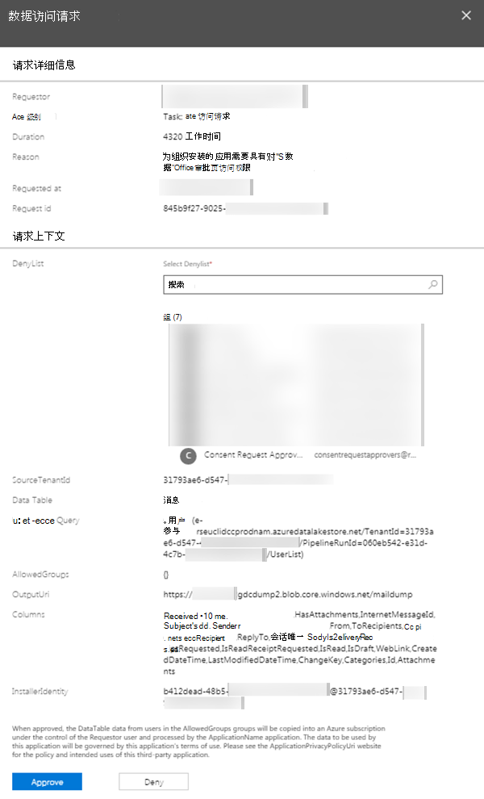
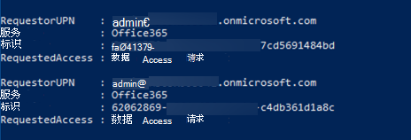
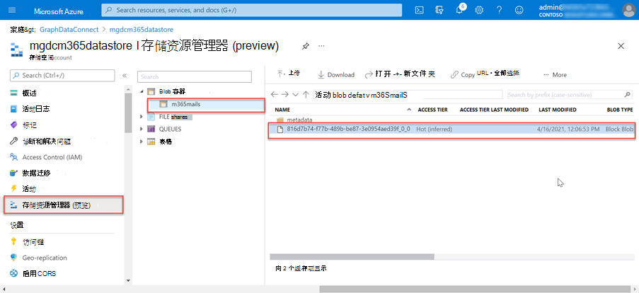

<!-- markdownlint-disable MD002 MD041 -->

Microsoft 365 管理员能够批准或拒绝同意请求。 这可以通过Microsoft 365 管理中心或通过 PowerShell 以编程方式完成。

## <a name="approve-consent-requests"></a>批准同意请求

# <a name="microsoft-365-admin-center"></a>[Microsoft 365 管理中心](#tab/Microsoft365)

1. 打开浏览器并转到[Microsoft 365 管理门户](https://admin.microsoft.com)。

1. 若要批准或拒绝同意请求，请转到 [Privileged Access](https://portal.office.com/adminportal/home#/Settings/PrivilegedAccess)。

1. 选择挂起 **的数据访问请求**。

1. 在 **“数据访问请求** ”调用中，选择“ **批准** ”按钮。

    

# <a name="powershell"></a>[PowerShell](#tab/PowerShell)

1. 打开 Windows PowerShell。
1. 确保 PowerShell 会话已启用远程签名脚本。

    ```powershell
    Set-ExecutionPolicy RemoteSigned
    ```

1. 连接到Exchange Online。

    1. 通过执行以下 PowerShell 获取登录凭据。 使用不同于创建并启动Azure 数据工厂管道的用户登录，该管道具有 **全局管理员** 角色，是组的成员，有权批准 Microsoft 365 中的数据请求，并启用了多重身份验证。

        ```powershell
        $UserCredential = Get-Credential
        ```

    1. 创建新的 Exchange Online PowerShell 会话并加载 () 导入。

        ```powershell
        $Session = New-PSSession -ConfigurationName Microsoft.Exchange -ConnectionUri https://ps.protection.outlook.com/powershell-liveid/ -Credential $UserCredential -Authentication Basic -AllowRedirection
        Import-PSSession $Session -DisableNameChecking
        ```

        > [!IMPORTANT]
        > 完成此会话后，请确保使用 PowerShell 命令 `Remove-PSSession $Session`断开与会话的连接。 Exchange Online仅允许三个打开的远程 PowerShell 会话来防范拒绝服务 (DoS) 攻击。 如果只是关闭 PowerShell 窗口，则会使连接保持打开状态。

1. 通过执行以下 PowerShell，获取 Microsoft Graph 数据连接中所有挂起的数据请求的列表。

    ```powershell
    Get-ElevatedAccessRequest | where {$_.RequestStatus -eq 'Pending'} | select RequestorUPN, Service, Identity, RequestedAccess | fl
    ```

    - 检查返回的数据访问请求的列表。 在下图中，请注意有两个挂起的请求。

        

1. 通过执行以下 PowerShell 复制请求的标识 GUID，批准在上一步骤中返回的数据访问。

    > [!NOTE]
    > 将以下代码片段中的 GUID 替换为上一步结果中的 GUID。

    ```powershell
    Approve-ElevatedAccessRequest -RequestId fa041379-0000-0000-0000-7cd5691484bd -Comment 'approval request granted'
    ```

1. 片刻之后，应该会看到活动运行更新的状态页，以显示它现在正在 _提取数据_。

    

1. 提取数据的过程可能需要一些时间，具体取决于 Microsoft 365 租户的大小。

---

## <a name="verify-extracted-data-from-microsoft-365-to-azure-storage-blob"></a>验证从 Microsoft 365 提取到 Azure 存储 Blob 的数据

1. 打开浏览器并转到 [Azure 门户](https://portal.azure.com/)。

1. 使用对 Azure 和 Microsoft 365 租户 **具有全局管理员** 权限的帐户登录。

1. 在侧栏导航中，选择 **“所有资源”** 菜单项。

1. 在资源列表中，选择之前在本教程中创建的 **Azure 存储帐户** 。

1. 在边栏导航菜单上，从 **Azure 存储帐户** 边栏选项卡中选择 **Blob**。

1. 选择之前在本教程中创建的 **容器**，该容器将Azure 数据工厂管道配置为提取数据的接收器。 现在应该会在此容器中看到数据。

    
