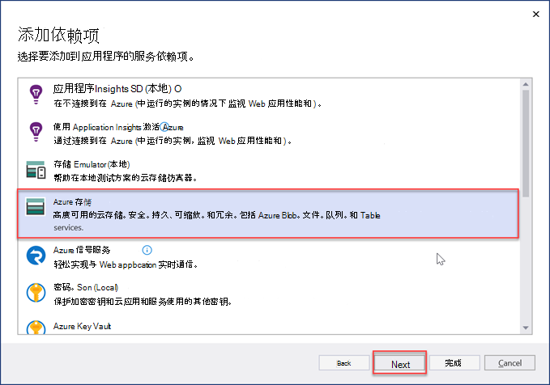
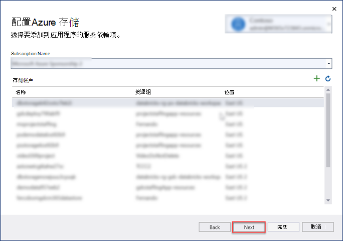
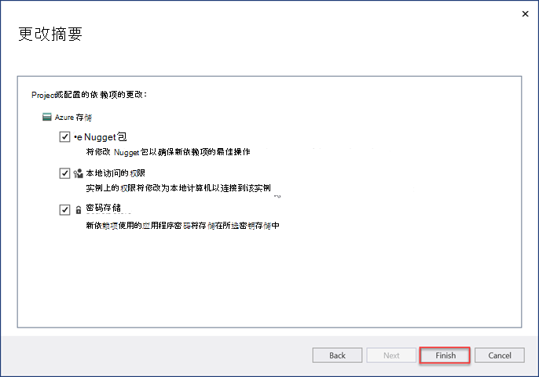
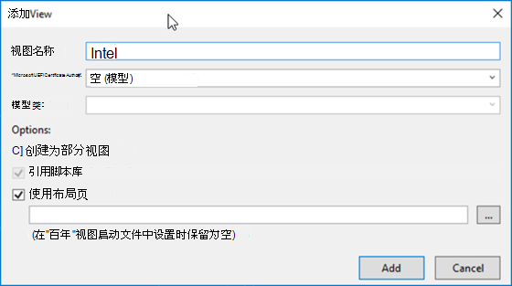
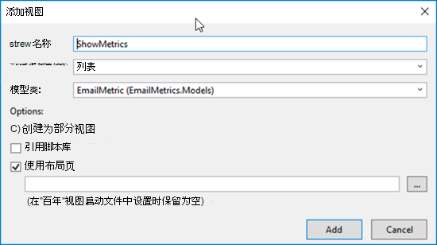

<!-- markdownlint-disable MD002 MD041 -->

在本部分中，我们将生成第一个用于处理已导出的 Microsoft Graph Data Connect 数据的 ASP.NET 项目应用程序。

## <a name="create-a-new-aspnet-project"></a>创建新的 ASP.NET 项目

1. 打开 Visual Studio 并选择 **“文件>”新建>项目**。

1. 在 **“新建项目”** 对话框中，执行以下操作。

    1. 在搜索框 **中搜索 ASP.NET Web 应用程序**，然后选择 **ASP.NET Web 应用程序 (.NET Framework)** 选项。
    1. 单击“ **下一步**”。

        

    1. 输入 **EmailMetrics** 作为项目的名称。
    1. 选择 **.NET Framework 4.7.2** 作为框架选项。
    1. 选择“**创建**”。

    > [!IMPORTANT]
    > 确保为此快速入门说明中指定的 Visual Studio Project 输入完全相同的名称。 Visual Studio 项目名称在代码中成为了命名空间的一部分。 在这些说明里的代码依赖于匹配在这些说明中指定的 Visual Studio 项目名称的命名空间。 如果你使用不同的项目名称，代码不会编译，除非你调整所有的命名空间来匹配你在创建项目时输入的 Visual Studio 项目名称。

    1. 在新的 **ASP.NET Web 应用程序** 项目对话框中，选择 MVC。
    1. 选择“**创建**”。

    

## <a name="add-and-configure-your-azure-storage-as-a-connected-service"></a>将 Azure 存储添加并配置为连接服务

1. 在 **解决方案资源管理器** 工具窗口中，右键单击 **“连接服务**”节点，然后选择 **“添加连接服务**”。

    

1. 在 **“连接服务** ”对话框中，选择位于对话框右上角的绿色 **+** 标志。

1. 在 **“添加依赖项** ”对话框中，选择 **“Azure 存储** ”，然后选择 **“下一步**”。

    

1. 在 **“Azure 存储** ”对话框中，选择在上一练习中导出数据的订阅和存储帐户，选择 **“下一步**”。

    

1. 为 **Azure 存储连接** 提供 **AzureStorageConnectionString** 的名称，然后选择 **“下一步**”。
1. 选择 **“完成”**。

    

## <a name="create-a-new-model-class-that-will-be-used-to-store-the-email-metrics"></a>创建用于存储电子邮件指标的新模型类

1. 在 **解决方案资源管理器** 工具窗口中，右键单击 **“模型**”文件夹，然后选择 **“添加>类**”。

    

1. 在 **“添加新项** ”对话框中，选择 **“类**”，将文件的名称设置为 _EmailMetric.cs_ ，然后选择 **“添加**”。

1. 将以下代码添加到刚刚创建的类 EmailMetric。

    ```csharp
    public string Email;
    public double RecipientsToEmail;
    ```

## <a name="create-a-new-controller-that-will-calculate-and-display-the-results"></a>创建将计算和显示结果的新控制器

1. 右键单击 **“控制器** ”文件夹，然后选择 **“添加>控制器**”。

1. 在 **“添加基架** ”对话框中，选择 **“MVC 5 控制器 - 空** ”，然后选择 **“添加**”。

1. 出现提示时，将控制器 **命名为 EmailMetricsController** ，然后选择 **“确定**”。

1. 在包含 **EmailMetricsController** 类的文件顶部的现有 using 语句之后添加以下 using 语句。

    ```csharp
    using System.Collections.Generic;
    using System.Configuration;
    using System.IO;
    using System.Linq;
    using System.Threading.Tasks;
    using System.Web.Mvc;
    using Azure.Storage.Blobs;
    using Azure.Storage.Blobs.Models;
    using Newtonsoft.Json.Linq;
    ```

1. 将以下代码添加到 **EmailMetricsController** 类。 这些数据将用于连接到包含导出数据的 **Azure 存储帐户** 。

    ```csharp
    private const string connectionStringName = "AzureStorageConnectionString";
    private const string emailBlobName = "m365mails";

    ```

1. 将以下方法添加到 **EmailMetricsController** 类。 这将处理 **Azure Blob** 并更新一个集合，该集合代表电子邮件帐户以及在为提取的帐户找到的所有电子邮件中合并了多少个收件人。

    ```csharp
    private async Task ProcessBlobEmails(List<Models.EmailMetric> emailMetrics, BlobClient emailBlob)
    {
        using (var stream = new MemoryStream())
        {
            var response = await emailBlob.DownloadToAsync(stream);
            var pos = stream.Seek(0, SeekOrigin.Begin);

            using (var reader = new StreamReader(stream))
            {

                string line;
                while ((line = reader.ReadLine()) != null)
                {
                    var jsonObj = JObject.Parse(line);

                    // extract sender
                    var sender = jsonObj.SelectToken("Sender.EmailAddress.Address")?.ToString();
                    // No sender - skip this one
                    if (string.IsNullOrEmpty(sender)) continue;

                    // extract and count up recipients
                    var totalRecipients = 0;
                    totalRecipients += jsonObj.SelectToken("ToRecipients")?.Children().Count() ?? 0;
                    totalRecipients += jsonObj.SelectToken("CcRecipients")?.Children().Count() ?? 0;
                    totalRecipients += jsonObj.SelectToken("BccRecipients")?.Children().Count() ?? 0;

                    var emailMetric = new Models.EmailMetric();
                    emailMetric.Email = sender;
                    emailMetric.RecipientsToEmail = totalRecipients;

                    // if already have this sender...
                    var existingMetric = emailMetrics.FirstOrDefault(metric => metric.Email == emailMetric.Email);
                    if (existingMetric != null)
                    {
                        existingMetric.RecipientsToEmail += emailMetric.RecipientsToEmail;
                    }
                    else
                    {
                        emailMetrics.Add(emailMetric);
                    }
                }
            }
        }
    }
    ```

1. 将以下方法添加到 **EmailMetricsController** 类。 这将枚举指定 **Azure 存储** 帐户指定容器中的所有 Blob，并将每个 Blob 发送到 `ProcessBlobEmails()` 上一步中添加的方法。

    ```csharp
    private async Task<List<Models.EmailMetric>> ProcessBlobFiles()
    {
        var emailMetrics = new List<Models.EmailMetric>();
        var connectionString = ConfigurationManager.ConnectionStrings[connectionStringName];

        // Connect to the storage account
        var containerClient = new BlobContainerClient(connectionString.ConnectionString, emailBlobName);

        foreach (var blob in containerClient.GetBlobs())
        {
            if (blob.Properties.BlobType == BlobType.Block &&
                // Don't process blobs in the metadata folder
                !blob.Name.StartsWith("metadata/"))
            {
                var blobClient = containerClient.GetBlobClient(blob.Name);
                await ProcessBlobEmails(emailMetrics, blobClient);
            }
        }

        return emailMetrics;
    }
    ```

1. 将以下操作添加到 **EmailMetricsController** ，该操作将使用添加此类的方法来处理电子邮件并将结果发送到视图。

    ```csharp
    [HttpPost, ActionName("ShowMetrics")]
    [ValidateAntiForgeryToken]
    public async Task<ActionResult> ShowMetrics()
    {
        var emailMetrics = await ProcessBlobFiles();

        return View(emailMetrics);
    }
    ```

## <a name="create-a-new-view-for-the-emailmetrics-index-action"></a>为 EmailMetrics 索引操作创建新视图

1. 在 **解决方案资源管理器** 工具窗口中，右键单击 **“视图”> EmailMetrics** 文件夹，然后选择 **“添加>视图**”。

1. 在 **“添加新的基架项目”** 对话框中，选择 **“MVC 5 视图**”，然后选择 **“添加**”。

1. 在 **“添加视图** ”对话框中，将 **视图** 名称设置为 **索引**，将剩余的输入控件保留为其默认值，然后选择 **“添加**”。

    

1. 将新 **视图> EmailMetrics > _Index.cshtml 中的_** 标记更新为以下内容。 这会添加一个包含单个按钮的窗体，该按钮将 HTTP POST 提交到上一步中添加的自定义控制器操作。

    ```html
    @{
    ViewBag.Title = "Index";
    }

    <h2>Email Metrics</h2>
    ```

1. 此应用程序将查看提取到 **Azure Blob 存储** 帐户的电子邮件的电子邮件数据，并显示每个发件人的收件人总数。

    ```html
    @using (Html.BeginForm("ShowMetrics", "EmailMetrics", FormMethod.Post))
    {
    @Html.AntiForgeryToken()
    <div>
        <button type="submit">View email metrics</button>
    </div>

    <div>
        <em>Please be patient as this can take a few moments to calculate depending on the size of the exported data...</em>
    </div>
    }
    ```

## <a name="create-a-new-view-for-the-emailmetrics-showmetrics-action"></a>为 EmailMetrics ShowMetrics 操作创建新视图

1. 在 **解决方案资源管理器** 工具窗口中，右键单击 **“视图”> EmailMetrics** 文件夹，然后选择 **“添加>视图**”。

1. 在 **“添加视图** ”对话框中，设置以下值并将剩余的输入控件保留为其默认值，然后选择 **“添加**”。

    - **视图名称**：ShowMetrics
    - **模板**：列表
    - **模型类**：EmailMetric (EmailMetric.Models) 

        

    >[!TIP]
    > 如果在下拉框中看不到 **EmailMetric** 模型，请生成解决方案。

1. 将新 **视图> EmailMetrics > _ShowMetrics.cshtml_** 中的标记更新为以下内容。 这将显示计算结果。

    ```html
    @model IEnumerable<EmailMetrics.Models.EmailMetric>

    @{
    ViewBag.Title = "ShowMetrics";
    }

    <h2>Email Metrics</h2>

    <table class="table">
    <tr>
        <th>Sender</th>
        <th>Number of Recipients</th>
    </tr>

    @foreach (var item in Model)
    {
    <tr>
        <td>@Html.DisplayFor(modelItem => item.Email)</td>
        <td>@Html.DisplayFor(modelItem => item.RecipientsToEmail)</td>
    </tr>
    }

    </table>
    ```

## <a name="update-the-navigation-to-have-a-way-to-get-to-the-new-controller"></a>更新导航以获得访问新控制器的方法

1. 在 **解决方案资源管理器** 工具窗口中，找到并打开“**共享> _Layout.cshtml_ >文件视图**。
1. 用以下代码替换内容。

    ```html
    <!-- new code -->
    <li>@Html.ActionLink("Email Metrics", "Index", "EmailMetrics")</li>
    ```

## <a name="test-the-application"></a>测试应用程序

1. 在 Visual Studio 中，选择 **“调试>开始调试**。

1. 生成应用程序并在新的浏览器窗口中加载时，选择顶部导航栏中的 **Email指标** 项。

1. 在 **“Email指标**”页上，选择“**查看电子邮件指标**”按钮。

    

1. 加载页面时，你将看到在所有电子邮件中找到的电子邮件地址列表，其中包含两者之间发送的所有收件人的总和，如下图中测试电子邮件提取中的一个小示例集中所示。

    
